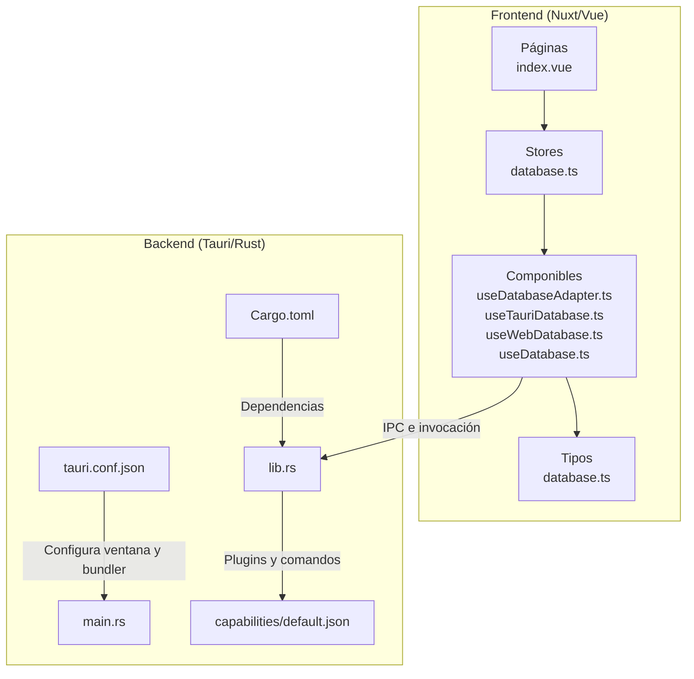
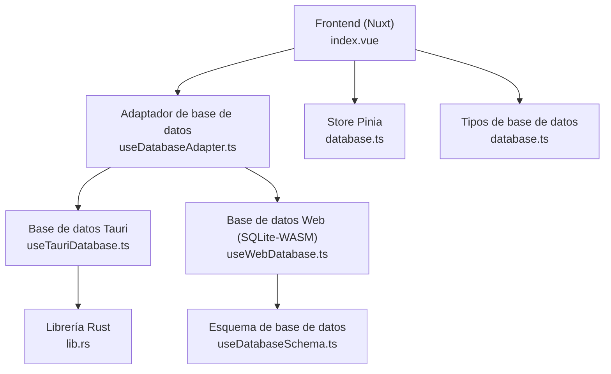
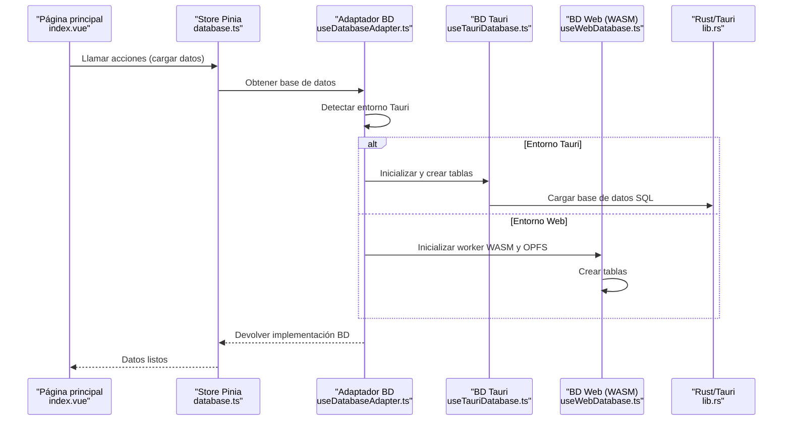
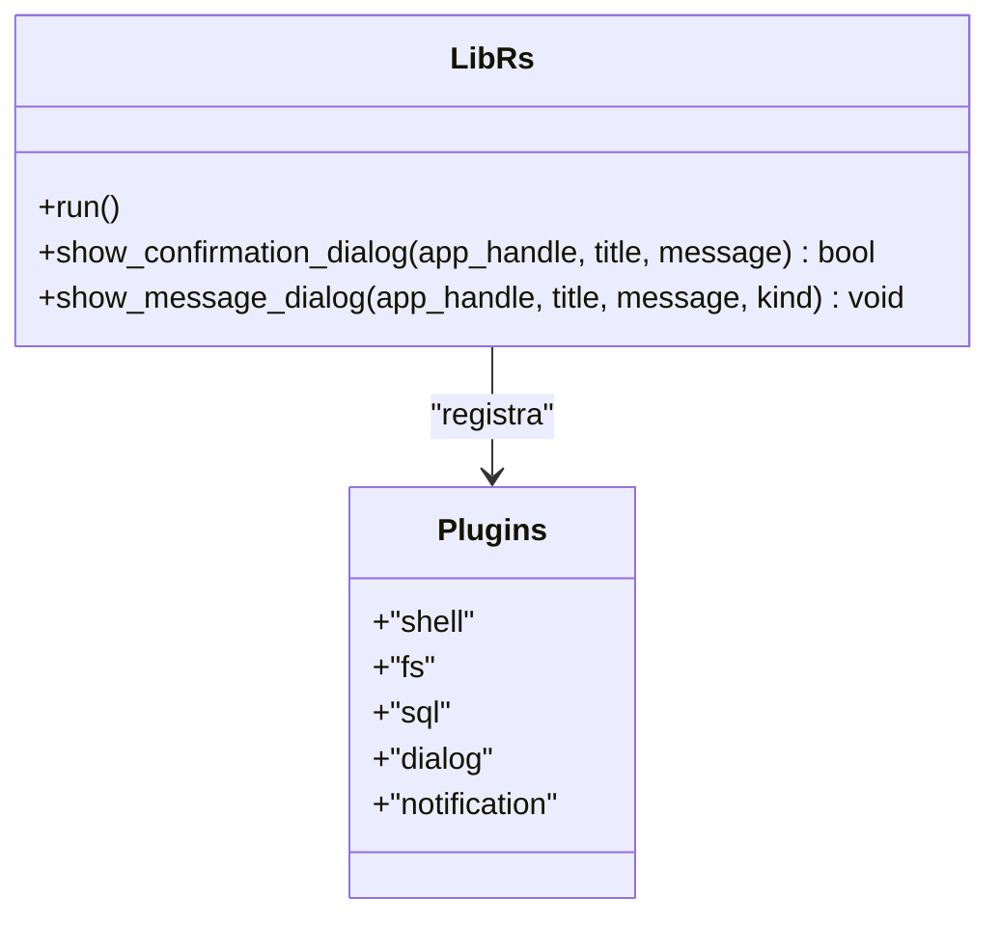
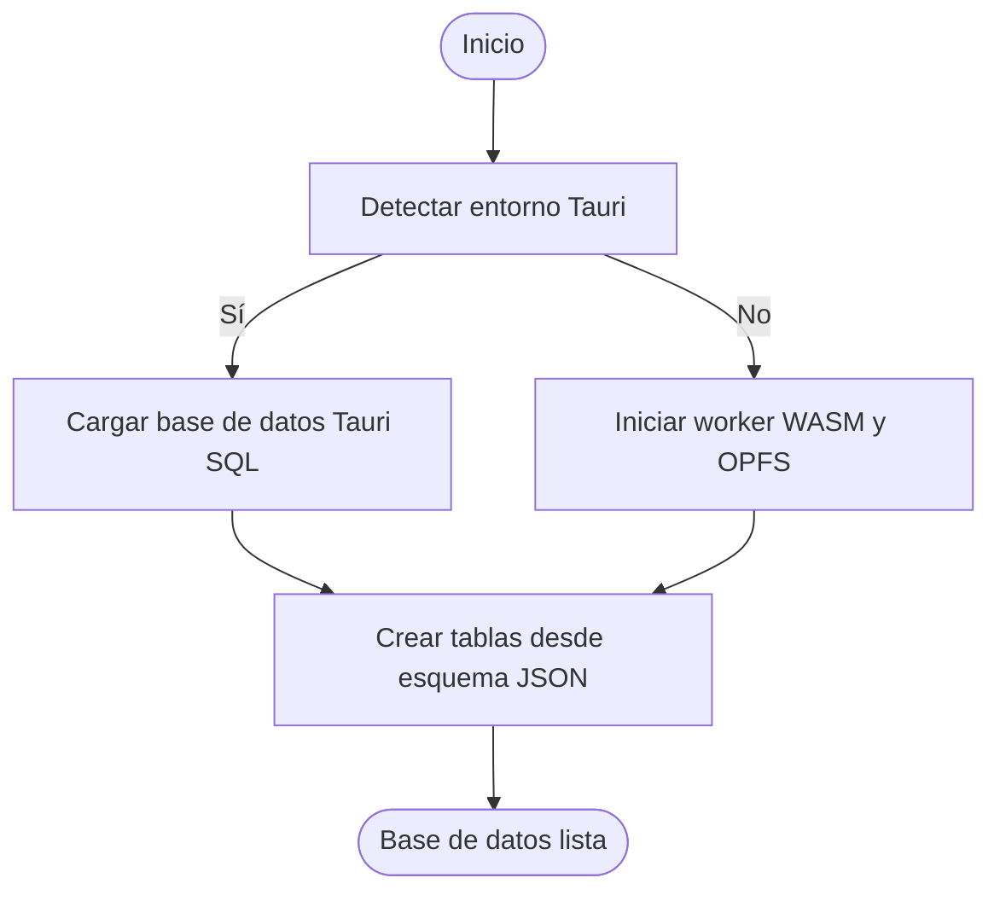
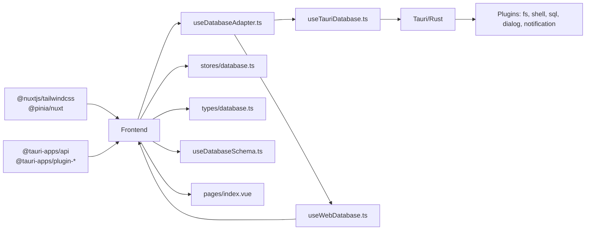

# Arquitectura Frontend-Backend

<cite>
**Archivos referenciados en este documento**
- [src-tauri/src/main.rs](file://src-tauri/src/main.rs)
- [src-tauri/src/lib.rs](file://src-tauri/src/lib.rs)
- [src-tauri/tauri.conf.json](file://src-tauri/tauri.conf.json)
- [src-tauri/Cargo.toml](file://src-tauri/Cargo.toml)
- [src-tauri/capabilities/default.json](file://src-tauri/capabilities/default.json)
- [nuxt.config.ts](file://nuxt.config.ts)
- [package.json](file://package.json)
- [composables/useDatabaseAdapter.ts](file://composables/useDatabaseAdapter.ts)
- [composables/useTauriDatabase.ts](file://composables/useTauriDatabase.ts)
- [composables/useWebDatabase.ts](file://composables/useWebDatabase.ts)
- [composables/useDatabase.ts](file://composables/useDatabase.ts)
- [stores/database.ts](file://stores/database.ts)
- [pages/index.vue](file://pages/index.vue)
- [types/database.ts](file://types/database.ts)
- [composables/useDatabaseSchema.ts](file://composables/useDatabaseSchema.ts)
</cite>

## Índice
1. [Introducción](#introducción)
2. [Estructura del proyecto](#estructura-del-proyecto)
3. [Componentes principales](#componentes-principales)
4. [Visión general de la arquitectura](#visión-general-de-la-arquitectura)
5. [Análisis detallado de componentes](#análisis-detallado-de-componentes)
6. [Análisis de dependencias](#análisis-de-dependencias)
7. [Consideraciones de rendimiento](#consideraciones-de-rendimiento)
8. [Guía de solución de problemas](#guía-de-solución-de-problemas)
9. [Conclusión](#conclusión)
10. [Apéndices](#apéndices)

## Introducción
Este documento describe la arquitectura híbrida de BOM Manager, donde el backend nativo está construido con Tauri/Rust y el frontend web con Vue/Nuxt. Se explica cómo se configuran Tauri, qué permisos y capacidades se definen, cómo se establece la comunicación bidireccional mediante IPC, y cómo se integran SQLite-WASM y plugins nativos. También se detalla la estructura del main.rs, la configuración de ventanas, eventos y handlers, y se abordan ventajas de esta arquitectura, consideraciones de rendimiento y despliegue multiplataforma.

## Estructura del proyecto
El repositorio sigue una organización clara:
- Backend Tauri/Rust en src-tauri: configuración, dependencias, comandos y plugins.
- Frontend Nuxt/Vue en la raíz: páginas, componentes, stores, componibles y tipos.
- Base de datos: adaptador que permite usar Tauri SQL o SQLite-WASM según el entorno.

**Diagrama fuente**
- [src-tauri/src/main.rs](file://src-tauri/src/main.rs#L1-L7)
- [src-tauri/src/lib.rs](file://src-tauri/src/lib.rs#L1-L79)
- [src-tauri/tauri.conf.json](file://src-tauri/tauri.conf.json#L1-L37)
- [src-tauri/Cargo.toml](file://src-tauri/Cargo.toml#L1-L31)
- [src-tauri/capabilities/default.json](file://src-tauri/capabilities/default.json#L1-L41)
- [pages/index.vue](file://pages/index.vue#L1-L294)
- [stores/database.ts](file://stores/database.ts#L1-L198)
- [composables/useDatabaseAdapter.ts](file://composables/useDatabaseAdapter.ts#L1-L25)
- [composables/useTauriDatabase.ts](file://composables/useTauriDatabase.ts#L1-L55)
- [composables/useWebDatabase.ts](file://composables/useWebDatabase.ts#L1-L179)
- [composables/useDatabase.ts](file://composables/useDatabase.ts#L1-L89)
- [types/database.ts](file://types/database.ts#L1-L5)

**Sección fuente**
- [src-tauri/src/main.rs](file://src-tauri/src/main.rs#L1-L7)
- [src-tauri/src/lib.rs](file://src-tauri/src/lib.rs#L1-L79)
- [src-tauri/tauri.conf.json](file://src-tauri/tauri.conf.json#L1-L37)
- [src-tauri/Cargo.toml](file://src-tauri/Cargo.toml#L1-L31)
- [src-tauri/capabilities/default.json](file://src-tauri/capabilities/default.json#L1-L41)
- [nuxt.config.ts](file://nuxt.config.ts#L1-L67)
- [package.json](file://package.json#L1-L50)
- [pages/index.vue](file://pages/index.vue#L1-L294)
- [stores/database.ts](file://stores/database.ts#L1-L198)
- [composables/useDatabaseAdapter.ts](file://composables/useDatabaseAdapter.ts#L1-L25)
- [composables/useTauriDatabase.ts](file://composables/useTauriDatabase.ts#L1-L55)
- [composables/useWebDatabase.ts](file://composables/useWebDatabase.ts#L1-L179)
- [composables/useDatabase.ts](file://composables/useDatabase.ts#L1-L89)
- [types/database.ts](file://types/database.ts#L1-L5)

## Componentes principales
- Configuración de Tauri: ventana principal, bundler, seguridad y plugins.
- Librería Rust: comandos IPC, plugins instalados y setup.
- Adaptador de base de datos: detecta entorno y selecciona Tauri SQL o SQLite-WASM.
- Base de datos Tauri: carga de base de datos local y ejecución de consultas.
- Base de datos Web (SQLite-WASM): worker oficial con OPFS, encapsulamiento de operaciones.
- Base de datos centralizada: composables de negocio que exponen métodos CRUD y utilidades.
- Store Pinia: capa de estado para componentes de UI.
- Página principal: muestra estadísticas y activa flujos de importación.

**Sección fuente**
- [src-tauri/tauri.conf.json](file://src-tauri/tauri.conf.json#L1-L37)
- [src-tauri/src/lib.rs](file://src-tauri/src/lib.rs#L1-L79)
- [composables/useDatabaseAdapter.ts](file://composables/useDatabaseAdapter.ts#L1-L25)
- [composables/useTauriDatabase.ts](file://composables/useTauriDatabase.ts#L1-L55)
- [composables/useWebDatabase.ts](file://composables/useWebDatabase.ts#L1-L179)
- [composables/useDatabase.ts](file://composables/useDatabase.ts#L1-L89)
- [stores/database.ts](file://stores/database.ts#L1-L198)
- [pages/index.vue](file://pages/index.vue#L1-L294)

## Visión general de la arquitectura
La aplicación se ejecuta como una aplicación de escritorio nativa gracias a Tauri/Rust, mientras que el frontend se desarrolla con Nuxt/Vue. El frontend puede correr en modo SPA (desarrollo y producción local) o embebido dentro de la ventana nativa. La base de datos se puede usar de dos maneras:
- Tauri SQL: plugin nativo que accede a una base de datos SQLite local.
- SQLite-WASM: base de datos en el navegador usando un worker oficial con soporte OPFS.

**Diagrama fuente**
- [composables/useDatabaseAdapter.ts](file://composables/useDatabaseAdapter.ts#L1-L25)
- [composables/useTauriDatabase.ts](file://composables/useTauriDatabase.ts#L1-L55)
- [composables/useWebDatabase.ts](file://composables/useWebDatabase.ts#L1-L179)
- [src-tauri/src/lib.rs](file://src-tauri/src/lib.rs#L1-L79)
- [composables/useDatabaseSchema.ts](file://composables/useDatabaseSchema.ts#L1-L302)
- [stores/database.ts](file://stores/database.ts#L1-L198)
- [types/database.ts](file://types/database.ts#L1-L5)

## Análisis detallado de componentes

### Configuración de Tauri
- Archivo de configuración principal: define el producto, versión, identificador, rutas de build/dev, ventana principal, seguridad y plugins.
- Ventana: título, dimensiones, redimensionable, fullscreen.
- Seguridad: se deja CSP sin valor (permite flexibilidad en desarrollo).
- Plugins: habilita el plugin SQL con preload de base de datos local.

**Sección fuente**
- [src-tauri/tauri.conf.json](file://src-tauri/tauri.conf.json#L1-L37)

### Dependencias y librería Rust
- Cargo.toml: define la librería compartida y dependencias de Tauri, plugins (SQL, FS, Shell, Dialog, Notification).
- main.rs: punto de entrada que llama a la función run de la librería.
- lib.rs: Builder de Tauri con plugins, comandos IPC y setup condicional de logging.

**Sección fuente**
- [src-tauri/Cargo.toml](file://src-tauri/Cargo.toml#L1-L31)
- [src-tauri/src/main.rs](file://src-tauri/src/main.rs#L1-L7)
- [src-tauri/src/lib.rs](file://src-tauri/src/lib.rs#L1-L79)

### Capabilities y permisos
- capabilities/default.json: define permisos por ventana, incluyendo acceso a SQL (ejecutar y cargar), FS (por defecto y existencia en $APPDATA), Dialog, Shell (ejecutar sh con validación) y notificaciones.

**Sección fuente**
- [src-tauri/capabilities/default.json](file://src-tauri/capabilities/default.json#L1-L41)

### Comunicación IPC y comandos
- Comandos declarados en lib.rs: diálogos de confirmación y mensaje con diferentes tipos.
- Setup del Builder: se registran plugins y se asigna el handler de invocación.
- En el frontend, se usa @tauri-apps/api/core para invocar comandos.

**Sección fuente**
- [src-tauri/src/lib.rs](file://src-tauri/src/lib.rs#L1-L79)

### Adaptador de base de datos
- useDatabaseAdapter.ts: detecta si se ejecuta en entorno Tauri (__TAURI_INTERNALS__ en window) y selecciona la implementación correspondiente.
- useTauriDatabase.ts: carga base de datos Tauri SQL y expone select/execute.
- useWebDatabase.ts: inicializa SQLite-WASM con worker oficial, OPFS, y encapsula select/execute.

**Sección fuente**
- [composables/useDatabaseAdapter.ts](file://composables/useDatabaseAdapter.ts#L1-L25)
- [composables/useTauriDatabase.ts](file://composables/useTauriDatabase.ts#L1-L55)
- [composables/useWebDatabase.ts](file://composables/useWebDatabase.ts#L1-L179)

### Esquema y sincronización de base de datos
- useDatabaseSchema.ts: carga esquema desde JSON, crea tablas si no existen, compara columnas, agrega columnas faltantes, y permite actualización forzosa de tablas manteniendo datos comunes.

**Sección fuente**
- [composables/useDatabaseSchema.ts](file://composables/useDatabaseSchema.ts#L1-L302)

### Base de datos centralizada y Store
- useDatabase.ts: reúne métodos CRUD de items, proyectos, relaciones, actividad, notificaciones, configuración y archivos.
- stores/database.ts: Store Pinia que consume useDatabase.ts y expone acciones para cargar y manipular datos.

**Sección fuente**
- [composables/useDatabase.ts](file://composables/useDatabase.ts#L1-L89)
- [stores/database.ts](file://stores/database.ts#L1-L198)

### Página principal y flujo de datos
- pages/index.vue: carga estadísticas, notificaciones y actividad reciente, y maneja eventos de importación. Utiliza composables de base de datos y store.

**Sección fuente**
- [pages/index.vue](file://pages/index.vue#L1-L294)

### Tipos de base de datos
- types/database.ts: interfaz común para select/execute en ambos motores de base de datos.

**Sección fuente**
- [types/database.ts](file://types/database.ts#L1-L5)

## Visión general de la arquitectura

**Diagrama fuente**
- [pages/index.vue](file://pages/index.vue#L1-L294)
- [stores/database.ts](file://stores/database.ts#L1-L198)
- [composables/useDatabaseAdapter.ts](file://composables/useDatabaseAdapter.ts#L1-L25)
- [composables/useTauriDatabase.ts](file://composables/useTauriDatabase.ts#L1-L55)
- [composables/useWebDatabase.ts](file://composables/useWebDatabase.ts#L1-L179)
- [src-tauri/src/lib.rs](file://src-tauri/src/lib.rs#L1-L79)

## Análisis detallado de componentes

### main.rs
- Configura el subsistema de Windows en versión release.
- Llama a app_lib::run() para iniciar la aplicación.

**Sección fuente**
- [src-tauri/src/main.rs](file://src-tauri/src/main.rs#L1-L7)

### lib.rs (comandos, plugins y setup)
- Comandos IPC: show_confirmation_dialog y show_message_dialog.
- Plugins cargados: shell, fs, sql, dialog, notification.
- Setup condicional: en debug, se agrega plugin de log con nivel Info.
- Builder: se configuran plugins, comandos y contexto de ejecución.

**Diagrama fuente**
- [src-tauri/src/lib.rs](file://src-tauri/src/lib.rs#L1-L79)

**Sección fuente**
- [src-tauri/src/lib.rs](file://src-tauri/src/lib.rs#L1-L79)

### Configuración de ventanas y seguridad
- Ventana principal: título, tamaño, redimensionable, fullscreen.
- Seguridad: CSP sin valor.
- Plugins: SQL con preload de base de datos local.

**Sección fuente**
- [src-tauri/tauri.conf.json](file://src-tauri/tauri.conf.json#L1-L37)

### Capacidades y permisos
- Permisos: SQL (default, allow-execute, allow-load), FS (default y exists en $APPDATA), Dialog (default), Shell (allow-execute con validación), Notification (default).
- Asociado a la ventana "main".

**Sección fuente**
- [src-tauri/capabilities/default.json](file://src-tauri/capabilities/default.json#L1-L41)

### Comunicación IPC bidireccional
- Frontend invoca comandos Rust mediante @tauri-apps/api.
- Rust expone comandos con tauri::command y se registran en el Builder.

**Sección fuente**
- [src-tauri/src/lib.rs](file://src-tauri/src/lib.rs#L1-L79)
- [package.json](file://package.json#L1-L50)

### Integración con SQLite-WASM
- Worker oficial de @sqlite.org/sqlite-wasm.
- OPFS como VFS para persistencia.
- Encapsulamiento de select/execute con promiser.

**Sección fuente**
- [composables/useWebDatabase.ts](file://composables/useWebDatabase.ts#L1-L179)

### Plugins nativos y funcionalidades del sistema operativo
- Plugins: fs, shell, dialog, notification, sql.
- Uso de diálogo nativo, notificaciones, ejecución de comandos shell y acceso al sistema de archivos.

**Sección fuente**
- [src-tauri/Cargo.toml](file://src-tauri/Cargo.toml#L1-L31)
- [src-tauri/src/lib.rs](file://src-tauri/src/lib.rs#L1-L79)

### Flujo de inicialización de base de datos

**Diagrama fuente**
- [composables/useDatabaseAdapter.ts](file://composables/useDatabaseAdapter.ts#L1-L25)
- [composables/useTauriDatabase.ts](file://composables/useTauriDatabase.ts#L1-L55)
- [composables/useWebDatabase.ts](file://composables/useWebDatabase.ts#L1-L179)
- [composables/useDatabaseSchema.ts](file://composables/useDatabaseSchema.ts#L1-L302)

## Análisis de dependencias
- Frontend depende de @tauri-apps/api y plugins de Tauri para IPC y funcionalidades del sistema.
- Backend depende de tauri y plugins para FS, Shell, SQL, Dialog y Notification.
- Ambos lados usan un esquema de base de datos compartido (JSON) para crear y mantener consistencia.

**Diagrama fuente**
- [package.json](file://package.json#L1-L50)
- [nuxt.config.ts](file://nuxt.config.ts#L1-L67)
- [composables/useDatabaseAdapter.ts](file://composables/useDatabaseAdapter.ts#L1-L25)
- [composables/useTauriDatabase.ts](file://composables/useTauriDatabase.ts#L1-L55)
- [composables/useWebDatabase.ts](file://composables/useWebDatabase.ts#L1-L179)
- [stores/database.ts](file://stores/database.ts#L1-L198)
- [types/database.ts](file://types/database.ts#L1-L5)
- [composables/useDatabaseSchema.ts](file://composables/useDatabaseSchema.ts#L1-L302)
- [pages/index.vue](file://pages/index.vue#L1-L294)
- [src-tauri/src/lib.rs](file://src-tauri/src/lib.rs#L1-L79)

**Sección fuente**
- [package.json](file://package.json#L1-L50)
- [nuxt.config.ts](file://nuxt.config.ts#L1-L67)
- [src-tauri/Cargo.toml](file://src-tauri/Cargo.toml#L1-L31)

## Consideraciones de rendimiento
- SQLite-WASM: el worker oficial mejora la eficiencia de operaciones SQL en el navegador. OPFS reduce sobrecarga de copias de archivo y mejora el rendimiento de E/S.
- Tauri SQL: acceso directo al sistema de archivos y base de datos local, ideal para operaciones intensivas.
- Optimización de dependencias: Nuxt/Vite incluye plugins específicos para WASM y top-level await, y se evita incluir SQLite-WASM en optimizeDeps para evitar conflictos.
- Logging condicional: en modo debug se habilita el plugin de log de Tauri.

**Sección fuente**
- [composables/useWebDatabase.ts](file://composables/useWebDatabase.ts#L1-L179)
- [nuxt.config.ts](file://nuxt.config.ts#L1-L67)
- [src-tauri/src/lib.rs](file://src-tauri/src/lib.rs#L1-L79)

## Guía de solución de problemas
- No se cargan datos en modo web: verificar inicialización del worker WASM y OPFS, y que el esquema se haya aplicado correctamente.
- Errores de permisos en Tauri: revisar capabilities/default.json y asegurar que los permisos de fs y shell estén correctamente definidos.
- Fallos en comandos IPC: confirmar que los comandos estén registrados en lib.rs y que el frontend invoque con @tauri-apps/api.
- Problemas de bundling: revisar tauri.conf.json para rutas de frontendDist y devUrl.

**Sección fuente**
- [composables/useWebDatabase.ts](file://composables/useWebDatabase.ts#L1-L179)
- [src-tauri/capabilities/default.json](file://src-tauri/capabilities/default.json#L1-L41)
- [src-tauri/src/lib.rs](file://src-tauri/src/lib.rs#L1-L79)
- [src-tauri/tauri.conf.json](file://src-tauri/tauri.conf.json#L1-L37)

## Conclusión
BOM Manager aprovecha una arquitectura híbrida sólida: Tauri/Rust como backend nativo con permisos y plugins controlados, y Vue/Nuxt como frontend web con capacidad de ejecutarse en modo SPA o embebido. El adaptador de base de datos permite usar Tauri SQL o SQLite-WASM según el entorno, garantizando portabilidad y rendimiento. La configuración de Tauri, los comandos IPC y las capacidades definen una base segura, mientras que el esquema de base de datos y el store ofrecen una experiencia de usuario fluida.

## Apéndices
- Despliegue multiplataforma: Tauri bundle con múltiples objetivos activados.
- Configuración de CORS/COOP/COEP: Nuxt/Vite establece encabezados para compatibilidad con WASM.

**Sección fuente**
- [src-tauri/tauri.conf.json](file://src-tauri/tauri.conf.json#L1-L37)
- [nuxt.config.ts](file://nuxt.config.ts#L1-L67)