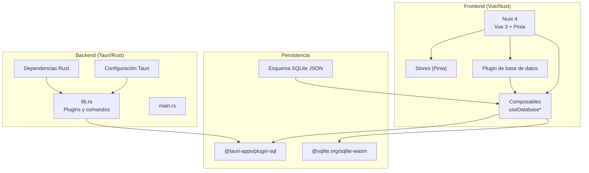
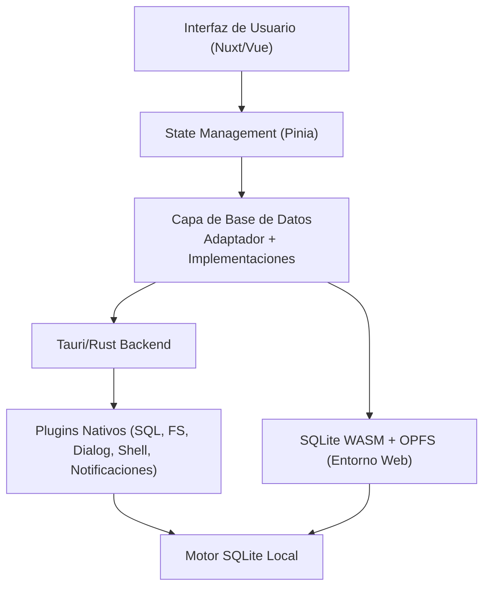
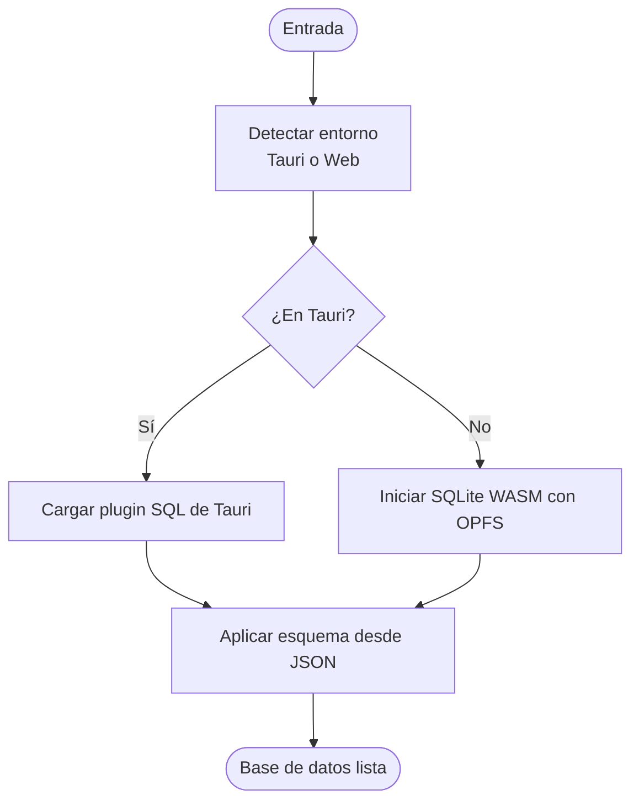
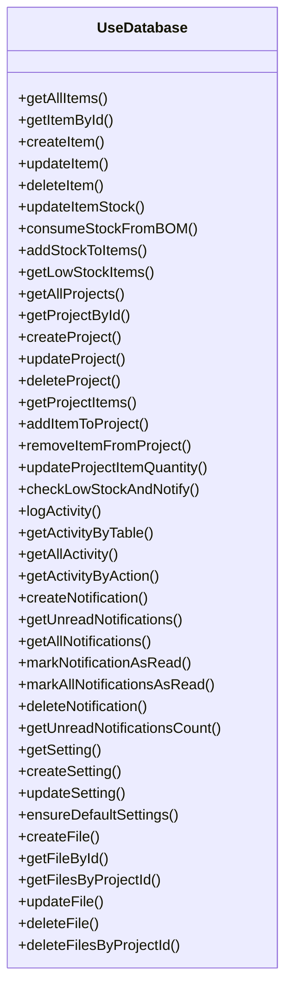
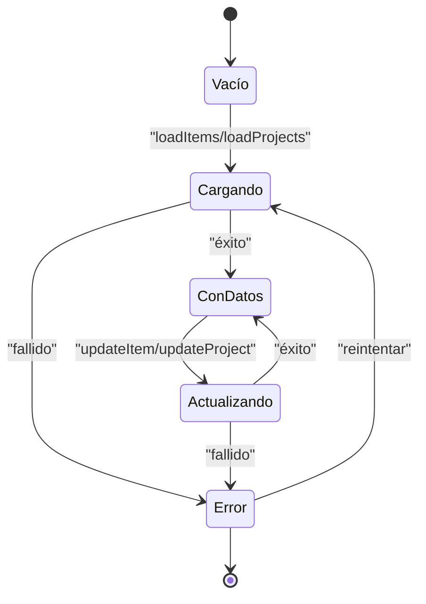
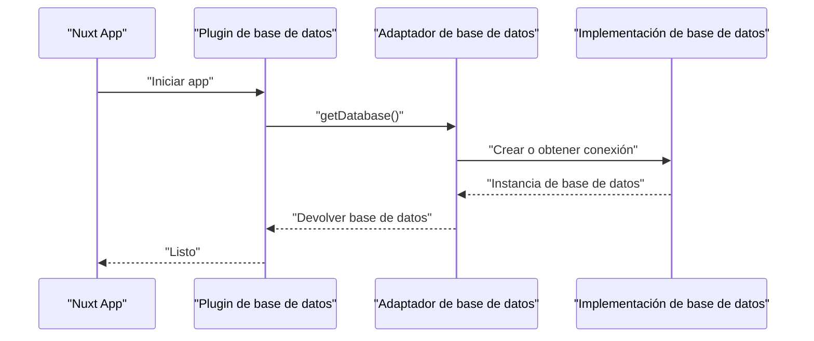
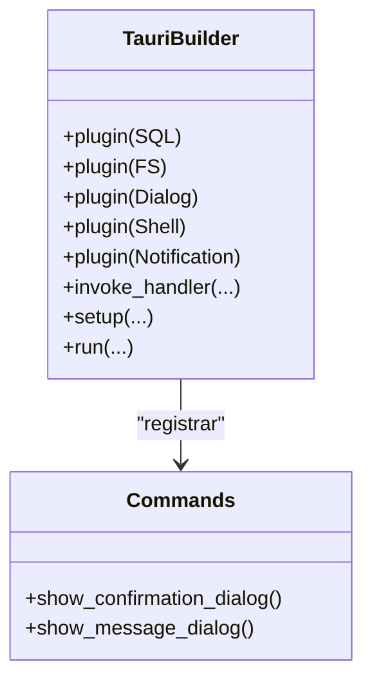
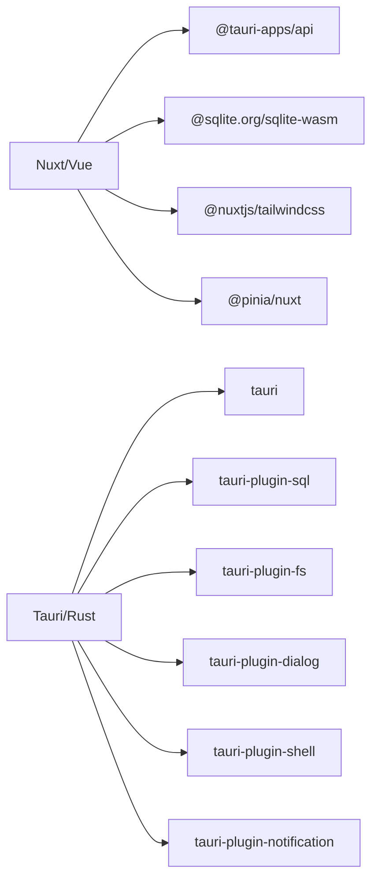

# Arquitectura del Sistema

<cite>
**Archivos referenciados en este documento**
- [README.md](file://README.md)
- [nuxt.config.ts](file://nuxt.config.ts)
- [package.json](file://package.json)
- [src-tauri/tauri.conf.json](file://src-tauri/tauri.conf.json)
- [src-tauri/Cargo.toml](file://src-tauri/Cargo.toml)
- [src-tauri/src/lib.rs](file://src-tauri/src/lib.rs)
- [src-tauri/src/main.rs](file://src-tauri/src/main.rs)
- [composables/useDatabase.ts](file://composables/useDatabase.ts)
- [composables/useDatabaseAdapter.ts](file://composables/useDatabaseAdapter.ts)
- [composables/useDatabaseMain.ts](file://composables/useDatabaseMain.ts)
- [composables/useTauriDatabase.ts](file://composables/useTauriDatabase.ts)
- [composables/useWebDatabase.ts](file://composables/useWebDatabase.ts)
- [stores/database.ts](file://stores/database.ts)
- [plugins/database.ts](file://plugins/database.ts)
- [data/db/schema.json](file://data/db/schema.json)
</cite>

## Índice
1. [Introducción](#introducción)
2. [Estructura del Proyecto](#estructura-del-proyecto)
3. [Componentes Principales](#componentes-principales)
4. [Visión General de la Arquitectura](#visión-general-de-la-arquitectura)
5. [Análisis Detallado de Componentes](#análisis-detallado-de-componentes)
6. [Análisis de Dependencias](#análisis-de-dependencias)
7. [Consideraciones de Rendimiento](#consideraciones-de-rendimiento)
8. [Guía de Resolución de Problemas](#guía-de-resolución-de-problemas)
9. [Conclusión](#conclusión)
10. [Apéndices](#apéndices)

## Introducción
BOM Manager es una aplicación multiplataforma de gestión de BOM (Lista de Materiales) que combina un backend Rust/Tauri con un frontend Vue/Nuxt. La arquitectura híbrida permite ejecutar una interfaz moderna en el navegador o como aplicación nativa, mientras se utiliza SQLite como motor de persistencia. En producción, se usa el plugin SQL de Tauri para acceder a una base de datos local nativa. En desarrollo o en navegadores, se emplea SQLite WASM con soporte OPFS para simular funcionalidad similar.

## Estructura del Proyecto
La estructura del repositorio está organizada en módulos bien definidos:
- Frontend: Nuxt 4, Vue 3, Pinia, TailwindCSS
- Backend: Tauri/Rust con plugins nativos (SQL, FS, Dialog, Shell, Notification)
- Base de datos: SQLite, con esquema definido en JSON y adaptador de base de datos que detecta entorno
- Composables: Lógica reutilizable de base de datos y utilidades
- Stores: State management con Pinia
- Plugins: Inicialización de base de datos al arrancar la app

**Diagrama fuente**
- [nuxt.config.ts](file://nuxt.config.ts#L1-L67)
- [package.json](file://package.json#L1-L50)
- [src-tauri/tauri.conf.json](file://src-tauri/tauri.conf.json#L1-L37)
- [src-tauri/Cargo.toml](file://src-tauri/Cargo.toml#L1-L31)
- [src-tauri/src/lib.rs](file://src-tauri/src/lib.rs#L1-L79)
- [src-tauri/src/main.rs](file://src-tauri/src/main.rs#L1-L7)
- [data/db/schema.json](file://data/db/schema.json#L1-L37)

**Sección fuente**
- [README.md](file://README.md#L63-L101)
- [nuxt.config.ts](file://nuxt.config.ts#L1-L67)
- [package.json](file://package.json#L1-L50)
- [src-tauri/tauri.conf.json](file://src-tauri/tauri.conf.json#L1-L37)
- [src-tauri/Cargo.toml](file://src-tauri/Cargo.toml#L1-L31)

## Componentes Principales
- Adaptador de base de datos: Detecta entorno Tauri o Web y proporciona una implementación de base de datos coherente.
- Implementaciones de base de datos:
  - Tauri: Plugin SQL nativo cargado desde la configuración de Tauri.
  - Web: SQLite WASM con worker y VFS OPFS.
- Composables de base de datos: Exposición de métodos CRUD y operaciones de negocio a través de un único punto de entrada.
- Store de base de datos: State management con Pinia para items, proyectos y elementos de proyecto.
- Plugin de inicialización: Se asegura de que la base de datos esté lista antes de que la app comience a operar.

**Sección fuente**
- [composables/useDatabaseAdapter.ts](file://composables/useDatabaseAdapter.ts#L1-L25)
- [composables/useTauriDatabase.ts](file://composables/useTauriDatabase.ts#L1-L55)
- [composables/useWebDatabase.ts](file://composables/useWebDatabase.ts#L1-L179)
- [composables/useDatabase.ts](file://composables/useDatabase.ts#L1-L89)
- [stores/database.ts](file://stores/database.ts#L1-L198)
- [plugins/database.ts](file://plugins/database.ts#L1-L13)

## Visión General de la Arquitectura
La arquitectura sigue un patrón híbrido:
- Capa frontend (Vue/Nuxt): Interfaz de usuario, state management, routing, y lógica de presentación.
- Capa de datos: Composables que exponen una interfaz uniforme de base de datos, delegando a Tauri o WASM según el entorno.
- Capa backend (Tauri): Plugins nativos expuestos como comandos IPC, incluyendo SQL, FS, Dialog, Shell y Notification.
- Persistencia: SQLite, con esquema centralizado en JSON y creación automática al iniciar sesión.

**Diagrama fuente**
- [nuxt.config.ts](file://nuxt.config.ts#L1-L67)
- [package.json](file://package.json#L1-L50)
- [src-tauri/tauri.conf.json](file://src-tauri/tauri.conf.json#L1-L37)
- [src-tauri/src/lib.rs](file://src-tauri/src/lib.rs#L1-L79)
- [composables/useDatabaseAdapter.ts](file://composables/useDatabaseAdapter.ts#L1-L25)
- [composables/useTauriDatabase.ts](file://composables/useTauriDatabase.ts#L1-L55)
- [composables/useWebDatabase.ts](file://composables/useWebDatabase.ts#L1-L179)

## Análisis Detallado de Componentes

### Capa de Base de Datos y Adaptador
- Detección de entorno: El adaptador evalúa la presencia de APIs nativas para decidir si usar Tauri o WASM.
- Inicialización diferida: Las implementaciones guardan una referencia a la base de datos y la crean solo cuando se necesita.
- Esquema: El esquema se carga desde JSON y se aplica al iniciar sesión, creando tablas como meta, bom_items, projects, files, project_items, activity, notifications, settings.

**Diagrama fuente**
- [composables/useDatabaseAdapter.ts](file://composables/useDatabaseAdapter.ts#L1-L25)
- [composables/useTauriDatabase.ts](file://composables/useTauriDatabase.ts#L1-L55)
- [composables/useWebDatabase.ts](file://composables/useWebDatabase.ts#L1-L179)
- [data/db/schema.json](file://data/db/schema.json#L1-L37)

**Sección fuente**
- [composables/useDatabaseAdapter.ts](file://composables/useDatabaseAdapter.ts#L1-L25)
- [composables/useTauriDatabase.ts](file://composables/useTauriDatabase.ts#L1-L55)
- [composables/useWebDatabase.ts](file://composables/useWebDatabase.ts#L1-L179)
- [data/db/schema.json](file://data/db/schema.json#L1-L37)

### Exposición de Operaciones de Base de Datos
- useDatabase: Exporta métodos CRUD y operaciones de negocio agrupados en un solo objeto.
- Inicialización ligera: Algunas operaciones se prueban al arrancar para asegurar disponibilidad.

**Diagrama fuente**
- [composables/useDatabase.ts](file://composables/useDatabase.ts#L1-L89)

**Sección fuente**
- [composables/useDatabase.ts](file://composables/useDatabase.ts#L1-L89)

### State Management con Pinia
- Store de base de datos: Gestiona items, proyectos, elementos de proyecto, loading y errores.
- Acciones: Carga, creación, actualización y eliminación de registros, recargando vistas tras operaciones exitosas.

**Diagrama fuente**
- [stores/database.ts](file://stores/database.ts#L1-L198)

**Sección fuente**
- [stores/database.ts](file://stores/database.ts#L1-L198)

### Inicialización de Base de Datos al Arrancar
- Plugin Nuxt: Se ejecuta al iniciar la app, llama a initDatabase y muestra mensajes de log o error.

**Diagrama fuente**
- [plugins/database.ts](file://plugins/database.ts#L1-L13)
- [composables/useDatabaseAdapter.ts](file://composables/useDatabaseAdapter.ts#L1-L25)
- [composables/useTauriDatabase.ts](file://composables/useTauriDatabase.ts#L1-L55)
- [composables/useWebDatabase.ts](file://composables/useWebDatabase.ts#L1-L179)

**Sección fuente**
- [plugins/database.ts](file://plugins/database.ts#L1-L13)

### Backend Tauri: Plugins y Comandos
- Plugins activos: SQL, FS, Dialog, Shell, Notification.
- Comandos IPC: Diálogos de confirmación y mensaje, expuestos al frontend.
- Configuración de bundling y preload de base de datos.

**Diagrama fuente**
- [src-tauri/src/lib.rs](file://src-tauri/src/lib.rs#L1-L79)
- [src-tauri/tauri.conf.json](file://src-tauri/tauri.conf.json#L1-L37)
- [src-tauri/Cargo.toml](file://src-tauri/Cargo.toml#L1-L31)

**Sección fuente**
- [src-tauri/src/lib.rs](file://src-tauri/src/lib.rs#L1-L79)
- [src-tauri/tauri.conf.json](file://src-tauri/tauri.conf.json#L1-L37)
- [src-tauri/Cargo.toml](file://src-tauri/Cargo.toml#L1-L31)

## Análisis de Dependencias
- Frontend depende de:
  - @tauri-apps/api y @tauri-apps/plugin-sql (entorno Tauri)
  - @sqlite.org/sqlite-wasm (entorno Web)
  - @nuxtjs/tailwindcss y @pinia/nuxt
- Backend depende de:
  - tauri, tauri-plugin-sql, tauri-plugin-fs, tauri-plugin-dialog, tauri-plugin-shell, tauri-plugin-notification
- Configuración de Vite/Nuxt:
  - Plugins WASM y top-level-await
  - Headers COOP/COEP requeridos para OPFS
  - Optimización de dependencias con @tauri-apps/plugin-sql

**Diagrama fuente**
- [package.json](file://package.json#L1-L50)
- [nuxt.config.ts](file://nuxt.config.ts#L1-L67)
- [src-tauri/Cargo.toml](file://src-tauri/Cargo.toml#L1-L31)

**Sección fuente**
- [package.json](file://package.json#L1-L50)
- [nuxt.config.ts](file://nuxt.config.ts#L1-L67)
- [src-tauri/Cargo.toml](file://src-tauri/Cargo.toml#L1-L31)

## Consideraciones de Rendimiento
- SQLite WASM con OPFS:
  - Se configuran pragmas para WAL, synchronous normal y claves foráneas activadas.
  - El worker se inicializa una sola vez y se reutiliza.
- Entorno Tauri:
  - Uso del plugin SQL nativo con preload de base de datos.
- Optimización de dependencias:
  - Vite incluye @tauri-apps/plugin-sql en optimizeDeps para acelerar el tiempo de arranque.
- State management:
  - Pinia evita actualizaciones innecesarias gracias al estado local en stores.

[No se requieren fuentes adicionales para esta sección]

## Guía de Resolución de Problemas
- Base de datos no disponible al iniciar:
  - Verificar que el plugin de base de datos se haya cargado correctamente en el entorno correspondiente.
  - Revisar logs de inicialización y errores en adaptador o implementación.
- Errores en consultas SQL:
  - Validar que el esquema se haya aplicado correctamente al iniciar sesión.
  - Asegurar que las operaciones usen parámetros correctamente.
- Problemas con OPFS/WASM:
  - Revisar headers COOP/COEP en desarrollo.
  - Verificar que el worker de SQLite WASM se haya iniciado sin errores.

**Sección fuente**
- [plugins/database.ts](file://plugins/database.ts#L1-L13)
- [composables/useWebDatabase.ts](file://composables/useWebDatabase.ts#L1-L179)
- [data/db/schema.json](file://data/db/schema.json#L1-L37)

## Conclusión
La arquitectura de BOM Manager combina eficiencia técnica y portabilidad. El backend Rust/Tauri ofrece acceso nativo a SQLite y plugins nativos, mientras que el frontend Vue/Nuxt proporciona una experiencia moderna y reactiva. El adaptador de base de datos permite transparencia entre entornos, facilitando desarrollo, pruebas y despliegue multiplataforma. El uso de Pinia simplifica el state management, y el esquema centralizado garantiza consistencia en la persistencia.

[No se requieren fuentes adicionales para esta sección]

## Apéndices
- Configuración de Tauri:
  - Preload de base de datos sqlite:bom_manager.db
  - Plugins habilitados: SQL, FS, Dialog, Shell, Notification
- Configuración de Nuxt/Vite:
  - Headers COOP/COEP
  - Plugins WASM y top-level-await
  - Optimización de dependencias

**Sección fuente**
- [src-tauri/tauri.conf.json](file://src-tauri/tauri.conf.json#L1-L37)
- [nuxt.config.ts](file://nuxt.config.ts#L1-L67)