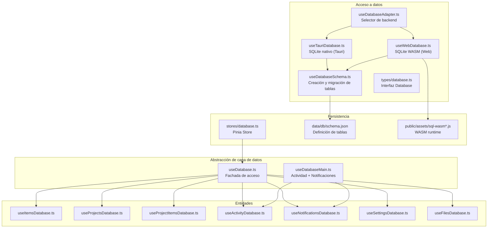
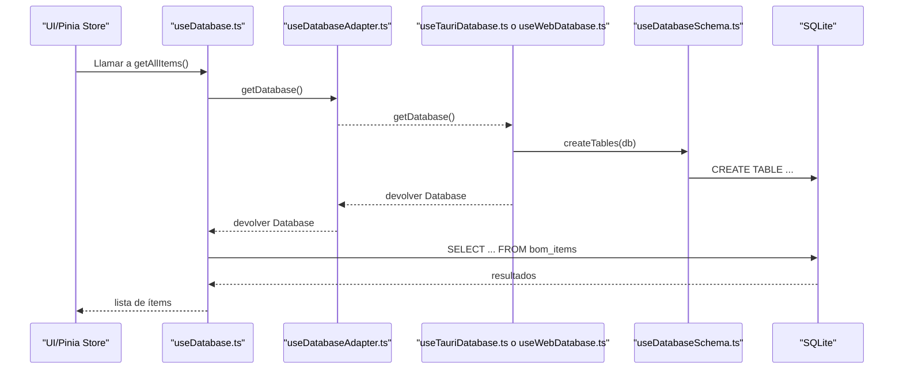
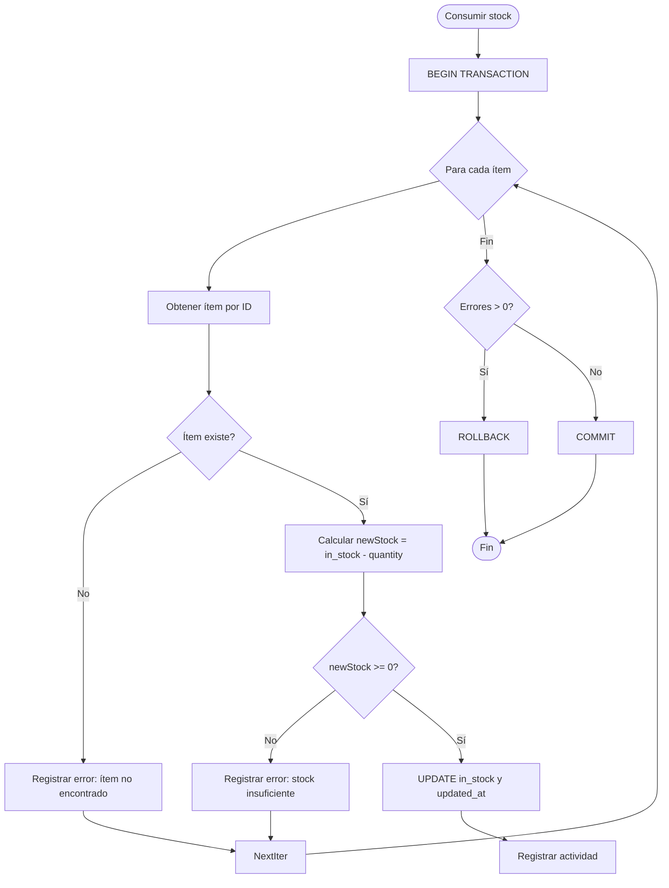
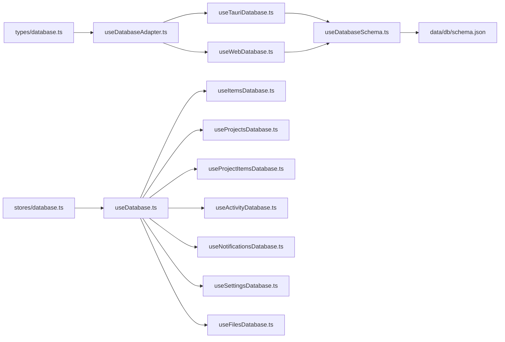
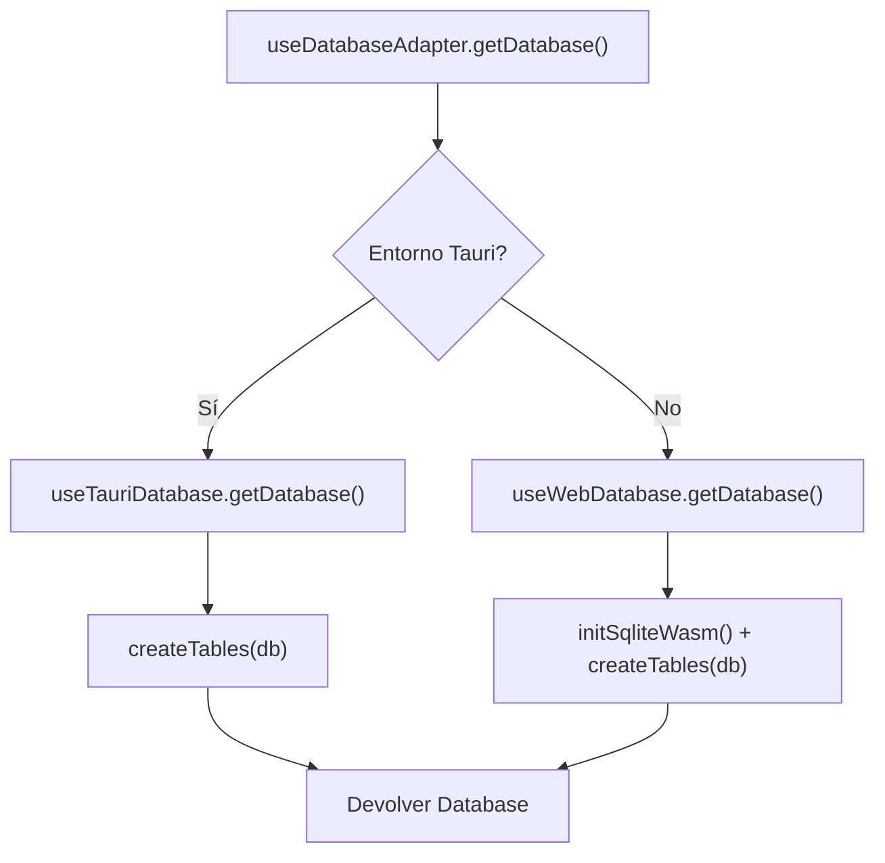

# Capa de Base de Datos

<cite>
**Archivos referenciados en este documento**
- [data/db/schema.json](file://data/db/schema.json)
- [types/database.ts](file://types/database.ts)
- [composables/useDatabaseAdapter.ts](file://composables/useDatabaseAdapter.ts)
- [composables/useTauriDatabase.ts](file://composables/useTauriDatabase.ts)
- [composables/useWebDatabase.ts](file://composables/useWebDatabase.ts)
- [composables/useDatabaseSchema.ts](file://composables/useDatabaseSchema.ts)
- [composables/useDatabase.ts](file://composables/useDatabase.ts)
- [composables/useDatabaseMain.ts](file://composables/useDatabaseMain.ts)
- [composables/useItemsDatabase.ts](file://composables/useItemsDatabase.ts)
- [composables/useProjectsDatabase.ts](file://composables/useProjectsDatabase.ts)
- [composables/useProjectItemsDatabase.ts](file://composables/useProjectItemsDatabase.ts)
- [composables/useActivityDatabase.ts](file://composables/useActivityDatabase.ts)
- [composables/useNotificationsDatabase.ts](file://composables/useNotificationsDatabase.ts)
- [composables/useSettingsDatabase.ts](file://composables/useSettingsDatabase.ts)
- [composables/useFilesDatabase.ts](file://composables/useFilesDatabase.ts)
- [stores/database.ts](file://stores/database.ts)
- [public/assets/sql-wasm.js](file://public/assets/sql-wasm.js)
- [public/assets/sql-wasm-debug.js](file://public/assets/sql-wasm-debug.js)
- [utils/databaseUpdater.ts](file://utils/databaseUpdater.ts)
</cite>

## Índice
1. [Introducción](#introducción)
2. [Estructura del proyecto](#estructura-del-proyecto)
3. [Componentes principales](#componentes-principales)
4. [Visión general de arquitectura](#visión-general-de-arquitectura)
5. [Análisis detallado de componentes](#análisis-detallado-de-componentes)
6. [Análisis de dependencias](#análisis-de-dependencias)
7. [Consideraciones de rendimiento](#consideraciones-de-rendimiento)
8. [Guía de solución de problemas](#guía-de-solución-de-problemas)
9. [Conclusión](#conclusión)
10. [Apéndices](#apéndices)

## Introducción
Este documento describe la capa de base de datos de BOM Manager, enfocándose en la abstracción de acceso a datos, el patrón de adaptador utilizado, la conexión a SQLite tanto en entornos Tauri como Web (SQLite WASM), y las operaciones CRUD soportadas. También documenta las interfaces de base de datos, transacciones, migraciones y validación de datos, la separación entre la capa de datos y la lógica de negocio, el uso de caché de consultas, y optimizaciones de rendimiento. Se incluyen diagramas de flujo de datos, ejemplos de operaciones comunes y consideraciones de escalabilidad, manejo de errores, concurrencia y persistencia de datos.

## Estructura del proyecto
La capa de base de datos se organiza en componibles que exponen operaciones CRUD específicas por entidad (ítems, proyectos, relaciones proyecto-ítems, actividad, notificaciones, configuración, archivos), un adaptador que selecciona dinámicamente el backend de base de datos según el entorno, y utilidades para la gestión del esquema y la inicialización.

**Diagrama fuente**
- [composables/useDatabaseAdapter.ts](file://composables/useDatabaseAdapter.ts#L1-L25)
- [composables/useTauriDatabase.ts](file://composables/useTauriDatabase.ts#L1-L55)
- [composables/useWebDatabase.ts](file://composables/useWebDatabase.ts#L1-L179)
- [composables/useDatabaseSchema.ts](file://composables/useDatabaseSchema.ts#L1-L302)
- [composables/useDatabase.ts](file://composables/useDatabase.ts#L1-L89)
- [composables/useDatabaseMain.ts](file://composables/useDatabaseMain.ts#L1-L17)
- [composables/useItemsDatabase.ts](file://composables/useItemsDatabase.ts#L1-L346)
- [composables/useProjectsDatabase.ts](file://composables/useProjectsDatabase.ts#L1-L128)
- [composables/useProjectItemsDatabase.ts](file://composables/useProjectItemsDatabase.ts#L1-L144)
- [composables/useActivityDatabase.ts](file://composables/useActivityDatabase.ts#L1-L87)
- [composables/useNotificationsDatabase.ts](file://composables/useNotificationsDatabase.ts#L1-L138)
- [composables/useSettingsDatabase.ts](file://composables/useSettingsDatabase.ts#L1-L111)
- [composables/useFilesDatabase.ts](file://composables/useFilesDatabase.ts#L1-L179)
- [stores/database.ts](file://stores/database.ts#L1-L198)
- [data/db/schema.json](file://data/db/schema.json#L1-L37)
- [public/assets/sql-wasm.js](file://public/assets/sql-wasm.js)
- [public/assets/sql-wasm-debug.js](file://public/assets/sql-wasm-debug.js)

**Sección fuente**
- [composables/useDatabaseAdapter.ts](file://composables/useDatabaseAdapter.ts#L1-L25)
- [composables/useTauriDatabase.ts](file://composables/useTauriDatabase.ts#L1-L55)
- [composables/useWebDatabase.ts](file://composables/useWebDatabase.ts#L1-L179)
- [composables/useDatabaseSchema.ts](file://composables/useDatabaseSchema.ts#L1-L302)
- [data/db/schema.json](file://data/db/schema.json#L1-L37)

## Componentes principales
- Interfaz Database: Define métodos select y execute para operaciones CRUD.
- Adaptador de base de datos: Detecta entorno y devuelve un manejador de base de datos específico (Tauri o Web).
- Implementaciones de base de datos:
  - Tauri: Conexión nativa a SQLite mediante plugin Tauri.
  - Web: SQLite WASM con worker, VFS OPFS y pragmas configurados.
- Esquema y migraciones: Carga el esquema desde JSON, crea tablas e intenta sincronizar columnas.
- Fachada de base de datos: Exposición unificada de operaciones CRUD para todas las entidades.
- Entidades: Componibles para ítems, proyectos, relación proyecto-ítems, actividad, notificaciones, configuración y archivos.
- Persistencia: Store Pinia que consume la fachada de base de datos.

**Sección fuente**
- [types/database.ts](file://types/database.ts#L1-L5)
- [composables/useDatabaseAdapter.ts](file://composables/useDatabaseAdapter.ts#L1-L25)
- [composables/useTauriDatabase.ts](file://composables/useTauriDatabase.ts#L1-L55)
- [composables/useWebDatabase.ts](file://composables/useWebDatabase.ts#L1-L179)
- [composables/useDatabaseSchema.ts](file://composables/useDatabaseSchema.ts#L1-L302)
- [composables/useDatabase.ts](file://composables/useDatabase.ts#L1-L89)
- [stores/database.ts](file://stores/database.ts#L1-L198)

## Visión general de arquitectura
El sistema utiliza un patrón de adaptador para ocultar las diferencias entre Tauri y Web. Ambos backends implementan la misma interfaz Database, permitiendo que los componibles de entidades operen de forma transparente. La inicialización incluye la creación o sincronización del esquema. Las operaciones CRUD se definen en componibles específicos, mientras que la fachada expone métodos consolidados. El store Pinia actúa como consumidor de la capa de datos.

**Diagrama fuente**
- [composables/useDatabase.ts](file://composables/useDatabase.ts#L1-L89)
- [composables/useDatabaseAdapter.ts](file://composables/useDatabaseAdapter.ts#L1-L25)
- [composables/useTauriDatabase.ts](file://composables/useTauriDatabase.ts#L1-L55)
- [composables/useWebDatabase.ts](file://composables/useWebDatabase.ts#L1-L179)
- [composables/useDatabaseSchema.ts](file://composables/useDatabaseSchema.ts#L1-L302)

## Análisis detallado de componentes

### Patrón de adaptador y conexión a SQLite
- Selector de backend: Evalúa la presencia de __TAURI_INTERNALS__ en window para decidir si usar Tauri o Web.
- Tauri: Carga el plugin @tauri-apps/plugin-sql, abre la base de datos local bom_manager.db y expone select/execute.
- Web: Inicializa SQLite WASM con worker oficial, configura VFS OPFS, pragmas de rendimiento y convierte filas en objetos.

**Sección fuente**
- [composables/useDatabaseAdapter.ts](file://composables/useDatabaseAdapter.ts#L1-L25)
- [composables/useTauriDatabase.ts](file://composables/useTauriDatabase.ts#L1-L55)
- [composables/useWebDatabase.ts](file://composables/useWebDatabase.ts#L1-L179)

### Interfaz de base de datos
- Database: select<T = any[]>(query, params?) y execute(query, params?), devolviendo promesas.

**Sección fuente**
- [types/database.ts](file://types/database.ts#L1-L5)

### Esquema y migraciones
- Carga el esquema desde data/db/schema.json.
- createTables: ejecuta las sentencias CREATE TABLE.
- syncSchema: compara tablas y columnas, agrega columnas faltantes; evita eliminar columnas extras.
- forceUpdateTable: renombra tabla actual, recrea con nueva definición y migra datos comunes.
- checkSchemaStatus: reporta estado de cada tabla (falta, desactualizada, ok).

**Sección fuente**
- [composables/useDatabaseSchema.ts](file://composables/useDatabaseSchema.ts#L1-L302)
- [data/db/schema.json](file://data/db/schema.json#L1-L37)

### Operaciones CRUD por entidad

#### Ítems (bom_items)
- Métodos: getAllItems, getItemById, createItem, updateItem, deleteItem, updateItemStock, consumeStockFromBOM, addStockToItems, getLowStockItems, getFilesByItem, getPdfFilesByItem.
- Transacciones: BEGIN/COMMIT/ROLLBACK al consumir o agregar stock masivamente.
- Validación: Control de stock negativo antes de descontar.
- Actividad: Registros de auditoría al crear, actualizar y eliminar.

**Diagrama fuente**
- [composables/useItemsDatabase.ts](file://composables/useItemsDatabase.ts#L201-L252)

**Sección fuente**
- [composables/useItemsDatabase.ts](file://composables/useItemsDatabase.ts#L1-L346)

#### Proyectos (projects)
- Métodos: getAllProjects, getProjectById, createProject, updateProject, deleteProject.
- Relaciones: Al eliminar un proyecto, se borran sus archivos asociados (eliminación en cascada).

**Sección fuente**
- [composables/useProjectsDatabase.ts](file://composables/useProjectsDatabase.ts#L1-L128)
- [composables/useFilesDatabase.ts](file://composables/useFilesDatabase.ts#L137-L150)

#### Relación proyecto-ítems (project_items)
- Métodos: getProjectItems, addItemToProject, removeItemFromProject, updateProjectItemQuantity, checkLowStockAndNotify, getProjectTotalValue.
- Clave única: (project_id, item_id) garantiza unicidad.

**Sección fuente**
- [composables/useProjectItemsDatabase.ts](file://composables/useProjectItemsDatabase.ts#L1-L144)

#### Actividad (activity)
- Métodos: logActivity, getActivityByTable, getAllActivity, getActivityByAction.

**Sección fuente**
- [composables/useActivityDatabase.ts](file://composables/useActivityDatabase.ts#L1-L87)

#### Notificaciones (notifications)
- Métodos: createNotification, getUnreadNotifications, getAllNotifications, markNotificationAsRead, markAllNotificationsAsRead, deleteNotification, getUnreadNotificationsCount.

**Sección fuente**
- [composables/useNotificationsDatabase.ts](file://composables/useNotificationsDatabase.ts#L1-L138)

#### Configuración (settings)
- Métodos: getSetting, createSetting, updateSetting, ensureDefaultSettings.

**Sección fuente**
- [composables/useSettingsDatabase.ts](file://composables/useSettingsDatabase.ts#L1-L111)

#### Archivos (files)
- Métodos: createFile, createFileForItem, createFileForProject, getFileById, getFilesByProjectId, getFilesByItemId, updateFile, deleteFile, deleteFilesByProjectId, deleteFilesByItemId.

**Sección fuente**
- [composables/useFilesDatabase.ts](file://composables/useFilesDatabase.ts#L1-L179)

### Fachada de base de datos
- useDatabase: Exporta métodos consolidados de todas las entidades, facilitando su consumo desde la UI o stores.

**Sección fuente**
- [composables/useDatabase.ts](file://composables/useDatabase.ts#L1-L89)

### Persistencia y caché de consultas
- Store Pinia: Almacena en memoria listas de ítems, proyectos y elementos de proyecto, actualizadas tras operaciones CRUD.
- Caché de consultas: No se detecta un mecanismo explícito de cacheo en memoria; se recomienda considerar claves de cacheo basadas en parámetros de consulta y TTL si se requiere.

**Sección fuente**
- [stores/database.ts](file://stores/database.ts#L1-L198)

## Análisis de dependencias
- Acoplamiento: Los componibles de entidades dependen del adaptador y de la interfaz Database. La fachada centraliza dependencias hacia todos los componibles.
- Cohesión: Cada componible encapsula operaciones de una sola entidad, manteniendo alta cohesión.
- Dependencias externas: Tauri plugin y SQLite WASM worker; ambos se cargan dinámicamente.

**Diagrama fuente**
- [types/database.ts](file://types/database.ts#L1-L5)
- [composables/useDatabaseAdapter.ts](file://composables/useDatabaseAdapter.ts#L1-L25)
- [composables/useTauriDatabase.ts](file://composables/useTauriDatabase.ts#L1-L55)
- [composables/useWebDatabase.ts](file://composables/useWebDatabase.ts#L1-L179)
- [composables/useDatabaseSchema.ts](file://composables/useDatabaseSchema.ts#L1-L302)
- [composables/useDatabase.ts](file://composables/useDatabase.ts#L1-L89)
- [composables/useItemsDatabase.ts](file://composables/useItemsDatabase.ts#L1-L346)
- [composables/useProjectsDatabase.ts](file://composables/useProjectsDatabase.ts#L1-L128)
- [composables/useProjectItemsDatabase.ts](file://composables/useProjectItemsDatabase.ts#L1-L144)
- [composables/useActivityDatabase.ts](file://composables/useActivityDatabase.ts#L1-L87)
- [composables/useNotificationsDatabase.ts](file://composables/useNotificationsDatabase.ts#L1-L138)
- [composables/useSettingsDatabase.ts](file://composables/useSettingsDatabase.ts#L1-L111)
- [composables/useFilesDatabase.ts](file://composables/useFilesDatabase.ts#L1-L179)
- [stores/database.ts](file://stores/database.ts#L1-L198)

**Sección fuente**
- [composables/useDatabase.ts](file://composables/useDatabase.ts#L1-L89)
- [stores/database.ts](file://stores/database.ts#L1-L198)

## Consideraciones de rendimiento
- SQLite WASM:
  - Configuración pragmática: journal_mode=WAL, synchronous=NORMAL, foreign_keys=ON.
  - VFS OPFS: Almacenamiento en sistema de archivos del navegador.
  - Worker oficial: Mejora la experiencia de usuario al evitar bloqueos del hilo principal.
- Transacciones: Uso de BEGIN/COMMIT/ROLLBACK para operaciones masivas de stock mejora atomicidad y eficiencia.
- Índices: No se observan índices adicionales en el esquema; se recomienda crear índices en columnas de búsqueda frecuente (por ejemplo, id, created_at, project_id, item_id) si se detecta latencia.
- Consultas: Seleccionar columnas específicas en lugar de * puede reducir tiempo de respuesta y uso de memoria.

**Sección fuente**
- [composables/useWebDatabase.ts](file://composables/useWebDatabase.ts#L1-L179)
- [composables/useItemsDatabase.ts](file://composables/useItemsDatabase.ts#L201-L252)

## Guía de solución de problemas
- Inicialización fallida:
  - Tauri: Revisar permisos y disponibilidad del plugin.
  - Web: Verificar carga de sql-wasm.js y compatibilidad del navegador con OPFS.
- Errores de migración:
  - syncSchema agrega columnas faltantes pero no elimina columnas extras; revisar discrepancias manuales si aparecen errores de tipos.
- Errores de stock:
  - Consumo de stock retorna mensajes detallados; validar entradas y condiciones previas a la operación.
- Auditoría:
  - Utilizar getActivityByTable y getAllActivity para rastrear cambios recientes.

**Sección fuente**
- [composables/useDatabaseSchema.ts](file://composables/useDatabaseSchema.ts#L1-L302)
- [composables/useItemsDatabase.ts](file://composables/useItemsDatabase.ts#L201-L252)
- [composables/useActivityDatabase.ts](file://composables/useActivityDatabase.ts#L1-L87)

## Conclusión
La capa de base de datos de BOM Manager implementa una arquitectura limpia con un adaptador que permite ejecutar SQLite tanto en Tauri como en Web. El esquema se gestiona desde JSON y se sincroniza automáticamente, incluyendo adición de columnas faltantes. Las operaciones CRUD están bien encapsuladas por entidad, con transacciones para operaciones críticas y registros de actividad. La persistencia se maneja a través de un store Pinia. Se recomienda considerar índices adicionales y posiblemente un mecanismo de cacheo de consultas para mejorar el rendimiento en escenarios de alto volumen.

## Apéndices

### Diagramas de flujo de datos

#### Flujo de inicialización de base de datos

**Diagrama fuente**
- [composables/useDatabaseAdapter.ts](file://composables/useDatabaseAdapter.ts#L1-L25)
- [composables/useTauriDatabase.ts](file://composables/useTauriDatabase.ts#L1-L55)
- [composables/useWebDatabase.ts](file://composables/useWebDatabase.ts#L1-L179)
- [composables/useDatabaseSchema.ts](file://composables/useDatabaseSchema.ts#L1-L302)

### Ejemplos de operaciones comunes
- Crear un ítem:
  - Llamar a createItem desde useDatabase o useItemsDatabase.
  - Registrar actividad automática.
- Actualizar stock:
  - Usar updateItemStock o consumir/agregar stock masivo.
  - Transacción asegura consistencia.
- Obtener proyectos con conteo de ítems:
  - getAllProjects con GROUP BY y COUNT.
- Registrar notificaciones:
  - createNotification y marcar como leídas posteriormente.

**Sección fuente**
- [composables/useItemsDatabase.ts](file://composables/useItemsDatabase.ts#L106-L176)
- [composables/useItemsDatabase.ts](file://composables/useItemsDatabase.ts#L201-L302)
- [composables/useProjectsDatabase.ts](file://composables/useProjectsDatabase.ts#L17-L36)
- [composables/useNotificationsDatabase.ts](file://composables/useNotificationsDatabase.ts#L1-L138)

### Consideraciones de escalabilidad
- Migraciones proactivas: Mantener el esquema en JSON y usar syncSchema para evitar caídas por estructuras desactualizadas.
- Índices: Agregar índices en columnas de búsqueda frecuentes.
- Cacheo: Implementar cacheo de consultas con invalidación basada en eventos de actualización.
- Concurrencia: Las transacciones garantizan atomicidad; en entornos multiusuario, considerar estrategias de control de concurrencia a nivel de aplicación.

**Sección fuente**
- [composables/useDatabaseSchema.ts](file://composables/useDatabaseSchema.ts#L1-L302)
- [composables/useItemsDatabase.ts](file://composables/useItemsDatabase.ts#L201-L302)

### Manejo de errores y persistencia
- Errores de base de datos: Todos los componibles capturan y registran errores, devolviendo valores neutros o false.
- Persistencia de datos: SQLite WASM con OPFS en Web; base de datos local en Tauri.
- Actualizador de base de datos: utils/databaseUpdater.ts puede usarse para actualizaciones manuales si es necesario.

**Sección fuente**
- [composables/useItemsDatabase.ts](file://composables/useItemsDatabase.ts#L18-L37)
- [composables/useProjectsDatabase.ts](file://composables/useProjectsDatabase.ts#L17-L36)
- [composables/useWebDatabase.ts](file://composables/useWebDatabase.ts#L1-L179)
- [utils/databaseUpdater.ts](file://utils/databaseUpdater.ts)