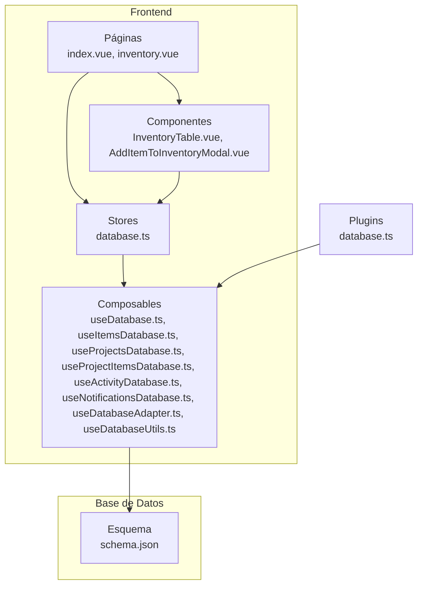
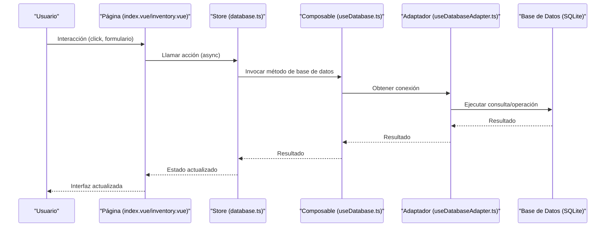
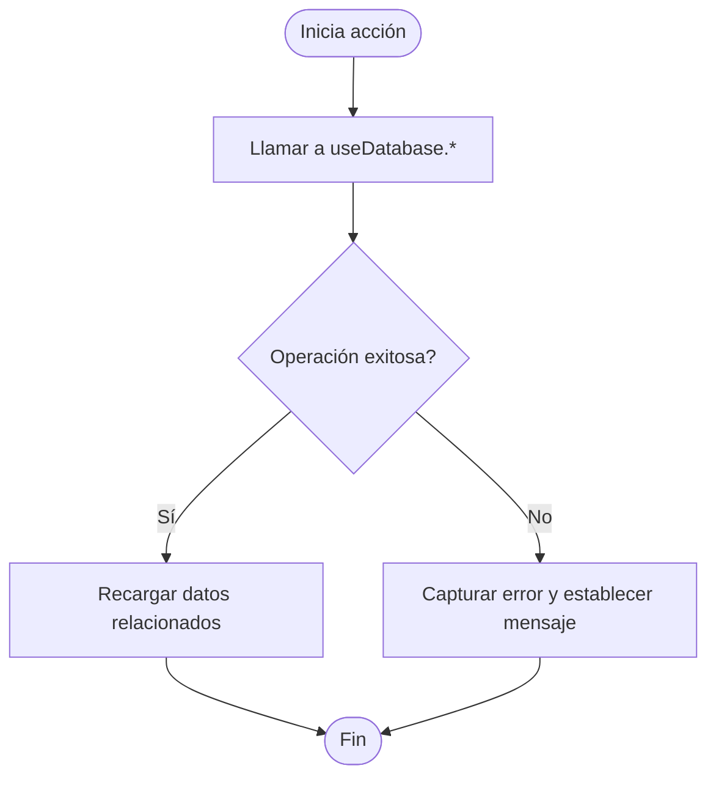
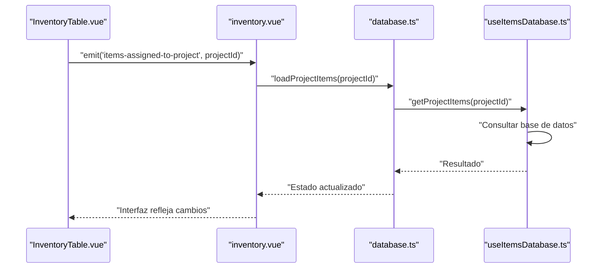
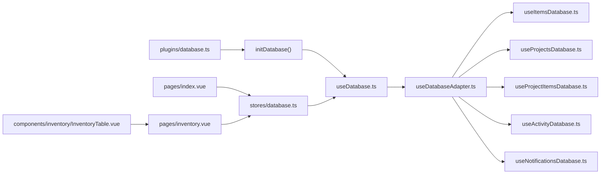

# Flujo de Datos y Comunicación

<cite>
**Archivos mencionados en este documento**
- [README.md](file://README.md)
- [nuxt.config.ts](file://nuxt.config.ts)
- [plugins/database.ts](file://plugins/database.ts)
- [stores/database.ts](file://stores/database.ts)
- [composables/useDatabase.ts](file://composables/useDatabase.ts)
- [composables/useDatabaseMain.ts](file://composables/useDatabaseMain.ts)
- [composables/useDatabaseAdapter.ts](file://composables/useDatabaseAdapter.ts)
- [composables/useItemsDatabase.ts](file://composables/useItemsDatabase.ts)
- [composables/useProjectsDatabase.ts](file://composables/useProjectsDatabase.ts)
- [composables/useProjectItemsDatabase.ts](file://composables/useProjectItemsDatabase.ts)
- [composables/useActivityDatabase.ts](file://composables/useActivityDatabase.ts)
- [composables/useNotificationsDatabase.ts](file://composables/useNotificationsDatabase.ts)
- [composables/useDatabaseUtils.ts](file://composables/useDatabaseUtils.ts)
- [pages/index.vue](file://pages/index.vue)
- [pages/inventory.vue](file://pages/inventory.vue)
- [components/inventory/InventoryTable.vue](file://components/inventory/InventoryTable.vue)
- [components/AddItemToInventoryModal.vue](file://components/AddItemToInventoryModal.vue)
- [data/db/schema.json](file://data/db/schema.json)
</cite>

## Índice
1. [Introducción](#introducción)
2. [Estructura del Proyecto](#estructura-del-proyecto)
3. [Componentes Principales](#componentes-principales)
4. [Arquitectura General](#arquitectura-general)
5. [Análisis Detallado de Componentes](#análisis-detallado-de-componentes)
6. [Análisis de Dependencias](#análisis-de-dependencias)
7. [Consideraciones de Rendimiento](#consideraciones-de-rendimiento)
8. [Guía de Solución de Problemas](#guía-de-solución-de-problemas)
9. [Conclusión](#conclusión)

## Introducción
Este documento explica cómo fluye la información y se comunica la aplicación BOM Manager desde la interacción del usuario hasta la actualización de la interfaz pasando por stores, composables, base de datos y notificaciones. Cubre el ciclo de vida de una acción del usuario, patrones de actualización de estado, notificaciones, sincronización de datos, manejo de eventos, callbacks y promesas asíncronas. También incluye diagramas de flujo, casos de uso típicos y recomendaciones de rendimiento.

## Estructura del Proyecto
La aplicación está construida con Nuxt 3/Vue 3, Pinia (stores) y una base de datos local SQLite. La capa frontend se organiza en páginas, componentes reutilizables, composables para lógica compartida y stores para el estado global. La base de datos se accede mediante un adaptador que permite ejecutar consultas SQL de forma segura tanto en entornos web como en Tauri.

**Diagrama fuente**
- [nuxt.config.ts](file://nuxt.config.ts#L1-L67)
- [plugins/database.ts](file://plugins/database.ts#L1-L13)
- [stores/database.ts](file://stores/database.ts#L1-L198)
- [composables/useDatabase.ts](file://composables/useDatabase.ts#L1-L89)
- [composables/useItemsDatabase.ts](file://composables/useItemsDatabase.ts#L1-L346)
- [composables/useProjectsDatabase.ts](file://composables/useProjectsDatabase.ts#L1-L128)
- [composables/useProjectItemsDatabase.ts](file://composables/useProjectItemsDatabase.ts#L1-L144)
- [composables/useActivityDatabase.ts](file://composables/useActivityDatabase.ts#L1-L87)
- [composables/useNotificationsDatabase.ts](file://composables/useNotificationsDatabase.ts#L1-L138)
- [composables/useDatabaseAdapter.ts](file://composables/useDatabaseAdapter.ts#L1-L25)
- [composables/useDatabaseUtils.ts](file://composables/useDatabaseUtils.ts#L1-L157)
- [data/db/schema.json](file://data/db/schema.json#L1-L37)

**Sección fuente**
- [README.md](file://README.md#L63-L101)
- [nuxt.config.ts](file://nuxt.config.ts#L1-L67)
- [plugins/database.ts](file://plugins/database.ts#L1-L13)

## Componentes Principales
- Páginas:
  - Página principal: carga estadísticas, notificaciones y actividad reciente.
  - Página de inventario: tabla de items, búsqueda, filtros, paginación, acciones CRUD, importación/exportación, notificaciones.
- Componentes:
  - Tabla de inventario: emite eventos de edición, eliminación, asignación a proyecto, vistas previas de LCSC.
  - Modal de alta/modificación de items: emite datos al padre.
- Stores:
  - Store de base de datos: encapsula operaciones CRUD de items, proyectos, items de proyectos y expone métodos asíncronos.
- Composables:
  - Adaptador de base de datos: detecta entorno y devuelve la conexión adecuada.
  - Base de datos: agrupa métodos de items, proyectos, relaciones, actividad y notificaciones.
  - Específicos: items, proyectos, items de proyectos, actividad, notificaciones, utilidades de mapeo.

**Sección fuente**
- [pages/index.vue](file://pages/index.vue#L1-L294)
- [pages/inventory.vue](file://pages/inventory.vue#L1-L630)
- [components/inventory/InventoryTable.vue](file://components/inventory/InventoryTable.vue#L1-L331)
- [components/AddItemToInventoryModal.vue](file://components/AddItemToInventoryModal.vue#L1-L311)
- [stores/database.ts](file://stores/database.ts#L1-L198)
- [composables/useDatabase.ts](file://composables/useDatabase.ts#L1-L89)
- [composables/useDatabaseAdapter.ts](file://composables/useDatabaseAdapter.ts#L1-L25)

## Arquitectura General
La arquitectura sigue un patrón de capas:
- Capa de presentación: páginas y componentes Vue.
- Capa de estado: stores (Pinia) que exponen acciones asíncronas.
- Capa de lógica: composables que encapsulan operaciones de base de datos y utilidades.
- Capa de persistencia: base de datos SQLite, con esquema definido.

**Diagrama fuente**
- [pages/index.vue](file://pages/index.vue#L140-L294)
- [pages/inventory.vue](file://pages/inventory.vue#L211-L630)
- [stores/database.ts](file://stores/database.ts#L1-L198)
- [composables/useDatabase.ts](file://composables/useDatabase.ts#L1-L89)
- [composables/useDatabaseAdapter.ts](file://composables/useDatabaseAdapter.ts#L1-L25)
- [data/db/schema.json](file://data/db/schema.json#L1-L37)

## Análisis Detallado de Componentes

### Store de Base de Datos
- Propósito: centralizar operaciones CRUD y exponer métodos asíncronos.
- Características:
  - Estados globales: items, proyectos, items de proyectos, loading, error.
  - Acciones asíncronas: loadItems, loadProjects, addItem, updateItem, deleteItem, addProject, updateProject, deleteProject, addProjectItem, loadProjectItems.
  - Manejo de errores y loading en cada acción.
  - Recarga automática de listas tras operaciones exitosas.

**Diagrama fuente**
- [stores/database.ts](file://stores/database.ts#L22-L197)

**Sección fuente**
- [stores/database.ts](file://stores/database.ts#L1-L198)

### Composable de Base de Datos Principal
- Propósito: agrupar métodos de items, proyectos, relaciones, actividad y notificaciones.
- Características:
  - Inicialización condicional de bases de datos.
  - Exposición de métodos consolidados.

**Sección fuente**
- [composables/useDatabase.ts](file://composables/useDatabase.ts#L1-L89)
- [composables/useDatabaseMain.ts](file://composables/useDatabaseMain.ts#L1-L17)

### Adaptador de Base de Datos
- Propósito: detectar entorno (web/Tauri) y devolver la conexión correspondiente.
- Características:
  - isTauri: detección mediante presencia de __TAURI_INTERNALS__.
  - getDatabase: delega a implementación específica.

**Sección fuente**
- [composables/useDatabaseAdapter.ts](file://composables/useDatabaseAdapter.ts#L1-L25)

### Composables de Entidades
- Items:
  - Operaciones CRUD completas.
  - Actualización de stock, consumo de stock basado en BOM, adición de stock, items con bajo stock.
  - Transacciones para operaciones múltiples (consume/add stock).
  - Registro de actividad.
- Proyectos:
  - CRUD de proyectos.
  - Eliminación en cascada de archivos asociados.
  - Registro de actividad.
- Relación Proyecto-Items:
  - Obtener items de un proyecto, agregar, remover, actualizar cantidad.
  - Cálculo del valor total del proyecto.
  - Verificación de stock bajo y notificaciones.
- Actividad:
  - Registro de eventos, consultas por tabla, acción o límite.
- Notificaciones:
  - Crear, leer, marcar como leídas, borrar, contar no leídas.

**Sección fuente**
- [composables/useItemsDatabase.ts](file://composables/useItemsDatabase.ts#L1-L346)
- [composables/useProjectsDatabase.ts](file://composables/useProjectsDatabase.ts#L1-L128)
- [composables/useProjectItemsDatabase.ts](file://composables/useProjectItemsDatabase.ts#L1-L144)
- [composables/useActivityDatabase.ts](file://composables/useActivityDatabase.ts#L1-L87)
- [composables/useNotificationsDatabase.ts](file://composables/useNotificationsDatabase.ts#L1-L138)

### Páginas y Componentes

#### Página Principal (Dashboard)
- Carga estadísticas: total de items, bajo stock, valor total, proyectos.
- Notificaciones no leídas.
- Actividad reciente.
- Eventos: apertura de modal de importación, cierre, manejo de errores.

**Sección fuente**
- [pages/index.vue](file://pages/index.vue#L140-L294)

#### Página de Inventario
- Filtros: búsqueda, categoría, stock (OK/Bajo).
- Paginación.
- Tabla de items: edición, eliminación, asignación a proyecto, vistas previas LCSC.
- Importación/exportación, gestión de listas, notificaciones.
- Eventos: guardado de items, importación completada, errores, asignación a proyecto.

**Sección fuente**
- [pages/inventory.vue](file://pages/inventory.vue#L1-L630)
- [components/inventory/InventoryTable.vue](file://components/inventory/InventoryTable.vue#L1-L331)
- [components/AddItemToInventoryModal.vue](file://components/AddItemToInventoryModal.vue#L1-L311)

### Comunicación entre Capas
- Páginas -> Store -> Composables -> Adaptador -> Base de Datos.
- Emisión de eventos de componentes hacia padres (por ejemplo, asignación a proyecto).
- Manejo de promesas asíncronas y callbacks de confirmación.

**Diagrama fuente**
- [components/inventory/InventoryTable.vue](file://components/inventory/InventoryTable.vue#L220-L275)
- [pages/inventory.vue](file://pages/inventory.vue#L373-L418)
- [stores/database.ts](file://stores/database.ts#L184-L196)
- [composables/useProjectItemsDatabase.ts](file://composables/useProjectItemsDatabase.ts#L15-L31)

## Análisis de Dependencias
- El plugin de base de datos se ejecuta en el arranque para asegurar que las bases de datos estén listas.
- Los stores dependen de composables de base de datos.
- Los composables de base de datos dependen del adaptador y del esquema de tablas.
- Las páginas y componentes dependen de stores y composables.

**Diagrama fuente**
- [plugins/database.ts](file://plugins/database.ts#L1-L13)
- [composables/useDatabase.ts](file://composables/useDatabase.ts#L1-L89)
- [composables/useDatabaseAdapter.ts](file://composables/useDatabaseAdapter.ts#L1-L25)
- [composables/useItemsDatabase.ts](file://composables/useItemsDatabase.ts#L1-L346)
- [composables/useProjectsDatabase.ts](file://composables/useProjectsDatabase.ts#L1-L128)
- [composables/useProjectItemsDatabase.ts](file://composables/useProjectItemsDatabase.ts#L1-L144)
- [composables/useActivityDatabase.ts](file://composables/useActivityDatabase.ts#L1-L87)
- [composables/useNotificationsDatabase.ts](file://composables/useNotificationsDatabase.ts#L1-L138)
- [stores/database.ts](file://stores/database.ts#L1-L198)
- [pages/index.vue](file://pages/index.vue#L140-L294)
- [pages/inventory.vue](file://pages/inventory.vue#L211-L630)
- [components/inventory/InventoryTable.vue](file://components/inventory/InventoryTable.vue#L1-L331)

**Sección fuente**
- [plugins/database.ts](file://plugins/database.ts#L1-L13)
- [stores/database.ts](file://stores/database.ts#L1-L198)

## Consideraciones de Rendimiento
- Carga diferida de datos:
  - El plugin inicializa la base de datos al arrancar, evitando errores de conexión durante la navegación.
- Paginación y filtrado:
  - La página de inventario filtra y pagina en el frontend, lo cual mejora la experiencia sin sobrecargar la base de datos.
- Transacciones:
  - Operaciones de consumo y adición de stock se realizan dentro de transacciones para mantener consistencia y evitar múltiples commits.
- Cálculos en frontend:
  - Cálculo del valor total y estadísticas en la página principal se realiza en memoria, reduciendo consultas redundantes.
- Manejo de errores:
  - Cada acción del store captura errores y establece un mensaje, evitando caídas y permitiendo al usuario reintentar.

**Sección fuente**
- [plugins/database.ts](file://plugins/database.ts#L1-L13)
- [pages/inventory.vue](file://pages/inventory.vue#L345-L371)
- [composables/useItemsDatabase.ts](file://composables/useItemsDatabase.ts#L201-L252)
- [composables/useItemsDatabase.ts](file://composables/useItemsDatabase.ts#L255-L302)
- [stores/database.ts](file://stores/database.ts#L22-L197)

## Guía de Solución de Problemas
- Errores en operaciones CRUD:
  - Verificar que el store establezca el error y que la página muestre notificaciones.
- Fallo en inicialización de base de datos:
  - Revisar el plugin de base de datos y asegurar que se ejecute en el arranque.
- Problemas de conexión en entornos Tauri/web:
  - Validar la detección de isTauri y que se devuelva la conexión correcta.
- Consistencia de datos:
  - Para operaciones múltiples, revisar que se usen transacciones y que se manejen rollback/commit correctamente.

**Sección fuente**
- [stores/database.ts](file://stores/database.ts#L22-L197)
- [plugins/database.ts](file://plugins/database.ts#L1-L13)
- [composables/useDatabaseAdapter.ts](file://composables/useDatabaseAdapter.ts#L1-L25)
- [composables/useItemsDatabase.ts](file://composables/useItemsDatabase.ts#L201-L252)
- [composables/useItemsDatabase.ts](file://composables/useItemsDatabase.ts#L255-L302)

## Conclusión
BOM Manager implementa un flujo de datos claro y robusto: las páginas y componentes emiten eventos y llaman a acciones del store, que delegan a composables de base de datos. Estos últimos utilizan un adaptador para acceder a SQLite, registran actividad y notificaciones, y mantienen la interfaz actualizada. El uso de transacciones, paginación y cálculos en frontend mejora el rendimiento. La arquitectura modular facilita mantenimiento y escalabilidad.