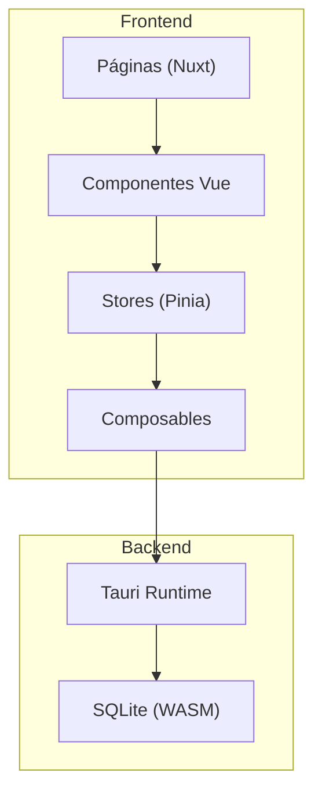
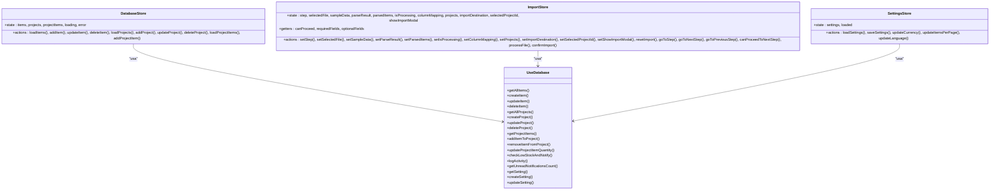
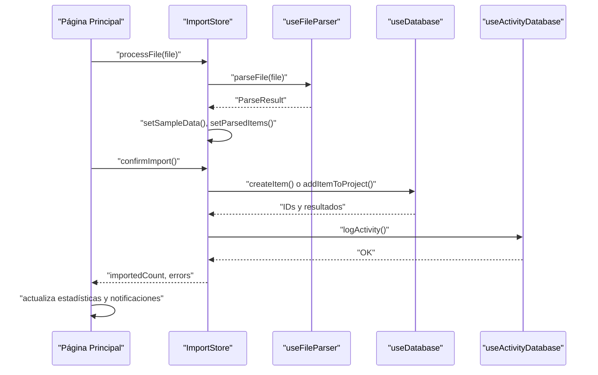

# Patrones de Componentes y State Management

<cite>
**Archivos referenciados en este documento**
- [README.md](file://README.md)
- [nuxt.config.ts](file://nuxt.config.ts)
- [package.json](file://package.json)
- [stores/database.ts](file://stores/database.ts)
- [stores/import.ts](file://stores/import.ts)
- [stores/settings.ts](file://stores/settings.ts)
- [composables/useDatabase.ts](file://composables/useDatabase.ts)
- [composables/useDatabaseMain.ts](file://composables/useDatabaseMain.ts)
- [components/dashboard/StatCard.vue](file://components/dashboard/StatCard.vue)
- [components/inventory/InventoryTable.vue](file://components/inventory/InventoryTable.vue)
- [components/project/ProjectCard.vue](file://components/project/ProjectCard.vue)
- [components/AddItemToInventoryModal.vue](file://components/AddItemToInventoryModal.vue)
- [pages/index.vue](file://pages/index.vue)
</cite>

## Índice
1. [Introducción](#introducción)
2. [Estructura del Proyecto](#estructura-del-proyecto)
3. [Componentes y Patrón Componible](#componentes-y-patrón-componible)
4. [Arquitectura de State Management con Pinia](#arquitectura-de-state-management-con-pinia)
5. [Comunicación entre Componentes](#comunicación-entre-componentes)
6. [Flujo de Importación de Datos](#flujo-de-importación-de-datos)
7. [Consideraciones de Mantenibilidad y Escalabilidad](#consideraciones-de-mantenibilidad-y-escalabilidad)
8. [Conclusión](#conclusión)

## Introducción
Este documento explica los patrones de diseño implementados en BOM Manager, con énfasis en:
- El patrón componible de Vue mediante composables reutilizables.
- Uso de Pinia para el state management centralizado.
- Arquitectura de componentes reutilizables y su organización en carpetas.
- Relaciones entre stores, composables y componentes.
- Comunicación entre componentes mediante props, eventos y slots.
- Manejo de estado global y flujo de datos desde la capa de presentación hasta el backend a través de adaptadores de base de datos.

## Estructura del Proyecto
La aplicación sigue una estructura modular basada en capas:
- Frontend: Vue 3 + Nuxt 4, con TailwindCSS para estilos.
- State Management: Pinia stores.
- Lógica reutilizable: composables que encapsulan funcionalidades de base de datos, notificaciones, importación, etc.
- Componentes: Carpetas temáticas (dashboard, inventory, project) y globales.
- Páginas: Rutas de la aplicación (index, inventory, projects).
- Backend: Tauri + SQLite (WASM) integrado a través de plugins.

**Diagram sources**
- [nuxt.config.ts](file://nuxt.config.ts#L1-L67)
- [package.json](file://package.json#L1-L50)
- [README.md](file://README.md#L63-L80)

**Sección sources**
- [README.md](file://README.md#L63-L80)
- [nuxt.config.ts](file://nuxt.config.ts#L1-L67)
- [package.json](file://package.json#L1-L50)

## Componentes y Patrón Componible
Los componentes están diseñados con:
- Props tipadas y valores por defecto.
- Slots con nombres para personalización de subtítulos y títulos.
- Eventos bien definidos con tipos para comunicación ascendente.
- Renderización condicional basada en props y estado local.
- Interacción con composables para notificaciones y funcionalidades externas.

Ejemplos destacados:
- Tarjeta de estadísticas con slots y renderización condicional de alertas.
- Tabla de inventario con selección múltiple, emisión de eventos y modales secundarios.
- Tarjeta de proyecto con acciones de edición, eliminación y visualización.
- Modal de alta/edita de ítems con watchers para sincronizar formulario y edición.

**Sección sources**
- [components/dashboard/StatCard.vue](file://components/dashboard/StatCard.vue#L1-L104)
- [components/inventory/InventoryTable.vue](file://components/inventory/InventoryTable.vue#L1-L331)
- [components/project/ProjectCard.vue](file://components/project/ProjectCard.vue#L1-L109)
- [components/AddItemToInventoryModal.vue](file://components/AddItemToInventoryModal.vue#L1-L311)

## Arquitectura de State Management con Pinia
La arquitectura de state management se organiza en tres capas:
- Stores (Pinia): encapsulan estado, acciones y lógica de negocio relacionada con dominios específicos (base de datos, importación, configuración).
- Composables: abstracciones de bajo nivel que exponen métodos CRUD y funcionalidades auxiliares (notificaciones, actividad, archivos).
- Adaptador de base de datos: provee acceso a SQLite/WASM y funciones compartidas (Tauri vs web).

**Diagram sources**
- [stores/database.ts](file://stores/database.ts#L1-L198)
- [stores/import.ts](file://stores/import.ts#L1-L344)
- [stores/settings.ts](file://stores/settings.ts#L1-L99)
- [composables/useDatabase.ts](file://composables/useDatabase.ts#L1-L89)

**Sección sources**
- [stores/database.ts](file://stores/database.ts#L1-L198)
- [stores/import.ts](file://stores/import.ts#L1-L344)
- [stores/settings.ts](file://stores/settings.ts#L1-L99)
- [composables/useDatabase.ts](file://composables/useDatabase.ts#L1-L89)

## Comunicación entre Componentes
La comunicación sigue patrones estrictos:
- De padres a hijos: props tipadas y slots con nombre.
- De hijos a padres: eventos con tipos explícitos.
- De componentes a stores: llamadas a acciones de stores desde scripts setup.
- De stores a composables: los stores invocan métodos de base de datos a través de composables.

Ejemplo en la página principal:
- Se pasan props a componentes de tarjetas de estadísticas.
- Se emiten eventos desde la tabla de inventario hacia el padre.
- Se actualiza el estado global y se refrescan vistas tras importaciones.

**Sección sources**
- [pages/index.vue](file://pages/index.vue#L1-L294)
- [components/inventory/InventoryTable.vue](file://components/inventory/InventoryTable.vue#L1-L331)
- [components/dashboard/StatCard.vue](file://components/dashboard/StatCard.vue#L1-L104)

## Flujo de Importación de Datos
El flujo de importación es un caso típico de state management componible:
- El usuario selecciona un archivo en un modal.
- El store importa procesa el archivo, genera una vista previa y mapea columnas.
- Al confirmar, el store persiste los datos en base de datos y registra actividad.
- La UI se actualiza con estadísticas y notificaciones.

**Diagram sources**
- [stores/import.ts](file://stores/import.ts#L195-L343)
- [pages/index.vue](file://pages/index.vue#L242-L256)

**Sección sources**
- [stores/import.ts](file://stores/import.ts#L195-L343)
- [pages/index.vue](file://pages/index.vue#L242-L256)

## Consideraciones de Mantenibilidad y Escalabilidad
- Organización lógica:
  - Los stores se mantienen enfocados en un dominio (base de datos, importación, configuración).
  - Los composables encapsulan lógica de base de datos y utilidades, evitando duplicados.
  - Los componentes son pequeños, reutilizables y se agrupan por funcionalidad.
- Patrones de diseño:
  - Composable pattern: reutilización de lógica sin acoplamiento a la UI.
  - Store actions puras: operaciones asíncronas con manejo de errores y loading.
  - Props + eventos + slots: comunicación clara y predecible.
- Escalabilidad:
  - Nuxt 4 permite rutas dinámicas y SSR desactivado (client-side) ideal para aplicaciones de escritorio.
  - Tauri + SQLite/WASM permite persistencia local robusta y fácil de distribuir.
  - La arquitectura permite añadir nuevos stores y composables sin afectar componentes existentes.

**Sección sources**
- [README.md](file://README.md#L63-L80)
- [nuxt.config.ts](file://nuxt.config.ts#L1-L67)
- [package.json](file://package.json#L1-L50)

## Conclusión
BOM Manager implementa una arquitectura sólida basada en:
- Componentes reutilizables con props, slots y eventos bien definidos.
- Un state management con Pinia que separa responsabilidades por dominios.
- Un conjunto de composables que encapsulan la lógica de base de datos y utilidades.
- Un flujo de importación robusto que demuestra la comunicación entre componentes, stores y el backend.

Esta estructura facilita el mantenimiento, mejora la legibilidad y permite escalar funcionalidades sin comprometer la cohesión del sistema.