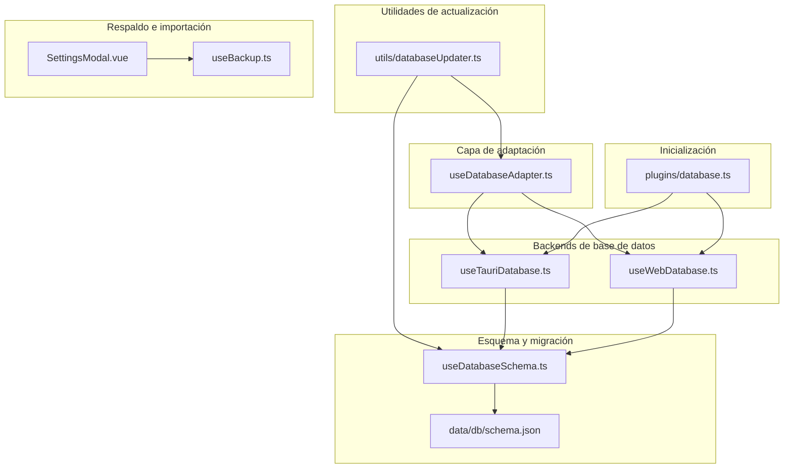
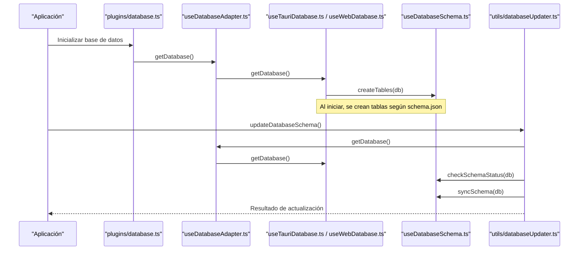
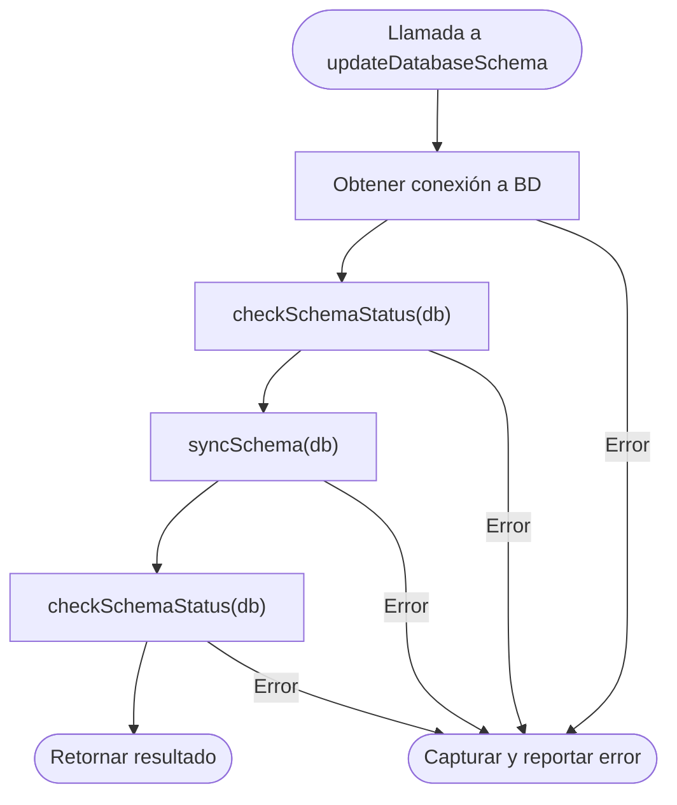
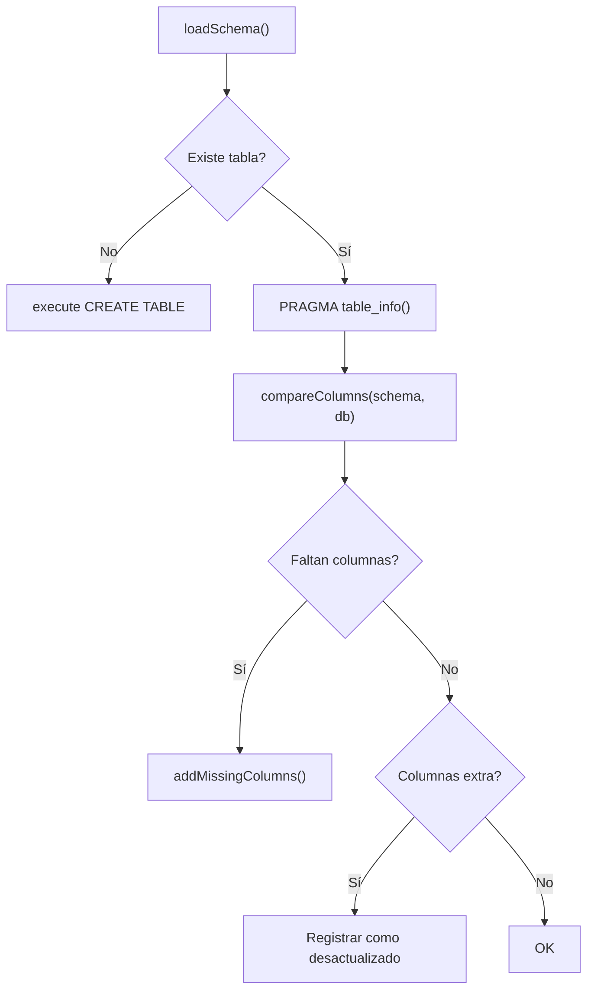
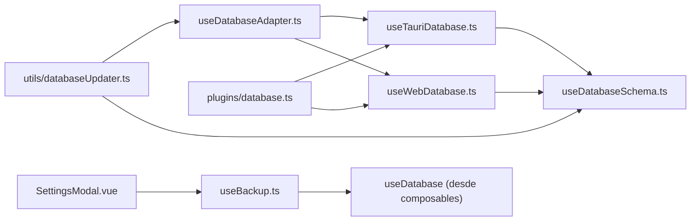

# Actualización de Base de Datos

<cite>
**Archivos referenciados en este documento**
- [utils/databaseUpdater.ts](file://utils/databaseUpdater.ts)
- [composables/useDatabaseAdapter.ts](file://composables/useDatabaseAdapter.ts)
- [composables/useDatabaseSchema.ts](file://composables/useDatabaseSchema.ts)
- [composables/useTauriDatabase.ts](file://composables/useTauriDatabase.ts)
- [composables/useWebDatabase.ts](file://composables/useWebDatabase.ts)
- [data/db/schema.json](file://data/db/schema.json)
- [plugins/database.ts](file://plugins/database.ts)
- [composables/useBackup.ts](file://composables/useBackup.ts)
- [components/global/SettingsModal.vue](file://components/global/SettingsModal.vue)
- [public/assets/sql-wasm-debug.js](file://public/assets/sql-wasm-debug.js)
- [types/sqlite-wasm.d.ts](file://types/sqlite-wasm.d.ts)
</cite>

## Índice
1. [Introducción](#introducción)
2. [Estructura del sistema de actualización](#estructura-del-sistema-de-actualización)
3. [Componentes principales](#componentes-principales)
4. [Arquitectura general](#arquitectura-general)
5. [Análisis detallado de componentes](#análisis-detallado-de-componentes)
6. [Análisis de dependencias](#análisis-de-dependencias)
7. [Consideraciones de rendimiento](#consideraciones-de-rendimiento)
8. [Guía de procedimientos](#guía-de-procedimientos)
9. [Solución de problemas](#solución-de-problemas)
10. [Conclusión](#conclusión)

## Introducción
Este documento explica el sistema de actualización de la base de datos de BOM Manager, enfocado en la migración de esquemas, compatibilidad entre versiones y mantenimiento post-migración. Se detalla cómo se manejan las actualizaciones automáticas, la verificación de compatibilidad y el rollback ante errores. También se describe el rol del archivo utils/databaseUpdater.ts y composables como useDatabaseAdapter.ts y useDatabaseSchema.ts en el proceso de actualización. Además, se incluyen procedimientos de respaldo previo a actualizaciones, pruebas de compatibilidad y soluciones a problemas comunes durante la migración, junto con guías paso a paso para actualizaciones manuales y posibles automatizaciones.

## Estructura del sistema de actualización
El sistema está compuesto por:
- Adaptador de base de datos (entorno Tauri o Web) que selecciona dinámicamente el backend de base de datos.
- Esquema de base de datos cargado desde un archivo JSON centralizado.
- Utilidades de actualización que verifican y sincronizan el esquema con la base de datos real.
- Composables de base de datos específicos (Tauri/Web) que inicializan y exponen operaciones de consulta y ejecución.
- Plugin de inicialización de base de datos en Nuxt.
- Herramientas de respaldo e importación de datos.

**Diagrama fuente**
- [utils/databaseUpdater.ts](file://utils/databaseUpdater.ts#L1-L90)
- [composables/useDatabaseAdapter.ts](file://composables/useDatabaseAdapter.ts#L1-L25)
- [composables/useDatabaseSchema.ts](file://composables/useDatabaseSchema.ts#L1-L302)
- [composables/useTauriDatabase.ts](file://composables/useTauriDatabase.ts#L1-L55)
- [composables/useWebDatabase.ts](file://composables/useWebDatabase.ts#L1-L179)
- [data/db/schema.json](file://data/db/schema.json#L1-L37)
- [plugins/database.ts](file://plugins/database.ts#L1-L13)
- [composables/useBackup.ts](file://composables/useBackup.ts#L1-L129)
- [components/global/SettingsModal.vue](file://components/global/SettingsModal.vue#L268-L341)

**Sección fuente**
- [utils/databaseUpdater.ts](file://utils/databaseUpdater.ts#L1-L90)
- [composables/useDatabaseAdapter.ts](file://composables/useDatabaseAdapter.ts#L1-L25)
- [composables/useDatabaseSchema.ts](file://composables/useDatabaseSchema.ts#L1-L302)
- [composables/useTauriDatabase.ts](file://composables/useTauriDatabase.ts#L1-L55)
- [composables/useWebDatabase.ts](file://composables/useWebDatabase.ts#L1-L179)
- [data/db/schema.json](file://data/db/schema.json#L1-L37)
- [plugins/database.ts](file://plugins/database.ts#L1-L13)
- [composables/useBackup.ts](file://composables/useBackup.ts#L1-L129)
- [components/global/SettingsModal.vue](file://components/global/SettingsModal.vue#L268-L341)

## Componentes principales
- utils/databaseUpdater.ts
  - Funciones de actualización de esquema, verificación de estado y forzado de actualización de tablas.
  - Interfaz común para operaciones de migración sin alterar datos innecesariamente.
- composables/useDatabaseAdapter.ts
  - Selector de backend según entorno (Tauri o Web).
  - Proporciona getDatabase() para acceder a la base de datos activa.
- composables/useDatabaseSchema.ts
  - Carga el esquema desde data/db/schema.json.
  - Verifica existencia de tablas, columnas y estados de compatibilidad.
  - Sincroniza automáticamente nuevas columnas y permite recrear tablas si es necesario.
- composables/useTauriDatabase.ts y useWebDatabase.ts
  - Inicialización de base de datos nativa (Tauri) y WASM (Web).
  - Configuración de parámetros iniciales y creación de tablas al iniciar.
- plugins/database.ts
  - Inicialización automática de base de datos al arrancar la aplicación.
- composables/useBackup.ts y components/global/SettingsModal.vue
  - Respaldo completo de datos y flujo de importación con advertencias y confirmaciones.

**Sección fuente**
- [utils/databaseUpdater.ts](file://utils/databaseUpdater.ts#L1-L90)
- [composables/useDatabaseAdapter.ts](file://composables/useDatabaseAdapter.ts#L1-L25)
- [composables/useDatabaseSchema.ts](file://composables/useDatabaseSchema.ts#L1-L302)
- [composables/useTauriDatabase.ts](file://composables/useTauriDatabase.ts#L1-L55)
- [composables/useWebDatabase.ts](file://composables/useWebDatabase.ts#L1-L179)
- [plugins/database.ts](file://plugins/database.ts#L1-L13)
- [composables/useBackup.ts](file://composables/useBackup.ts#L1-L129)
- [components/global/SettingsModal.vue](file://components/global/SettingsModal.vue#L268-L341)

## Arquitectura general
La arquitectura sigue un patrón de adaptador de base de datos que selecciona dinámicamente el backend (Tauri o Web). Al iniciar, se carga el esquema desde un archivo JSON y se crean las tablas si no existen. Las utilidades de actualización permiten verificar y sincronizar el esquema sin perder datos. La inicialización ocurre en el plugin de Nuxt, garantizando que la base de datos esté disponible antes de que se rendericen las páginas.

**Diagrama fuente**
- [plugins/database.ts](file://plugins/database.ts#L1-L13)
- [composables/useDatabaseAdapter.ts](file://composables/useDatabaseAdapter.ts#L1-L25)
- [composables/useTauriDatabase.ts](file://composables/useTauriDatabase.ts#L1-L55)
- [composables/useWebDatabase.ts](file://composables/useWebDatabase.ts#L1-L179)
- [composables/useDatabaseSchema.ts](file://composables/useDatabaseSchema.ts#L1-L302)
- [utils/databaseUpdater.ts](file://utils/databaseUpdater.ts#L1-L90)

## Análisis detallado de componentes

### utils/databaseUpdater.ts
- updateDatabaseSchema(): Verifica el estado del esquema, lo sincroniza y devuelve el estado final.
- forceUpdateTable(tableName): Recrea una tabla existente basada en la definición del esquema.
- checkDatabaseSchema(): Solo verifica sin hacer cambios.
- Manejo de errores: Retorna mensajes descriptivos y evita fallos catastróficos.

**Diagrama fuente**
- [utils/databaseUpdater.ts](file://utils/databaseUpdater.ts#L1-L90)
- [composables/useDatabaseSchema.ts](file://composables/useDatabaseSchema.ts#L1-L302)
- [composables/useDatabaseAdapter.ts](file://composables/useDatabaseAdapter.ts#L1-L25)

**Sección fuente**
- [utils/databaseUpdater.ts](file://utils/databaseUpdater.ts#L1-L90)

### composables/useDatabaseAdapter.ts
- Detecta entorno y delega a useTauriDatabase o useWebDatabase.
- Proporciona un único punto de acceso getDatabase() para acceder a la base de datos activa.

**Sección fuente**
- [composables/useDatabaseAdapter.ts](file://composables/useDatabaseAdapter.ts#L1-L25)

### composables/useDatabaseSchema.ts
- Carga el esquema desde data/db/schema.json.
- Funciones clave:
  - tableExists(), getCurrentTableDefinition(), getTableColumnInfo().
  - extractColumnNames(), extractColumnDefinitions(), compareColumns().
  - addMissingColumns(): Añade columnas faltantes manteniendo compatibilidad.
  - updateTable(): Renombra tabla actual, crea nueva con definición actualizada y migra datos comunes.
  - syncSchema(): Crea tablas si no existen; si existen, compara columnas y agrega las faltantes.
  - forceUpdateTable(): Recrea tabla completa basada en el esquema.
  - checkSchemaStatus(): Reporta estado de cada tabla (falta, actualizado, desactualizado).

**Diagrama fuente**
- [composables/useDatabaseSchema.ts](file://composables/useDatabaseSchema.ts#L1-L302)
- [data/db/schema.json](file://data/db/schema.json#L1-L37)

**Sección fuente**
- [composables/useDatabaseSchema.ts](file://composables/useDatabaseSchema.ts#L1-L302)
- [data/db/schema.json](file://data/db/schema.json#L1-L37)

### composables/useTauriDatabase.ts
- Inicializa base de datos nativa mediante @tauri-apps/plugin-sql.
- Al iniciar, llama a createTables() del esquema para asegurar estructura.
- Devuelve objetos con métodos select() y execute().

**Sección fuente**
- [composables/useTauriDatabase.ts](file://composables/useTauriDatabase.ts#L1-L55)

### composables/useWebDatabase.ts
- Inicializa SQLite WASM con worker oficial (@sqlite.org/sqlite-wasm).
- Configura PRAGMA y abre base de datos con VFS OPFS.
- Al iniciar, llama a createTables() del esquema.
- Devuelve objetos con métodos select() y execute() compatibles.

**Sección fuente**
- [composables/useWebDatabase.ts](file://composables/useWebDatabase.ts#L1-L179)
- [types/sqlite-wasm.d.ts](file://types/sqlite-wasm.d.ts#L71-L96)
- [public/assets/sql-wasm-debug.js](file://public/assets/sql-wasm-debug.js#L1193-L1241)

### plugins/database.ts
- Inicializa la base de datos al arrancar la aplicación en Nuxt.
- Llama a initDatabase() desde composables/useDatabase para asegurar disponibilidad.

**Sección fuente**
- [plugins/database.ts](file://plugins/database.ts#L1-L13)

### Respaldo e importación
- useBackup.ts:
  - Crea copia de seguridad de items, proyectos y listas.
  - Exporta a archivo JSON descargable.
  - Importa respaldo con validación de estructura.
- SettingsModal.vue:
  - Flujo de importación de base de datos con advertencias y confirmación previa.

**Sección fuente**
- [composables/useBackup.ts](file://composables/useBackup.ts#L1-L129)
- [components/global/SettingsModal.vue](file://components/global/SettingsModal.vue#L268-L341)

## Análisis de dependencias
- databaseUpdater.ts depende de useDatabaseAdapter.ts y useDatabaseSchema.ts.
- useDatabaseAdapter.ts depende de useTauriDatabase.ts y useWebDatabase.ts.
- useTauriDatabase.ts y useWebDatabase.ts dependen de useDatabaseSchema.ts para crear tablas al iniciar.
- plugins/database.ts depende de useDatabase.ts (no incluido aquí) y de useDatabaseAdapter.ts.
- Respaldo e importación dependen de composables de base de datos y listas.

**Diagrama fuente**
- [utils/databaseUpdater.ts](file://utils/databaseUpdater.ts#L1-L90)
- [composables/useDatabaseAdapter.ts](file://composables/useDatabaseAdapter.ts#L1-L25)
- [composables/useDatabaseSchema.ts](file://composables/useDatabaseSchema.ts#L1-L302)
- [composables/useTauriDatabase.ts](file://composables/useTauriDatabase.ts#L1-L55)
- [composables/useWebDatabase.ts](file://composables/useWebDatabase.ts#L1-L179)
- [plugins/database.ts](file://plugins/database.ts#L1-L13)
- [composables/useBackup.ts](file://composables/useBackup.ts#L1-L129)
- [components/global/SettingsModal.vue](file://components/global/SettingsModal.vue#L268-L341)

**Sección fuente**
- [utils/databaseUpdater.ts](file://utils/databaseUpdater.ts#L1-L90)
- [composables/useDatabaseAdapter.ts](file://composables/useDatabaseAdapter.ts#L1-L25)
- [composables/useDatabaseSchema.ts](file://composables/useDatabaseSchema.ts#L1-L302)
- [composables/useTauriDatabase.ts](file://composables/useTauriDatabase.ts#L1-L55)
- [composables/useWebDatabase.ts](file://composables/useWebDatabase.ts#L1-L179)
- [plugins/database.ts](file://plugins/database.ts#L1-L13)
- [composables/useBackup.ts](file://composables/useBackup.ts#L1-L129)
- [components/global/SettingsModal.vue](file://components/global/SettingsModal.vue#L268-L341)

## Consideraciones de rendimiento
- Inicialización diferida: useWebDatabase.ts y useTauriDatabase.ts evitan múltiples inicializaciones concurrentes.
- Operaciones de migración mínimas: addMissingColumns() solo agrega columnas faltantes, preservando datos.
- Recreación de tablas: updateTable() renombra tabla actual, crea nueva y copia columnas comunes, lo cual puede ser costoso en grandes volúmenes de datos.
- Configuración de base de datos: useWebDatabase.ts establece PRAGMA adecuados (journal_mode, synchronous, foreign_keys) para mejorar integridad y rendimiento.

**Sección fuente**
- [composables/useWebDatabase.ts](file://composables/useWebDatabase.ts#L1-L179)
- [composables/useDatabaseSchema.ts](file://composables/useDatabaseSchema.ts#L144-L175)

## Guía de procedimientos

### Procedimiento de respaldo previo a actualización
1. Generar copia de seguridad completa:
   - Usar useBackup.ts para crear y exportar un archivo JSON con items, proyectos y listas.
2. Confirmar ubicación del respaldo y almacenarlo en un lugar seguro.
3. Verificar que el respaldo contenga los datos necesarios antes de continuar.

**Sección fuente**
- [composables/useBackup.ts](file://composables/useBackup.ts#L1-L129)

### Pruebas de compatibilidad
1. Verificar estado del esquema sin cambios:
   - Llamar a checkDatabaseSchema() para obtener el estado actual de todas las tablas.
2. Revisar resultados:
   - Tablas faltantes: deben ser creadas automáticamente al iniciar.
   - Tablas desactualizadas: mostrarán columnas faltantes o extras; se recomienda agregar columnas faltantes o planificar recreación.

**Sección fuente**
- [utils/databaseUpdater.ts](file://utils/databaseUpdater.ts#L71-L90)
- [composables/useDatabaseSchema.ts](file://composables/useDatabaseSchema.ts#L251-L289)

### Actualización automática
1. Iniciar la aplicación:
   - plugins/database.ts llamará a initDatabase() que asegura que las bases de datos estén listas.
2. Sincronizar esquema:
   - Llamar a updateDatabaseSchema() para verificar y aplicar cambios menores (agregar columnas faltantes).
3. Validar resultados:
   - Revisar el estado devuelto y confirmar que todas las tablas están en estado “ok”.

**Sección fuente**
- [plugins/database.ts](file://plugins/database.ts#L1-L13)
- [utils/databaseUpdater.ts](file://utils/databaseUpdater.ts#L1-L46)
- [composables/useDatabaseSchema.ts](file://composables/useDatabaseSchema.ts#L201-L236)

### Actualización manual (recreación de tabla)
1. Identificar tabla a actualizar.
2. Llamar a forceUpdateTable(tableName):
   - Esto recreará la tabla basada en la definición actual del esquema.
3. Validar datos migrados:
   - Verificar que columnas comunes hayan sido copiadas correctamente.

**Sección fuente**
- [utils/databaseUpdater.ts](file://utils/databaseUpdater.ts#L48-L69)
- [composables/useDatabaseSchema.ts](file://composables/useDatabaseSchema.ts#L238-L249)

### Automatización del proceso
- Integrar updateDatabaseSchema() en flujos de inicio o actualización de la aplicación.
- Programar tareas periódicas de verificación de compatibilidad (checkDatabaseSchema()) en entornos donde sea necesario.
- Registrar logs de migración y errores para auditoría.

**Sección fuente**
- [utils/databaseUpdater.ts](file://utils/databaseUpdater.ts#L1-L90)

## Solución de problemas

### Errores comunes durante la migración
- Fallo al obtener conexión a la base de datos:
  - Verificar que useDatabaseAdapter.ts detecte correctamente el entorno y que useTauriDatabase.ts o useWebDatabase.ts hayan iniciado correctamente.
- Problemas al crear o actualizar tablas:
  - Revisar definiciones en data/db/schema.json y asegurar que las columnas faltantes sean compatibles.
  - Para recreaciones masivas, considerar respaldos completos y pruebas en entornos no productivos.
- Conflictos de columnas extras:
  - El sistema actual no elimina columnas extras; se recomienda revisar y documentar antes de proceder con acciones destructivas.

### Recuperación ante errores
- Usar forceUpdateTable(tableName) para recrear tablas problemáticas basadas en el esquema actual.
- Restaurar desde copia de seguridad:
  - Importar respaldo con useBackup.ts o desde SettingsModal.vue, asegurándose de confirmar advertencias previas.

**Sección fuente**
- [composables/useDatabaseAdapter.ts](file://composables/useDatabaseAdapter.ts#L1-L25)
- [composables/useTauriDatabase.ts](file://composables/useTauriDatabase.ts#L1-L55)
- [composables/useWebDatabase.ts](file://composables/useWebDatabase.ts#L1-L179)
- [composables/useDatabaseSchema.ts](file://composables/useDatabaseSchema.ts#L127-L175)
- [composables/useBackup.ts](file://composables/useBackup.ts#L67-L129)
- [components/global/SettingsModal.vue](file://components/global/SettingsModal.vue#L268-L341)

## Conclusión
El sistema de actualización de BOM Manager proporciona un mecanismo robusto y seguro para mantener la base de datos alineada con el esquema definido. Gracias al adaptador de base de datos, a la carga centralizada del esquema y a utilidades de verificación y sincronización, se minimiza el riesgo de incompatibilidades. Las prácticas recomendadas incluyen respaldos previos, pruebas de compatibilidad y el uso de actualizaciones manuales solo cuando sea necesario. La integración con flujos de inicio y la posibilidad de automatización permiten mantener la base de datos siempre actualizada sin interrumpir la experiencia del usuario.