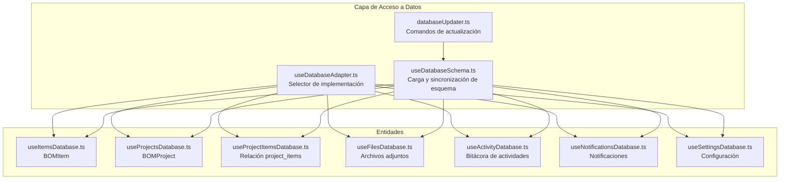
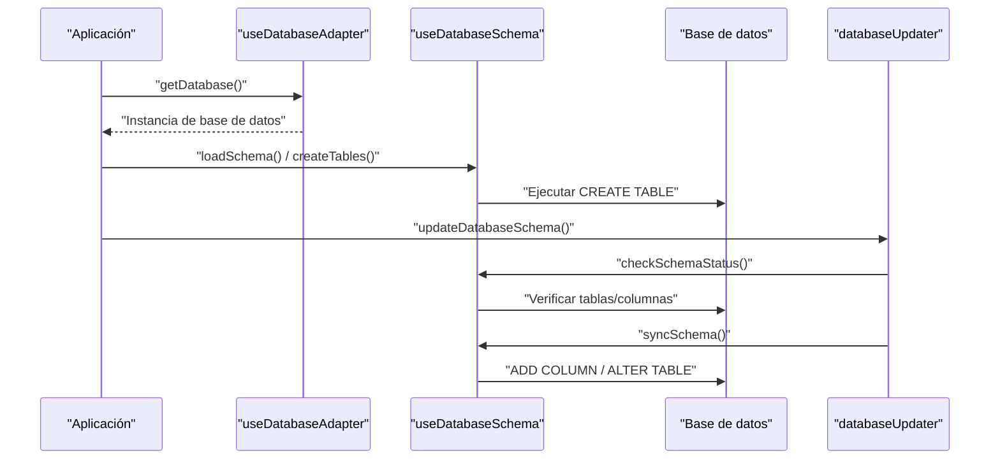
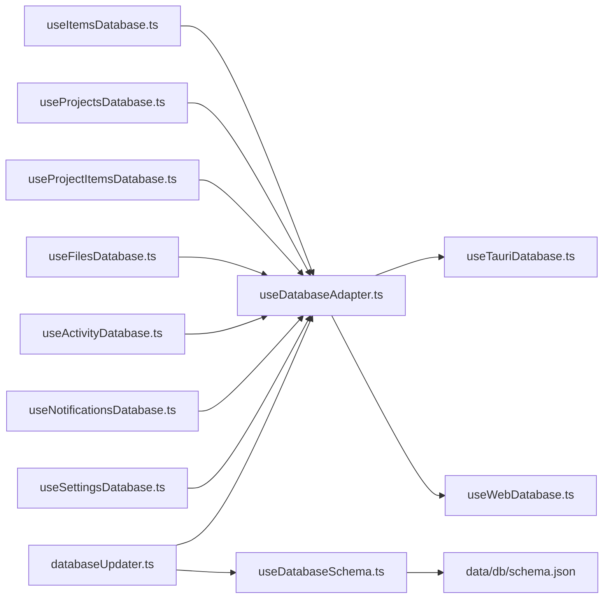
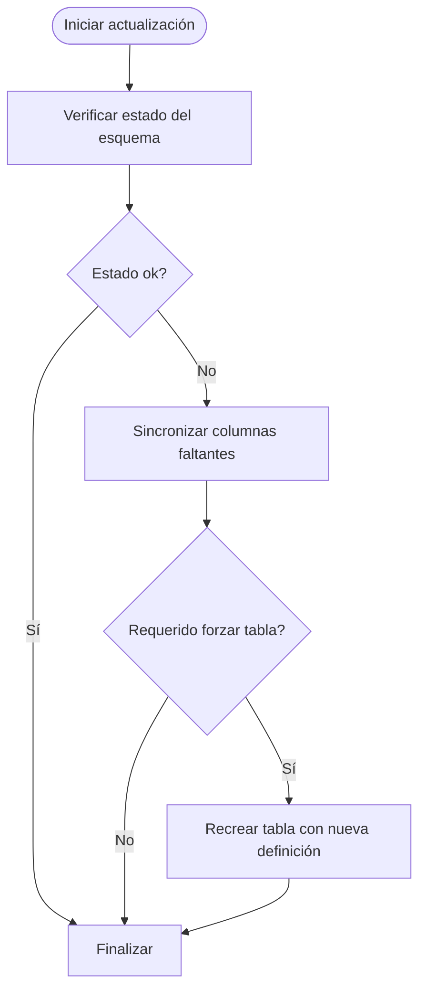

# Base de Datos y Esquema

<cite>
**Archivos referenciados en este documento**
- [schema.json](file://data/db/schema.json)
- [useDatabase.ts](file://composables/useDatabase.ts)
- [useDatabaseMain.ts](file://composables/useDatabaseMain.ts)
- [useDatabaseAdapter.ts](file://composables/useDatabaseAdapter.ts)
- [useDatabaseSchema.ts](file://composables/useDatabaseSchema.ts)
- [databaseUpdater.ts](file://utils/databaseUpdater.ts)
- [useItemsDatabase.ts](file://composables/useItemsDatabase.ts)
- [useProjectsDatabase.ts](file://composables/useProjectsDatabase.ts)
- [useProjectItemsDatabase.ts](file://composables/useProjectItemsDatabase.ts)
- [useFilesDatabase.ts](file://composables/useFilesDatabase.ts)
- [useActivityDatabase.ts](file://composables/useActivityDatabase.ts)
- [useNotificationsDatabase.ts](file://composables/useNotificationsDatabase.ts)
- [useSettingsDatabase.ts](file://composables/useSettingsDatabase.ts)
- [useDatabaseUtils.ts](file://composables/useDatabaseUtils.ts)
- [bom.ts](file://types/bom.ts)
- [database.ts](file://types/database.ts)
</cite>

## Índice
1. [Introducción](#introducción)
2. [Estructura del Proyecto](#estructura-del-proyecto)
3. [Componentes Principales](#componentes-principales)
4. [Visión General de la Arquitectura](#visión-general-de-la-arquitectura)
5. [Análisis Detallado de Componentes](#análisis-detallado-de-componentes)
6. [Análisis de Dependencias](#análisis-de-dependencias)
7. [Consideraciones de Rendimiento](#consideraciones-de-rendimiento)
8. [Guía de Mantenimiento y Actualización](#guía-de-mantenimiento-y-actualización)
9. [Consultas Comunes y Operaciones CRUD](#consultas-comunes-y-operaciones-crud)
10. [Consultas Avanzadas, Triggers y Vistas](#consultas-avanzadas-triggers-y-vistas)
11. [Consideraciones de Integridad, Seguridad y Respaldo](#consideraciones-de-integridad-seguridad-y-respaldo)
12. [Conclusión](#conclusión)

## Introducción
Este documento describe la base de datos SQLite de BOM Manager, incluyendo el esquema completo, relaciones, índices implícitos, restricciones, y el modelo de datos de BOMItem, BOMProject y ProjectItem. También explica cómo se gestionan las operaciones CRUD, el sistema de actualización automática del esquema, y proporciona recomendaciones de rendimiento, mantenimiento, seguridad y respaldo.

## Estructura del Proyecto
El esquema de la base de datos se define en un archivo JSON central y se aplica dinámicamente al iniciar la aplicación. La capa de acceso a datos está dividida en componibles que encapsulan operaciones CRUD por entidad y un adaptador que selecciona la implementación según el entorno (Tauri o Web).



**Diagrama fuente**
- [useDatabaseAdapter.ts](file://composables/useDatabaseAdapter.ts#L1-L25)
- [useDatabaseSchema.ts](file://composables/useDatabaseSchema.ts#L1-L302)
- [databaseUpdater.ts](file://utils/databaseUpdater.ts#L1-L90)
- [useItemsDatabase.ts](file://composables/useItemsDatabase.ts#L1-L346)
- [useProjectsDatabase.ts](file://composables/useProjectsDatabase.ts#L1-L128)
- [useProjectItemsDatabase.ts](file://composables/useProjectItemsDatabase.ts#L1-L144)
- [useFilesDatabase.ts](file://composables/useFilesDatabase.ts#L1-L179)
- [useActivityDatabase.ts](file://composables/useActivityDatabase.ts#L1-L87)
- [useNotificationsDatabase.ts](file://composables/useNotificationsDatabase.ts#L1-L138)
- [useSettingsDatabase.ts](file://composables/useSettingsDatabase.ts#L1-L111)

**Sección fuente**
- [schema.json](file://data/db/schema.json#L1-L37)
- [useDatabase.ts](file://composables/useDatabase.ts#L1-L89)
- [useDatabaseMain.ts](file://composables/useDatabaseMain.ts#L1-L17)
- [useDatabaseAdapter.ts](file://composables/useDatabaseAdapter.ts#L1-L25)
- [useDatabaseSchema.ts](file://composables/useDatabaseSchema.ts#L1-L302)
- [databaseUpdater.ts](file://utils/databaseUpdater.ts#L1-L90)

## Componentes Principales
- Esquema de base de datos: definido en JSON y aplicado mediante componibles.
- Adaptador de base de datos: detecta entorno y selecciona implementación Tauri o Web.
- Componibles de entidad: encapsulan operaciones CRUD y lógica de negocio.
- Actualización de esquema: verificación y sincronización automática.
- Actividad y notificaciones: trazabilidad de cambios y alertas.

**Sección fuente**
- [schema.json](file://data/db/schema.json#L1-L37)
- [useDatabaseAdapter.ts](file://composables/useDatabaseAdapter.ts#L1-L25)
- [useDatabaseSchema.ts](file://composables/useDatabaseSchema.ts#L1-L302)
- [useItemsDatabase.ts](file://composables/useItemsDatabase.ts#L1-L346)
- [useProjectsDatabase.ts](file://composables/useProjectsDatabase.ts#L1-L128)
- [useProjectItemsDatabase.ts](file://composables/useProjectItemsDatabase.ts#L1-L144)
- [useFilesDatabase.ts](file://composables/useFilesDatabase.ts#L1-L179)
- [useActivityDatabase.ts](file://composables/useActivityDatabase.ts#L1-L87)
- [useNotificationsDatabase.ts](file://composables/useNotificationsDatabase.ts#L1-L138)
- [useSettingsDatabase.ts](file://composables/useSettingsDatabase.ts#L1-L111)

## Visión General de la Arquitectura
La arquitectura se basa en:
- Un adaptador que determina el backend de base de datos (Tauri o Web).
- Un sistema de carga de esquema desde JSON y sincronización automática.
- Componibles por entidad que exponen métodos CRUD y operaciones de negocio.
- Un módulo de actualización que permite verificar y forzar actualizaciones de tablas.



**Diagrama fuente**
- [useDatabaseAdapter.ts](file://composables/useDatabaseAdapter.ts#L1-L25)
- [useDatabaseSchema.ts](file://composables/useDatabaseSchema.ts#L1-L302)
- [databaseUpdater.ts](file://utils/databaseUpdater.ts#L1-L90)

## Análisis Detallado de Componentes

### Esquema de Base de Datos
- Tabla meta: almacena pares clave-valor para metadatos.
- Tabla bom_items: almacena componentes con campos de stock, precios, proveedores, fabricantes, etc.
- Tabla projects: proyectos con enlaces a recursos externos.
- Tabla project_items: relación muchos a muchos entre proyectos e ítems, con cantidad y cláusula UNIQUE.
- Tabla files: archivos adjuntos vinculados a proyectos o ítems con claves foráneas y eliminación en cascada.
- Tabla activity: bitácora de acciones realizadas en la base de datos.
- Tabla notifications: notificaciones del sistema.
- Tabla settings: configuración global (moneda, idioma, paginación).

Restricciones y claves:
- Las tablas usan claves primarias simples (id TEXT PRIMARY KEY).
- project_items tiene UNIQUE(project_id, item_id) para evitar duplicados.
- Claves foráneas con ON DELETE CASCADE entre files y bom_items/projects, y entre project_items y bom_items/projects.

**Sección fuente**
- [schema.json](file://data/db/schema.json#L1-L37)

### Modelo de Datos: BOMItem, BOMProject, ProjectItem
- BOMItem: representa un componente electrónico con atributos como nombre, descripción, cantidad, categoría, proveedor, número de parte, precio, stock, mínimos, notas, fechas de creación/actualización, fabricante, código de empaque, ROHS, precio total, tiempo de entrega, código de fecha/lote, estado, designación en PCB e imagen.
- BOMProject: representa un proyecto con nombre, descripción y enlaces a repositorio/web.
- ProjectItem: relación entre proyecto e ítem con cantidad asociada.

Tipos y mapeo:
- Los tipos TypeScript definen las propiedades de estas entidades.
- Al insertar/updatear, se convierte camelCase a snake_case para compatibilidad con columnas de base de datos.

**Sección fuente**
- [bom.ts](file://types/bom.ts#L1-L47)
- [useItemsDatabase.ts](file://composables/useItemsDatabase.ts#L1-L346)
- [useDatabaseUtils.ts](file://composables/useDatabaseUtils.ts)

### Relaciones y Claves Foráneas
```mermaid
erDiagram
BOM_ITEMS {
text id PK
text name
text description
real quantity
text category
text supplier
text part_number
text lcsc_part
real price
real in_stock
real min_stock
text notes
text created_at
text updated_at
text manufacturer
text customer_no
text package
text rohs
real ext_price
integer lead_time
text date_code_lot_no
text status
text pcb_designation
text item_image
}
PROJECTS {
text id PK
text name
text description
text git
text web
text created_at
text updated_at
}
PROJECT_ITEMS {
text id PK
text project_id FK
text item_id FK
real quantity
text created_at
text updated_at
unique uq_project_item UNQ
}
FILES {
text id PK
text project_id FK
text item_id FK
text filename
text filepath
text file_type
integer size
text title
text description
text created_at
}
ACTIVITY {
text id PK
text action
text table_name
text record_id
text user_id
text description
text created_at
}
NOTIFICATIONS {
text id PK
text title
text message
text type
integer is_read
text created_at
}
SETTINGS {
text id PK
text currency
integer items_per_page
text language
text created_at
text updated_at
}
BOM_ITEMS ||--o{ PROJECT_ITEMS : "contiene"
PROJECTS ||--o{ PROJECT_ITEMS : "tiene"
BOM_ITEMS ||--o{ FILES : "puede tener"
PROJECTS ||--o{ FILES : "puede tener"
```

**Diagrama fuente**
- [schema.json](file://data/db/schema.json#L1-L37)

### Componibles de Entidad y Operaciones CRUD

#### BOM Items (bom_items)
- Operaciones: obtener todos, obtener por id, crear, actualizar, eliminar, actualizar stock, consumir stock desde BOM, agregar stock, obtener ítems con bajo stock.
- Transacciones: consumo y adición de stock se manejan con BEGIN/COMMIT/ROLLBACK.
- Seguridad: se registran actividades de cada operación.

**Sección fuente**
- [useItemsDatabase.ts](file://composables/useItemsDatabase.ts#L1-L346)
- [useActivityDatabase.ts](file://composables/useActivityDatabase.ts#L1-L87)

#### Proyectos (projects)
- Operaciones: listar, obtener por id, crear, actualizar, eliminar.
- Al eliminar un proyecto, se borran archivos asociados debido a claves foráneas con CASCADE.

**Sección fuente**
- [useProjectsDatabase.ts](file://composables/useProjectsDatabase.ts#L1-L128)
- [useFilesDatabase.ts](file://composables/useFilesDatabase.ts#L1-L179)

#### Relación Proyecto-Ítem (project_items)
- Operaciones: obtener ítems de un proyecto, agregar ítem con cantidad, remover ítem, actualizar cantidad, calcular valor total del proyecto, verificar stock bajo.
- Clave única: UNIQUE(project_id, item_id).

**Sección fuente**
- [useProjectItemsDatabase.ts](file://composables/useProjectItemsDatabase.ts#L1-L144)

#### Archivos (files)
- Operaciones: crear, obtener por id, obtener por proyecto o ítem, actualizar, eliminar, eliminar en cascada por proyecto o ítem.
- Relaciones: project_id y/o item_id pueden estar presentes.

**Sección fuente**
- [useFilesDatabase.ts](file://composables/useFilesDatabase.ts#L1-L179)

#### Actividad (activity)
- Operaciones: registrar actividad, obtener por tabla/registro, obtener últimas, filtrar por acción.

**Sección fuente**
- [useActivityDatabase.ts](file://composables/useActivityDatabase.ts#L1-L87)

#### Notificaciones (notifications)
- Operaciones: crear, obtener no leídas, todas, marcar como leída, marcar todas, eliminar, contar no leídas.

**Sección fuente**
- [useNotificationsDatabase.ts](file://composables/useNotificationsDatabase.ts#L1-L138)

#### Configuración (settings)
- Operaciones: obtener, crear, actualizar, asegurar valores por defecto.

**Sección fuente**
- [useSettingsDatabase.ts](file://composables/useSettingsDatabase.ts#L1-L111)

## Análisis de Dependencias
- El adaptador de base de datos depende de la detección del entorno y delega a implementaciones Tauri o Web.
- Los componibles de entidad dependen del adaptador y de la base de datos.
- El sistema de actualización depende del esquema cargado desde JSON.
- La capa de utilidades convierte nombres de campos de camelCase a snake_case.



**Diagrama fuente**
- [useDatabaseAdapter.ts](file://composables/useDatabaseAdapter.ts#L1-L25)
- [useDatabaseSchema.ts](file://composables/useDatabaseSchema.ts#L1-L302)
- [databaseUpdater.ts](file://utils/databaseUpdater.ts#L1-L90)
- [schema.json](file://data/db/schema.json#L1-L37)

**Sección fuente**
- [useDatabaseAdapter.ts](file://composables/useDatabaseAdapter.ts#L1-L25)
- [useDatabaseSchema.ts](file://composables/useDatabaseSchema.ts#L1-L302)
- [databaseUpdater.ts](file://utils/databaseUpdater.ts#L1-L90)

## Consideraciones de Rendimiento
- Índices implícitos: las claves primarias generan índices en SQLite. No hay índices explícitos en el esquema actual.
- Recomendaciones:
  - Agregar índices en columnas de búsqueda frecuentes (por ejemplo, bom_items.name, projects.name, project_items.project_id, project_items.item_id).
  - Usar consultas parametrizadas (ya se hace).
  - Limitar resultados con ORDER BY y LIMIT en vistas de listas.
  - Evitar selecciones grandes sin filtros; usar paginación.
  - Revisar el uso de JOINs en consultas complejas (ya se usan de forma moderada).

[No sección fuente específica, ya que esta sección ofrece recomendaciones generales]

## Guía de Mantenimiento y Actualización
- Verificación de esquema: se puede ejecutar un comando que reporta el estado actual de las tablas.
- Sincronización automática: compara columnas actuales con el esquema y agrega columnas faltantes.
- Recreación forzosa: permite rehacer una tabla usando la definición actual del esquema.



**Diagrama fuente**
- [databaseUpdater.ts](file://utils/databaseUpdater.ts#L1-L90)
- [useDatabaseSchema.ts](file://composables/useDatabaseSchema.ts#L1-L302)

**Sección fuente**
- [databaseUpdater.ts](file://utils/databaseUpdater.ts#L1-L90)
- [useDatabaseSchema.ts](file://composables/useDatabaseSchema.ts#L1-L302)

## Consultas Comunes y Operaciones CRUD

### CRUD de BOM Items
- Crear: inserta en bom_items con id generado y timestamps.
- Leer: obtener todos con JOIN a project_items para mostrar proyectos asociados; obtener por id.
- Actualizar: actualiza todos los campos excepto id y timestamps.
- Eliminar: elimina el ítem y registra actividad.

**Sección fuente**
- [useItemsDatabase.ts](file://composables/useItemsDatabase.ts#L1-L346)
- [useActivityDatabase.ts](file://composables/useActivityDatabase.ts#L1-L87)

### CRUD de Proyectos
- Crear: inserta en projects.
- Leer: listar con conteo de ítems; obtener por id.
- Actualizar: modifica nombre/descripción/enlaces.
- Eliminar: borra proyecto y archivos asociados por CASCADE.

**Sección fuente**
- [useProjectsDatabase.ts](file://composables/useProjectsDatabase.ts#L1-L128)
- [useFilesDatabase.ts](file://composables/useFilesDatabase.ts#L1-L179)

### CRUD de Relación Proyecto-Ítem
- Obtener ítems de un proyecto con JOIN a bom_items.
- Agregar/actualizar ítem con cantidad; remover ítem.
- Calcular valor total del proyecto con JOIN y SUM.

**Sección fuente**
- [useProjectItemsDatabase.ts](file://composables/useProjectItemsDatabase.ts#L1-L144)

### CRUD de Archivos
- Crear archivo para proyecto o ítem.
- Obtener archivos por proyecto o ítem.
- Actualizar y eliminar archivos; eliminación en cascada.

**Sección fuente**
- [useFilesDatabase.ts](file://composables/useFilesDatabase.ts#L1-L179)

### Bitácora y Notificaciones
- Registrar actividad de cualquier operación.
- Consultar últimas actividades, por tabla o por acción.
- Manejo de notificaciones: crear, marcar como leídas, eliminar, contar.

**Sección fuente**
- [useActivityDatabase.ts](file://composables/useActivityDatabase.ts#L1-L87)
- [useNotificationsDatabase.ts](file://composables/useNotificationsDatabase.ts#L1-L138)

## Consultas Avanzadas, Triggers y Vistas

### Consultas Avanzadas
- Ítems con stock bajo: comparar in_stock <= min_stock.
- Proyectos con conteo de ítems: GROUP BY en projects con LEFT JOIN a project_items.
- Valor total de un proyecto: SUM(bi.price * pi.quantity) con JOIN.
- Últimas actividades: ORDER BY created_at DESC LIMIT N.

**Sección fuente**
- [useItemsDatabase.ts](file://composables/useItemsDatabase.ts#L305-L319)
- [useProjectsDatabase.ts](file://composables/useProjectsDatabase.ts#L17-L36)
- [useProjectItemsDatabase.ts](file://composables/useProjectItemsDatabase.ts#L117-L134)
- [useActivityDatabase.ts](file://composables/useActivityDatabase.ts#L49-L58)

### Triggers
- No se definen triggers en el esquema actual. Se recomienda:
  - Trigger de auditoría AFTER UPDATE/DELETE en bom_items para registrar cambios.
  - Trigger de limpieza de archivos cuando se eliminan proyectos o ítems (ya se maneja con CASCADE).

**Sección fuente**
- [schema.json](file://data/db/schema.json#L1-L37)

### Vistas
- Vista de resumen de proyecto: combinación de project_items con bom_items para mostrar cantidad, precio y subtotal.
- Vista de ítems con stock crítico: filtra in_stock <= min_stock.

**Sección fuente**
- [useProjectItemsDatabase.ts](file://composables/useProjectItemsDatabase.ts#L117-L134)
- [useItemsDatabase.ts](file://composables/useItemsDatabase.ts#L305-L319)

## Consideraciones de Integridad, Seguridad y Respaldo

### Integridad de Datos
- Claves primarias garantizan unicidad de registros.
- Claves foráneas con CASCADE aseguran coherencia al eliminar proyectos o ítems.
- UNIQUE en project_items evita duplicados de ítems en un mismo proyecto.
- Transacciones en operaciones de stock (consumo y adición) mantienen consistencia.

**Sección fuente**
- [schema.json](file://data/db/schema.json#L1-L37)
- [useItemsDatabase.ts](file://composables/useItemsDatabase.ts#L201-L252)
- [useItemsDatabase.ts](file://composables/useItemsDatabase.ts#L255-L302)

### Seguridad
- Uso de consultas parametrizadas evita inyección SQL.
- Registro de actividad permite auditoría de cambios.
- Manejo de errores sin exponer detalles sensibles.

**Sección fuente**
- [useItemsDatabase.ts](file://composables/useItemsDatabase.ts#L107-L157)
- [useActivityDatabase.ts](file://composables/useActivityDatabase.ts#L1-L87)

### Respaldo de Información
- Recomendaciones:
  - Realizar copias de seguridad periódicas de la base de datos SQLite.
  - Mantener respaldos versionados y probar restauraciones.
  - Para producción, considerar WAL mode y checkpoints programados si se requiere alta disponibilidad.

[No sección fuente específica, ya que esta sección ofrece recomendaciones generales]

## Conclusión
El esquema de BOM Manager está bien estructurado con relaciones claras y buenas prácticas de integridad referencial. El sistema de actualización automática del esquema permite mantener la base de datos al día con el código. Se recomienda agregar índices estratégicos, revisar consultas complejas y considerar vistas adicionales para mejorar la experiencia de usuario. La auditoría mediante la tabla activity y el manejo de notificaciones fortalecen la trazabilidad y la experiencia del sistema.