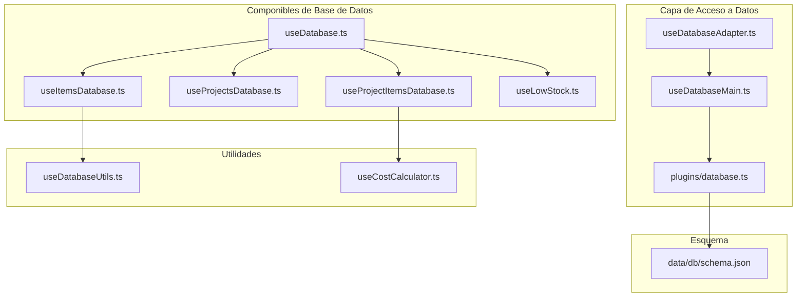
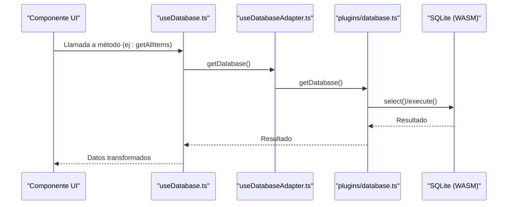
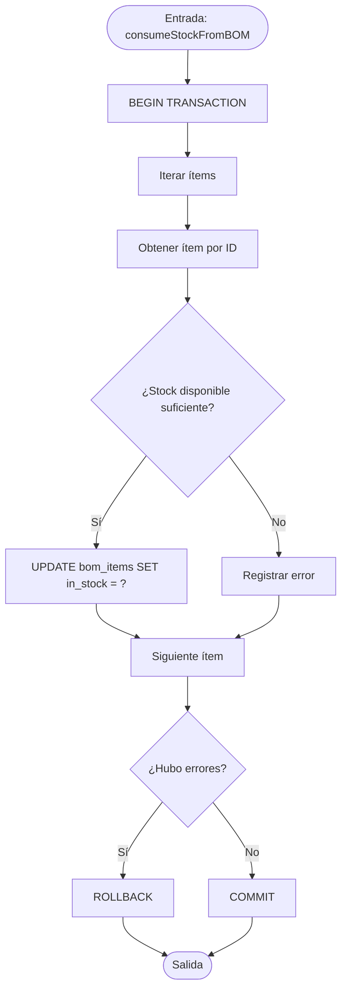
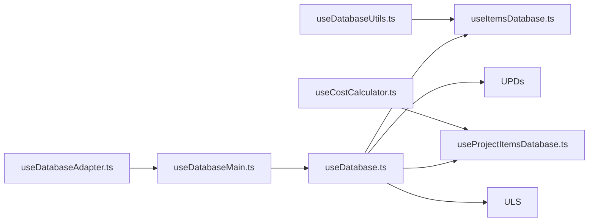
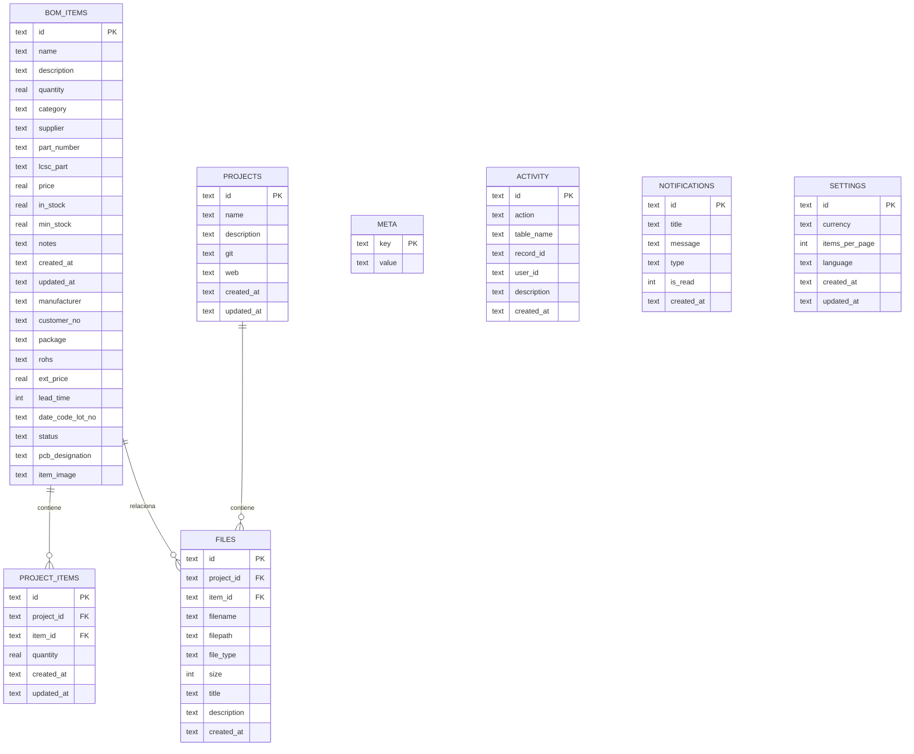

# Consultas y Rendimiento

<cite>
**Archivos referenciados en este documento**
- [useDatabaseUtils.ts](file://composables/useDatabaseUtils.ts)
- [useCostCalculator.ts](file://composables/useCostCalculator.ts)
- [schema.json](file://data/db/schema.json)
- [useDatabase.ts](file://composables/useDatabase.ts)
- [useDatabaseMain.ts](file://composables/useDatabaseMain.ts)
- [useDatabaseAdapter.ts](file://composables/useDatabaseAdapter.ts)
- [useItemsDatabase.ts](file://composables/useItemsDatabase.ts)
- [useProjectsDatabase.ts](file://composables/useProjectsDatabase.ts)
- [useProjectItemsDatabase.ts](file://composables/useProjectItemsDatabase.ts)
- [useLowStock.ts](file://composables/useLowStock.ts)
- [database.ts](file://plugins/database.ts)
- [sqlite-wasm.d.ts](file://types/sqlite-wasm.d.ts)
- [sql-wasm-debug.js](file://public/assets/sql-wasm-debug.js)
- [sql-wasm.js](file://public/assets/sql-wasm.js)
</cite>

## Índice
1. [Introducción](#introducción)
2. [Estructura del Proyecto](#estructura-del-proyecto)
3. [Componentes Principales](#componentes-principales)
4. [Visión General de la Arquitectura](#visión-general-de-la-arquitectura)
5. [Análisis Detallado de Componentes](#análisis-detallado-de-componentes)
6. [Análisis de Dependencias](#análisis-de-dependencias)
7. [Consideraciones de Rendimiento](#consideraciones-de-rendimiento)
8. [Guía de Solución de Problemas](#guía-de-solución-de-problemas)
9. [Conclusión](#conclusión)
10. [Apéndices](#apéndices)

## Introducción
Este documento documenta las consultas SQL y optimizaciones de rendimiento implementadas en BOM Manager. Cubre:
- Consultas comunes: cálculo de costos totales de proyectos, búsqueda de ítems por categoría o proveedor, reportes de stock bajo.
- Uso de utilidades de base de datos y cálculo económico.
- Índices sugeridos, joins optimizados y estrategias de caching.
- Ejemplos de consultas avanzadas, triggers útiles y vistas creadas.
- Métricas de rendimiento, monitoreo de consultas lentas y mejores prácticas para evitar bloqueos.

## Estructura del Proyecto
La base de datos se define en JSON y se compone principalmente de tablas relacionadas con ítems, proyectos, archivos, relaciones proyecto-ítems, actividad y notificaciones. La capa de acceso a datos expone componibles que encapsulan operaciones CRUD y cálculos.

**Diagrama fuente**
- [useDatabaseAdapter.ts](file://composables/useDatabaseAdapter.ts#L1-L25)
- [useDatabaseMain.ts](file://composables/useDatabaseMain.ts#L1-L17)
- [useDatabase.ts](file://composables/useDatabase.ts#L1-L89)
- [useItemsDatabase.ts](file://composables/useItemsDatabase.ts#L1-L346)
- [useProjectsDatabase.ts](file://composables/useProjectsDatabase.ts#L1-L128)
- [useProjectItemsDatabase.ts](file://composables/useProjectItemsDatabase.ts#L1-L144)
- [useLowStock.ts](file://composables/useLowStock.ts#L1-L82)
- [useDatabaseUtils.ts](file://composables/useDatabaseUtils.ts#L1-L157)
- [useCostCalculator.ts](file://composables/useCostCalculator.ts#L1-L174)
- [schema.json](file://data/db/schema.json#L1-L37)

**Sección fuente**
- [schema.json](file://data/db/schema.json#L1-L37)
- [useDatabase.ts](file://composables/useDatabase.ts#L1-L89)

## Componentes Principales
- useDatabaseUtils.ts: convierte nombres de campos entre camelCase y snake_case, y mapea campos específicos de ítems BOM.
- useCostCalculator.ts: realiza cálculos de costos, impuestos, envío y estadísticas de precios.
- useItemsDatabase.ts: operaciones CRUD de ítems, actualización de stock, consumo de stock desde BOM, y consulta de ítems con bajo stock.
- useProjectsDatabase.ts: operaciones CRUD de proyectos y conteo de ítems por proyecto.
- useProjectItemsDatabase.ts: relación proyecto-ítems, inserción/actualización/eliminación, notificaciones de stock bajo y cálculo del valor total de un proyecto.
- useLowStock.ts: verificación de stock bajo y notificaciones asociadas.
- useDatabaseAdapter.ts y useDatabaseMain.ts: adaptador de base de datos para entornos Tauri/Web y exportación de funcionalidades principales.
- plugins/database.ts: punto de entrada de la base de datos (no se muestra aquí su contenido).
- Tipos y WebAssembly: sqlite-wasm.d.ts y sql-wasm.js/debug.js definen la interfaz de ejecución SQL.

**Sección fuente**
- [useDatabaseUtils.ts](file://composables/useDatabaseUtils.ts#L1-L157)
- [useCostCalculator.ts](file://composables/useCostCalculator.ts#L1-L174)
- [useItemsDatabase.ts](file://composables/useItemsDatabase.ts#L1-L346)
- [useProjectsDatabase.ts](file://composables/useProjectsDatabase.ts#L1-L128)
- [useProjectItemsDatabase.ts](file://composables/useProjectItemsDatabase.ts#L1-L144)
- [useLowStock.ts](file://composables/useLowStock.ts#L1-L82)
- [useDatabaseAdapter.ts](file://composables/useDatabaseAdapter.ts#L1-L25)
- [useDatabaseMain.ts](file://composables/useDatabaseMain.ts#L1-L17)
- [sqlite-wasm.d.ts](file://types/sqlite-wasm.d.ts#L1-L69)
- [sql-wasm-debug.js](file://public/assets/sql-wasm-debug.js#L962-L1148)
- [sql-wasm.js](file://public/assets/sql-wasm.js#L83-L84)

## Visión General de la Arquitectura
La aplicación utiliza un adaptador de base de datos que selecciona dinámicamente el backend según el entorno (Tauri o Web). Los componibles exponen métodos para operaciones CRUD y cálculos, mientras que useDatabase.ts actúa como fachada central.

**Diagrama fuente**
- [useDatabase.ts](file://composables/useDatabase.ts#L1-L89)
- [useDatabaseAdapter.ts](file://composables/useDatabaseAdapter.ts#L1-L25)
- [database.ts](file://plugins/database.ts)
- [sqlite-wasm.d.ts](file://types/sqlite-wasm.d.ts#L1-L69)
- [sql-wasm-debug.js](file://public/assets/sql-wasm-debug.js#L1001-L1148)

## Análisis Detallado de Componentes

### Utilidades de Base de Datos (useDatabaseUtils.ts)
- Conversión de nombres de campos: camelCase ↔ snake_case, incluyendo un mapeo específico para BOMItem.
- Aplicación del mapeo en operaciones de persistencia para mantener consistencia con el esquema.

**Sección fuente**
- [useDatabaseUtils.ts](file://composables/useDatabaseUtils.ts#L1-L157)
- [schema.json](file://data/db/schema.json#L1-L37)

### Cálculo Económico (useCostCalculator.ts)
- Cálculo de costos por ítem, subtotal, impuestos, envío y total.
- Estadísticas de precios (mínimo, máximo, promedio, total).
- Configuración de tasa de impuesto, costo de envío y moneda.

**Sección fuente**
- [useCostCalculator.ts](file://composables/useCostCalculator.ts#L1-L174)

### Ítems (useItemsDatabase.ts)
- Consultas:
  - Listado completo con proyección de proyecto asociado mediante LEFT JOIN.
  - Búsqueda por ID.
  - Bajo stock: WHERE in_stock <= min_stock.
- Operaciones:
  - Crear, actualizar, eliminar ítems.
  - Actualización de stock, consumo desde BOM con transacciones y rollback en errores.
  - Adición de stock con transacciones.

**Diagrama fuente**
- [useItemsDatabase.ts](file://composables/useItemsDatabase.ts#L201-L252)

**Sección fuente**
- [useItemsDatabase.ts](file://composables/useItemsDatabase.ts#L1-L346)

### Proyectos (useProjectsDatabase.ts)
- Consultas:
  - Listado con conteo de ítems por proyecto mediante GROUP BY.
  - Búsqueda por ID.
- Operaciones CRUD completas.

**Sección fuente**
- [useProjectsDatabase.ts](file://composables/useProjectsDatabase.ts#L1-L128)

### Relación Proyecto-Ítems (useProjectItemsDatabase.ts)
- Consultas:
  - Listado de ítems de un proyecto con JOIN a bom_items y proyección de cantidad del proyecto.
  - Valor total de un proyecto: SUM(bi.price * pi.quantity) con JOIN.
  - Verificación de stock bajo: comparación entre in_stock y min_stock.
- Operaciones CRUD de relación e inserción/actualización de cantidad.

**Sección fuente**
- [useProjectItemsDatabase.ts](file://composables/useProjectItemsDatabase.ts#L1-L144)

### Stock Bajo (useLowStock.ts)
- Llama a useDatabase().getLowStockItems() y dispara notificaciones personalizadas.
- Permite actualizar mínimos y reevaluar alertas.

**Sección fuente**
- [useLowStock.ts](file://composables/useLowStock.ts#L1-L82)
- [useDatabase.ts](file://composables/useDatabase.ts#L1-L89)

### Adaptador y Fachada (useDatabaseAdapter.ts, useDatabaseMain.ts, useDatabase.ts)
- useDatabaseAdapter.ts detecta entorno y devuelve el adaptador correspondiente.
- useDatabaseMain.ts combina funcionalidades de actividad y notificaciones.
- useDatabase.ts exporta métodos consolidados de todas las bases de datos.

**Sección fuente**
- [useDatabaseAdapter.ts](file://composables/useDatabaseAdapter.ts#L1-L25)
- [useDatabaseMain.ts](file://composables/useDatabaseMain.ts#L1-L17)
- [useDatabase.ts](file://composables/useDatabase.ts#L1-L89)

## Análisis de Dependencias

**Diagrama fuente**
- [useDatabaseUtils.ts](file://composables/useDatabaseUtils.ts#L1-L157)
- [useCostCalculator.ts](file://composables/useCostCalculator.ts#L1-L174)
- [useItemsDatabase.ts](file://composables/useItemsDatabase.ts#L1-L346)
- [useProjectsDatabase.ts](file://composables/useProjectsDatabase.ts#L1-L128)
- [useProjectItemsDatabase.ts](file://composables/useProjectItemsDatabase.ts#L1-L144)
- [useLowStock.ts](file://composables/useLowStock.ts#L1-L82)
- [useDatabase.ts](file://composables/useDatabase.ts#L1-L89)
- [useDatabaseAdapter.ts](file://composables/useDatabaseAdapter.ts#L1-L25)
- [useDatabaseMain.ts](file://composables/useDatabaseMain.ts#L1-L17)

**Sección fuente**
- [useDatabase.ts](file://composables/useDatabase.ts#L1-L89)
- [useDatabaseAdapter.ts](file://composables/useDatabaseAdapter.ts#L1-L25)

## Consideraciones de Rendimiento

### Índices Sugeridos
- bom_items(category)
- bom_items(supplier)
- bom_items(in_stock)
- bom_items(min_stock)
- project_items(project_id)
- project_items(item_id)
- projects(id) (PK)
- files(project_id)
- files(item_id)

Estos índices acelerarían búsquedas por categoría/proveedor, consultas de stock bajo y joins frecuentes.

### Joins Optimizados
- En listado de ítems, se usa LEFT JOIN con proyección limitada a columnas necesarias.
- En proyectos, GROUP BY evita subconsultas costosas y permite conteos eficientes.
- En relación proyecto-ítems, JOIN con filtro WHERE reduce el conjunto de trabajo.

### Estrategias de Caching
- Caché de resultados de consultas recurrentes (ej: listado de proyectos, ítems).
- Evitar recargas innecesarias: usar watchers y actualizaciones puntuales tras operaciones CRUD.
- Almacenamiento local de configuraciones (moneda, idioma) para evitar consultas redundantes.

### Consultas Avanzadas Recomendadas
- Búsqueda paginada de ítems con ORDER BY y LIMIT.
- Reporte de stock bajo con JOIN a project_items para mostrar impacto en proyectos.
- Cálculo de costos totales de proyectos con agrupaciones y filtros por rango de fechas.

### Triggers Útiles
- Trigger de auditoría automática al insertar/actualizar/eliminar en bom_items y projects.
- Trigger para mantener actualizado el campo updated_at en todas las tablas.

### Vistas Creadas
- Vista de ítems con stock crítico y proyecto asociado.
- Vista de proyectos con conteo de ítems y total estimado.

### Monitoreo de Consultas Lentas
- Registrar tiempos de ejecución de consultas críticas.
- Alertar consultas que excedan umbrales configurables.
- Medir latencia de operaciones CRUD y reportes.

### Mejores Prácticas
- Usar transacciones para operaciones en lote (agregar/actualizar stock).
- Evitar SELECT *; proyectar solo columnas necesarias.
- Parametrizar consultas y evitar concatenaciones dinámicas.
- Evitar bloqueos: no ejecutar operaciones pesadas en el hilo principal.

[No se requieren fuentes adicionales ya que estas son recomendaciones generales basadas en el análisis del código.]

## Guía de Solución de Problemas

### Errores Comunes
- Fallo en acceso a base de datos: revisar inicialización de adaptadores y estado de la base de datos.
- Transacciones sin commit/rollback explícito: asegurar bloques try/catch con manejo de errores.
- Consultas lentas: revisar índices faltantes y evitar funciones en cláusulas WHERE.

### Pasos de Diagnóstico
- Verificar conexión: useDatabaseAdapter.isTauri y estado de plugins/database.ts.
- Registrar tiempos de ejecución de consultas.
- Validar parámetros de entrada y tipos de datos.

**Sección fuente**
- [useDatabaseAdapter.ts](file://composables/useDatabaseAdapter.ts#L1-L25)
- [useItemsDatabase.ts](file://composables/useItemsDatabase.ts#L201-L252)

## Conclusión
BOM Manager implementa un modelo de base de datos sólido con consultas bien estructuradas y operaciones económicas integradas. Las recomendaciones de índices, joins optimizados, caching y monitoreo permitirán mantener un buen rendimiento a medida que crezca la base de datos. La separación de responsabilidades en componibles facilita mantenimiento y escalabilidad.

[No se requieren fuentes adicionales.]

## Apéndices

### Esquema de Base de Datos

**Diagrama fuente**
- [schema.json](file://data/db/schema.json#L1-L37)

### Referencias de Tipos y WebAssembly
- Tipos de base de datos: select/execute.
- Métodos de ejecución SQL en WebAssembly.

**Sección fuente**
- [sqlite-wasm.d.ts](file://types/sqlite-wasm.d.ts#L1-L69)
- [sql-wasm-debug.js](file://public/assets/sql-wasm-debug.js#L962-L1148)
- [sql-wasm.js](file://public/assets/sql-wasm.js#L83-L84)