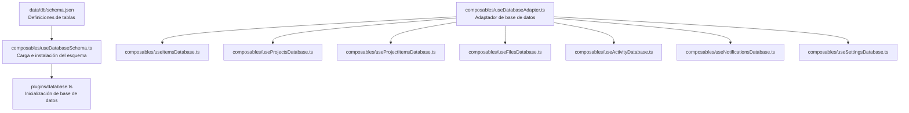
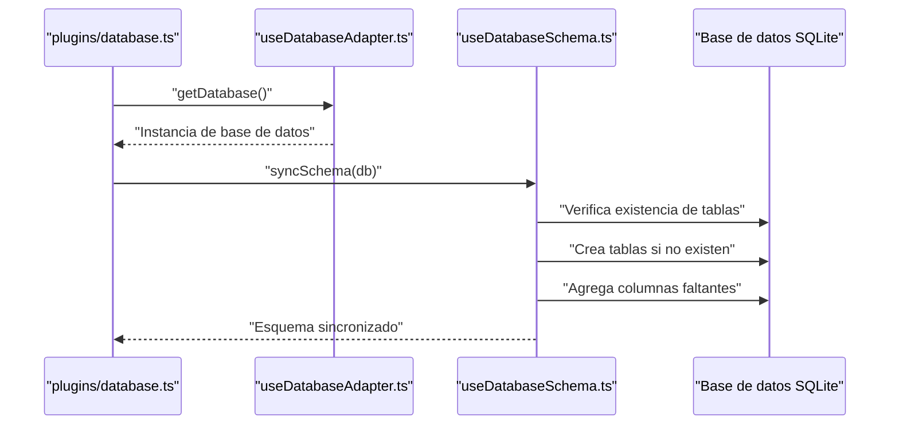
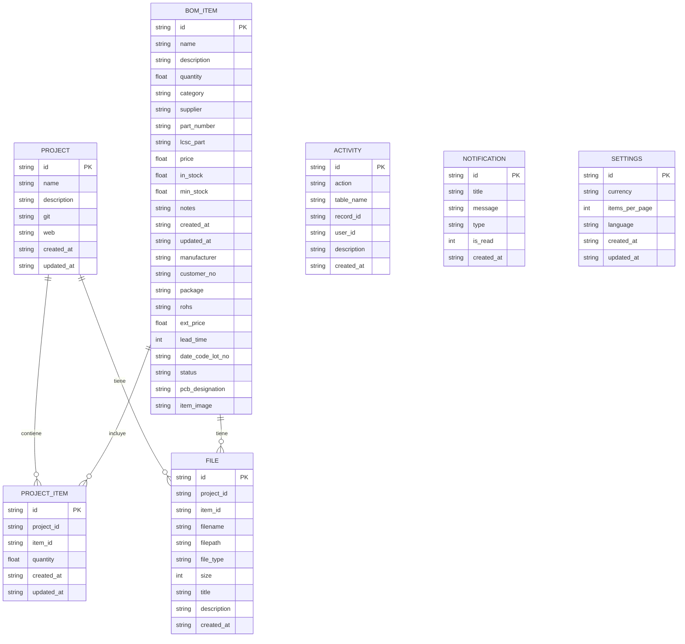
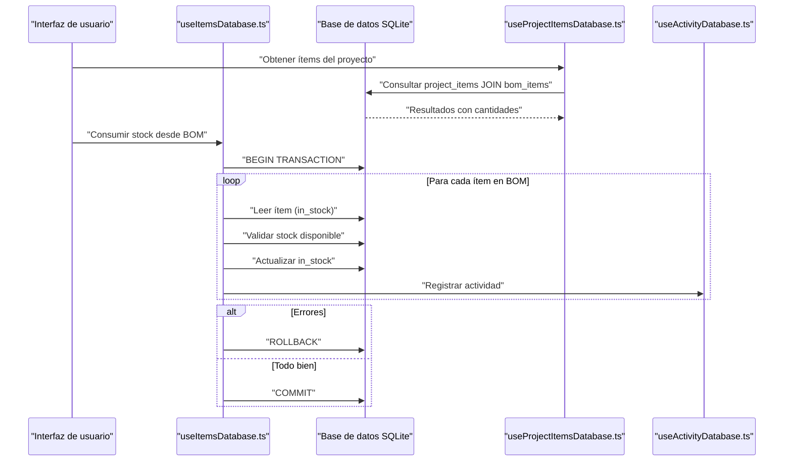
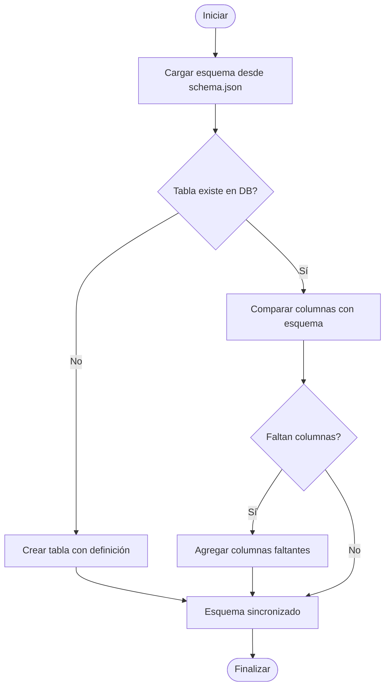
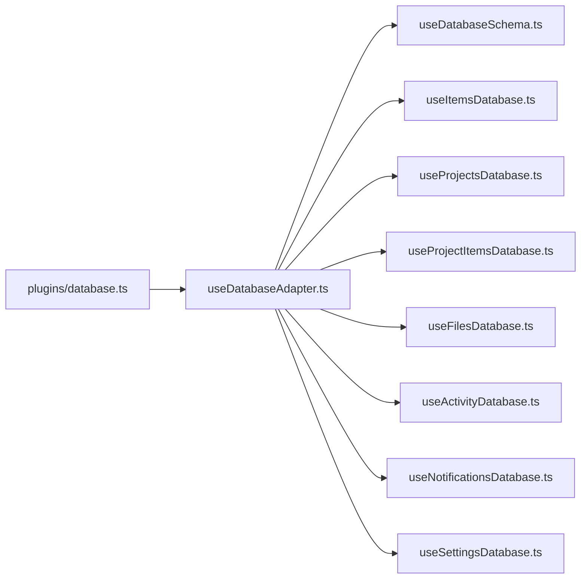

# Esquema de Base de Datos

<cite>
**Archivos referenciados en este documento**
- [schema.json](file://data/db/schema.json)
- [useDatabaseSchema.ts](file://composables/useDatabaseSchema.ts)
- [useItemsDatabase.ts](file://composables/useItemsDatabase.ts)
- [useProjectsDatabase.ts](file://composables/useProjectsDatabase.ts)
- [useProjectItemsDatabase.ts](file://composables/useProjectItemsDatabase.ts)
- [useFilesDatabase.ts](file://composables/useFilesDatabase.ts)
- [useActivityDatabase.ts](file://composables/useActivityDatabase.ts)
- [useNotificationsDatabase.ts](file://composables/useNotificationsDatabase.ts)
- [useSettingsDatabase.ts](file://composables/useSettingsDatabase.ts)
- [useDatabaseAdapter.ts](file://composables/useDatabaseAdapter.ts)
- [database.ts](file://plugins/database.ts)
- [bom.ts](file://types/bom.ts)
- [database.ts](file://types/database.ts)
</cite>

## Índice
1. [Introducción](#introducción)
2. [Estructura del repositorio](#estructura-del-repositorio)
3. [Componentes principales](#componentes-principales)
4. [Visión general de la arquitectura](#visión-general-de-la-arquitectura)
5. [Análisis detallado de componentes](#análisis-detallado-de-componentes)
6. [Análisis de dependencias](#análisis-de-dependencias)
7. [Consideraciones de rendimiento](#consideraciones-de-rendimiento)
8. [Guía de solución de problemas](#guía-de-solución-de-problemas)
9. [Conclusión](#conclusión)

## Introducción
Este documento describe el esquema de base de datos SQLite utilizado por BOM Manager. Se documentan todas las tablas definidas en el archivo de esquema, incluyendo meta, bom_items, projects, files, project_items, activity, notifications y settings. Además, se explica el modelo de datos conceptual centrado en BOMItem, BOMProject y ProjectItem, y cómo se relacionan entre sí. Se incluyen diagramas ER y flujos de trabajo para facilitar la comprensión tanto técnica como para usuarios no técnicos.

## Estructura del repositorio
El esquema de base de datos se define en un archivo JSON que contiene las definiciones SQL de las tablas. El sistema también incluye componibles que manejan operaciones CRUD, sincronización de esquema, y adaptadores de base de datos para diferentes entornos (Tauri/Web).

**Diagrama fuente**
- [schema.json](file://data/db/schema.json#L1-L37)
- [useDatabaseSchema.ts](file://composables/useDatabaseSchema.ts#L1-L302)
- [database.ts](file://plugins/database.ts#L1-L13)
- [useDatabaseAdapter.ts](file://composables/useDatabaseAdapter.ts#L1-L25)

**Sección fuente**
- [schema.json](file://data/db/schema.json#L1-L37)
- [useDatabaseSchema.ts](file://composables/useDatabaseSchema.ts#L1-L302)
- [database.ts](file://plugins/database.ts#L1-L13)
- [useDatabaseAdapter.ts](file://composables/useDatabaseAdapter.ts#L1-L25)

## Componentes principales
- Tabla meta: Almacena pares clave-valor para configuraciones de sistema.
- Tabla bom_items: Almacena artículos del BOM con propiedades como nombre, descripción, cantidades, precios, stock, proveedor, categoría, etc.
- Tabla projects: Almacena proyectos con metadatos como nombre, descripción, enlaces a recursos externos y fechas de creación/actualización.
- Tabla files: Archivos adjuntos a proyectos o ítems; tiene claves foráneas a projects e items.
- Tabla project_items: Relación muchos a muchos entre proyectos e ítems, con cantidad asociada y fechas de creación/actualización.
- Tabla activity: Registro de auditoría de acciones realizadas en otras tablas.
- Tabla notifications: Notificaciones del sistema con tipo y estado de lectura.
- Tabla settings: Configuración global del sistema (divisa, idioma, elementos por página).

**Sección fuente**
- [schema.json](file://data/db/schema.json#L1-L37)

## Visión general de la arquitectura
La aplicación carga el esquema desde el archivo JSON, lo crea en la base de datos si no existe, y mantiene la coherencia mediante comparación de columnas. Los componibles exponen métodos CRUD para cada tabla y registran actividades en la tabla activity. La inicialización del plugin asegura que las bases de datos estén listas al arrancar.

**Diagrama fuente**
- [database.ts](file://plugins/database.ts#L1-L13)
- [useDatabaseAdapter.ts](file://composables/useDatabaseAdapter.ts#L1-L25)
- [useDatabaseSchema.ts](file://composables/useDatabaseSchema.ts#L202-L236)

**Sección fuente**
- [useDatabaseSchema.ts](file://composables/useDatabaseSchema.ts#L202-L236)
- [database.ts](file://plugins/database.ts#L1-L13)

## Análisis detallado de componentes

### Tabla meta
- Propósito: Almacena configuraciones globales del sistema como pares clave-valor.
- Campos:
  - key (TEXT, PRIMARY KEY)
  - value (TEXT, NOT NULL)
- Restricciones: PRIMARY KEY en key.
- Relaciones: Sin claves foráneas.
- Índices: Ninguno explícito (clave primaria implícita).
- Uso esperado: Lectura/escritura de valores de configuración del sistema.

**Sección fuente**
- [schema.json](file://data/db/schema.json#L1-L10)

### Tabla bom_items
- Propósito: Representa los artículos del BOM con información de stock, precios, proveedores, fabricantes, etc.
- Campos:
  - id (TEXT, PRIMARY KEY)
  - name (TEXT, NOT NULL)
  - description (TEXT)
  - quantity (REAL, NOT NULL)
  - category (TEXT)
  - supplier (TEXT)
  - part_number (TEXT)
  - lcsc_part (TEXT)
  - price (REAL)
  - in_stock (REAL)
  - min_stock (REAL)
  - notes (TEXT)
  - created_at (TEXT, NOT NULL)
  - updated_at (TEXT, NOT NULL)
  - manufacturer (TEXT)
  - customer_no (TEXT)
  - package (TEXT)
  - rohs (TEXT)
  - ext_price (REAL)
  - lead_time (INTEGER)
  - date_code_lot_no (TEXT)
  - status (TEXT)
  - pcb_designation (TEXT)
  - item_image (TEXT)
- Restricciones: PRIMARY KEY en id.
- Relaciones: Referenciada por files.item_id y project_items.item_id.
- Índices: Ninguno explícito.
- Uso esperado: Gestión de inventario, seguimiento de stock, búsquedas y reportes.

**Sección fuente**
- [schema.json](file://data/db/schema.json#L1-L10)
- [bom.ts](file://types/bom.ts#L1-L32)

### Tabla projects
- Propósito: Representa proyectos con metadatos básicos.
- Campos:
  - id (TEXT, PRIMARY KEY)
  - name (TEXT, NOT NULL)
  - description (TEXT)
  - git (TEXT)
  - web (TEXT)
  - created_at (TEXT, NOT NULL)
  - updated_at (TEXT, NOT NULL)
- Restricciones: PRIMARY KEY en id.
- Relaciones: Referenciada por files.project_id.
- Índices: Ninguno explícito.
- Uso esperado: Listado de proyectos, edición, eliminación.

**Sección fuente**
- [schema.json](file://data/db/schema.json#L1-L18)
- [bom.ts](file://types/bom.ts#L34-L42)

### Tabla files
- Propósito: Archivos adjuntos a proyectos o ítems.
- Campos:
  - id (TEXT, PRIMARY KEY)
  - project_id (TEXT)
  - item_id (TEXT)
  - filename (TEXT, NOT NULL)
  - filepath (TEXT, NOT NULL)
  - file_type (TEXT)
  - size (INTEGER)
  - title (TEXT)
  - description (TEXT)
  - created_at (TEXT, NOT NULL)
- Restricciones:
  - PRIMARY KEY en id
  - FOREIGN KEY (project_id) REFERENCES projects(id) ON DELETE CASCADE
  - FOREIGN KEY (item_id) REFERENCES bom_items(id) ON DELETE CASCADE
- Relaciones: Relación muchos a uno con projects e ítems.
- Índices: Ninguno explícito.
- Uso esperado: Adjuntar documentos PDF u otros a proyectos o ítems.

**Sección fuente**
- [schema.json](file://data/db/schema.json#L1-L18)
- [useFilesDatabase.ts](file://composables/useFilesDatabase.ts#L1-L179)

### Tabla project_items
- Propósito: Relación muchos a muchos entre proyectos e ítems, con cantidad asociada.
- Campos:
  - id (TEXT, PRIMARY KEY)
  - project_id (TEXT, NOT NULL)
  - item_id (TEXT, NOT NULL)
  - quantity (REAL, NOT NULL DEFAULT 1)
  - created_at (TEXT, NOT NULL)
  - updated_at (TEXT, NOT NULL)
- Restricciones:
  - PRIMARY KEY en id
  - FOREIGN KEY (project_id) REFERENCES projects(id) ON DELETE CASCADE
  - FOREIGN KEY (item_id) REFERENCES bom_items(id) ON DELETE CASCADE
  - UNIQUE(project_id, item_id)
- Relaciones: Une projects e ítems.
- Índices: Ninguno explícito.
- Uso esperado: Asociar ítems a proyectos con cantidades específicas, calcular valores totales de proyectos.

**Sección fuente**
- [schema.json](file://data/db/schema.json#L1-L22)
- [useProjectItemsDatabase.ts](file://composables/useProjectItemsDatabase.ts#L1-L144)

### Tabla activity
- Propósito: Auditoría de acciones realizadas en otras tablas.
- Campos:
  - id (TEXT, PRIMARY KEY)
  - action (TEXT, NOT NULL)
  - table_name (TEXT, NOT NULL)
  - record_id (TEXT, NOT NULL)
  - user_id (TEXT)
  - description (TEXT)
  - created_at (TEXT, NOT NULL)
- Restricciones: PRIMARY KEY en id.
- Relaciones: Sin claves foráneas.
- Índices: Ninguno explícito.
- Uso esperado: Seguimiento de cambios, reportes de auditoría.

**Sección fuente**
- [schema.json](file://data/db/schema.json#L1-L26)
- [useActivityDatabase.ts](file://composables/useActivityDatabase.ts#L1-L87)

### Tabla notifications
- Propósito: Notificaciones del sistema con tipo y estado de lectura.
- Campos:
  - id (TEXT, PRIMARY KEY)
  - title (TEXT, NOT NULL)
  - message (TEXT, NOT NULL)
  - type (TEXT, DEFAULT 'info')
  - is_read (INTEGER, DEFAULT 0)
  - created_at (TEXT, NOT NULL)
- Restricciones: PRIMARY KEY en id.
- Relaciones: Sin claves foráneas.
- Índices: Ninguno explícito.
- Uso esperado: Sistema de notificaciones, marcado como leído, conteo de no leídas.

**Sección fuente**
- [schema.json](file://data/db/schema.json#L1-L30)
- [useNotificationsDatabase.ts](file://composables/useNotificationsDatabase.ts#L1-L138)

### Tabla settings
- Propósito: Configuración global del sistema.
- Campos:
  - id (TEXT, PRIMARY KEY)
  - currency (TEXT, DEFAULT 'USD')
  - items_per_page (INTEGER, DEFAULT 20)
  - language (TEXT, DEFAULT 'es')
  - created_at (TEXT, NOT NULL)
  - updated_at (TEXT, NOT NULL)
- Restricciones: PRIMARY KEY en id.
- Relaciones: Sin claves foráneas.
- Índices: Ninguno explícito.
- Uso esperado: Configuración de presentación y comportamiento del sistema.

**Sección fuente**
- [schema.json](file://data/db/schema.json#L1-L36)
- [useSettingsDatabase.ts](file://composables/useSettingsDatabase.ts#L1-L111)

## Modelo de datos conceptual

### Entidades y relaciones
- BOMItem: Representa un artículo del BOM (campos en [bom.ts](file://types/bom.ts#L1-L32)).
- BOMProject: Representa un proyecto (campos en [bom.ts](file://types/bom.ts#L34-L42)).
- ProjectItem: Relación entre BOMProject y BOMItem con cantidad (no es una tabla física, sino una relación lógica representada por project_items).

**Diagrama fuente**
- [schema.json](file://data/db/schema.json#L1-L36)
- [bom.ts](file://types/bom.ts#L1-L42)

### Flujo de trabajo: Consumo de stock desde un BOM

**Diagrama fuente**
- [useItemsDatabase.ts](file://composables/useItemsDatabase.ts#L201-L252)
- [useProjectItemsDatabase.ts](file://composables/useProjectItemsDatabase.ts#L15-L28)
- [useActivityDatabase.ts](file://composables/useActivityDatabase.ts#L1-L31)

### Flujo de trabajo: Sincronización de esquema

**Diagrama fuente**
- [useDatabaseSchema.ts](file://composables/useDatabaseSchema.ts#L202-L236)
- [schema.json](file://data/db/schema.json#L1-L37)

## Análisis de dependencias
- El plugin de base de datos inicia la inicialización de las bases de datos al arrancar.
- El adaptador de base de datos selecciona dinámicamente el backend según el entorno (Tauri o Web).
- Los componibles de base de datos exponen métodos CRUD y usan el adaptador para acceder a la base de datos.
- El esquema se aplica mediante la función de sincronización que compara columnas y actualiza la base de datos si es necesario.

**Diagrama fuente**
- [database.ts](file://plugins/database.ts#L1-L13)
- [useDatabaseAdapter.ts](file://composables/useDatabaseAdapter.ts#L1-L25)
- [useDatabaseSchema.ts](file://composables/useDatabaseSchema.ts#L1-L302)

**Sección fuente**
- [database.ts](file://plugins/database.ts#L1-L13)
- [useDatabaseAdapter.ts](file://composables/useDatabaseAdapter.ts#L1-L25)
- [useDatabaseSchema.ts](file://composables/useDatabaseSchema.ts#L1-L302)

## Consideraciones de rendimiento
- Índices: Actualmente no hay índices explícitos en las tablas. Para consultas frecuentes (por ejemplo, búsqueda por nombre, fecha de creación, o búsquedas de bajo stock), considerar índices en campos de filtro comunes.
- Transacciones: Las operaciones de consumo y adición de stock usan transacciones para mantener consistencia. Mantener este patrón mejora rendimiento y consistencia.
- Consultas JOIN: Las vistas combinadas (items con proyectos) pueden beneficiarse de índices en claves foráneas y campos de ordenamiento.

[No se necesitan fuentes para esta sección, ya que proporciona orientación general]

## Guía de solución de problemas
- Esquema no sincronizado:
  - Verificar que se haya ejecutado la sincronización del esquema.
  - Revisar la salida de comparación de columnas y asegurar que se agreguen columnas faltantes.
- Fallos en operaciones de stock:
  - Revisar que las cantidades no generen valores negativos.
  - Validar que las transacciones se completen correctamente (commit/rollback).
- Eliminación de registros:
  - Al eliminar proyectos o ítems, confirmar que se borren también archivos asociados debido a las restricciones ON DELETE CASCADE.

**Sección fuente**
- [useDatabaseSchema.ts](file://composables/useDatabaseSchema.ts#L202-L236)
- [useItemsDatabase.ts](file://composables/useItemsDatabase.ts#L201-L252)
- [useProjectsDatabase.ts](file://composables/useProjectsDatabase.ts#L96-L119)
- [useFilesDatabase.ts](file://composables/useFilesDatabase.ts#L137-L165)

## Conclusión
El esquema de BOM Manager está bien estructurado para gestionar ítems de BOM, proyectos, archivos, auditoría, notificaciones y configuraciones. El uso de relaciones claras y la sincronización automática del esquema permiten mantener la base de datos actualizada. Se recomienda evaluar la inclusión de índices en campos de consulta frecuentes y seguir patrones de transacciones para operaciones críticas como el consumo de stock.