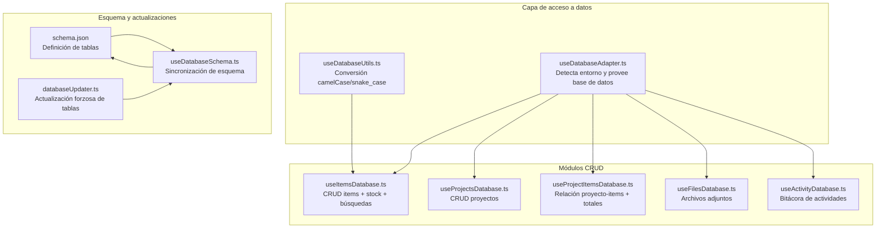
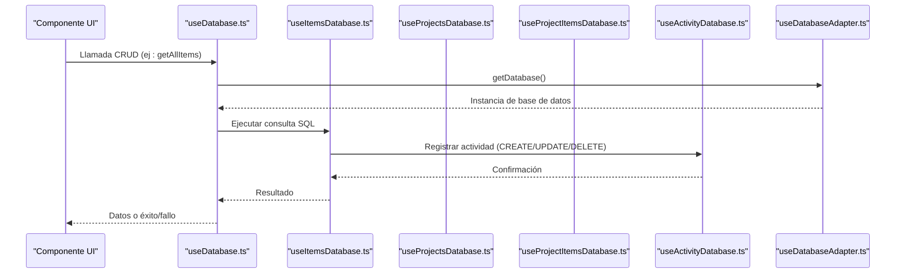
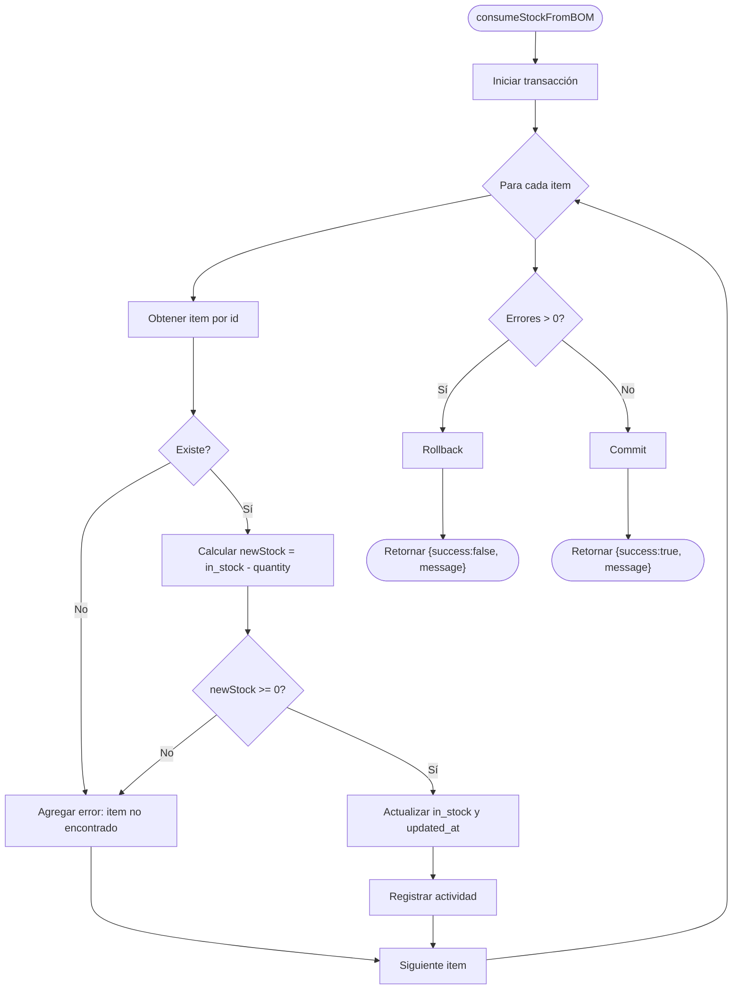
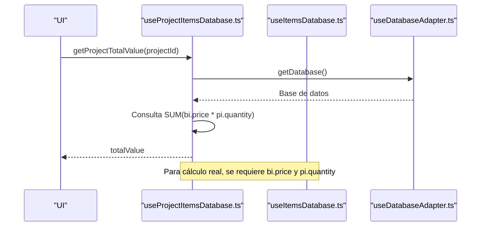
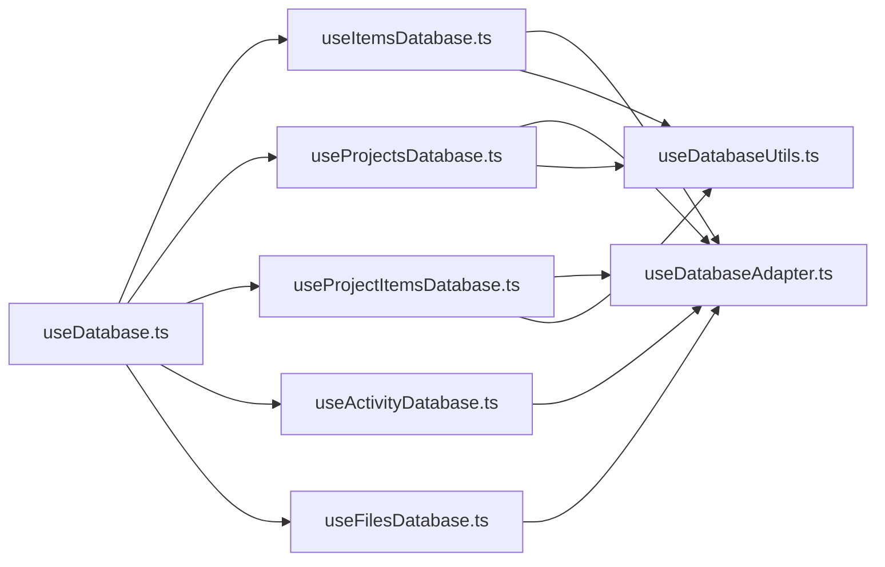

# Operaciones CRUD

<cite>
**Archivos referenciados en este documento**
- [useDatabase.ts](file://composables/useDatabase.ts)
- [useItemsDatabase.ts](file://composables/useItemsDatabase.ts)
- [useProjectsDatabase.ts](file://composables/useProjectsDatabase.ts)
- [useProjectItemsDatabase.ts](file://composables/useProjectItemsDatabase.ts)
- [useDatabaseAdapter.ts](file://composables/useDatabaseAdapter.ts)
- [useActivityDatabase.ts](file://composables/useActivityDatabase.ts)
- [useFilesDatabase.ts](file://composables/useFilesDatabase.ts)
- [useDatabaseUtils.ts](file://composables/useDatabaseUtils.ts)
- [schema.json](file://data/db/schema.json)
- [useCostCalculator.ts](file://composables/useCostCalculator.ts)
- [useLowStock.ts](file://composables/useLowStock.ts)
- [useDatabaseSchema.ts](file://composables/useDatabaseSchema.ts)
- [databaseUpdater.ts](file://utils/databaseUpdater.ts)
- [bom.ts](file://types/bom.ts)
- [BOMProcessor.vue](file://components/BOMProcessor.vue)
</cite>

## Índice
1. [Introducción](#introducción)
2. [Estructura del sistema](#estructura-del-sistema)
3. [Componentes principales](#componentes-principales)
4. [Arquitectura general](#arquitectura-general)
5. [Análisis detallado de componentes](#análisis-detallado-de-componentes)
6. [Análisis de dependencias](#análisis-de-dependencias)
7. [Consideraciones de rendimiento](#consideraciones-de-rendimiento)
8. [Guía de solución de problemas](#guía-de-solución-de-problemas)
9. [Conclusión](#conclusión)
10. [Apéndices](#apéndices)

## Introducción
Este documento documenta todas las operaciones CRUD implementadas en la base de datos de BOM Manager, incluyendo métodos de creación, lectura, actualización y eliminación para las tablas principales. También explica las funciones de useDatabase.ts y sus módulos específicos (useItemsDatabase.ts, useProjectsDatabase.ts, useProjectItemsDatabase.ts), incluyendo parámetros de entrada, valores de retorno, manejo de errores y validaciones. Se proporcionan ejemplos de uso para operaciones comunes como obtener todos los items, buscar por categoría, actualizar cantidades en stock, crear proyectos con items asociados, y operaciones específicas como cálculo de precios totales y búsqueda avanzada.

## Estructura del sistema
El sistema se organiza en componibles que exponen métodos CRUD a través de un adaptador de base de datos. La capa de persistencia se adapta automáticamente al entorno (Tauri o Web) y se apoya en un esquema de base de datos declarativo.

**Diagrama fuente**
- [useDatabaseAdapter.ts](file://composables/useDatabaseAdapter.ts#L1-L25)
- [useDatabaseUtils.ts](file://composables/useDatabaseUtils.ts#L1-L157)
- [useItemsDatabase.ts](file://composables/useItemsDatabase.ts#L1-L346)
- [useProjectsDatabase.ts](file://composables/useProjectsDatabase.ts#L1-L128)
- [useProjectItemsDatabase.ts](file://composables/useProjectItemsDatabase.ts#L1-L144)
- [useFilesDatabase.ts](file://composables/useFilesDatabase.ts#L1-L179)
- [useActivityDatabase.ts](file://composables/useActivityDatabase.ts#L1-L87)
- [schema.json](file://data/db/schema.json#L1-L37)
- [useDatabaseSchema.ts](file://composables/useDatabaseSchema.ts#L1-L302)
- [databaseUpdater.ts](file://utils/databaseUpdater.ts#L36-L90)

**Sección fuente**
- [useDatabase.ts](file://composables/useDatabase.ts#L1-L89)
- [useDatabaseAdapter.ts](file://composables/useDatabaseAdapter.ts#L1-L25)
- [schema.json](file://data/db/schema.json#L1-L37)

## Componentes principales
- useDatabase.ts: Exposición centralizada de todas las operaciones CRUD mediante un contenedor que agrupa módulos de base de datos.
- useItemsDatabase.ts: Operaciones CRUD para la tabla bom_items, además de actualización de stock, consumo de stock desde BOM, adición de stock y búsqueda de items con bajo stock.
- useProjectsDatabase.ts: Operaciones CRUD para la tabla projects, incluyendo eliminación con cascada de archivos.
- useProjectItemsDatabase.ts: Operaciones CRUD para la tabla project_items, cálculo del valor total de un proyecto y verificación de stock bajo.
- useFilesDatabase.ts: Operaciones CRUD para la tabla files, con soporte para archivos asociados a proyectos e ítems.
- useActivityDatabase.ts: Registro de actividades de usuario en la tabla activity.
- useDatabaseUtils.ts: Conversión de nombres de campos entre camelCase y snake_case, especialmente para BOMItem.
- useDatabaseSchema.ts: Sincronización automática del esquema de base de datos con el archivo schema.json.
- databaseUpdater.ts: Comandos para forzar actualización de tablas y verificar el estado del esquema.

**Sección fuente**
- [useDatabase.ts](file://composables/useDatabase.ts#L1-L89)
- [useItemsDatabase.ts](file://composables/useItemsDatabase.ts#L1-L346)
- [useProjectsDatabase.ts](file://composables/useProjectsDatabase.ts#L1-L128)
- [useProjectItemsDatabase.ts](file://composables/useProjectItemsDatabase.ts#L1-L144)
- [useFilesDatabase.ts](file://composables/useFilesDatabase.ts#L1-L179)
- [useActivityDatabase.ts](file://composables/useActivityDatabase.ts#L1-L87)
- [useDatabaseUtils.ts](file://composables/useDatabaseUtils.ts#L1-L157)
- [useDatabaseSchema.ts](file://composables/useDatabaseSchema.ts#L1-L302)
- [databaseUpdater.ts](file://utils/databaseUpdater.ts#L36-L90)

## Arquitectura general
La arquitectura sigue un patrón de componibles que encapsulan operaciones CRUD. El adaptador detecta el entorno y proporciona una conexión a la base de datos. Los módulos de base de datos realizan consultas SQL parametrizadas, manejan errores y registran actividades.

**Diagrama fuente**
- [useDatabase.ts](file://composables/useDatabase.ts#L1-L89)
- [useItemsDatabase.ts](file://composables/useItemsDatabase.ts#L1-L346)
- [useProjectsDatabase.ts](file://composables/useProjectsDatabase.ts#L1-L128)
- [useProjectItemsDatabase.ts](file://composables/useProjectItemsDatabase.ts#L1-L144)
- [useActivityDatabase.ts](file://composables/useActivityDatabase.ts#L1-L87)
- [useDatabaseAdapter.ts](file://composables/useDatabaseAdapter.ts#L1-L25)

## Análisis detallado de componentes

### useDatabase.ts
- Propósito: Exponer métodos CRUD combinados de varios módulos en una sola interfaz.
- Funciones clave:
  - getAllItems, getItemById, createItem, updateItem, deleteItem, updateItemStock, consumeStockFromBOM, addStockToItems, getLowStockItems.
  - getAllProjects, getProjectById, createProject, updateProject, deleteProject.
  - getProjectItems, addItemToProject, removeItemFromProject, updateProjectItemQuantity, checkLowStockAndNotify, getProjectTotalValue.
  - Actividad y notificaciones: logActivity, getActivityByTable, getAllActivity, getActivityByAction, createNotification, getUnreadNotifications, etc.
  - Archivos: createFile, getFileById, getFilesByProjectId, updateFile, deleteFile, deleteFilesByProjectId.
- Manejo de errores: Retorna valores neutros (null, false, []) en caso de fallo y registra logs.

**Sección fuente**
- [useDatabase.ts](file://composables/useDatabase.ts#L1-L89)

### useItemsDatabase.ts
- Tabla: bom_items
- Operaciones CRUD:
  - getAllItems: Devuelve todos los items con proyección de proyecto asociado.
  - getItemById: Búsqueda por id.
  - createItem: Inserción con conversión de campos camelCase a snake_case.
  - updateItem: Actualización de campos con conversión de nombres.
  - deleteItem: Eliminación con registro de actividad.
- Operaciones de stock:
  - updateItemStock: Actualiza in_stock.
  - consumeStockFromBOM: Transacción que descuenta stock de múltiples items validando disponibilidad.
  - addStockToItems: Transacción que agrega stock de múltiples items.
  - getLowStockItems: Items donde in_stock <= min_stock.
- Archivos asociados:
  - getFilesByItem, getPdfFilesByItem: Filtra archivos PDF.

**Diagrama fuente**
- [useItemsDatabase.ts](file://composables/useItemsDatabase.ts#L201-L252)

**Sección fuente**
- [useItemsDatabase.ts](file://composables/useItemsDatabase.ts#L1-L346)
- [useDatabaseUtils.ts](file://composables/useDatabaseUtils.ts#L1-L157)

### useProjectsDatabase.ts
- Tabla: projects
- Operaciones CRUD:
  - getAllProjects: Devuelve proyectos con conteo de items por grupo.
  - getProjectById: Búsqueda por id.
  - createProject: Inserción con timestamps.
  - updateProject: Actualización de campos.
  - deleteProject: Elimina archivos asociados (cascada) y luego el proyecto.
- Manejo de errores: Retorna null o false según operación.

**Sección fuente**
- [useProjectsDatabase.ts](file://composables/useProjectsDatabase.ts#L1-L128)

### useProjectItemsDatabase.ts
- Tabla: project_items
- Operaciones CRUD:
  - getProjectItems: Devuelve items asociados a un proyecto con cantidad del proyecto.
  - addItemToProject: Inserta o reemplaza relación con cantidad.
  - removeItemFromProject: Elimina relación.
  - updateProjectItemQuantity: Actualiza cantidad.
- Operaciones específicas:
  - checkLowStockAndNotify: Items con in_stock < min_stock o in_stock <= min_stock.
  - getProjectTotalValue: Suma de price * quantity de items en el proyecto.

**Diagrama fuente**
- [useProjectItemsDatabase.ts](file://composables/useProjectItemsDatabase.ts#L116-L134)
- [useItemsDatabase.ts](file://composables/useItemsDatabase.ts#L1-L346)
- [useDatabaseAdapter.ts](file://composables/useDatabaseAdapter.ts#L1-L25)

**Sección fuente**
- [useProjectItemsDatabase.ts](file://composables/useProjectItemsDatabase.ts#L1-L144)

### useFilesDatabase.ts
- Tabla: files
- Operaciones CRUD:
  - createFile, createFileForItem, createFileForProject: Creación con id único y timestamps.
  - getFileById, getFilesByProjectId, getFilesByItemId: Lecturas.
  - updateFile: Actualización dinámica de campos.
  - deleteFile, deleteFilesByProjectId, deleteFilesByItemId: Eliminación con registro de actividad.

**Sección fuente**
- [useFilesDatabase.ts](file://composables/useFilesDatabase.ts#L1-L179)

### useActivityDatabase.ts
- Tabla: activity
- Operaciones:
  - logActivity: Registra acciones de usuario.
  - getActivityByTable, getAllActivity, getActivityByAction: Consultas de bitácora.

**Sección fuente**
- [useActivityDatabase.ts](file://composables/useActivityDatabase.ts#L1-L87)

### useDatabaseUtils.ts
- Funciones:
  - convertBomItemToSnake: Convierte campos específicos de BOMItem a snake_case.
  - convertBomItemToCamel: Convierte de snake_case a camelCase.
  - Mapeo BOM_ITEM_FIELD_MAPPING: Define correspondencia de campos.

**Sección fuente**
- [useDatabaseUtils.ts](file://composables/useDatabaseUtils.ts#L1-L157)

### Esquema de base de datos y actualización
- schema.json: Define las tablas y sus columnas.
- useDatabaseSchema.ts: Sincroniza tablas, compara columnas, añade columnas faltantes, y permite actualización forzosa.
- databaseUpdater.ts: Comandos para verificar estado y forzar actualización de tablas.

**Sección fuente**
- [schema.json](file://data/db/schema.json#L1-L37)
- [useDatabaseSchema.ts](file://composables/useDatabaseSchema.ts#L1-L302)
- [databaseUpdater.ts](file://utils/databaseUpdater.ts#L36-L90)

## Análisis de dependencias

**Diagrama fuente**
- [useDatabase.ts](file://composables/useDatabase.ts#L1-L89)
- [useItemsDatabase.ts](file://composables/useItemsDatabase.ts#L1-L346)
- [useProjectsDatabase.ts](file://composables/useProjectsDatabase.ts#L1-L128)
- [useProjectItemsDatabase.ts](file://composables/useProjectItemsDatabase.ts#L1-L144)
- [useActivityDatabase.ts](file://composables/useActivityDatabase.ts#L1-L87)
- [useFilesDatabase.ts](file://composables/useFilesDatabase.ts#L1-L179)
- [useDatabaseAdapter.ts](file://composables/useDatabaseAdapter.ts#L1-L25)
- [useDatabaseUtils.ts](file://composables/useDatabaseUtils.ts#L1-L157)

**Sección fuente**
- [useDatabase.ts](file://composables/useDatabase.ts#L1-L89)

## Consideraciones de rendimiento
- Uso de transacciones: consumeStockFromBOM y addStockToItems usan BEGIN/COMMIT/ROLLBACK para mantener consistencia y evitar operaciones parciales.
- Consultas parametrizadas: Reducen riesgos de inyección SQL y permiten optimización en motores de base de datos.
- Índices implícitos: Las claves primarias y foráneas definidas en schema.json facilitan búsquedas eficientes.
- Recomendaciones:
  - Evitar grandes listados sin paginación si no es necesario.
  - Usar índices adicionales si se realizan búsquedas frecuentes por campos como category o part_number.
  - Revisar el esquema periódicamente con useDatabaseSchema.ts o databaseUpdater.ts.

[No se necesitan fuentes para esta sección]

## Guía de solución de problemas
- Errores en operaciones CRUD:
  - useItemsDatabase.ts, useProjectsDatabase.ts, useProjectItemsDatabase.ts y useFilesDatabase.ts devuelven null/false o [] en caso de error y registran logs. Verifique la conexión a la base de datos y los parámetros de entrada.
- Validaciones:
  - consumeStockFromBOM y addStockToItems validan disponibilidad y retornan mensajes descriptivos. Revise los errores acumulados en el mensaje de retorno.
- Bitácora de actividades:
  - useActivityDatabase.ts permite auditar acciones recientes. Utilice getActivityByTable o getAllActivity para diagnosticar.
- Esquema de base de datos:
  - useDatabaseSchema.ts y databaseUpdater.ts permiten verificar y forzar actualizaciones de tablas. Ejecute checkDatabaseSchema y forceUpdateTable si encuentra discrepancias.

**Sección fuente**
- [useItemsDatabase.ts](file://composables/useItemsDatabase.ts#L201-L252)
- [useProjectsDatabase.ts](file://composables/useProjectsDatabase.ts#L1-L128)
- [useProjectItemsDatabase.ts](file://composables/useProjectItemsDatabase.ts#L1-L144)
- [useFilesDatabase.ts](file://composables/useFilesDatabase.ts#L1-L179)
- [useActivityDatabase.ts](file://composables/useActivityDatabase.ts#L1-L87)
- [useDatabaseSchema.ts](file://composables/useDatabaseSchema.ts#L238-L301)
- [databaseUpdater.ts](file://utils/databaseUpdater.ts#L36-L90)

## Conclusión
Las operaciones CRUD están bien estructuradas en componibles especializados, con un adaptador que soporta múltiples entornos y un esquema de base de datos declarativo. Se han implementado mecanismos robustos de validación, manejo de errores y auditoría. Las operaciones avanzadas como cálculo de precios totales y búsqueda de items con bajo stock amplían la funcionalidad del sistema.

[No se necesitan fuentes para esta sección]

## Apéndices

### Operaciones CRUD por tabla

- bom_items (useItemsDatabase.ts)
  - Crear: createItem
  - Leer: getAllItems, getItemById
  - Actualizar: updateItem
  - Eliminar: deleteItem
  - Stock: updateItemStock, consumeStockFromBOM, addStockToItems, getLowStockItems

- projects (useProjectsDatabase.ts)
  - Crear: createProject
  - Leer: getAllProjects, getProjectById
  - Actualizar: updateProject
  - Eliminar: deleteProject

- project_items (useProjectItemsDatabase.ts)
  - Crear: addItemToProject
  - Leer: getProjectItems
  - Actualizar: updateProjectItemQuantity
  - Eliminar: removeItemFromProject
  - Específico: getProjectTotalValue, checkLowStockAndNotify

- files (useFilesDatabase.ts)
  - Crear: createFile, createFileForItem, createFileForProject
  - Leer: getFileById, getFilesByProjectId, getFilesByItemId
  - Actualizar: updateFile
  - Eliminar: deleteFile, deleteFilesByProjectId, deleteFilesByItemId

- activity (useActivityDatabase.ts)
  - Registrar: logActivity
  - Consultar: getActivityByTable, getAllActivity, getActivityByAction

**Sección fuente**
- [useItemsDatabase.ts](file://composables/useItemsDatabase.ts#L1-L346)
- [useProjectsDatabase.ts](file://composables/useProjectsDatabase.ts#L1-L128)
- [useProjectItemsDatabase.ts](file://composables/useProjectItemsDatabase.ts#L1-L144)
- [useFilesDatabase.ts](file://composables/useFilesDatabase.ts#L1-L179)
- [useActivityDatabase.ts](file://composables/useActivityDatabase.ts#L1-L87)

### Ejemplos de uso

- Obtener todos los items
  - Llamar a: useDatabase().getAllItems()
  - Origen: [useDatabase.ts](file://composables/useDatabase.ts#L1-L89), [useItemsDatabase.ts](file://composables/useItemsDatabase.ts#L1-L346)

- Buscar por categoría
  - Implementación sugerida: Realizar una consulta SQL parametrizada en el módulo correspondiente o filtrar en UI tras obtener todos los items.
  - Origen: [useItemsDatabase.ts](file://composables/useItemsDatabase.ts#L1-L346)

- Actualizar cantidades en stock
  - Descontar: useDatabase().consumeStockFromBOM([{ id, quantity }])
  - Agregar: useDatabase().addStockToItems([{ id, quantity }])
  - Origen: [useItemsDatabase.ts](file://composables/useItemsDatabase.ts#L201-L252)

- Crear proyectos con items asociados
  - Crear proyecto: useDatabase().createProject({ name, description, git, web })
  - Asociar items: useDatabase().addItemToProject(projectId, itemId, quantity)
  - Origen: [useProjectsDatabase.ts](file://composables/useProjectsDatabase.ts#L1-L128), [useProjectItemsDatabase.ts](file://composables/useProjectItemsDatabase.ts#L1-L144)

- Cálculo de precios totales
  - useDatabase().getProjectTotalValue(projectId)
  - Origen: [useProjectItemsDatabase.ts](file://composables/useProjectItemsDatabase.ts#L116-L134)

- Búsqueda avanzada
  - Bajo stock: useDatabase().getLowStockItems()
  - Origen: [useItemsDatabase.ts](file://composables/useItemsDatabase.ts#L304-L319), [useLowStock.ts](file://composables/useLowStock.ts#L1-L82)

- Procesamiento de BOM y búsqueda de ítems
  - Buscar ítems por part_number o nombre y mapear con stock actual.
  - Origen: [BOMProcessor.vue](file://components/BOMProcessor.vue#L232-L280)

### Tipos de datos relevantes
- BOMItem: Campos como name, description, quantity, category, supplier, partNumber, lcscPart, price, inStock, minStock, notes, createdAt, updatedAt, manufacturer, package, customerNo, rohs, extPrice, leadTime, dateCodeLotNo, status, pcbDesignation, itemImage.
- BOMProject: Campos como id, name, description, git, web, createdAt, updatedAt.

**Sección fuente**
- [bom.ts](file://types/bom.ts#L1-L47)