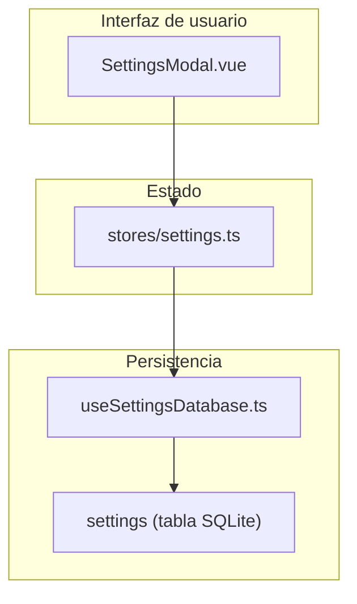
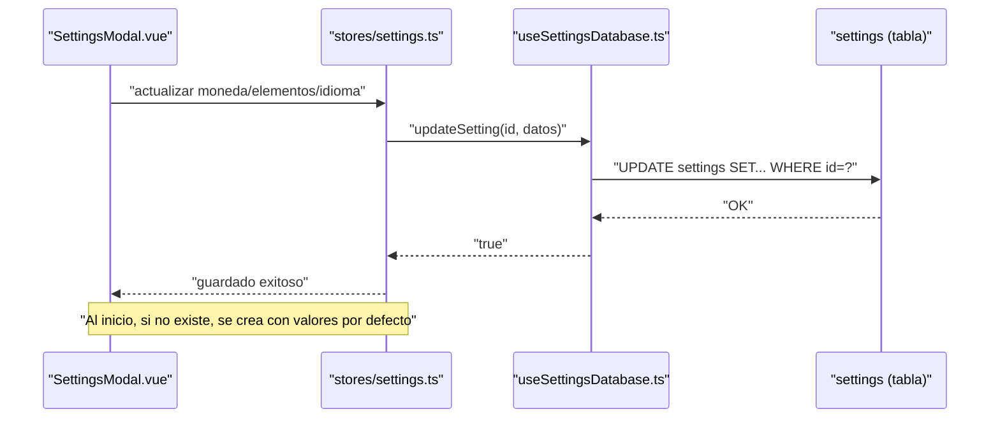
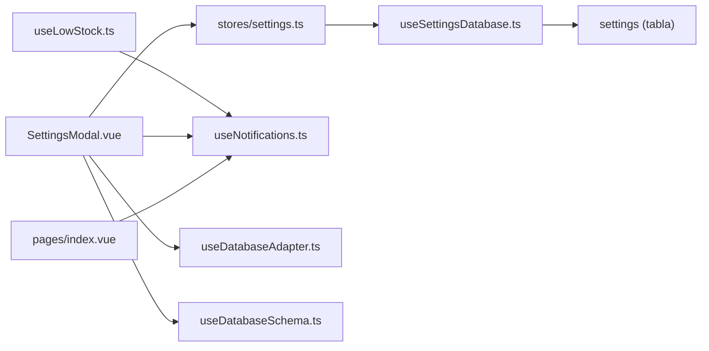
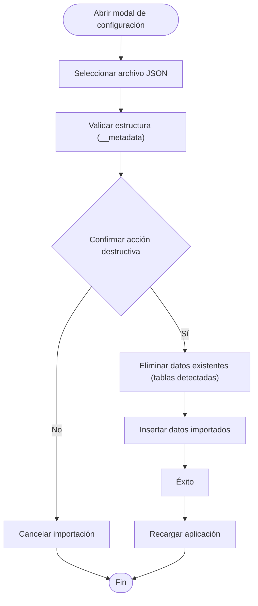
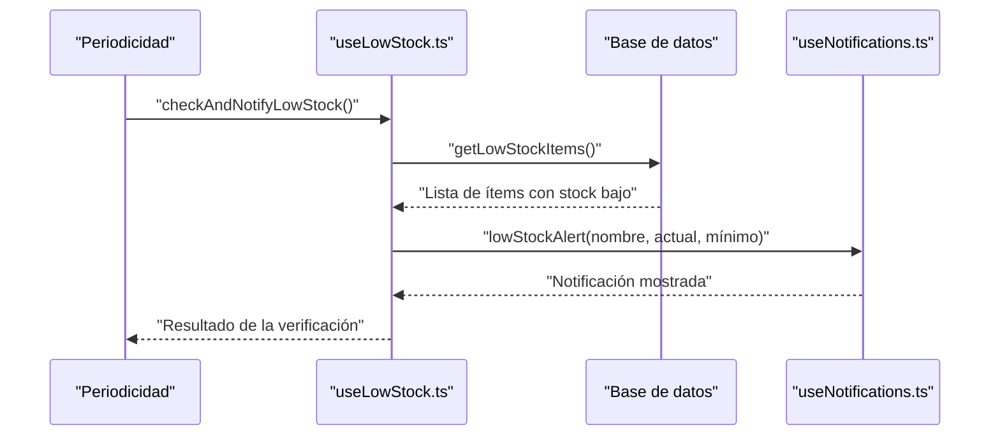

# Configuración y Preferencias

<cite>
**Archivos mencionados en este documento**
- [stores/settings.ts](file://stores/settings.ts)
- [composables/useSettingsDatabase.ts](file://composables/useSettingsDatabase.ts)
- [data/db/schema.json](file://data/db/schema.json)
- [components/global/SettingsModal.vue](file://components/global/SettingsModal.vue)
- [composables/useNotifications.ts](file://composables/useNotifications.ts)
- [composables/useLowStock.ts](file://composables/useLowStock.ts)
- [pages/index.vue](file://pages/index.vue)
- [composables/useBackup.ts](file://composables/useBackup.ts)
- [TODO.md](file://TODO.md)
</cite>

## Índice
1. [Introducción](#introducción)
2. [Estructura del proyecto](#estructura-del-proyecto)
3. [Componentes principales de configuración](#componentes-principales-de-configuración)
4. [Arquitectura general de la configuración](#arquitectura-general-de-la-configuración)
5. [Análisis detallado de componentes](#análisis-detallado-de-componentes)
6. [Análisis de dependencias](#análisis-de-dependencias)
7. [Consideraciones de rendimiento](#consideraciones-de-rendimiento)
8. [Guía de solución de problemas](#guía-de-solución-de-problemas)
9. [Conclusión](#conclusión)
10. [Apéndices](#apéndices)

## Introducción
Este documento explica cómo se configuran y gestionan las preferencias de usuario en BOM Manager, incluyendo moneda, elementos por página, idioma, y funcionalidades relacionadas con notificaciones, alertas de stock mínimo, respaldo e importación de datos. También describe cómo se persisten estas configuraciones, cómo se sincronizan entre dispositivos mediante exportación/importación de base de datos, y cómo restaurar valores predeterminados. Se incluyen casos de uso comunes y recomendaciones para optimizar la experiencia de usuario.

## Estructura del proyecto
La configuración se centra en tres capas principales:
- Almacén de estado (Pinia): almacena y actualiza las preferencias del usuario.
- Composable de base de datos de configuración: encapsula operaciones CRUD en la tabla settings.
- Interfaz de usuario: modal de configuración con campos editables y acciones de exportación/importación.

**Diagrama fuente**
- [components/global/SettingsModal.vue](file://components/global/SettingsModal.vue#L1-L160)
- [stores/settings.ts](file://stores/settings.ts#L1-L99)
- [composables/useSettingsDatabase.ts](file://composables/useSettingsDatabase.ts#L1-L111)
- [data/db/schema.json](file://data/db/schema.json#L32-L34)

**Sección fuente**
- [stores/settings.ts](file://stores/settings.ts#L1-L99)
- [composables/useSettingsDatabase.ts](file://composables/useSettingsDatabase.ts#L1-L111)
- [data/db/schema.json](file://data/db/schema.json#L32-L34)

## Componentes principales de configuración
- Preferencias de usuario:
  - Moneda: USD, EUR, GBP, JPY, CNY.
  - Elementos por página: 10, 20, 50, 100.
  - Idioma: español, inglés, francés, alemán.
- Persistencia:
  - Tabla settings con campos id, currency, items_per_page, language, created_at, updated_at.
- Notificaciones:
  - Sistema de notificaciones globales y alertas de stock mínimo.
- Respaldo e importación:
  - Exportar/importar base de datos completa desde el modal de configuración.
  - Copias de seguridad específicas de ítems, proyectos y listas.

**Sección fuente**
- [components/global/SettingsModal.vue](file://components/global/SettingsModal.vue#L16-L54)
- [data/db/schema.json](file://data/db/schema.json#L32-L34)
- [composables/useNotifications.ts](file://composables/useNotifications.ts#L1-L156)
- [composables/useLowStock.ts](file://composables/useLowStock.ts#L1-L82)
- [composables/useBackup.ts](file://composables/useBackup.ts#L1-L129)

## Arquitectura general de la configuración
El flujo típico de carga y guardado de configuraciones es:
- Al iniciar, se intenta cargar settings desde la base de datos.
- Si no existen, se crean con valores predeterminados.
- El usuario modifica preferencias en el modal.
- Las actualizaciones se guardan automáticamente en la base de datos.

**Diagrama fuente**
- [stores/settings.ts](file://stores/settings.ts#L26-L99)
- [composables/useSettingsDatabase.ts](file://composables/useSettingsDatabase.ts#L52-L77)
- [data/db/schema.json](file://data/db/schema.json#L32-L34)

## Análisis detallado de componentes

### Almacén de configuración (Pinia)
- Estructura de Settings: id, currency, items_per_page, language, created_at, updated_at.
- Acciones:
  - loadSettings(): obtiene o crea configuraciones por defecto.
  - saveSettings(): actualiza updated_at y guarda cambios.
  - updateCurrency(), updateItemsPerPage(), updateLanguage(): setters con guardado automático.

**Sección fuente**
- [stores/settings.ts](file://stores/settings.ts#L1-L99)

### Composable de base de datos de configuración
- Métodos:
  - getSetting(id): lectura.
  - createSetting(setting): inserción con timestamps.
  - updateSetting(id, setting): actualización de currency/items_per_page/language.
  - ensureDefaultSettings(): garantiza que exista la configuración principal.

**Sección fuente**
- [composables/useSettingsDatabase.ts](file://composables/useSettingsDatabase.ts#L1-L111)

### Modal de configuración
- Campos editables:
  - Selector de moneda.
  - Selector de elementos por página.
  - Selector de idioma.
- Funciones adicionales:
  - Exportar base de datos: descarga JSON con todas las tablas.
  - Importar base de datos: reemplaza datos actuales tras confirmación.
  - Avisos de seguridad durante importación.

**Sección fuente**
- [components/global/SettingsModal.vue](file://components/global/SettingsModal.vue#L16-L54)
- [components/global/SettingsModal.vue](file://components/global/SettingsModal.vue#L219-L274)
- [components/global/SettingsModal.vue](file://components/global/SettingsModal.vue#L277-L395)

### Notificaciones y alertas de stock mínimo
- Notificaciones globales:
  - Tipos: éxito, error, advertencia, información.
  - Sistema de permisos para notificaciones del sistema operativo (Tauri).
- Alertas de stock:
  - lowStockAlert(): muestra advertencia persistente con detalles del ítem.
  - checkAndNotifyLowStock(): recupera ítems con stock por debajo del mínimo y lanza notificaciones.

**Sección fuente**
- [composables/useNotifications.ts](file://composables/useNotifications.ts#L1-L156)
- [composables/useLowStock.ts](file://composables/useLowStock.ts#L1-L82)

### Respaldo e importación de datos
- Copia de seguridad específica:
  - Exportar/importar ítems, proyectos y listas.
- Importación/exportación de base de datos:
  - Exportar: JSON con metadatos y todas las tablas.
  - Importar: confirmación previa, borrado de datos existentes y reescritura.

**Sección fuente**
- [composables/useBackup.ts](file://composables/useBackup.ts#L1-L129)
- [components/global/SettingsModal.vue](file://components/global/SettingsModal.vue#L219-L395)

## Análisis de dependencias
- stores/settings.ts depende de useSettingsDatabase.ts (inyectado a través de useDatabase).
- SettingsModal.vue depende de:
  - stores/settings.ts (para leer/escribir preferencias).
  - useDatabaseAdapter y useDatabaseSchema (para exportar/importar).
  - useNotifications y useDialog (para UX de importación).
- useLowStock.ts depende de useNotifications.ts y de la base de datos.
- useNotifications.ts depende de @tauri-apps/plugin-notification (solo en entorno Tauri).

**Diagrama fuente**
- [stores/settings.ts](file://stores/settings.ts#L1-L99)
- [composables/useSettingsDatabase.ts](file://composables/useSettingsDatabase.ts#L1-L111)
- [components/global/SettingsModal.vue](file://components/global/SettingsModal.vue#L158-L190)
- [composables/useLowStock.ts](file://composables/useLowStock.ts#L1-L82)
- [composables/useNotifications.ts](file://composables/useNotifications.ts#L1-L156)
- [pages/index.vue](file://pages/index.vue#L1-L36)

**Sección fuente**
- [stores/settings.ts](file://stores/settings.ts#L1-L99)
- [composables/useSettingsDatabase.ts](file://composables/useSettingsDatabase.ts#L1-L111)
- [components/global/SettingsModal.vue](file://components/global/SettingsModal.vue#L158-L190)
- [composables/useLowStock.ts](file://composables/useLowStock.ts#L1-L82)
- [composables/useNotifications.ts](file://composables/useNotifications.ts#L1-L156)
- [pages/index.vue](file://pages/index.vue#L1-L36)

## Consideraciones de rendimiento
- Persistencia ligera: solo se guardan 4 campos de configuración, lo que minimiza sobrecarga.
- Uso de transacciones implícitas: las operaciones de base de datos se realizan en bloques pequeños, adecuadas para la escala actual.
- Notificaciones: se limita el número máximo de notificaciones visibles simultáneamente, evitando congestión de la interfaz.

[No se necesitan fuentes para esta sección, ya que proporciona orientación general]

## Guía de solución de problemas
- No se muestran notificaciones del sistema:
  - Verificar permisos de notificación y activarlos si es necesario.
  - En entornos donde no se soporta Tauri, las notificaciones del sistema no se mostrarán.
- Importar base de datos falla:
  - Asegurar que el archivo tenga metadatos válidos (__metadata).
  - Confirmar que las tablas coincidan con el esquema actual.
- Valores de configuración no se guardan:
  - Revisar errores en la consola durante saveSettings().
  - Verificar que la tabla settings exista y sea accesible.

**Sección fuente**
- [composables/useNotifications.ts](file://composables/useNotifications.ts#L111-L155)
- [components/global/SettingsModal.vue](file://components/global/SettingsModal.vue#L277-L395)
- [stores/settings.ts](file://stores/settings.ts#L66-L99)

## Conclusión
BOM Manager permite una configuración sencilla y eficaz de moneda, elementos por página e idioma, con persistencia segura en base de datos. Además, ofrece alertas de stock mínimo y mecanismos robustos de respaldo e importación de datos. La arquitectura modular facilita mantenimiento y expansión futura.

[No se necesitan fuentes para esta sección, ya que resume sin analizar archivos específicos]

## Apéndices

### Ejemplos de configuraciones comunes
- Entorno empresarial internacional:
  - Moneda: EUR o USD según región.
  - Idioma: inglés o local.
  - Elementos por página: 50 o 100 para mayor productividad.
- Entornos con recursos limitados:
  - Moneda: local.
  - Idioma: local.
  - Elementos por página: 20 o 50.
- Usuarios que prefieren alertas constantes:
  - Activar notificaciones de stock mínimo.
  - Revisar periódicamente la pantalla de alertas.

[No se necesitan fuentes para esta sección, ya que proporciona casos generales]

### Casos de uso para diferentes entornos
- Desarrollo local:
  - Usar exportación/importación de base de datos para migrar cambios de esquema.
- Producción compartida:
  - Establecer moneda e idioma según país del equipo.
  - Realizar copias de seguridad periódicas antes de importar cambios masivos.
- Soporte técnico:
  - Utilizar notificaciones de stock mínimo para priorizar reposición.

[No se necesitan fuentes para esta sección, ya que proporciona casos generales]

### Optimización de la experiencia de usuario
- Limitar el número de notificaciones simultáneas.
- Usar elementos por página según la capacidad de pantalla.
- Establecer alertas de stock mínimo con valores realistas basados en consumo histórico.

[No se necesitan fuentes para esta sección, ya que proporciona orientación general]

### Tabla de campos de configuración
- Campo: id
  - Tipo: texto
  - Obligatorio: sí
  - Valor por defecto: main_settings
- Campo: currency
  - Tipo: texto
  - Valores permitidos: USD, EUR, GBP, JPY, CNY
  - Valor por defecto: USD
- Campo: items_per_page
  - Tipo: entero
  - Valores permitidos: 10, 20, 50, 100
  - Valor por defecto: 20
- Campo: language
  - Tipo: texto
  - Valores permitidos: es, en, fr, de
  - Valor por defecto: es
- Campo: created_at
  - Tipo: texto (fecha ISO)
  - Obligatorio: sí
- Campo: updated_at
  - Tipo: texto (fecha ISO)
  - Obligatorio: sí

**Sección fuente**
- [data/db/schema.json](file://data/db/schema.json#L32-L34)
- [components/global/SettingsModal.vue](file://components/global/SettingsModal.vue#L16-L54)

### Flujo de importación de base de datos

**Diagrama fuente**
- [components/global/SettingsModal.vue](file://components/global/SettingsModal.vue#L277-L395)

### Flujo de alerta de stock mínimo

**Diagrama fuente**
- [composables/useLowStock.ts](file://composables/useLowStock.ts#L8-L36)
- [composables/useNotifications.ts](file://composables/useNotifications.ts#L99-L108)

### Sincronización entre dispositivos
- Exportar base de datos desde un dispositivo.
- Importar en otro dispositivo (reemplaza datos actuales).
- Alternativamente, usar copias de seguridad específicas (ítems, proyectos, listas) para migrar solo ciertos datos.

**Sección fuente**
- [components/global/SettingsModal.vue](file://components/global/SettingsModal.vue#L219-L395)
- [composables/useBackup.ts](file://composables/useBackup.ts#L1-L129)

### Restauración de valores predeterminados
- Al iniciar, si no existe la configuración principal, se crea con valores por defecto (moneda, elementos por página, idioma).
- En el modal, se pueden guardar manualmente los valores actuales, que se persisten en la base de datos.

**Sección fuente**
- [stores/settings.ts](file://stores/settings.ts#L26-L63)
- [composables/useSettingsDatabase.ts](file://composables/useSettingsDatabase.ts#L80-L103)
- [components/global/SettingsModal.vue](file://components/global/SettingsModal.vue#L211-L216)

### Pendiente de implementación
- Ajustes regionales adicionales (ej. separador decimal según país).
- Selector de región/país.

**Sección fuente**
- [TODO.md](file://TODO.md#L78-L82)