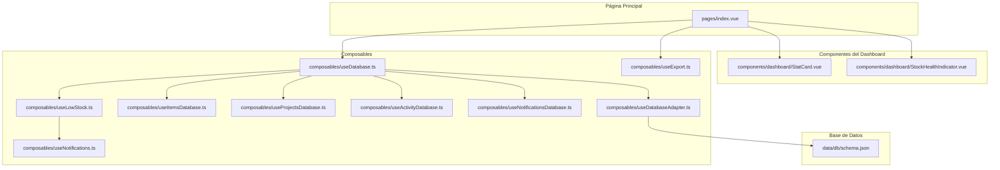
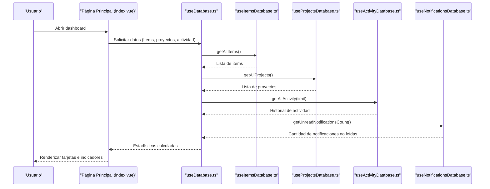
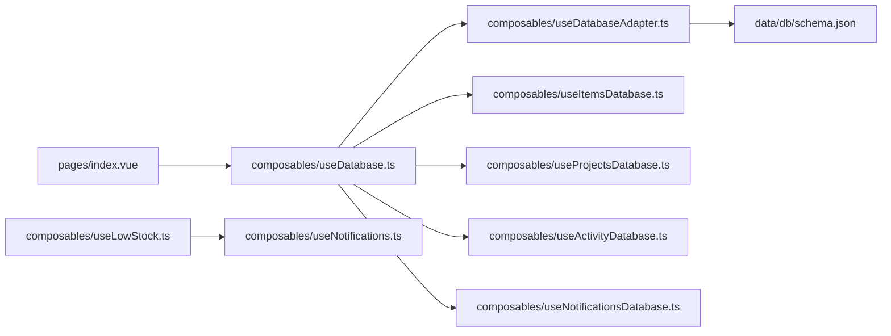

# Dashboard y Estadísticas

<cite>
**Archivos referenciados en este documento**
- [pages/index.vue](file://pages/index.vue)
- [components/dashboard/StatCard.vue](file://components/dashboard/StatCard.vue)
- [components/dashboard/StockHealthIndicator.vue](file://components/dashboard/StockHealthIndicator.vue)
- [composables/useDatabase.ts](file://composables/useDatabase.ts)
- [composables/useDatabaseAdapter.ts](file://composables/useDatabaseAdapter.ts)
- [composables/useItemsDatabase.ts](file://composables/useItemsDatabase.ts)
- [composables/useProjectsDatabase.ts](file://composables/useProjectsDatabase.ts)
- [composables/useActivityDatabase.ts](file://composables/useActivityDatabase.ts)
- [composables/useNotificationsDatabase.ts](file://composables/useNotificationsDatabase.ts)
- [composables/useLowStock.ts](file://composables/useLowStock.ts)
- [composables/useNotifications.ts](file://composables/useNotifications.ts)
- [composables/useExport.ts](file://composables/useExport.ts)
- [data/db/schema.json](file://data/db/schema.json)
- [types/bom.ts](file://types/bom.ts)
- [README.md](file://README.md)
</cite>

## Índice
1. [Introducción](#introducción)
2. [Estructura del proyecto](#estructura-del-proyecto)
3. [Componentes principales](#componentes-principales)
4. [Visión general de arquitectura](#visión-general-de-arquitectura)
5. [Análisis detallado de componentes](#análisis-detallado-de-componentes)
6. [Análisis de dependencias](#análisis-de-dependencias)
7. [Consideraciones de rendimiento](#consideraciones-de-rendimiento)
8. [Guía de solución de problemas](#guía-de-solución-de-problemas)
9. [Conclusión](#conclusión)
10. [Apéndices](#apéndices)

## Introducción
Este documento explica cómo funciona el dashboard principal y las estadísticas de BOM Manager. Cubre las tarjetas de estadísticas, el indicador de salud del stock, la actividad reciente, y cómo se calculan y actualizan los datos. También incluye información sobre visualización, exportación de reportes, y sugerencias de interpretación de métricas para distintos perfiles de usuario.

## Estructura del proyecto
El dashboard reside en la página principal y utiliza componentes reutilizables para mostrar métricas clave. La lógica de datos se obtiene a través de componibles que acceden a la base de datos (SQLite) mediante adaptadores para entornos web o Tauri. Los datos se persisten en tablas definidas en el esquema de base de datos.

**Diagrama fuente**
- [pages/index.vue](file://pages/index.vue#L1-L130)
- [components/dashboard/StatCard.vue](file://components/dashboard/StatCard.vue#L1-L104)
- [components/dashboard/StockHealthIndicator.vue](file://components/dashboard/StockHealthIndicator.vue#L1-L72)
- [composables/useDatabase.ts](file://composables/useDatabase.ts#L1-L89)
- [composables/useDatabaseAdapter.ts](file://composables/useDatabaseAdapter.ts#L1-L25)
- [composables/useItemsDatabase.ts](file://composables/useItemsDatabase.ts#L1-L346)
- [composables/useProjectsDatabase.ts](file://composables/useProjectsDatabase.ts#L1-L128)
- [composables/useActivityDatabase.ts](file://composables/useActivityDatabase.ts#L1-L87)
- [composables/useNotificationsDatabase.ts](file://composables/useNotificationsDatabase.ts#L1-L138)
- [composables/useLowStock.ts](file://composables/useLowStock.ts#L1-L82)
- [composables/useNotifications.ts](file://composables/useNotifications.ts#L1-L156)
- [composables/useExport.ts](file://composables/useExport.ts#L1-L184)
- [data/db/schema.json](file://data/db/schema.json#L1-L37)

**Sección fuente**
- [README.md](file://README.md#L63-L101)

## Componentes principales
- Tarjetas de estadísticas: mide totales de ítems, proyectos activos y valor total del inventario.
- Indicador de salud del stock: muestra un porcentaje de ítems con stock suficiente.
- Actividad reciente: muestra eventos recientes del sistema.
- Exportación de reportes: permite exportar el inventario completo a CSV o XLSX.

**Sección fuente**
- [pages/index.vue](file://pages/index.vue#L24-L128)
- [components/dashboard/StatCard.vue](file://components/dashboard/StatCard.vue#L1-L104)
- [components/dashboard/StockHealthIndicator.vue](file://components/dashboard/StockHealthIndicator.vue#L1-L72)
- [composables/useExport.ts](file://composables/useExport.ts#L1-L184)

## Visión general de arquitectura
La página principal carga estadísticas desde la base de datos, calcula métricas y las presenta en tarjetas e indicadores. La actividad reciente se obtiene de la tabla de actividad. La exportación se realiza desde la base de datos a través de utilidades.

**Diagrama fuente**
- [pages/index.vue](file://pages/index.vue#L195-L288)
- [composables/useDatabase.ts](file://composables/useDatabase.ts#L25-L89)
- [composables/useItemsDatabase.ts](file://composables/useItemsDatabase.ts#L18-L36)
- [composables/useProjectsDatabase.ts](file://composables/useProjectsDatabase.ts#L17-L36)
- [composables/useActivityDatabase.ts](file://composables/useActivityDatabase.ts#L49-L63)
- [composables/useNotificationsDatabase.ts](file://composables/useNotificationsDatabase.ts#L114-L127)

## Análisis detallado de componentes

### Dashboard principal (página de inicio)
- Carga de datos: al montar, se obtienen ítems, proyectos, actividad reciente y notificaciones no leídas.
- Cálculo de métricas:
  - Total de ítems: conteo de registros.
  - Stock bajo: cantidad de ítems donde la cantidad actual es menor que el stock mínimo (y el mínimo es mayor que cero).
  - Valor total del inventario: suma de precio × cantidad para todos los ítems.
  - Porcentaje de salud del stock: (totalItems − lowStock) / totalItems × 100.
- Presentación:
  - Tarjetas de estadísticas con formato de moneda y números.
  - Indicador de salud del stock con colores según rango de porcentaje.
  - Actividad reciente limitada a las últimas entradas.

**Sección fuente**
- [pages/index.vue](file://pages/index.vue#L195-L288)
- [components/dashboard/StatCard.vue](file://components/dashboard/StatCard.vue#L1-L104)
- [components/dashboard/StockHealthIndicator.vue](file://components/dashboard/StockHealthIndicator.vue#L1-L72)

### Tarjetas de estadísticas (StatCard)
- Propiedades: título, valor, subtítulo, tipo de valor (número o moneda), función de formato personalizado.
- Iconografía dinámica según el texto del título.
- Estilo condicional para alertas (cuando hay valores mayores a cero).

**Sección fuente**
- [components/dashboard/StatCard.vue](file://components/dashboard/StatCard.vue#L1-L104)

### Indicador de salud del stock
- Propiedades: porcentaje, título y texto de estado.
- Colores y sombras cambian según rangos:
  - ≥ 80%: verde (bueno).
  - ≥ 50%: amarillo (advertencia).
  - < 50%: rojo (problemas).

**Sección fuente**
- [components/dashboard/StockHealthIndicator.vue](file://components/dashboard/StockHealthIndicator.vue#L1-L72)

### Base de datos y cálculos
- Tabla de ítems: contiene campos como cantidad, precio, stock mínimo, etc.
- Cálculo de stock bajo: compara cantidad actual con stock mínimo.
- Cálculo del valor total: multiplica precio por cantidad y acumula.
- Cálculo de salud del stock: basado en ítems con stock suficiente vs. total.

**Sección fuente**
- [data/db/schema.json](file://data/db/schema.json#L1-L37)
- [pages/index.vue](file://pages/index.vue#L195-L217)
- [composables/useItemsDatabase.ts](file://composables/useItemsDatabase.ts#L304-L319)

### Actividad reciente
- Selecciona las últimas entradas de la tabla de actividad y las muestra con descripción y fecha.
- Se actualiza tras importaciones exitosas.

**Sección fuente**
- [pages/index.vue](file://pages/index.vue#L228-L240)
- [composables/useActivityDatabase.ts](file://composables/useActivityDatabase.ts#L49-L63)

### Exportación de reportes
- Permite exportar todo el inventario a CSV o XLSX.
- Genera nombres de archivo con fecha y muestra notificaciones de éxito/error.

**Sección fuente**
- [composables/useExport.ts](file://composables/useExport.ts#L1-L184)
- [pages/index.vue](file://pages/index.vue#L63-L96)

## Análisis de dependencias
- Página principal depende de useDatabase, que agrupa métodos de ítems, proyectos, actividad y notificaciones.
- useDatabaseAdapter detecta entorno (Tauri o web) y proporciona la base de datos correspondiente.
- useItemsDatabase y useProjectsDatabase encapsulan consultas SQL.
- useActivityDatabase y useNotificationsDatabase manejan historial y notificaciones.
- useLowStock y useNotifications se utilizan para alertas de stock bajo.

**Diagrama fuente**
- [pages/index.vue](file://pages/index.vue#L140-L153)
- [composables/useDatabase.ts](file://composables/useDatabase.ts#L1-L89)
- [composables/useDatabaseAdapter.ts](file://composables/useDatabaseAdapter.ts#L1-L25)
- [composables/useItemsDatabase.ts](file://composables/useItemsDatabase.ts#L1-L346)
- [composables/useProjectsDatabase.ts](file://composables/useProjectsDatabase.ts#L1-L128)
- [composables/useActivityDatabase.ts](file://composables/useActivityDatabase.ts#L1-L87)
- [composables/useNotificationsDatabase.ts](file://composables/useNotificationsDatabase.ts#L1-L138)
- [composables/useLowStock.ts](file://composables/useLowStock.ts#L1-L82)
- [composables/useNotifications.ts](file://composables/useNotifications.ts#L1-L156)
- [data/db/schema.json](file://data/db/schema.json#L1-L37)

**Sección fuente**
- [composables/useDatabase.ts](file://composables/useDatabase.ts#L25-L89)
- [composables/useDatabaseAdapter.ts](file://composables/useDatabaseAdapter.ts#L1-L25)

## Consideraciones de rendimiento
- Consultas SQL: se usan selects simples; mantener índices en columnas de búsqueda frecuente mejora tiempos de respuesta.
- Transacciones: operaciones de consumo y adición de stock usan transacciones para garantizar consistencia.
- Cálculos en frontend: el cálculo del valor total y porcentaje de salud se realiza en memoria; puede escalarse con paginación si el dataset crece mucho.
- Exportación: CSV/XLSX se generan en el navegador; grandes volúmenes pueden impactar el rendimiento.

[No se necesitan fuentes adicionales ya que esta sección ofrece recomendaciones generales]

## Guía de solución de problemas
- No se muestran estadísticas:
  - Verifique que la base de datos esté disponible (adaptador detecta entorno).
  - Confirme que las funciones de base de datos devuelvan resultados (ítems, proyectos).
- Valores incorrectos:
  - Revise que los campos de cantidad y precio no sean nulos.
  - Asegúrese de que el stock mínimo sea mayor que cero para considerar “bajo”.
- Actividad reciente vacía:
  - Asegúrese de haber registrado eventos en la tabla de actividad.
- Exportación fallida:
  - Verifique que haya ítems para exportar y que las dependencias de Excel estén disponibles.

**Sección fuente**
- [pages/index.vue](file://pages/index.vue#L278-L288)
- [composables/useDatabaseAdapter.ts](file://composables/useDatabaseAdapter.ts#L1-L25)
- [composables/useItemsDatabase.ts](file://composables/useItemsDatabase.ts#L304-L319)
- [composables/useExport.ts](file://composables/useExport.ts#L1-L184)

## Conclusión
El dashboard central de BOM Manager presenta métricas clave de forma clara y actualizada. Las tarjetas y el indicador de salud permiten una evaluación rápida del estado del inventario, mientras que la actividad reciente y la exportación facilitan el seguimiento y el análisis externo. La arquitectura modular permite mantener y ampliar funcionalidades fácilmente.

[No se necesitan fuentes adicionales]

## Apéndices

### Fórmulas de cálculo
- Total de ítems: cantidad de registros en la tabla de ítems.
- Stock bajo: cantidad de ítems donde cantidad actual < stock mínimo (y stock mínimo > 0).
- Valor total del inventario: suma de precio × cantidad para todos los ítems.
- Porcentaje de salud del stock: redondeo de (1 − (stock_bajo / total_ítems)) × 100, con total_ítems ≠ 0.

**Sección fuente**
- [pages/index.vue](file://pages/index.vue#L195-L217)
- [composables/useItemsDatabase.ts](file://composables/useItemsDatabase.ts#L304-L319)

### Interpretación de métricas
- Porcentaje de salud del stock:
  - ≥ 80%: buen estado del inventario.
  - 50–79%: advertencia, revisar niveles mínimos.
  - < 50%: riesgo de escasez, priorizar reposición.
- Valor total del inventario:
  - Comparar con períodos anteriores para evaluar tendencias de inversión.
- Ítems con stock bajo:
  - Priorizar acciones de compra o ajuste de mínimos.

**Sección fuente**
- [components/dashboard/StockHealthIndicator.vue](file://components/dashboard/StockHealthIndicator.vue#L42-L71)
- [pages/index.vue](file://pages/index.vue#L195-L217)

### Casos de uso por perfil
- Administrador:
  - Monitorear salud del stock y valor total.
  - Revisar actividad reciente y exportar reportes mensuales.
- Comprador:
  - Identificar ítems con stock bajo y ajustar mínimos.
  - Usar exportaciones para comparar precios y proveedores.
- Técnico:
  - Verificar disponibilidad de componentes antes de comenzar proyectos.

**Sección fuente**
- [pages/index.vue](file://pages/index.vue#L24-L128)
- [composables/useLowStock.ts](file://composables/useLowStock.ts#L1-L82)
- [composables/useExport.ts](file://composables/useExport.ts#L83-L101)

### Configuración de indicadores personalizados
- Añadir nuevas tarjetas:
  - Crear componentes similares a StatCard con propiedades personalizadas.
  - Integrar cálculos en la página principal y renderizar en el dashboard.
- Filtros de tiempo:
  - Extender useActivityDatabase para filtrar por fechas.
  - Actualizar la página principal para aceptar parámetros de rango de fechas.

**Sección fuente**
- [components/dashboard/StatCard.vue](file://components/dashboard/StatCard.vue#L1-L104)
- [composables/useActivityDatabase.ts](file://composables/useActivityDatabase.ts#L49-L63)
- [pages/index.vue](file://pages/index.vue#L228-L240)

### Actualización automática de datos
- Recarga tras importaciones:
  - La página refresca estadísticas y actividad reciente después de importar al inventario global.
- Notificaciones:
  - Se muestra un contador de notificaciones no leídas en la barra de notificaciones.

**Sección fuente**
- [pages/index.vue](file://pages/index.vue#L242-L256)
- [composables/useNotificationsDatabase.ts](file://composables/useNotificationsDatabase.ts#L114-L127)