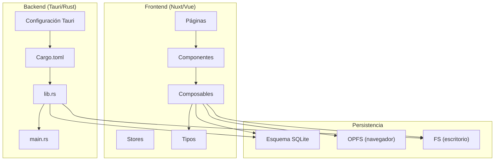
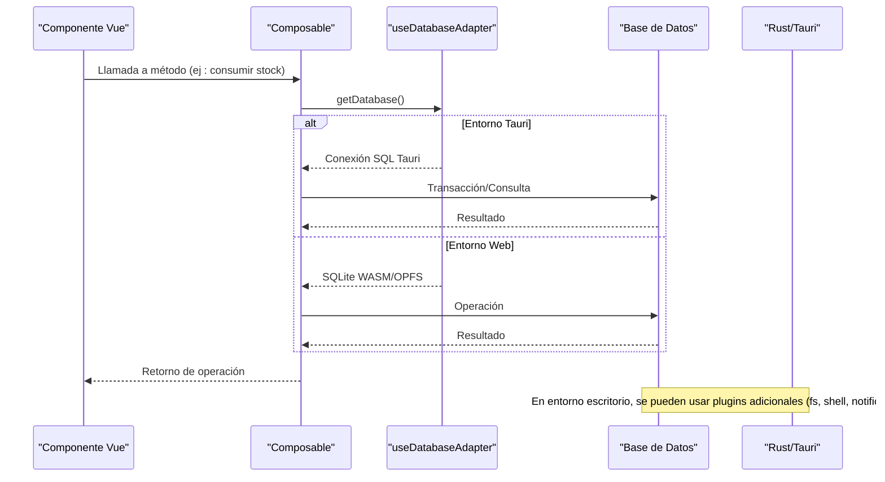
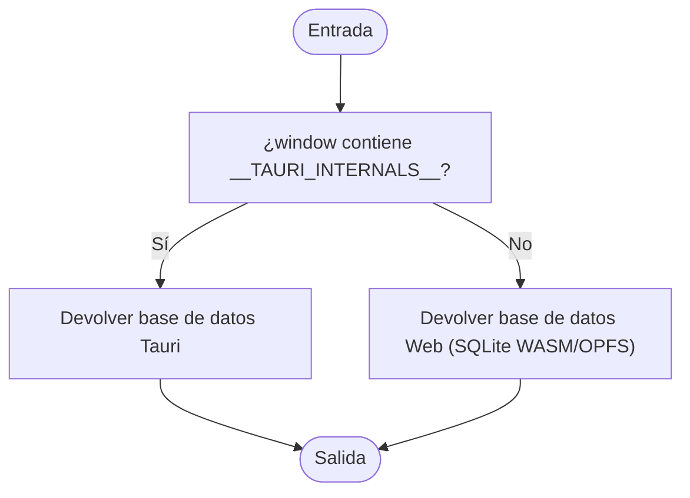
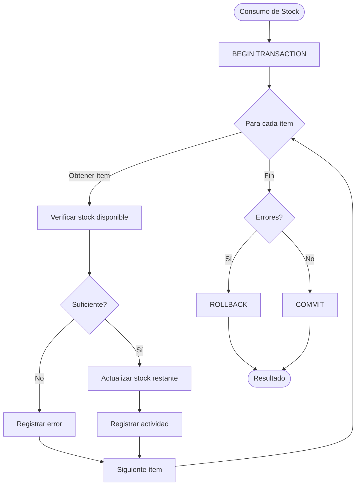
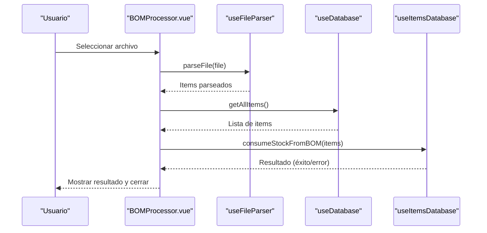
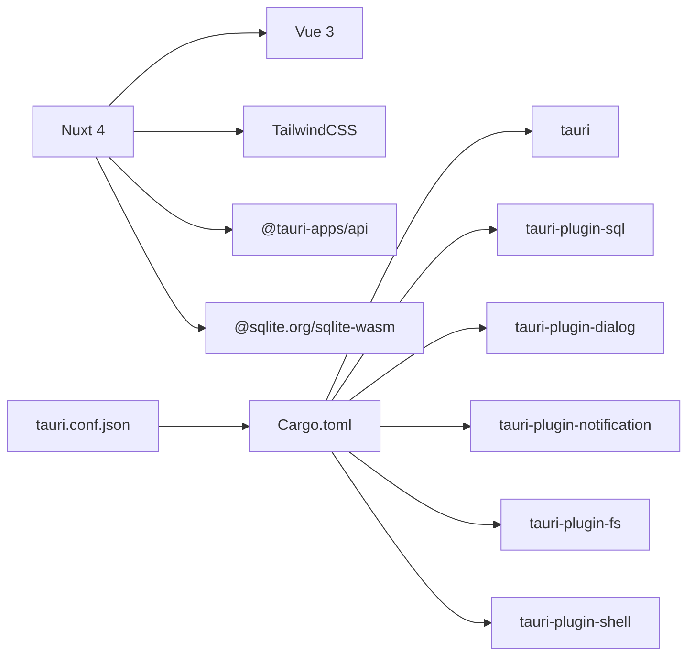

# Desarrollo y Contribución

<cite>
**Archivos citados en este documento**
- [README.md](file://README.md)
- [TODO.md](file://TODO.md)
- [package.json](file://package.json)
- [nuxt.config.ts](file://nuxt.config.ts)
- [src-tauri/Cargo.toml](file://src-tauri/Cargo.toml)
- [src-tauri/tauri.conf.json](file://src-tauri/tauri.conf.json)
- [src-tauri/src/main.rs](file://src-tauri/src/main.rs)
- [src-tauri/src/lib.rs](file://src-tauri/src/lib.rs)
- [data/db/schema.json](file://data/db/schema.json)
- [types/database.ts](file://types/database.ts)
- [composables/useDatabaseAdapter.ts](file://composables/useDatabaseAdapter.ts)
- [composables/useDatabaseMain.ts](file://composables/useDatabaseMain.ts)
- [composables/useDatabase.ts](file://composables/useDatabase.ts)
- [composables/useItemsDatabase.ts](file://composables/useItemsDatabase.ts)
- [composables/useProjectsDatabase.ts](file://composables/useProjectsDatabase.ts)
- [components/BOMProcessor.vue](file://components/BOMProcessor.vue)
- [components/EasyEDAImporter.vue](file://components/EasyEDAImporter.vue)
- [wiki/MANEJO_ARCHIVOS.md](file://wiki/MANEJO_ARCHIVOS.md)
</cite>

## Índice
1. [Introducción](#introducción)
2. [Estructura del Proyecto](#estructura-del-proyecto)
3. [Componentes Principales](#componentes-principales)
4. [Arquitectura General](#arquitectura-general)
5. [Análisis Detallado de Componentes](#análisis-detallado-de-componentes)
6. [Análisis de Dependencias](#análisis-de-dependencias)
7. [Consideraciones de Rendimiento](#consideraciones-de-rendimiento)
8. [Guía de Resolución de Problemas](#guía-de-resolución-de-problemas)
9. [Contribution Workflow y Buenas Prácticas](#contribution-workflow-y-buenas-prácticas)
10. [Pruebas Unitarias e Integración](#pruebas-unitarias-e-integración)
11. [Herramientas de Desarrollo y Configuración](#herramientas-de-desarrollo-y-configuración)
12. [Roadmap y Mejoras Sugeridas](#roadmap-y-mejoras-sugeridas)
13. [Estándares de Codificación y Convenciones](#estándares-de-codificación-y-convenciones)
14. [Conclusión](#conclusión)

## Introducción
BOM Manager es una aplicación multiplataforma para gestionar listas de materiales (BOM) de manera local, combinando frontend web moderno con backend nativo mediante Tauri. El proyecto permite importar BOMs, mantener un inventario de componentes, asignarlos a proyectos, y realizar operaciones de consumo de stock. La arquitectura se basa en:
- Frontend: Vue 3 + Nuxt 4, con TailwindCSS y SQLite WASM en el navegador.
- Backend: Rust/Tauri con plugins para diálogo, notificaciones, sistema de archivos y base de datos SQL.
- Persistencia: Base de datos relacional local (SQLite) con soporte para entornos web (OPFS) y escritorio (plugin fs).

**Sección fuente**
- [README.md](file://README.md#L1-L101)

## Estructura del Proyecto
La estructura del repositorio organiza funcionalidades por capas y características:
- src-tauri/: Código Rust/Tauri (comandos, plugins, configuración de bundle).
- composables/: Lógica reutilizable de acceso a base de datos y funcionalidades.
- components/: Componentes Vue reutilizables (importadores, vistas, diálogos).
- pages/: Páginas de la aplicación (rutas).
- stores/: Almacén de estado (Pinia).
- types/: Tipos TypeScript.
- data/db/: Esquema de base de datos.
- wiki/: Documentación técnica y notas de desarrollo.
- server/: Middleware y endpoints auxiliares (proxy de imagen, cabeceras).

**Diagrama fuente**
- [nuxt.config.ts](file://nuxt.config.ts#L1-L67)
- [src-tauri/tauri.conf.json](file://src-tauri/tauri.conf.json#L1-L37)
- [src-tauri/Cargo.toml](file://src-tauri/Cargo.toml#L1-L31)
- [src-tauri/src/lib.rs](file://src-tauri/src/lib.rs#L1-L79)
- [src-tauri/src/main.rs](file://src-tauri/src/main.rs#L1-L7)
- [data/db/schema.json](file://data/db/schema.json#L1-L37)

**Sección fuente**
- [README.md](file://README.md#L63-L101)
- [nuxt.config.ts](file://nuxt.config.ts#L1-L67)
- [src-tauri/tauri.conf.json](file://src-tauri/tauri.conf.json#L1-L37)

## Componentes Principales
- useDatabaseAdapter: Detecta entorno (Tauri/web) y proporciona la base de datos correspondiente.
- useDatabaseMain: Combinación de adaptador + funcionalidades de actividad y notificaciones.
- useDatabase: Facade que expone métodos consolidados de items, proyectos, actividades, notificaciones, configuración y archivos.
- useItemsDatabase: Operaciones CRUD de componentes, actualización de stock, consumo y adición de stock, consultas de bajo stock.
- useProjectsDatabase: Operaciones CRUD de proyectos y relación con items.
- BOMProcessor.vue: Modal para importar y procesar BOMs, comparar stock y descontar cantidades.
- EasyEDAImporter.vue: Importador de plantillas EasyEDA con vista previa y confirmación.

**Sección fuente**
- [composables/useDatabaseAdapter.ts](file://composables/useDatabaseAdapter.ts#L1-L25)
- [composables/useDatabaseMain.ts](file://composables/useDatabaseMain.ts#L1-L17)
- [composables/useDatabase.ts](file://composables/useDatabase.ts#L1-L89)
- [composables/useItemsDatabase.ts](file://composables/useItemsDatabase.ts#L1-L346)
- [composables/useProjectsDatabase.ts](file://composables/useProjectsDatabase.ts#L1-L128)
- [components/BOMProcessor.vue](file://components/BOMProcessor.vue#L1-L387)
- [components/EasyEDAImporter.vue](file://components/EasyEDAImporter.vue#L1-L311)

## Arquitectura General
La aplicación sigue un patrón de capas:
- Interfaz de usuario (Vue/Nuxt) llama a componibles.
- Composables usan useDatabaseAdapter para obtener la base de datos.
- En entorno Tauri, se usa el plugin SQL de Tauri; en web, se usa SQLite WASM con OPFS.
- Los comandos Rust exponen diálogos y utilidades al frontend.

**Diagrama fuente**
- [composables/useDatabaseAdapter.ts](file://composables/useDatabaseAdapter.ts#L1-L25)
- [composables/useItemsDatabase.ts](file://composables/useItemsDatabase.ts#L200-L252)
- [src-tauri/src/lib.rs](file://src-tauri/src/lib.rs#L56-L78)

**Sección fuente**
- [composables/useDatabaseAdapter.ts](file://composables/useDatabaseAdapter.ts#L1-L25)
- [src-tauri/src/lib.rs](file://src-tauri/src/lib.rs#L1-L79)

## Análisis Detallado de Componentes

### useDatabaseAdapter
Detecta si se ejecuta dentro de Tauri y devuelve el adaptador de base de datos adecuado. Esto permite un único punto de entrada para operaciones CRUD sin preocuparse del entorno.

**Diagrama fuente**
- [composables/useDatabaseAdapter.ts](file://composables/useDatabaseAdapter.ts#L1-L25)

**Sección fuente**
- [composables/useDatabaseAdapter.ts](file://composables/useDatabaseAdapter.ts#L1-L25)

### useItemsDatabase
Operaciones CRUD de items, actualización de stock, consumo de stock basado en BOMs, adición de stock y consulta de items con bajo stock. Incluye manejo de transacciones y registro de actividad.

**Diagrama fuente**
- [composables/useItemsDatabase.ts](file://composables/useItemsDatabase.ts#L200-L252)

**Sección fuente**
- [composables/useItemsDatabase.ts](file://composables/useItemsDatabase.ts#L1-L346)

### useProjectsDatabase
Operaciones CRUD de proyectos y relación con items. Al eliminar un proyecto, se eliminan archivos asociados (eliminación en cascada).

**Sección fuente**
- [composables/useProjectsDatabase.ts](file://composables/useProjectsDatabase.ts#L1-L128)

### useDatabase
Facade que expone métodos consolidados de items, proyectos, actividades, notificaciones, configuración y archivos. Simplifica el acceso desde componentes y páginas.

**Sección fuente**
- [composables/useDatabase.ts](file://composables/useDatabase.ts#L1-L89)

### BOMProcessor.vue
Permite cargar un archivo BOM, previsualizar componentes, comparar stock actual vs requerido, y descontar stock si hay suficiencia. Emite eventos de resultado y maneja errores.

**Diagrama fuente**
- [components/BOMProcessor.vue](file://components/BOMProcessor.vue#L180-L357)
- [composables/useItemsDatabase.ts](file://composables/useItemsDatabase.ts#L200-L252)

**Sección fuente**
- [components/BOMProcessor.vue](file://components/BOMProcessor.vue#L1-L387)

### EasyEDAImporter.vue
Importa plantillas EasyEDA (JSON), muestra metadatos y vista previa, y confirma la importación convirtiendo a formato interno.

**Sección fuente**
- [components/EasyEDAImporter.vue](file://components/EasyEDAImporter.vue#L1-L311)

## Análisis de Dependencias
- Frontend:
  - Nuxt 4, Vue 3, Pinia, TailwindCSS.
  - @sqlite.org/sqlite-wasm, @tauri-apps/api, plugins Tauri.
  - Herramientas de desarrollo: @tauri-apps/cli, vite plugins wasm/top-level-await.
- Backend (Tauri):
  - tauri, tauri-plugin-sql, tauri-plugin-dialog, tauri-plugin-notification, tauri-plugin-fs, tauri-plugin-shell.
  - rust-version 1.77.2, edition 2021.
- Configuración:
  - nuxt.config.ts: Vite plugins, CORS/COOP, SSR desactivado, módulos.
  - tauri.conf.json: Build/dev URLs, ventana principal, bundle, plugin SQL preload.

**Diagrama fuente**
- [package.json](file://package.json#L1-L50)
- [nuxt.config.ts](file://nuxt.config.ts#L1-L67)
- [src-tauri/Cargo.toml](file://src-tauri/Cargo.toml#L1-L31)
- [src-tauri/tauri.conf.json](file://src-tauri/tauri.conf.json#L1-L37)

**Sección fuente**
- [package.json](file://package.json#L1-L50)
- [nuxt.config.ts](file://nuxt.config.ts#L1-L67)
- [src-tauri/Cargo.toml](file://src-tauri/Cargo.toml#L1-L31)
- [src-tauri/tauri.conf.json](file://src-tauri/tauri.conf.json#L1-L37)

## Consideraciones de Rendimiento
- Uso de transacciones en operaciones de stock evita inconsistencias y mejora rendimiento al hacer múltiples actualizaciones.
- En entornos web, limitar el tamaño de OPFS y limpiar archivos no utilizados mejora la experiencia.
- Evitar consultas redundantes (por ejemplo, obtener lista de items varias veces) y reutilizar resultados.

**Sección fuente**
- [composables/useItemsDatabase.ts](file://composables/useItemsDatabase.ts#L200-L252)
- [wiki/MANEJO_ARCHIVOS.md](file://wiki/MANEJO_ARCHIVOS.md#L1-L46)

## Guía de Resolución de Problemas
- Diálogos y notificaciones en Tauri:
  - El backend expone comandos para mostrar diálogos de confirmación e información. Si no aparecen, revisar permisos de plugin y entorno de ejecución.
- Archivos y OPFS:
  - En navegadores, verificar disponibilidad de OPFS y cuotas. Implementar fallback si no está disponible.
- Errores de base de datos:
  - En operaciones con transacciones, revisar mensajes de error y asegurar rollback ante fallos.

**Sección fuente**
- [src-tauri/src/lib.rs](file://src-tauri/src/lib.rs#L1-L79)
- [wiki/MANEJO_ARCHIVOS.md](file://wiki/MANEJO_ARCHIVOS.md#L1-L46)

## Contribution Workflow y Buenas Prácticas
- Flujo básico:
  - Fork del repositorio → Feature branch → Desarrollo en componentes/composables → PR con descripción clara.
- Estilo de commits: Conformar con convenciones del equipo (por ejemplo, feat/, fix/, docs/).
- Validación previa:
  - Lint y formateo (Prettier) → Pruebas unitarias e integración → Build de frontend y backend.
- Ramas y releases:
  - Develop → Release candidate → Tag de versión → Build multiplataforma.

[No se añaden fuentes porque esta sección resume buenas prácticas sin analizar archivos específicos]

## Pruebas Unitarias e Integración
- Unitarias:
  - Testear componibles (useDatabaseAdapter, useItemsDatabase, useProjectsDatabase) con entradas simuladas y verificación de resultados.
- Integración:
  - Simular flujo de importación BOM y EasyEDA, validando actualización de stock y notificaciones.
- Herramientas sugeridas:
  - Vitest (configuración existente en tsconfig.vitest.json).
  - Mock de base de datos (SQLite WASM/OPFS) para evitar dependencias externas.

[No se añaden fuentes porque esta sección propone estrategias sin analizar archivos específicos]

## Herramientas de Desarrollo y Configuración
- Entorno:
  - Node.js ≥ 18, Rust (instalado con rustup), Xcode Command Line Tools (macOS).
- Scripts:
  - setup.sh: Instalación automática de dependencias.
  - npm run tauri:dev, tauri build.
- Configuración:
  - nuxt.config.ts: Plugins WASM, COOP/COEP headers, SSR desactivado.
  - tauri.conf.json: Ventana principal, bundle, plugin SQL preload.

**Sección fuente**
- [README.md](file://README.md#L9-L62)
- [nuxt.config.ts](file://nuxt.config.ts#L1-L67)
- [src-tauri/tauri.conf.json](file://src-tauri/tauri.conf.json#L1-L37)

## Roadmap y Mejoras Sugeridas
- Importación CSV/XLSX:
  - Completar mapeo preciso de columnas y validación avanzada.
  - Opción de crear proyectos nuevos durante importación.
- Vista de Inventario:
  - Preview LCSC, integración de compra, notificaciones de bajo stock, reordenamiento automático.
- Gestión de Proyectos:
  - Carga de Gerber, ayuda visual de ubicación de componentes, costos por unidad y por PCB.
- Exportación/Importación:
  - Exportar base de datos y archivos OPFS; importar paquete comprimido.
- Configuración:
  - Preferencias de cantidad por página, moneda, país.

**Sección fuente**
- [TODO.md](file://TODO.md#L1-L82)

## Estándares de Codificación y Convenciones
- Nombres de funciones y variables: camelCase.
- Interfaces de base de datos: Database con métodos select/execute.
- Composables: Prefijo use*, retornan objetos con métodos.
- Componentes Vue: setup con composables, emits tipados.
- Manejo de errores: Captura de excepciones y retorno de mensajes estructurados.

**Sección fuente**
- [types/database.ts](file://types/database.ts#L1-L5)
- [composables/useDatabaseAdapter.ts](file://composables/useDatabaseAdapter.ts#L1-L25)
- [components/BOMProcessor.vue](file://components/BOMProcessor.vue#L180-L357)

## Conclusión
BOM Manager combina un frontend moderno con un backend nativo para ofrecer una solución integral de gestión de BOMs. La arquitectura modular facilita el mantenimiento y expansión. Se recomienda seguir las buenas prácticas de desarrollo, mantener el esquema de base de datos actualizado y priorizar pruebas unitarias e integración. El roadmap identificado permite evolucionar funcionalidades clave como importación avanzada, notificaciones de stock y exportación de datos.

[No se añaden fuentes porque esta sección resume sin analizar archivos específicos]