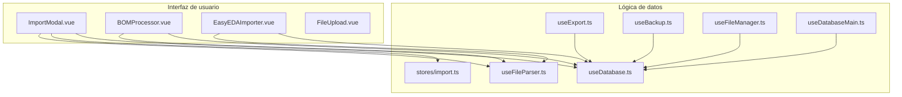
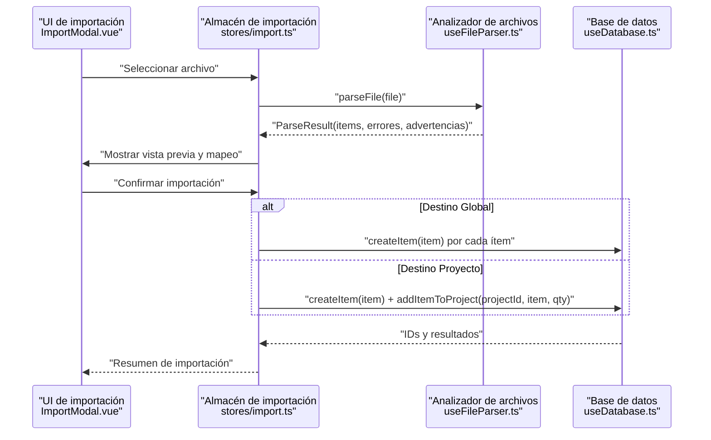
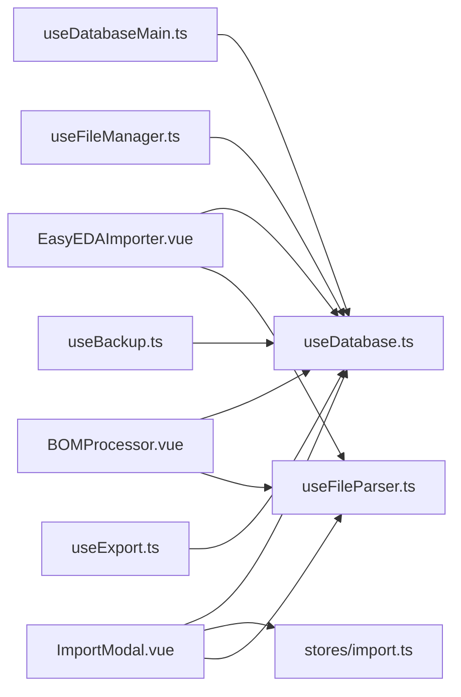

# Exportación e Importación de Datos

<cite>
**Archivos mencionados en este documento**
- [useExport.ts](file://composables/useExport.ts)
- [useBackup.ts](file://composables/useBackup.ts)
- [useFileManager.ts](file://composables/useFileManager.ts)
- [useFileParser.ts](file://composables/useFileParser.ts)
- [useDatabase.ts](file://composables/useDatabase.ts)
- [useDatabaseMain.ts](file://composables/useDatabaseMain.ts)
- [ImportModal.vue](file://components/ImportModal.vue)
- [BOMProcessor.vue](file://components/BOMProcessor.vue)
- [EasyEDAImporter.vue](file://components/EasyEDAImporter.vue)
- [FileUpload.vue](file://components/FileUpload.vue)
- [import.ts](file://stores/import.ts)
- [README.md](file://README.md)
</cite>

## Índice
1. [Introducción](#introducción)
2. [Estructura del proyecto](#estructura-del-proyecto)
3. [Componentes principales](#componentes-principales)
4. [Visión general de arquitectura](#visión-general-de-arquitectura)
5. [Análisis detallado de componentes](#análisis-detallado-de-componentes)
6. [Análisis de dependencias](#análisis-de-dependencias)
7. [Consideraciones de rendimiento](#consideraciones-de-rendimiento)
8. [Guía de solución de problemas](#guía-de-solución-de-problemas)
9. [Conclusión](#conclusión)
10. [Apéndices](#apéndices)

## Introducción
Este documento explica las funcionalidades completas de exportación e importación de datos en BOM Manager. Cubre:
- Exportación de base de datos completa (formatos CSV y XLSX) y respaldos de seguridad JSON.
- Transferencia de información mediante archivos locales y almacenamiento seguro (OPFS en web, sistema de archivos en Tauri).
- Importación de respaldos, restauración de datos y migración entre sistemas.
- Verificación de integridad mediante validación de esquemas y detección automática de columnas.
- Opciones de exportación parcial, filtrado de datos y personalización de formatos.
- Manejo de archivos locales, procedimientos de respaldo automatizados y flujos empresariales recomendados.

## Estructura del proyecto
Los flujos de exportación/importación involucran componentes front-end, componibles de datos y almacén de estado. Los principales módulos son:
- Exportación: composables de exportación y respaldo.
- Importación: modal de importación, procesador de BOM y cargador de plantillas EasyEDA.
- Almacenamiento: composable de archivos con compatibilidad web y Tauri.
- Base de datos: acceso centralizado a items, proyectos y actividades.

**Diagrama fuente**
- [ImportModal.vue](file://components/ImportModal.vue#L1-L756)
- [BOMProcessor.vue](file://components/BOMProcessor.vue#L1-L387)
- [EasyEDAImporter.vue](file://components/EasyEDAImporter.vue#L1-L311)
- [FileUpload.vue](file://components/FileUpload.vue#L1-L283)
- [useFileParser.ts](file://composables/useFileParser.ts#L1-L422)
- [useExport.ts](file://composables/useExport.ts#L1-L184)
- [useBackup.ts](file://composables/useBackup.ts#L1-L129)
- [useFileManager.ts](file://composables/useFileManager.ts#L1-L260)
- [useDatabase.ts](file://composables/useDatabase.ts#L1-L89)
- [useDatabaseMain.ts](file://composables/useDatabaseMain.ts#L1-L17)
- [import.ts](file://stores/import.ts#L1-L344)

**Sección fuente**
- [README.md](file://README.md#L63-L101)

## Componentes principales
- Exportación
  - CSV y XLSX: conversión de items del inventario a formatos compatibles y descarga.
  - Respaldo JSON: exportación completa de items, proyectos y listas.
- Importación
  - Modal de importación con pasos: carga, mapeo de columnas, revisión y confirmación.
  - Procesador de BOM: lectura de archivos BOM, comparación con stock actual e incremento o descuento de existencias.
  - Importador EasyEDA: carga de plantillas JSON y conversión a formato interno.
- Almacenamiento
  - Gestión de archivos locales: OPFS en web y sistema de archivos en Tauri, con limpieza de URLs y mapeo de nombres.
- Base de datos
  - Acceso centralizado a items, proyectos, relaciones y actividades.

**Sección fuente**
- [useExport.ts](file://composables/useExport.ts#L1-L184)
- [useBackup.ts](file://composables/useBackup.ts#L1-L129)
- [useFileManager.ts](file://composables/useFileManager.ts#L1-L260)
- [useFileParser.ts](file://composables/useFileParser.ts#L1-L422)
- [useDatabase.ts](file://composables/useDatabase.ts#L1-L89)
- [ImportModal.vue](file://components/ImportModal.vue#L1-L756)
- [BOMProcessor.vue](file://components/BOMProcessor.vue#L1-L387)
- [EasyEDAImporter.vue](file://components/EasyEDAImporter.vue#L1-L311)
- [FileUpload.vue](file://components/FileUpload.vue#L1-L283)
- [import.ts](file://stores/import.ts#L1-L344)

## Visión general de arquitectura

**Diagrama fuente**
- [ImportModal.vue](file://components/ImportModal.vue#L700-L756)
- [import.ts](file://stores/import.ts#L263-L342)
- [useFileParser.ts](file://composables/useFileParser.ts#L379-L421)
- [useDatabase.ts](file://composables/useDatabase.ts#L25-L89)

## Análisis detallado de componentes

### Exportación de base de datos
- CSV
  - Genera un archivo CSV con encabezados específicos y codificación UTF-8.
  - Valida que haya datos antes de exportar.
  - Notifica éxito o error al usuario.
- XLSX
  - Convierte items a hoja de cálculo, ajusta anchos de columnas y descarga con nombre basado en fecha.
- Exportación completa
  - Obtiene todos los items y exporta con formato CSV o XLSX, generando nombres de archivo automáticos.

**Sección fuente**
- [useExport.ts](file://composables/useExport.ts#L1-L184)

### Copias de seguridad (respaldos)
- Creación de respaldo
  - Recopila items, proyectos y listas actuales, incluyendo marca de tiempo y versión.
- Exportación de respaldo
  - Serializa a JSON y permite descarga como archivo.
- Importación de respaldo
  - Valida estructura del archivo JSON.
  - Recorre items y proyectos, actualizando o creando registros según existencia.
  - Recupera listas desde el composable correspondiente.

**Sección fuente**
- [useBackup.ts](file://composables/useBackup.ts#L1-L129)

### Importación de archivos
- Modal de importación
  - Etapas: carga de archivo, mapeo de columnas, revisión y confirmación.
  - Vista previa de datos y selección de filas.
  - Destinos: inventario global o proyecto específico.
- Procesador de BOM
  - Carga archivo BOM, compara con stock actual e incrementa o descuenta existencias.
- Importador EasyEDA
  - Carga plantilla JSON, muestra metadatos y componentes, y confirma importación convertida al formato interno.

**Sección fuente**
- [ImportModal.vue](file://components/ImportModal.vue#L1-L756)
- [BOMProcessor.vue](file://components/BOMProcessor.vue#L1-L387)
- [EasyEDAImporter.vue](file://components/EasyEDAImporter.vue#L1-L311)
- [FileUpload.vue](file://components/FileUpload.vue#L1-L283)
- [import.ts](file://stores/import.ts#L1-L344)

### Almacenamiento seguro de archivos
- Web (OPFS)
  - Guarda archivos en el sistema de archivos privado del origen y devuelve URLs.
  - Permite borrar archivos y estimar espacio disponible.
- Tauri
  - Escribe archivos usando plugins de sistema de archivos o Data URLs como fallback.
  - Elimina archivos temporales y libera objetos URL.
- Gestión de nombres
  - Mapeo de URLs a nombres de archivos para facilitar borrado posterior.

**Sección fuente**
- [useFileManager.ts](file://composables/useFileManager.ts#L1-L260)

### Validación e integridad de datos
- Detección automática de columnas
  - Basada en patrones de palabras clave para campos como nombre, cantidad, categoría, proveedor, etc.
- Procesamiento de datos
  - Conversión de tipos numéricos, manejo de valores vacíos y validación con esquema.
- Resultado de análisis
  - Items válidos, errores y advertencias detallados por fila.

**Sección fuente**
- [useFileParser.ts](file://composables/useFileParser.ts#L1-L422)

### Acceso a base de datos
- Centralización de operaciones
  - Métodos para items, proyectos, relaciones, actividades y notificaciones.
- Adaptador de base de datos
  - Facilita el acceso a la base de datos y detecta entorno Tauri.

**Sección fuente**
- [useDatabase.ts](file://composables/useDatabase.ts#L1-L89)
- [useDatabaseMain.ts](file://composables/useDatabaseMain.ts#L1-L17)

## Análisis de dependencias

**Diagrama fuente**
- [useExport.ts](file://composables/useExport.ts#L1-L184)
- [useBackup.ts](file://composables/useBackup.ts#L1-L129)
- [ImportModal.vue](file://components/ImportModal.vue#L1-L756)
- [BOMProcessor.vue](file://components/BOMProcessor.vue#L1-L387)
- [EasyEDAImporter.vue](file://components/EasyEDAImporter.vue#L1-L311)
- [useFileParser.ts](file://composables/useFileParser.ts#L1-L422)
- [useDatabase.ts](file://composables/useDatabase.ts#L1-L89)
- [useDatabaseMain.ts](file://composables/useDatabaseMain.ts#L1-L17)
- [useFileManager.ts](file://composables/useFileManager.ts#L1-L260)
- [import.ts](file://stores/import.ts#L1-L344)

**Sección fuente**
- [useExport.ts](file://composables/useExport.ts#L1-L184)
- [useBackup.ts](file://composables/useBackup.ts#L1-L129)
- [useFileParser.ts](file://composables/useFileParser.ts#L1-L422)
- [useDatabase.ts](file://composables/useDatabase.ts#L1-L89)
- [useFileManager.ts](file://composables/useFileManager.ts#L1-L260)
- [ImportModal.vue](file://components/ImportModal.vue#L1-L756)
- [BOMProcessor.vue](file://components/BOMProcessor.vue#L1-L387)
- [EasyEDAImporter.vue](file://components/EasyEDAImporter.vue#L1-L311)
- [import.ts](file://stores/import.ts#L1-L344)

## Consideraciones de rendimiento
- Exportación
  - CSV: adecuado para grandes volúmenes, fácil de procesar.
  - XLSX: mejor presentación visual, pero mayor consumo de memoria al construir libros.
- Importación
  - Procesamiento por lotes: crear o actualizar ítems en bucle, registrando actividades.
  - Validación incremental: detectar columnas automáticamente reduce errores humanos.
- Almacenamiento
  - OPFS en web: eficiente para archivos temporales; limitaciones en navegadores.
  - Tauri: acceso directo al sistema de archivos; fallback a Data URLs si no hay plugin.

[No se necesitan fuentes adicionales, ya que esta sección ofrece orientación general]

## Guía de solución de problemas
- Importación fallida
  - Verifica que el archivo tenga formato CSV/XLSX y que contenga columnas esenciales (nombre, cantidad).
  - Confirma que el destino sea válido (global o proyecto).
- Errores de validación
  - Revisa advertencias y errores por fila; corrige tipos numéricos o valores vacíos.
- Exportación sin datos
  - Asegúrate de tener ítems en el inventario antes de exportar.
- Almacenamiento
  - En Tauri, si no hay plugin de fs disponible, se usa Data URL como fallback; reinicia o verifica permisos.

**Sección fuente**
- [useFileParser.ts](file://composables/useFileParser.ts#L106-L201)
- [ImportModal.vue](file://components/ImportModal.vue#L503-L523)
- [import.ts](file://stores/import.ts#L263-L342)
- [useExport.ts](file://composables/useExport.ts#L13-L43)
- [useFileManager.ts](file://composables/useFileManager.ts#L74-L109)

## Conclusión
BOM Manager ofrece flujos robustos de exportación/importación con validación de datos, respaldo completo y compatibilidad multiplataforma. Las funcionalidades permiten respaldos seguros, migraciones entre entornos y operaciones empresariales eficientes, todo respaldado por un modelo de datos centralizado y herramientas de almacenamiento adaptativas.

[No se necesitan fuentes adicionales, ya que esta sección resume sin analizar archivos específicos]

## Apéndices

### Flujos de trabajo sugeridos
- Respaldo periódico
  - Programar exportación diaria de inventario (CSV/XLSX) y copia de seguridad JSON semanal.
- Migración entre sistemas
  - Exportar respaldo JSON en origen, importarlo en destino y verificar consistencia de ítems y proyectos.
- Importación masiva
  - Preparar archivo con columnas mapeadas automáticamente, revisar errores y confirmar importación en destino global o proyecto.

[No se necesitan fuentes adicionales, ya que esta sección proporciona orientación conceptual]