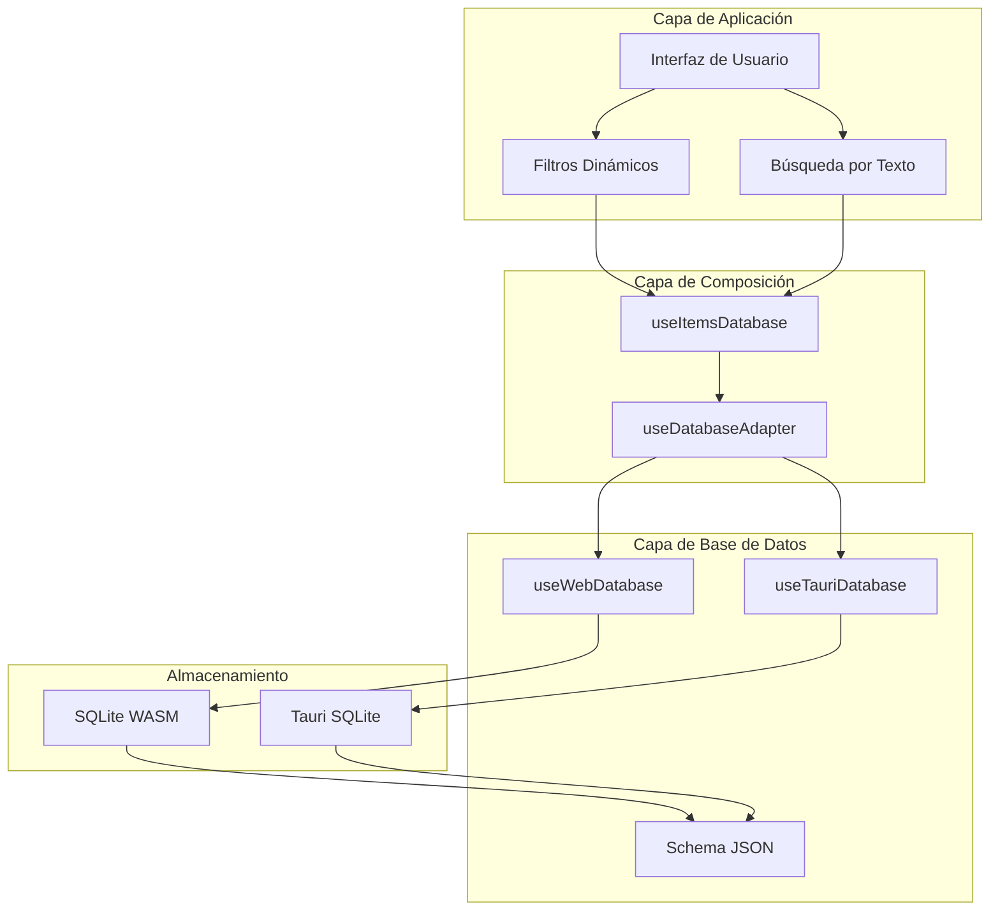
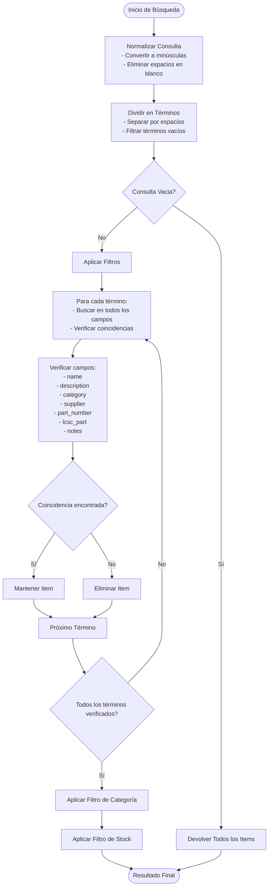
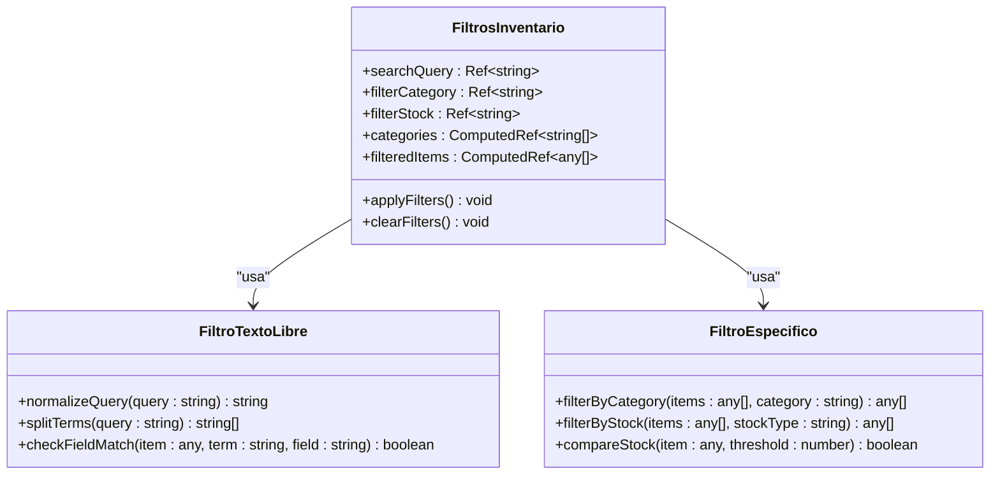
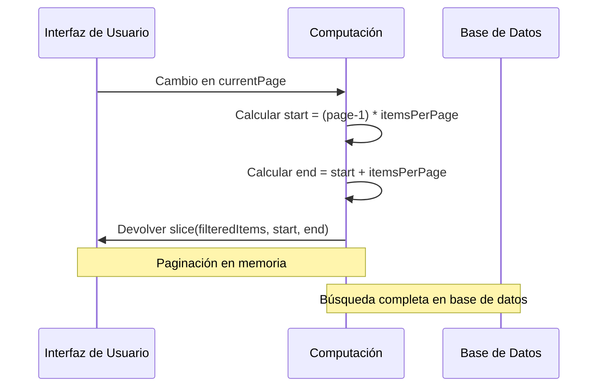
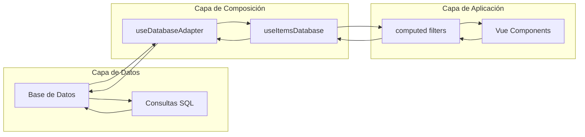

# Búsqueda y Filtrado

<cite>
**Archivos referenciados en este documento**
- [useItemsDatabase.ts](file://composables/useItemsDatabase.ts)
- [inventory.vue](file://pages/inventory.vue)
- [InventoryTable.vue](file://components/inventory/InventoryTable.vue)
- [useDatabaseAdapter.ts](file://composables/useDatabaseAdapter.ts)
- [useWebDatabase.ts](file://composables/useWebDatabase.ts)
- [useTauriDatabase.ts](file://composables/useTauriDatabase.ts)
- [database.ts](file://types/database.ts)
- [schema.json](file://data/db/schema.json)
- [useDatabaseUtils.ts](file://composables/useDatabaseUtils.ts)
</cite>

## Tabla de Contenidos
1. [Introducción](#introducción)
2. [Arquitectura de Búsqueda](#arquitectura-de-búsqueda)
3. [Criterios de Búsqueda Disponibles](#criterios-de-búsqueda-disponibles)
4. [Implementación de Búsquedas](#implementación-de-búsquedas)
5. [Filtros Dinámicos](#filtros-dinámicos)
6. [Ordenamiento y Paginación](#ordenamiento-y-paginación)
7. [Funciones del Composable useItemsDatabase](#funciones-del-composable-useitemsdatabase)
8. [Optimización de Rendimiento](#optimización-de-rendimiento)
9. [Ejemplos Prácticos](#ejemplos-prácticos)
10. [Mejores Prácticas](#mejores-prácticas)
11. [Consejos para la Experiencia del Usuario](#consejos-para-la-experiencia-del-usuario)
12. [Resumen](#resumen)

## Introducción

El sistema de búsqueda y filtrado en el inventario de componentes ofrece funcionalidades completas para localizar, organizar y gestionar piezas electrónicas. La implementación combina búsquedas por texto libre con filtros específicos, permitiendo a los usuarios encontrar rápidamente componentes mediante múltiples criterios de búsqueda.

## Arquitectura de Búsqueda

La arquitectura de búsqueda se basa en una capa de abstracción que permite operar tanto en entornos web como en aplicaciones Tauri, manteniendo una interfaz consistente para todas las operaciones de base de datos.



**Diagrama fuente**
- [useDatabaseAdapter.ts](file://composables/useDatabaseAdapter.ts#L6-L24)
- [useWebDatabase.ts](file://composables/useWebDatabase.ts#L133-L179)
- [useTauriDatabase.ts](file://composables/useTauriDatabase.ts#L25-L55)

**Sección fuente**
- [useDatabaseAdapter.ts](file://composables/useDatabaseAdapter.ts#L1-L25)
- [useDatabase.ts](file://composables/useDatabase.ts#L25-L89)

## Criterios de Búsqueda Disponibles

### Campos de Búsqueda por Texto Libre

La búsqueda por texto libre permite encontrar componentes utilizando múltiples campos del registro:

| Campo | Descripción | Uso en Búsqueda |
|-------|-------------|-----------------|
| `name` | Nombre del componente | Coincidencia parcial |
| `description` | Descripción detallada | Coincidencia parcial |
| `category` | Categoría del componente | Coincidencia parcial |
| `supplier` | Proveedor del componente | Coincidencia parcial |
| `part_number` | Número de parte del proveedor | Coincidencia parcial |
| `lcsc_part` | Número de parte LCSC | Coincidencia parcial |
| `notes` | Notas adicionales | Coincidencia parcial |

### Filtros Específicos

Los filtros específicos permiten restringir resultados por características particulares:

- **Categoría**: Filtro por categoría específica
- **Estado de Stock**: Opciones de "Todos", "Stock OK", "Stock Bajo"
- **Búsqueda Avanzada**: Posibilidad de búsqueda por campos específicos

**Sección fuente**
- [inventory.vue](file://pages/inventory.vue#L304-L343)

## Implementación de Búsquedas

### Búsqueda por Texto Libre

La implementación utiliza un algoritmo de búsqueda que:

1. **Normaliza la consulta**: Convierte a minúsculas y elimina espacios en blanco
2. **Divide en términos**: Separa la consulta en palabras individuales
3. **Aplica operador lógico AND**: Todos los términos deben estar presentes
4. **Verifica múltiples campos**: Busca en todos los campos especificados



**Diagrama fuente**
- [inventory.vue](file://pages/inventory.vue#L307-L328)

### Filtros Específicos

Los filtros específicos se aplican en orden de prioridad:

1. **Filtro de Categoría**: Filtra por categoría exacta
2. **Filtro de Stock**: 
   - "Stock OK": Items con stock mayor o igual al mínimo
   - "Stock Bajo": Items con stock menor al mínimo
   - "Todos": Sin restricción

**Sección fuente**
- [inventory.vue](file://pages/inventory.vue#L330-L341)

## Filtros Dinámicos

### Implementación Actual

La interfaz proporciona tres filtros dinámicos:



**Diagrama fuente**
- [inventory.vue](file://pages/inventory.vue#L257-L343)

### Posibles Mejoras

Para futuras implementaciones, se pueden considerar:

- **Filtros por rango de precios**
- **Filtros por fechas de creación/actualización**
- **Filtros por proveedores específicos**
- **Filtros por fabricantes**
- **Filtros por estado de stock (agotado, bajo, ok)**

## Ordenamiento y Paginación

### Ordenamiento

Actualmente, los items se ordenan por fecha de creación descendente:

```sql
SELECT 
    bi.*, 
    p.name as project_name
FROM bom_items bi
LEFT JOIN project_items pi ON bi.id = pi.item_id
LEFT JOIN projects p ON pi.project_id = p.id
ORDER BY bi.created_at DESC
```

### Paginación

La implementación actual incluye paginación básica:

- **Tamaño de página**: 100 items por página
- **Controles**: Anterior/Siguiente
- **Indicador**: Mostrando X a Y de Z items



**Diagrama fuente**
- [inventory.vue](file://pages/inventory.vue#L345-L353)

**Sección fuente**
- [inventory.vue](file://pages/inventory.vue#L262-L353)

## Funciones del Composable useItemsDatabase

### Métodos Principales

| Método | Parámetros | Descripción | Complejidad |
|--------|------------|-------------|-------------|
| `getAllItems()` | Ninguno | Obtiene todos los items con proyección de proyecto | O(n) |
| `getItemById(id)` | `id: string` | Obtiene item por ID | O(1) |
| `createItem(item)` | `item: Partial<BOMItem>` | Crea nuevo item | O(1) |
| `updateItem(id, item)` | `id: string, item: Partial<BOMItem>` | Actualiza item existente | O(1) |
| `deleteItem(id)` | `id: string` | Elimina item | O(1) |
| `getLowStockItems()` | Ninguno | Obtiene items con stock bajo | O(n) |

### Implementación de Búsqueda

La búsqueda se implementa en la capa de aplicación Vue:



**Diagrama fuente**
- [useItemsDatabase.ts](file://composables/useItemsDatabase.ts#L13-L346)
- [useDatabaseAdapter.ts](file://composables/useDatabaseAdapter.ts#L6-L24)

**Sección fuente**
- [useItemsDatabase.ts](file://composables/useItemsDatabase.ts#L13-L346)

## Optimización de Rendimiento

### Actual Implementación

La implementación actual realiza búsquedas en memoria:

- **Búsqueda en memoria**: Todos los items cargados en memoria
- **Filtros aplicados en JS**: Operaciones de filtrado en el frontend
- **Paginación en memoria**: Slice de arrays para mostrar por páginas

### Recomendaciones de Optimización

1. **Búsqueda en Base de Datos**:
   - Implementar consultas SQL parametrizadas
   - Utilizar índices en campos de búsqueda frecuentes
   - Aplicar LIMIT y OFFSET para paginación

2. **Caching**:
   - Almacenar resultados de búsquedas frecuentes
   - Implementar cache de categorías y proveedores
   - Usar WeakMap para referencias temporales

3. **Indexación**:
   - Crear índices en campos de búsqueda: `name`, `category`, `supplier`
   - Índices compuestos para búsquedas combinadas

4. **Debounce**:
   - Implementar debounce en búsquedas en tiempo real
   - Evitar múltiples llamadas durante la escritura

## Ejemplos Prácticos

### Búsqueda Avanzada por Campos

Para implementar búsquedas avanzadas, se pueden crear métodos adicionales:

```typescript
// Búsqueda por categoría específica
const getItemsByCategory = async (category: string) => {
    const database = await getDatabase();
    return await database.select(
        'SELECT * FROM bom_items WHERE category = ? ORDER BY name',
        [category]
    );
};

// Búsqueda por proveedor
const getItemsBySupplier = async (supplier: string) => {
    const database = await getDatabase();
    return await database.select(
        'SELECT * FROM bom_items WHERE supplier LIKE ? ORDER BY name',
        [`%${supplier}%`]
    );
};

// Búsqueda por rango de precios
const getItemsByPriceRange = async (minPrice: number, maxPrice: number) => {
    const database = await getDatabase();
    return await database.select(
        'SELECT * FROM bom_items WHERE price BETWEEN ? AND ? ORDER BY price',
        [minPrice, maxPrice]
    );
};
```

### Filtros Combinados

```typescript
// Búsqueda combinada con múltiples criterios
const searchItemsAdvanced = async (filters: {
    searchTerm?: string;
    category?: string;
    supplier?: string;
    minStock?: number;
    maxPrice?: number;
}) => {
    const conditions = [];
    const params: any[] = [];
    
    // Búsqueda por texto libre
    if (filters.searchTerm) {
        conditions.push(`(name LIKE ? OR description LIKE ? OR category LIKE ? OR supplier LIKE ?)`);
        const term = `%${filters.searchTerm}%`;
        params.push(term, term, term, term);
    }
    
    // Filtro por categoría
    if (filters.category) {
        conditions.push('category = ?');
        params.push(filters.category);
    }
    
    // Filtro por proveedor
    if (filters.supplier) {
        conditions.push('supplier LIKE ?');
        params.push(`%${filters.supplier}%`);
    }
    
    // Filtro por stock mínimo
    if (filters.minStock !== undefined) {
        conditions.push('in_stock <= ?');
        params.push(filters.minStock);
    }
    
    // Filtro por precio máximo
    if (filters.maxPrice !== undefined) {
        conditions.push('price <= ?');
        params.push(filters.maxPrice);
    }
    
    let sql = 'SELECT * FROM bom_items';
    if (conditions.length > 0) {
        sql += ' WHERE ' + conditions.join(' AND ');
    }
    sql += ' ORDER BY name';
    
    const database = await getDatabase();
    return await database.select(sql, params);
};
```

## Mejores Prácticas

### Para Búsquedas por Texto Libre

1. **Normalización de Entrada**:
   - Convertir a minúsculas
   - Eliminar caracteres especiales
   - Manejar acentos y caracteres Unicode

2. **Separación de Términos**:
   - Usar expresiones regulares para separar palabras
   - Filtrar términos vacíos o muy cortos (< 2 caracteres)

3. **Operador Lógico**:
   - Aplicar AND entre términos (todos deben coincidir)
   - Considerar OR para búsquedas más flexibles

### Para Filtros Específicos

1. **Validación de Entrada**:
   - Verificar tipos de datos
   - Manejar valores nulos e indefinidos
   - Normalizar valores de entrada

2. **Eficiencia**:
   - Aplicar filtros en orden de impacto
   - Filtrar primero por condiciones más restrictivas
   - Evitar múltiples pasadas por los datos

### Para Paginación

1. **Tamaños de Página**:
   - Configurable por usuario
   - Valores recomendados: 25, 50, 100, 200
   - Persistir preferencias del usuario

2. **Indicadores de Progreso**:
   - Mostrar total de resultados
   - Indicar página actual y total
   - Mostrar rangos de visualización

## Consejos para la Experiencia del Usuario

### Interfaz de Búsqueda

1. **Placeholder Informativo**:
   - "Buscar por nombre, categoría, proveedor..."
   - Mostrar sugerencias de búsqueda

2. **Feedback Visual**:
   - Mostrar número de resultados
   - Indicar si no hay resultados
   - Mostrar mensaje de búsqueda vacía

3. **Teclas de Atajo**:
   - Ctrl+F para enfocar campo de búsqueda
   - Enter para ejecutar búsqueda
   - Escape para limpiar búsqueda

### Rendimiento

1. **Debounce de Búsqueda**:
   - Esperar 300ms después de dejar de escribir
   - Cancelar búsquedas anteriores
   - Evitar sobrecarga de llamadas

2. **Carga Asincrónica**:
   - Mostrar loading state durante búsquedas
   - Implementar skeleton screens
   - Manejar timeouts de búsqueda

3. **Persistencia de Estado**:
   - Mantener filtros activos al navegar
   - Guardar última búsqueda
   - Restablecer estado al recargar página

### Accesibilidad

1. **Etiquetas Adecuadas**:
   - Etiquetas descriptivas para filtros
   - ARIA labels para estados de carga
   - Contraste adecuado en mensajes

2. **Navegación por Teclado**:
   - Tabulación lógica
   - Soporte para lectores de pantalla
   - Indicadores visuales de foco

## Resumen

El sistema de búsqueda y filtrado del inventario ofrece una solución completa y escalable para la gestión de componentes electrónicos. La implementación actual proporciona:

- **Búsqueda por texto libre** con operador lógico AND
- **Filtros específicos** por categoría y estado de stock
- **Paginación básica** en memoria
- **Arquitectura flexible** compatible con web y Tauri
- **Posibilidad de mejora** hacia búsquedas más avanzadas

Las recomendaciones incluyen implementar búsquedas en base de datos, añadir más filtros específicos, mejorar la experiencia del usuario con feedback visual y optimizar el rendimiento para grandes volúmenes de datos.