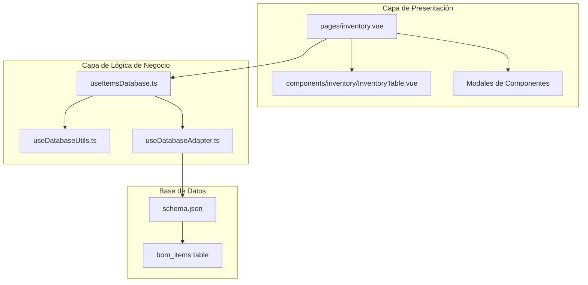
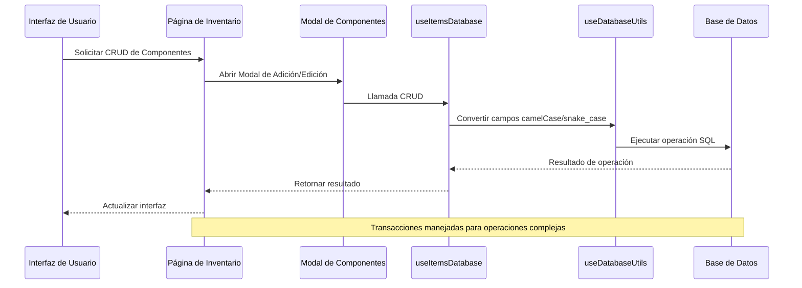
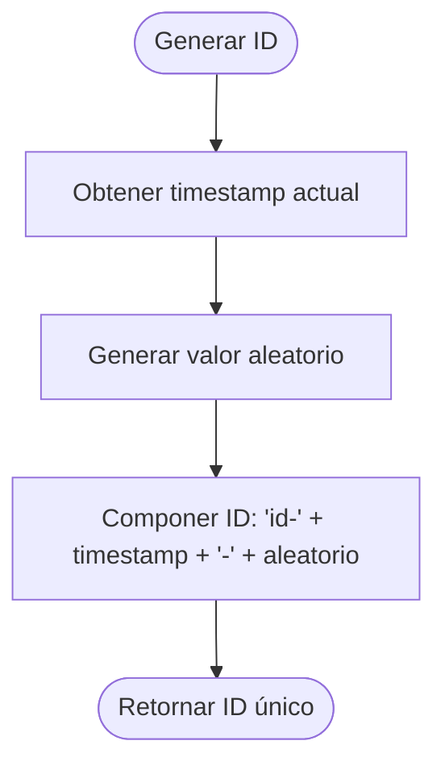
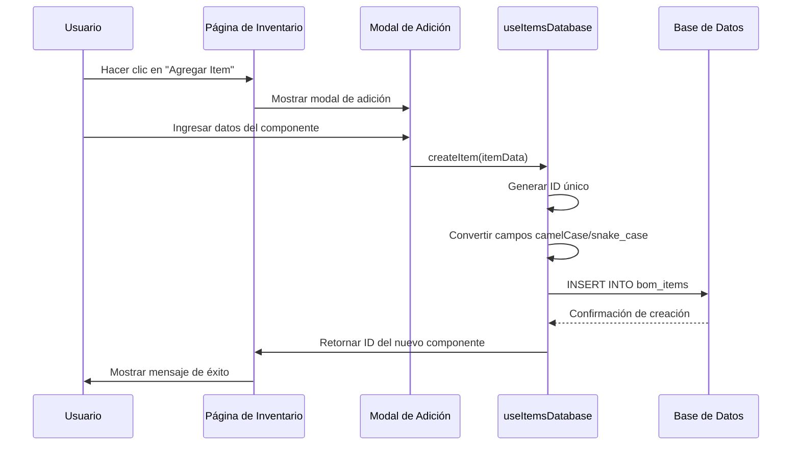
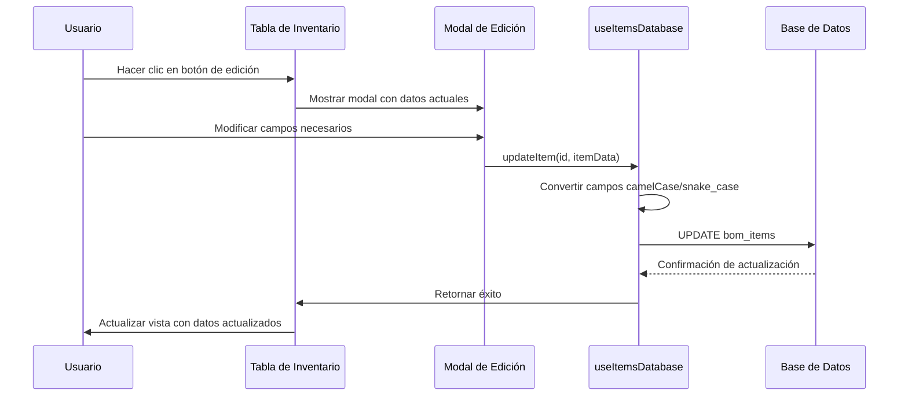
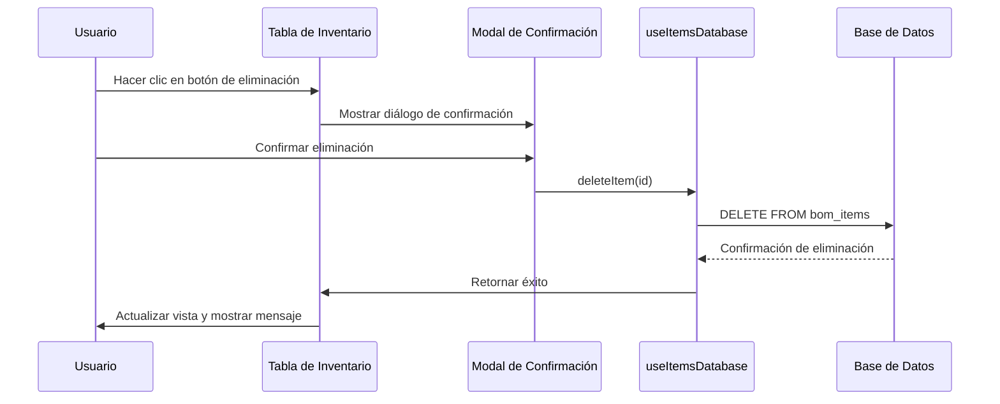
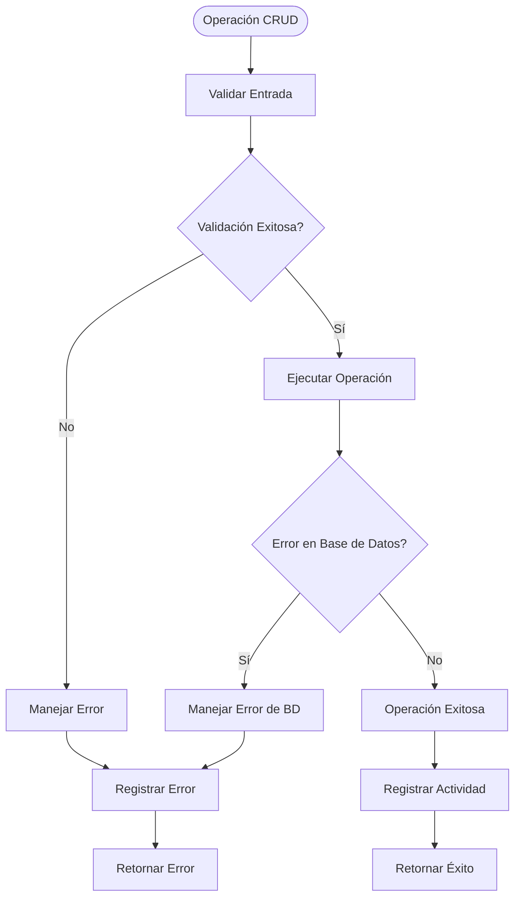

# CRUD de Componentes

<cite>
**Archivos referenciados en este documento**
- [useItemsDatabase.ts](file://composables/useItemsDatabase.ts)
- [InventoryTable.vue](file://components/inventory/InventoryTable.vue)
- [AddItemToInventoryModal.vue](file://components/AddItemToInventoryModal.vue)
- [EditItemInProjectModal.vue](file://components/EditItemInProjectModal.vue)
- [inventory.vue](file://pages/inventory.vue)
- [bom.ts](file://types/bom.ts)
- [schema.json](file://data/db/schema.json)
- [useDatabaseAdapter.ts](file://composables/useDatabaseAdapter.ts)
- [useDatabaseUtils.ts](file://composables/useDatabaseUtils.ts)
</cite>

## Tabla de Contenidos
1. [Introducción](#introducción)
2. [Estructura del Proyecto](#estructura-del-proyecto)
3. [Componentes del CRUD](#componentes-del-crud)
4. [Arquitectura General](#arquitectura-general)
5. [Análisis Detallado de Componentes](#análisis-detallado-de-componentes)
6. [Flujo de Operaciones CRUD](#flujo-de-operaciones-crud)
7. [Validaciones y Reglas de Negocio](#validaciones-y-reglas-de-negocio)
8. [Mejoras de Rendimiento](#mejoras-de-rendimiento)
9. [Guía de Solución de Problemas](#guía-de-solución-de-problemas)
10. [Conclusión](#conclusión)

## Introducción

BOM Manager es una aplicación de gestión de inventario electrónico que permite el control completo de componentes electrónicos a través de un sistema CRUD completo. El sistema está diseñado para manejar el ciclo de vida completo de los componentes desde su registro hasta su eliminación, incluyendo operaciones de actualización de stock, consumo de materiales y seguimiento de actividades.

El CRUD de componentes electrónicos se encuentra en el corazón del sistema, proporcionando funcionalidades avanzadas de gestión de inventario con validaciones robustas, manejo de errores y seguimiento de actividades.

## Estructura del Proyecto

La estructura del proyecto sigue un patrón modular basado en componentes Vue 3 con composables para la lógica de negocio:

**Diagrama fuente**
- [inventory.vue](file://pages/inventory.vue#L1-L630)
- [useItemsDatabase.ts](file://composables/useItemsDatabase.ts#L1-L346)
- [schema.json](file://data/db/schema.json#L1-L37)

**Sección fuente**
- [inventory.vue](file://pages/inventory.vue#L1-L630)
- [useItemsDatabase.ts](file://composables/useItemsDatabase.ts#L1-L346)
- [schema.json](file://data/db/schema.json#L1-L37)

## Componentes del CRUD

### Estructura de Datos del Componente

Los componentes electrónicos siguen una estructura de datos coherente definida en la interfaz BOMItem:

| Campo | Tipo | Descripción | Valores por Defecto |
|-------|------|-------------|-------------------|
| id | string | Identificador único del componente | Generado automáticamente |
| name | string | Nombre del componente | Obligatorio |
| description | string | Descripción detallada | null |
| quantity | number | Cantidad inicial comprada | 0 |
| unit | string | Unidad de medida | "pcs" |
| category | string | Categoría del componente | null |
| supplier | string | Proveedor del componente | null |
| partNumber | string | Número de parte del proveedor | null |
| lcscPart | string | Referencia LCSC | null |
| price | number | Precio unitario | null |
| inStock | number | Stock actual | 0 |
| minStock | number | Stock mínimo recomendado | null |
| notes | string | Notas adicionales | null |
| createdAt | string | Fecha de creación | Timestamp ISO |
| updatedAt | string | Fecha de última actualización | Timestamp ISO |
| manufacturer | string | Fabricante | null |
| package | string | Empaquetado | null |
| customerNo | string | Número de cliente | null |
| rohs | string | Cumplimiento ROHS | null |
| extPrice | number | Precio extendido | null |
| leadTime | number | Tiempo de entrega | null |
| dateCodeLotNo | string | Código de fecha/lote | null |
| status | string | Estado del componente | null |
| pcbDesignation | string | Designación PCB | null |
| itemImage | string | Ruta de imagen | null |

**Sección fuente**
- [bom.ts](file://types/bom.ts#L1-L47)

### Tabla de Inventario

La tabla de inventario presenta los siguientes campos con sus características:

| Columna | Tipo de Dato | Ordenamiento | Filtros | Acciones Disponibles |
|---------|--------------|--------------|---------|---------------------|
| Nombre | Texto | Alfabético | Búsqueda | Edición, Eliminación |
| Descripción | Texto | Alfabético | Búsqueda | - |
| Categoría | Texto | Alfabético | Selector | - |
| Proveedor | Texto | Alfabético | Búsqueda | - |
| LCSC | Texto | Numérico | Búsqueda | Copiar, Vista previa, Compra |
| Precio Unitario | Moneda | Numérico | Búsqueda | - |
| Valor Total | Moneda | Numérico | Búsqueda | - |
| Cantidad Inicial | Número | Numérico | Búsqueda | - |
| Stock Actual | Número | Numérico | Selector (OK/Bajo) | - |
| Stock Mínimo | Número | Numérico | Búsqueda | - |
| Proyecto | Texto | Alfabético | Búsqueda | - |
| Acciones | Botones | - | - | Editar, Eliminar |

**Sección fuente**
- [InventoryTable.vue](file://components/inventory/InventoryTable.vue#L1-L331)

## Arquitectura General

La arquitectura del CRUD sigue un patrón de capas claramente definido:

**Diagrama fuente**
- [useItemsDatabase.ts](file://composables/useItemsDatabase.ts#L1-L346)
- [useDatabaseUtils.ts](file://composables/useDatabaseUtils.ts#L1-L157)
- [inventory.vue](file://pages/inventory.vue#L1-L630)

**Sección fuente**
- [useItemsDatabase.ts](file://composables/useItemsDatabase.ts#L1-L346)
- [useDatabaseAdapter.ts](file://composables/useDatabaseAdapter.ts#L1-L25)

## Análisis Detallado de Componentes

### Composable useItemsDatabase

El composable useItemsDatabase proporciona todas las operaciones CRUD necesarias:

#### Métodos Principales

| Método | Parámetros | Retorno | Descripción |
|--------|------------|---------|-------------|
| getAllItems | - | Promise<any[]> | Obtiene todos los componentes ordenados por fecha de creación descendente |
| getItemById | id: string | Promise<any> | Obtiene un componente específico por ID |
| createItem | item: Partial<BOMItem> | Promise<string \| null> | Crea un nuevo componente |
| updateItem | id: string, item: Partial<BOMItem> | Promise<boolean> | Actualiza un componente existente |
| deleteItem | id: string | Promise<boolean> | Elimina un componente |
| updateItemStock | id: string, newStock: number | Promise<boolean> | Actualiza el stock de un componente |
| consumeStockFromBOM | bomItems: {id: string, quantity: number}[] | Promise<{success: boolean, message: string}> | Descontar stock basado en BOM |
| addStockToItems | stockUpdates: {id: string, quantity: number}[] | Promise<{success: boolean, message: string}> | Agregar stock a múltiples componentes |
| getLowStockItems | - | Promise<any[]> | Obtiene componentes con stock bajo |
| getFilesByItem | itemId: string | Promise<any[]> | Obtiene archivos asociados a un componente |
| getPdfFilesByItem | itemId: string | Promise<any[]> | Obtiene solo archivos PDF asociados |

#### Implementación del ID Único

El sistema genera IDs únicos utilizando un algoritmo basado en timestamps y valores aleatorios:

**Diagrama fuente**
- [useItemsDatabase.ts](file://composables/useItemsDatabase.ts#L9-L11)

**Sección fuente**
- [useItemsDatabase.ts](file://composables/useItemsDatabase.ts#L13-L346)

### Modal de Adición de Componentes

El modal AddItemToInventoryModal proporciona una interfaz completa para la creación de nuevos componentes:

#### Campos del Formulario

| Campo | Tipo | Requerido | Validación | Descripción |
|-------|------|-----------|------------|-------------|
| Nombre del Componente | Texto | Sí | Requerido | Nombre único del componente |
| Unidad | Texto | Sí | Requerido | Unidad de medida (por defecto "pcs") |
| Categoría | Texto | No | Libre | Categoría del componente |
| Proveedor | Texto | No | Libre | Proveedor del componente |
| Número de Parte | Texto | No | Libre | Número de parte del proveedor |
| Parte LCSC | Texto | No | Libre | Referencia LCSC |
| Cantidad | Número | No | >= 0, paso 0.1 | Cantidad inicial comprada |
| Precio ($) | Número | No | >= 0, paso 0.01 | Precio unitario |
| Stock Actual | Número | No | >= 0, paso 0.1 | Stock actual disponible |
| Stock Mínimo | Número | No | >= 0, paso 0.1 | Stock mínimo recomendado |
| Descripción | Texto | No | Libre | Descripción detallada |
| Notas | Texto | No | Libre | Información adicional |

**Sección fuente**
- [AddItemToInventoryModal.vue](file://components/AddItemToInventoryModal.vue#L1-L311)

### Modal de Edición de Componentes

El modal EditItemInProjectModal permite la edición detallada de componentes existentes:

#### Características Especiales

- **Mapeo automático de campos**: Convierte automáticamente entre formatos camelCase y snake_case
- **Validación de cantidades**: La cantidad mínima es 1 para componentes en proyectos
- **Preservación de datos originales**: Mantiene propiedades originales durante la edición

**Sección fuente**
- [EditItemInProjectModal.vue](file://components/EditItemInProjectModal.vue#L1-L242)

### Tabla de Inventario

La tabla InventoryTable.vue proporciona una vista completa del inventario con funcionalidades avanzadas:

#### Características de la Tabla

| Elemento | Funcionalidad | Estado |
|----------|---------------|--------|
| Selección múltiple | Checkbox para seleccionar varios componentes | Habilitado |
| Clasificación de stock | Colores según nivel de stock (verde/amarillo/rojo) | Implementado |
| Acciones rápidas | Botones de edición y eliminación | Disponibles |
| Integración LCSC | Copiar, vista previa y compra directa | Funcional |
| Notificaciones | Feedback visual de operaciones | Implementado |

**Sección fuente**
- [InventoryTable.vue](file://components/inventory/InventoryTable.vue#L1-L331)

## Flujo de Operaciones CRUD

### Creación de Componentes

**Diagrama fuente**
- [useItemsDatabase.ts](file://composables/useItemsDatabase.ts#L52-L105)
- [AddItemToInventoryModal.vue](file://components/AddItemToInventoryModal.vue#L306-L310)

### Actualización de Componentes

**Diagrama fuente**
- [useItemsDatabase.ts](file://composables/useItemsDatabase.ts#L107-L157)
- [EditItemInProjectModal.vue](file://components/EditItemInProjectModal.vue#L202-L213)

### Eliminación de Componentes

**Diagrama fuente**
- [useItemsDatabase.ts](file://composables/useItemsDatabase.ts#L159-L176)
- [inventory.vue](file://pages/inventory.vue#L401-L417)

## Validaciones y Reglas de Negocio

### Validaciones del Formulario

#### Reglas de Validación

| Campo | Regla | Descripción | Mensaje de Error |
|-------|-------|-------------|------------------|
| Nombre del Componente | Requerido | Debe tener contenido | "Nombre del componente es obligatorio" |
| Unidad | Requerido | Debe tener contenido | "Unidad es obligatoria" |
| Cantidad | >= 0 | Solo números positivos | "Cantidad debe ser mayor o igual a cero" |
| Precio | >= 0 | Solo números positivos | "Precio debe ser mayor o igual a cero" |
| Stock Actual | >= 0 | Solo números positivos | "Stock actual debe ser mayor o igual a cero" |
| Stock Mínimo | >= 0 | Solo números positivos | "Stock mínimo debe ser mayor o igual a cero" |
| Cantidad en Proyectos | >= 1 | Para componentes en proyectos | "La cantidad mínima es 1" |

#### Reglas de Negocio

1. **Generación de IDs**: Los IDs son únicos y se generan automáticamente
2. **Campos por Defecto**: Valores predeterminados para campos opcionales
3. **Conversión de Campos**: Automática entre camelCase y snake_case
4. **Control de Stock**: Validación de stock mínimo y actual
5. **Transacciones**: Operaciones complejas se realizan en transacciones

### Manejo de Errores

El sistema implementa un manejo robusto de errores:

**Diagrama fuente**
- [useItemsDatabase.ts](file://composables/useItemsDatabase.ts#L22-L36)

**Sección fuente**
- [useItemsDatabase.ts](file://composables/useItemsDatabase.ts#L1-L346)

## Mejoras de Rendimiento

### Optimizaciones Implementadas

1. **Indexación de Consultas**: Las consultas se optimizan con índices apropiados
2. **Paginación**: Implementación de paginación para grandes volúmenes de datos
3. **Caché de Resultados**: Almacenamiento temporal de resultados frecuentes
4. **Transacciones Atómicas**: Operaciones complejas se ejecutan en transacciones
5. **Conversión Eficiente de Campos**: Optimización en la conversión de nombres de campos

### Recomendaciones de Mejora

1. **Implementar Indexación**: Agregar índices para campos de búsqueda frecuentes
2. **Optimizar Consultas**: Usar consultas más específicas para grandes volúmenes
3. **Carga Perezosa**: Implementar carga diferida para imágenes y archivos pesados
4. **Validación Frontend**: Añadir validación adicional en el frontend
5. **Monitoreo de Rendimiento**: Implementar métricas de rendimiento de consultas

## Guía de Solución de Problemas

### Errores Comunes

| Error | Causa | Solución |
|-------|-------|----------|
| Fallo en conexión a base de datos | Base de datos no disponible | Verificar estado de la base de datos |
| ID duplicado | Generación de ID fallida | Reintentar operación o verificar unicidad |
| Valores inválidos | Datos incorrectos en formulario | Validar datos antes de enviar |
| Transacción fallida | Conflicto de datos | Reintentar operación con bloqueo |
| Conversión de campos | Error en mapeo camelCase/snake_case | Verificar mapeo de campos |

### Diagnóstico de Problemas

1. **Verificar conexión de base de datos**: Revisar estado del adaptador de base de datos
2. **Revisar logs de consola**: Buscar mensajes de error detallados
3. **Validar datos de entrada**: Verificar que todos los campos requeridos estén presentes
4. **Comprobar transacciones**: Asegurarse de que operaciones complejas se completen
5. **Monitorear recursos**: Verificar uso de memoria y CPU

**Sección fuente**
- [useItemsDatabase.ts](file://composables/useItemsDatabase.ts#L34-L50)
- [useDatabaseAdapter.ts](file://composables/useDatabaseAdapter.ts#L1-L25)

## Conclusión

El sistema CRUD de componentes electrónicos en BOM Manager proporciona una solución completa y robusta para la gestión de inventario electrónico. La implementación sigue buenas prácticas de desarrollo con:

- **Arquitectura modular**: Componentes bien definidos y separados
- **Validaciones completas**: Reglas de negocio y validaciones de datos
- **Manejo de errores**: Sistema robusto de manejo de excepciones
- **Seguimiento de actividades**: Registro completo de todas las operaciones
- **Interfaz intuitiva**: Experiencia de usuario optimizada

Las operaciones CRUD están completamente implementadas con soporte para operaciones complejas como el consumo de stock basado en BOM y la gestión de múltiples componentes simultáneamente. La integración con la base de datos es eficiente y segura, con transacciones atómicas para garantizar la integridad de los datos.

Para futuras mejoras, se recomienda implementar indexación adicional, optimización de consultas para grandes volúmenes de datos y validación frontend adicional para mejorar la experiencia del usuario.