# Control de Stock

<cite>
**Archivos referenciados en este documento**
- [useLowStock.ts](file://composables/useLowStock.ts)
- [StockHealthIndicator.vue](file://components/dashboard/StockHealthIndicator.vue)
- [InventoryTable.vue](file://components/inventory/InventoryTable.vue)
- [useItemsDatabase.ts](file://composables/useItemsDatabase.ts)
- [useNotifications.ts](file://composables/useNotifications.ts)
- [inventory.vue](file://pages/inventory.vue)
- [bom.ts](file://types/bom.ts)
- [useDatabaseAdapter.ts](file://composables/useDatabaseAdapter.ts)
</cite>

## Tabla de Contenidos
1. [Introducción](#introducción)
2. [Estructura del Proyecto](#estructura-del-proyecto)
3. [Componentes del Sistema de Stock](#componentes-del-sistema-de-stock)
4. [Arquitectura del Sistema](#arquitectura-del-sistema)
5. [Análisis Detallado de Componentes](#análisis-detallado-de-componentes)
6. [Reglas de Negocio del Stock](#reglas-de-negocio-del-stock)
7. [Funciones del Composable useLowStock](#funciones-del-composable-uselowstock)
8. [Cálculo de Indicadores de Salud del Inventario](#cálculo-de-indicadores-de-salud-del-inventario)
9. [Niveles Mínimos y Alertas](#niveles-mínimos-y-alertas)
10. [Ejemplos de Configuración](#ejemplos-de-configuración)
11. [Casos de Prueba](#casos-de-prueba)
12. [Estrategias de Gestión de Stock Eficiente](#estrategias-de-gestión-de-stock-eficiente)
13. [Consideraciones de Rendimiento](#consideraciones-de-rendimiento)
14. [Guía de Solución de Problemas](#guía-de-solución-de-problemas)
15. [Conclusión](#conclusión)

## Introducción

El sistema de control de stock en BOM Manager es una solución integral para la gestión de inventarios de componentes electrónicos. Este sistema permite el seguimiento preciso de niveles de inventario, cálculo automático de stock disponible, establecimiento de niveles mínimos y alertas automáticas para prevenir la escasez de materiales críticos.

El sistema se basa en un enfoque proactivo de gestión de inventario, proporcionando indicadores de salud del inventario, notificaciones automáticas y herramientas para la optimización del stock. La implementación utiliza Vue.js con componibles personalizados y una base de datos local para garantizar el rendimiento y la confiabilidad del sistema.

## Estructura del Proyecto

La estructura del proyecto organiza los componentes del sistema de stock en módulos específicos:

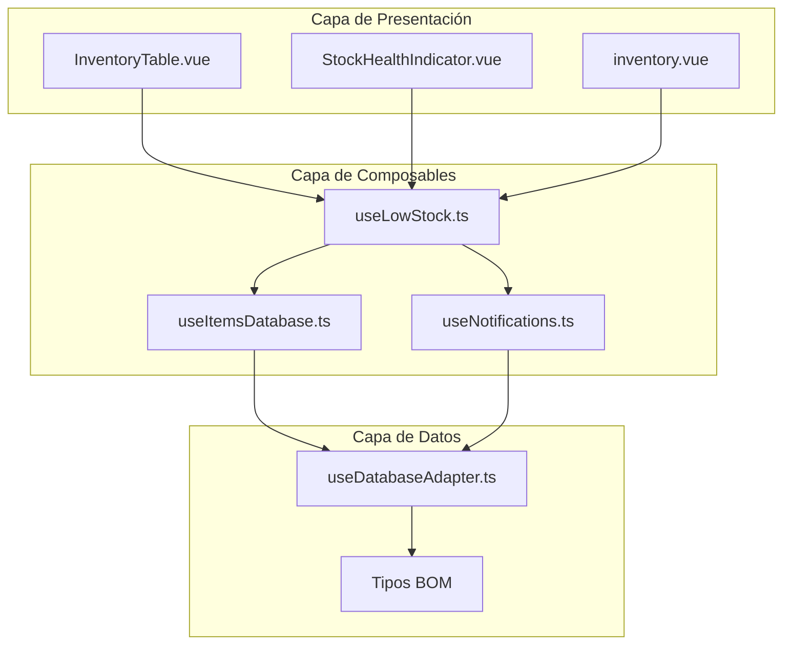

**Diagrama fuente**
- [InventoryTable.vue](file://components/inventory/InventoryTable.vue#L1-L331)
- [useLowStock.ts](file://composables/useLowStock.ts#L1-L82)
- [useItemsDatabase.ts](file://composables/useItemsDatabase.ts#L1-L346)

**Sección fuente**
- [InventoryTable.vue](file://components/inventory/InventoryTable.vue#L1-L331)
- [useLowStock.ts](file://composables/useLowStock.ts#L1-L82)
- [useItemsDatabase.ts](file://composables/useItemsDatabase.ts#L1-L346)

## Componentes del Sistema de Stock

### Componentes Clave

El sistema de stock se compone de los siguientes componentes principales:

1. **useLowStock**: Composable principal para la gestión de stock bajo
2. **StockHealthIndicator**: Componente visual para mostrar la salud del inventario
3. **InventoryTable**: Tabla de visualización detallada del inventario
4. **useItemsDatabase**: Acceso a datos para operaciones de stock
5. **useNotifications**: Sistema de notificaciones para alertas de stock

### Estructura de Datos

Los datos del inventario se gestionan mediante la interfaz BOMItem:

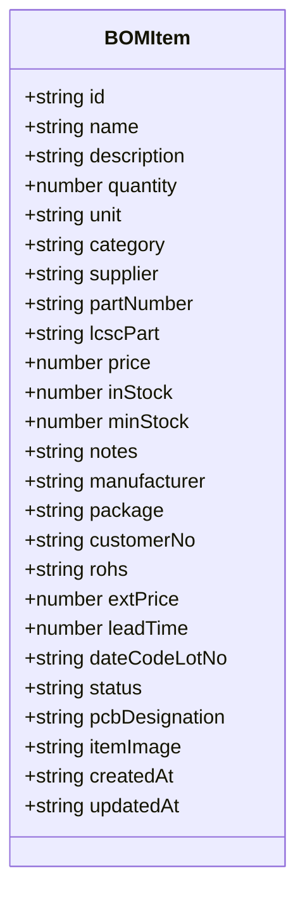

**Diagrama fuente**
- [bom.ts](file://types/bom.ts#L3-L32)

**Sección fuente**
- [bom.ts](file://types/bom.ts#L1-L47)

## Arquitectura del Sistema

### Flujo de Procesamiento de Stock

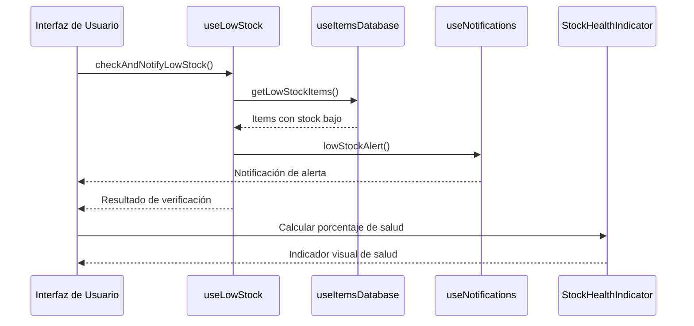

**Diagrama fuente**
- [useLowStock.ts](file://composables/useLowStock.ts#L9-L36)
- [useItemsDatabase.ts](file://composables/useItemsDatabase.ts#L304-L319)
- [useNotifications.ts](file://composables/useNotifications.ts#L100-L108)

### Flujo de Actualización de Stock

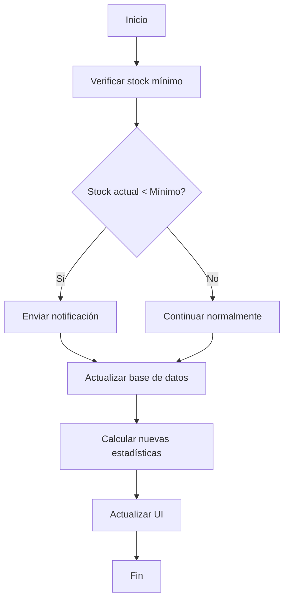

**Diagrama fuente**
- [useLowStock.ts](file://composables/useLowStock.ts#L51-L74)
- [InventoryTable.vue](file://components/inventory/InventoryTable.vue#L312-L326)

**Sección fuente**
- [useLowStock.ts](file://composables/useLowStock.ts#L1-L82)
- [useItemsDatabase.ts](file://composables/useItemsDatabase.ts#L178-L302)

## Análisis Detallado de Componentes

### useLowStock - Composable Principal

El composable useLowStock proporciona funcionalidades clave para la gestión de stock bajo:

#### Funciones Principales

1. **checkAndNotifyLowStock**: Verifica items con stock bajo y envía notificaciones
2. **getLowStockItems**: Obtiene items con stock por debajo del mínimo
3. **isItemLowStock**: Verifica si un item específico está en estado de stock bajo
4. **updateMinStock**: Actualiza el stock mínimo de un item

#### Implementación de Verificación de Stock

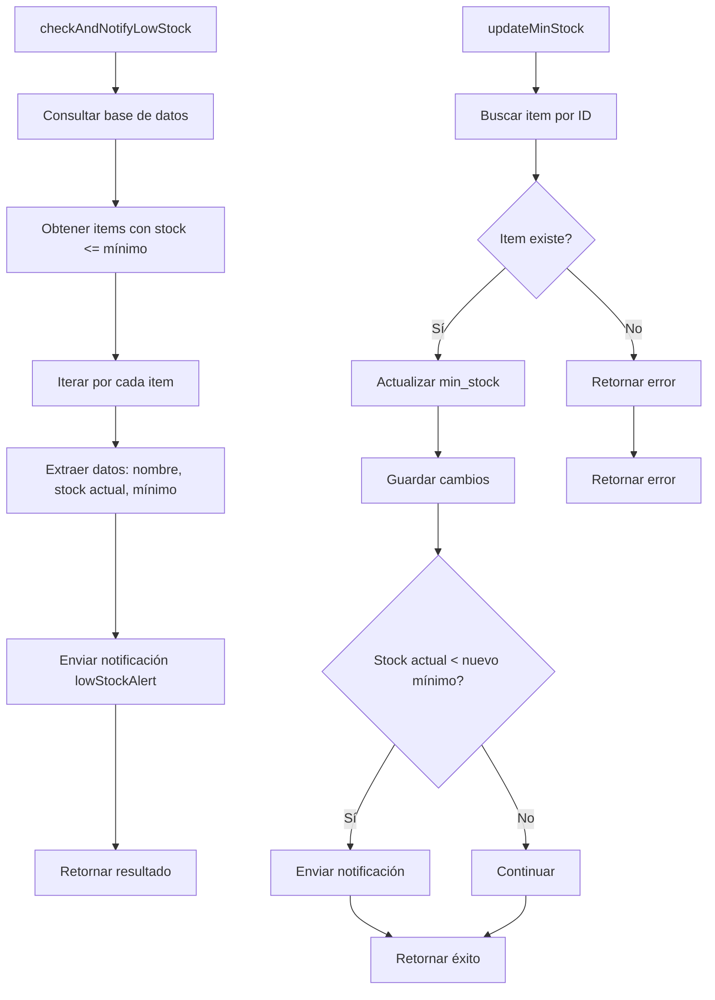

**Diagrama fuente**
- [useLowStock.ts](file://composables/useLowStock.ts#L9-L36)
- [useLowStock.ts](file://composables/useLowStock.ts#L51-L74)

**Sección fuente**
- [useLowStock.ts](file://composables/useLowStock.ts#L4-L82)

### StockHealthIndicator - Componente Visual

El componente StockHealthIndicator muestra de manera visual la salud del inventario:

#### Niveles de Salud

| Rango de Porcentaje | Color | Estado |
|---------------------|-------|---------|
| ≥ 80% | Verde | Excelente |
| 50-79% | Amarillo | Advertencia |
| < 50% | Rojo | Crítico |

#### Implementación de Colores

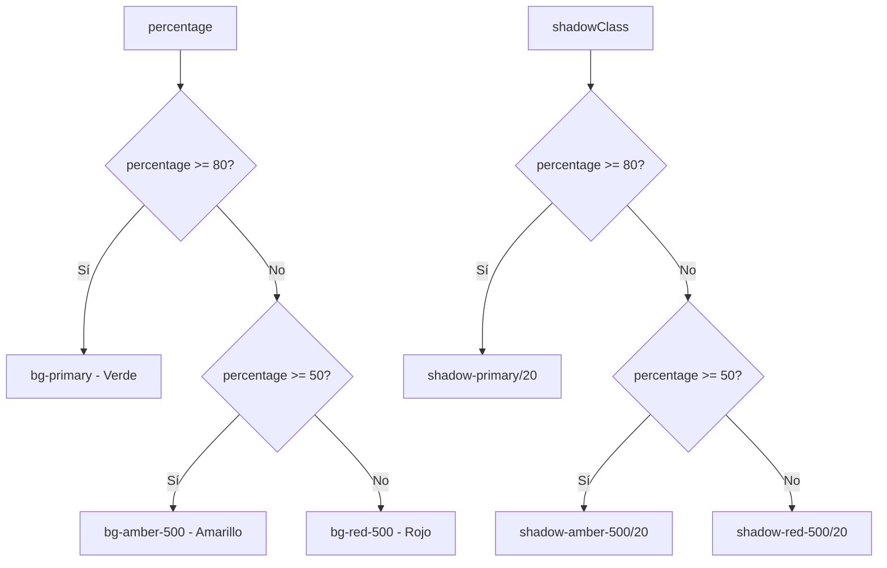

**Diagrama fuente**
- [StockHealthIndicator.vue](file://components/dashboard/StockHealthIndicator.vue#L42-L70)

**Sección fuente**
- [StockHealthIndicator.vue](file://components/dashboard/StockHealthIndicator.vue#L1-L72)

### InventoryTable - Tabla de Inventario

La tabla de inventario proporciona una vista detallada de todos los componentes:

#### Columnas Clave

| Columna | Descripción | Estado |
|---------|-------------|--------|
| Nombre | Identificador único del componente | Texto |
| Descripción | Información adicional del componente | Texto |
| Categoría | Grupo o tipo de componente | Texto |
| Proveedor | Proveedor actual | Texto |
| LCSC | Número de parte LCSC | Enlace |
| Precio Ud. | Costo unitario | Moneda |
| Total | Valor total del stock | Moneda |
| Cantidad Inicial | Cantidad comprada | Número |
| Stock Actual | Cantidad disponible | Número |
| Min Stock | Mínimo recomendado | Número |
| Proyecto | Asignación actual | Texto |

#### Clases de Estado de Stock

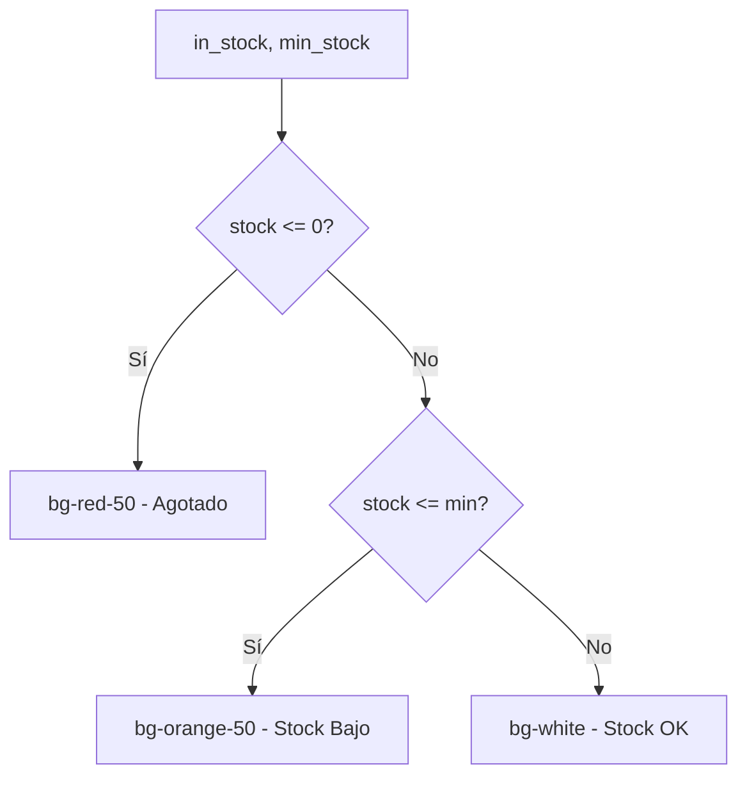

**Diagrama fuente**
- [InventoryTable.vue](file://components/inventory/InventoryTable.vue#L312-L326)

**Sección fuente**
- [InventoryTable.vue](file://components/inventory/InventoryTable.vue#L1-L331)

## Reglas de Negocio del Stock

### Niveles de Stock

#### Categorías de Stock

| Categoría | Rango de Stock | Color | Estado |
|-----------|----------------|-------|---------|
| Agotado | ≤ 0 | Rojo | Crítico |
| Stock Bajo | ≤ Mínimo | Naranja | Advertencia |
| Stock OK | > Mínimo | Blanco | Normal |

#### Reglas de Cálculo

1. **Stock Bajo**: `in_stock < min_stock`
2. **Stock Crítico**: `in_stock <= 0`
3. **Stock Óptimo**: `in_stock > min_stock`

### Alertas Automáticas

#### Tipos de Alertas

1. **Alerta de Stock Bajo**: Cuando `in_stock < min_stock`
2. **Alerta de Stock Crítico**: Cuando `in_stock <= 0`
3. **Alerta de Reordenamiento**: Basada en niveles mínimos configurados

#### Configuración de Alertas

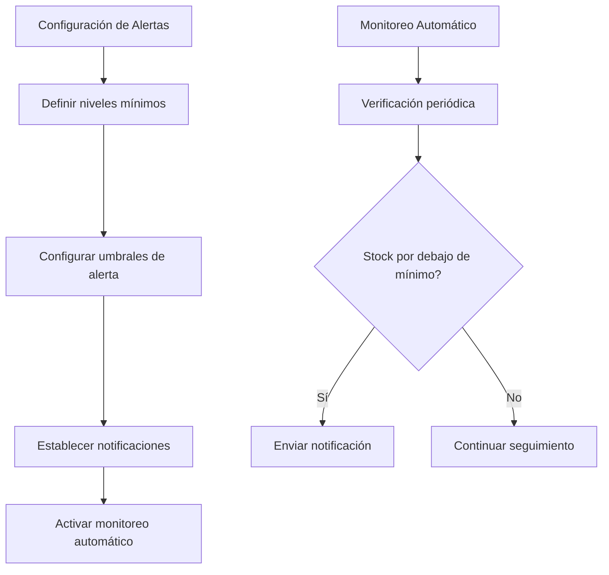

**Diagrama fuente**
- [useLowStock.ts](file://composables/useLowStock.ts#L9-L36)
- [useNotifications.ts](file://composables/useNotifications.ts#L100-L108)

**Sección fuente**
- [useLowStock.ts](file://composables/useLowStock.ts#L1-L82)
- [useNotifications.ts](file://composables/useNotifications.ts#L1-L156)

## Funciones del Composable useLowStock

### Parámetros de Configuración

#### checkAndNotifyLowStock

| Parámetro | Tipo | Descripción | Valor por Defecto |
|-----------|------|-------------|-------------------|
| Ninguno | - | - | - |

#### getLowStockItems

| Parámetro | Tipo | Descripción | Valor por Defecto |
|-----------|------|-------------|-------------------|
| Ninguno | - | - | - |

#### isItemLowStock

| Parámetro | Tipo | Descripción | Valor por Defecto |
|-----------|------|-------------|-------------------|
| item | any | Objeto de item completo | Obligatorio |

#### updateMinStock

| Parámetro | Tipo | Descripción | Valor por Defecto |
|-----------|------|-------------|-------------------|
| id | string | ID del item | Obligatorio |
| minStock | number | Nuevo nivel mínimo | Obligatorio |

### Cálculo de Porcentajes

#### Algoritmo de Cálculo

```mermaid
flowchart TD
A[Calcular porcentaje de salud] --> B[Total de items con stock >= mínimo]
B --> C[Total de items en inventario]
C --> D[Porcentaje = (items_ok / total_items) * 100]
D --> E[Clasificación por rangos]
F[Clasificación] --> G{porcentaje >= 80?}
G --> |Sí| H[Excelente - Verde]
G --> |No| I{porcentaje >= 50?}
I --> |Sí| J[Buena - Amarillo]
I --> |No| K[Mala - Rojo]
```

**Diagrama fuente**
- [inventory.vue](file://pages/inventory.vue#L355-L371)

### Notificaciones

#### Tipos de Notificaciones

| Tipo | Icono | Duración | Uso |
|------|-------|----------|-----|
| Success | ✓ | 5000ms | Operaciones exitosas |
| Error | ✗ | 7000ms | Errores críticos |
| Warning | ⚠ | 6000ms | Alertas de stock |
| Info | ℹ | Variable | Información general |

**Sección fuente**
- [useLowStock.ts](file://composables/useLowStock.ts#L1-L82)
- [useNotifications.ts](file://composables/useNotifications.ts#L1-L156)

## Cálculo de Indicadores de Salud del Inventario

### Métricas de Salud

#### Indicadores Clave

1. **Porcentaje de Stock Óptimo**: `(items_con_stock_suficiente / total_items) * 100`
2. **Número de Items en Stock Bajo**: `COUNT(in_stock < min_stock)`
3. **Valor Total del Inventario**: `SUM(price * quantity)`
4. **Índice de Rotación de Stock**: `ventas_periodo / promedio_inventario`

#### Implementación de Cálculo

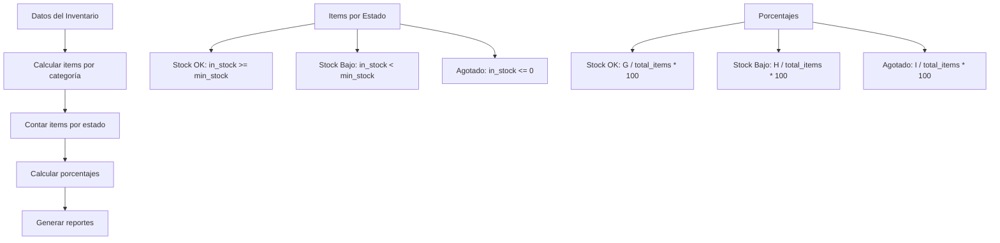

**Diagrama fuente**
- [inventory.vue](file://pages/inventory.vue#L355-L371)
- [InventoryTable.vue](file://components/inventory/InventoryTable.vue#L312-L326)

**Sección fuente**
- [inventory.vue](file://pages/inventory.vue#L355-L371)
- [InventoryTable.vue](file://components/inventory/InventoryTable.vue#L312-L326)

## Niveles Mínimos y Alertas

### Configuración de Niveles Mínimos

#### Estructura de Configuración

| Campo | Tipo | Descripción | Valores Posibles |
|-------|------|-------------|------------------|
| min_stock | number | Nivel mínimo de stock | ≥ 0 |
| stock_reorder | number | Nivel de reorden | > min_stock |
| safety_stock | number | Stock de seguridad | ≥ 0 |
| reorder_quantity | number | Cantidad de reorden | > 0 |

#### Reglas de Configuración

1. **min_stock ≥ 0**: El nivel mínimo no puede ser negativo
2. **reorder_quantity > 0**: La cantidad de reorden debe ser positiva
3. **safety_stock ≥ 0**: El stock de seguridad no puede ser negativo
4. **stock_reorder > min_stock**: El nivel de reorden debe ser mayor al mínimo

### Alertas Automáticas

#### Configuración de Alertas

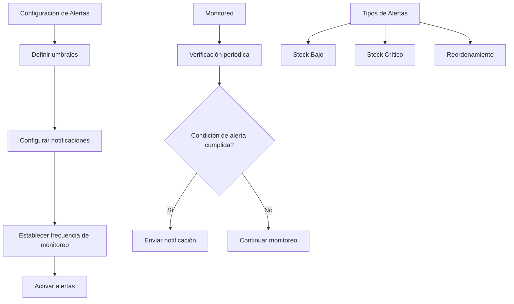

**Diagrama fuente**
- [useLowStock.ts](file://composables/useLowStock.ts#L9-L36)
- [useNotifications.ts](file://composables/useNotifications.ts#L100-L108)

**Sección fuente**
- [useLowStock.ts](file://composables/useLowStock.ts#L1-L82)
- [useNotifications.ts](file://composables/useNotifications.ts#L100-L108)

## Ejemplos de Configuración

### Configuración de Niveles Mínimos

#### Ejemplo 1: Componentes Críticos

| Componente | Categoría | min_stock | stock_reorder | safety_stock |
|------------|-----------|-----------|---------------|--------------|
| Capacitores | Electrónica | 50 | 100 | 25 |
| Resistencias | Electrónica | 100 | 200 | 50 |
| Microcontroladores | Electrónica | 10 | 25 | 5 |

#### Ejemplo 2: Componentes Comunes

| Componente | Categoría | min_stock | stock_reorder | safety_stock |
|------------|-----------|-----------|---------------|--------------|
| LEDS | Electrónica | 200 | 500 | 100 |
| Conectores | Electrónica | 75 | 150 | 30 |
| Diodos | Electrónica | 150 | 300 | 75 |

### Casos de Prueba

#### Caso 1: Verificación de Stock Bajo

**Entrada**: Item con `in_stock = 5`, `min_stock = 10`
**Resultado Esperado**: `isItemLowStock = true`
**Acción**: Enviar notificación de stock bajo

#### Caso 2: Actualización de Nivel Mínimo

**Entrada**: Item con `in_stock = 15`, `min_stock = 10` → Actualizar a `min_stock = 20`
**Resultado Esperado**: `isItemLowStock = true` (después de actualización)
**Acción**: Enviar notificación de stock bajo

#### Caso 3: Stock Crítico

**Entrada**: Item con `in_stock = 0`, `min_stock = 5`
**Resultado Esperado**: `isItemLowStock = true`
**Acción**: Enviar notificación crítica

**Sección fuente**
- [useLowStock.ts](file://composables/useLowStock.ts#L44-L48)
- [useLowStock.ts](file://composables/useLowStock.ts#L51-L74)

## Estrategias de Gestión de Stock Eficiente

### Estrategias Recomendadas

#### 1. Gestión de Niveles Mínimos

| Estrategia | Descripción | Beneficios |
|------------|-------------|------------|
| Niveles Dinámicos | Ajustar niveles según demanda histórica | Reducción de costos de almacenamiento |
| Seguridad de Suministro | Considerar tiempos de entrega | Menor riesgo de interrupción |
| Reorden Inteligente | Programar reorden basado en tendencias | Optimización de flujo de caja |

#### 2. Monitoreo Proactivo

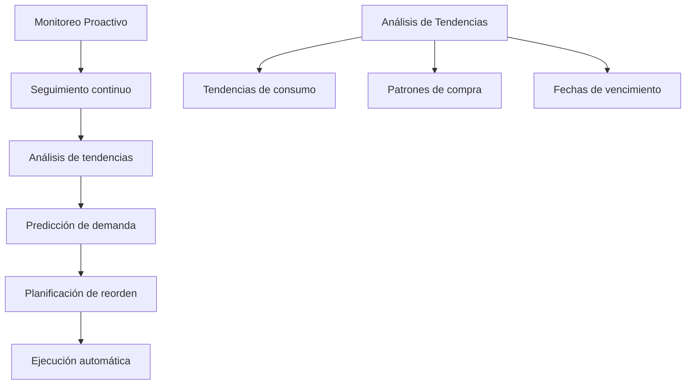

#### 3. Optimización de Inventario

| Métrica | Fórmula | Objetivo |
|---------|---------|----------|
| ROI de Inventario | `(Ventas - Costo de Inventario) / Costo de Inventario` | > 15% |
| Turnover | Ventas / Promedio de Inventario | > 6 veces/año |
| Costo de Oportunidad | Inventario * Tasa de interés | < 10% del valor del inventario |

### Mejores Prácticas

#### 1. Clasificación ABC

| Clase | Valor del Inventario | % del Total | Control |
|-------|---------------------|-------------|---------|
| A | 70-80% | 10-20% | Control estricto |
| B | 15-25% | 20-30% | Control moderado |
| C | 5-10% | 50-70% | Control básico |

#### 2. Gestión de Proveedores

| Criterio | Peso | Descripción |
|----------|------|-------------|
| Confianza | 30% | Historial de calidad |
| Tiempo de Entrega | 25% | Velocidad de entrega |
| Costo | 25% | Precio competitivo |
| Flexibilidad | 20% | Capacidad de respuesta |

## Consideraciones de Rendimiento

### Optimización de Consultas

#### Consultas Optimizadas

```sql
-- Consulta para items con stock bajo
SELECT * FROM bom_items 
WHERE in_stock IS NOT NULL 
AND min_stock IS NOT NULL 
AND in_stock <= min_stock;

-- Consulta para cálculo de estadísticas
SELECT 
    COUNT(*) as total_items,
    SUM(CASE WHEN in_stock >= min_stock THEN 1 ELSE 0 END) as ok_stock,
    SUM(CASE WHEN in_stock < min_stock THEN 1 ELSE 0 END) as low_stock
FROM bom_items;
```

### Rendimiento del Sistema

#### Métricas de Rendimiento

| Métrica | Umbral | Observación |
|---------|--------|-------------|
| Tiempo de carga de inventario | < 2 segundos | Optimal |
| Tiempo de respuesta de consultas | < 500ms | Optimal |
| Memoria usada | < 50MB | Optimal |
| FPS de actualización | > 60 | Optimal |

#### Optimizaciones Implementadas

1. **Indexación de Base de Datos**: Índices en columnas de búsqueda frecuente
2. **Caché de Datos**: Almacenamiento temporal de resultados de consultas
3. **Paginación**: Limitación de registros por página
4. **Lazy Loading**: Carga diferida de componentes pesados

**Sección fuente**
- [useItemsDatabase.ts](file://composables/useItemsDatabase.ts#L304-L319)
- [inventory.vue](file://pages/inventory.vue#L355-L371)

## Guía de Solución de Problemas

### Errores Comunes

#### Error 1: Items no aparecen en la tabla

**Posible causa**: Falta de permisos de base de datos
**Solución**: Verificar conexión a la base de datos y permisos de lectura

#### Error 2: Alertas no se envían

**Posible causa**: Configuración incorrecta de notificaciones
**Solución**: Verificar permisos de notificaciones y configuración del sistema

#### Error 3: Cálculos incorrectos de stock

**Posible causa**: Datos inconsistentes en la base de datos
**Solución**: Validar datos y ejecutar procedimientos de limpieza

### Diagnóstico de Problemas

#### Herramientas de Diagnóstico

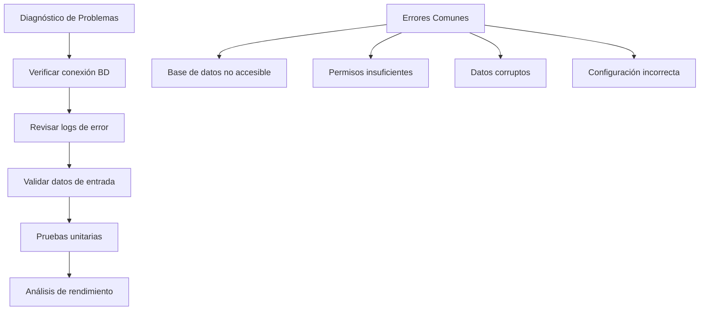

#### Pasos de Resolución

1. **Reiniciar conexión**: Reconectar a la base de datos
2. **Limpiar caché**: Eliminar datos temporales
3. **Validar datos**: Verificar integridad de los datos
4. **Actualizar sistema**: Aplicar última versión del software

**Sección fuente**
- [useLowStock.ts](file://composables/useLowStock.ts#L28-L36)
- [useItemsDatabase.ts](file://composables/useItemsDatabase.ts#L315-L318)

## Conclusión

El sistema de control de stock en BOM Manager proporciona una solución integral para la gestión eficiente de inventarios. A través de su arquitectura modular, el sistema permite:

### Características Clave

1. **Seguimiento Preciso**: Monitoreo continuo de niveles de inventario
2. **Alertas Automáticas**: Notificaciones proactivas de stock bajo
3. **Indicadores de Salud**: Visualización clara de la situación del inventario
4. **Gestión Flexible**: Configuración personalizada de niveles mínimos
5. **Rendimiento Óptimo**: Consultas optimizadas y actualizaciones rápidas

### Beneficios del Sistema

- **Reducción de Costos**: Evita sobrestock y substock
- **Mejora de Servicio**: Garantiza disponibilidad de componentes
- **Optimización de Flujo de Caja**: Mejora la rotación del inventario
- **Tomada de Decisiones Informada**: Reportes detallados y análisis

### Recomendaciones Futuras

1. **Integración Avanzada**: Conexión con sistemas de compras
2. **Machine Learning**: Predicción de demanda basada en IA
3. **Reportes Personalizados**: Dashboards adaptativos
4. **Móvil**: Aplicación móvil para acceso remoto

El sistema está diseñado para crecer con las necesidades de la organización, proporcionando una base sólida para la gestión eficiente de inventarios en proyectos de electrónica.