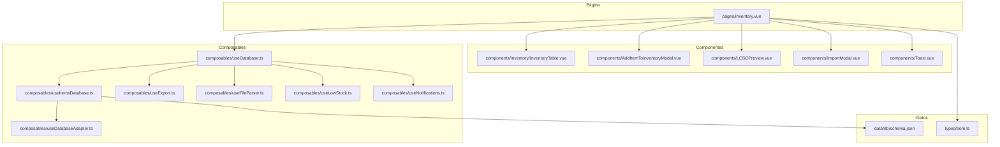
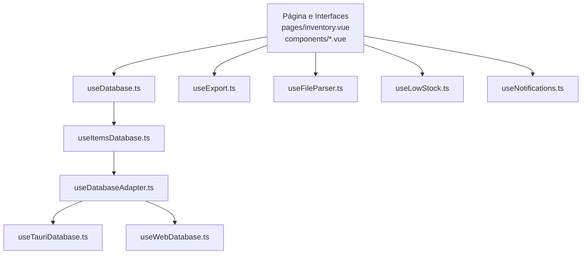
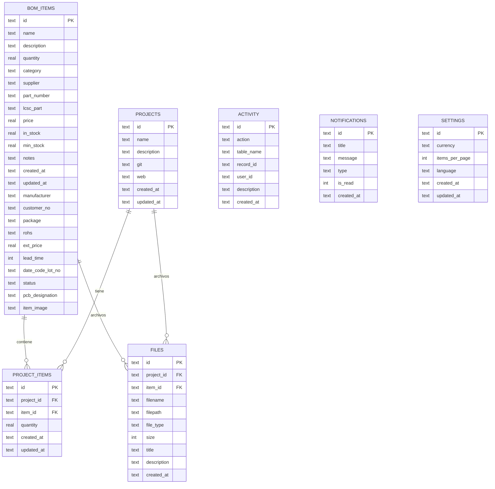
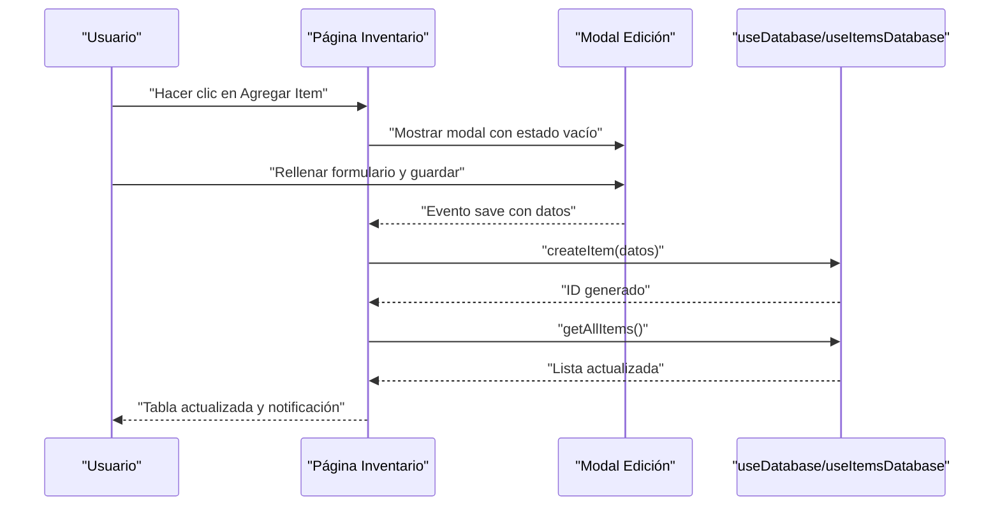
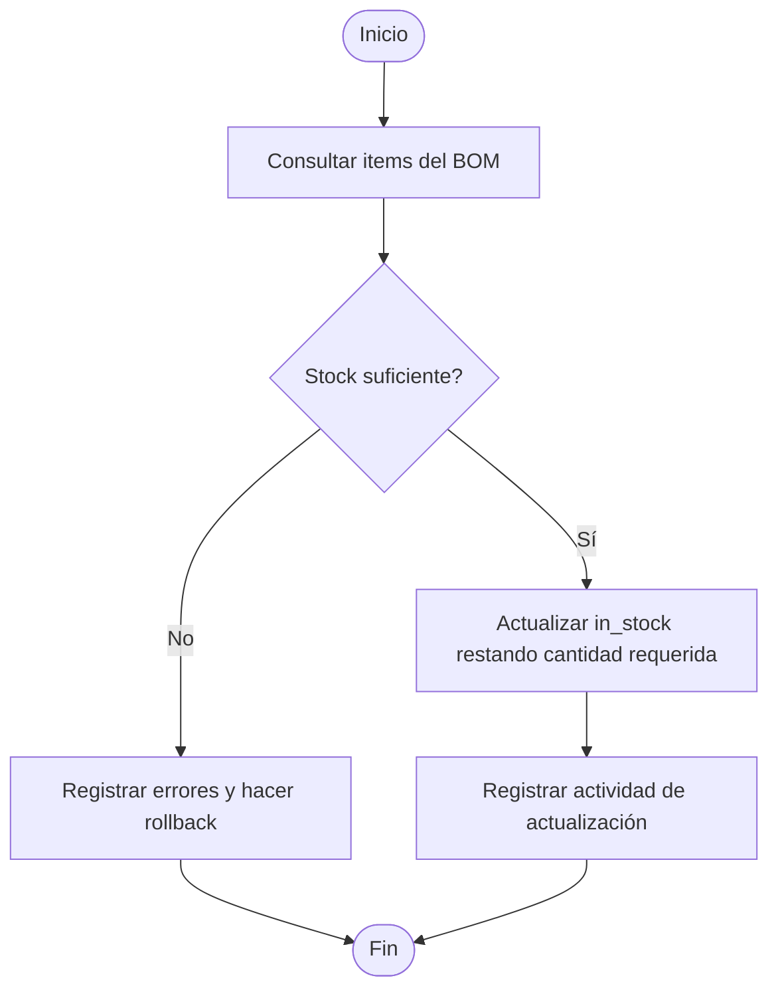
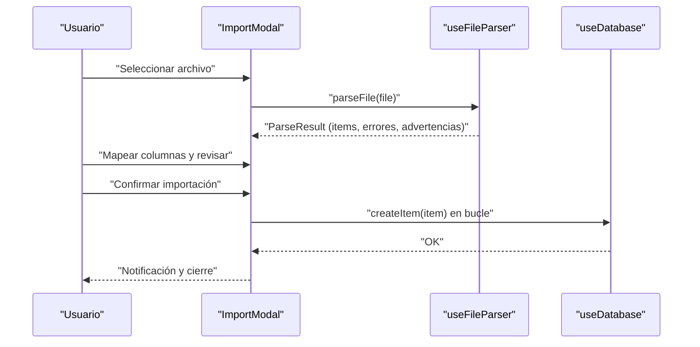
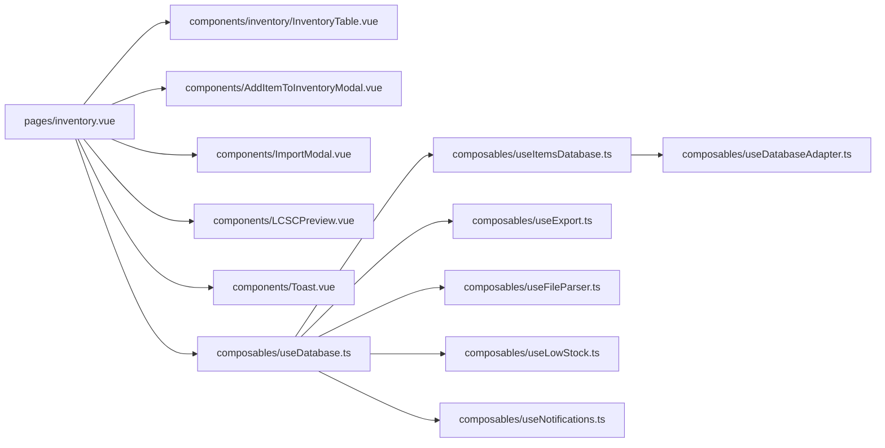

# Gestión de Inventario

<cite>
**Archivos referenciados en este documento**
- [pages/inventory.vue](file://pages/inventory.vue)
- [components/inventory/InventoryTable.vue](file://components/inventory/InventoryTable.vue)
- [components/AddItemToInventoryModal.vue](file://components/AddItemToInventoryModal.vue)
- [components/LCSCPreview.vue](file://components/LCSCPreview.vue)
- [components/ImportModal.vue](file://components/ImportModal.vue)
- [components/Toast.vue](file://components/Toast.vue)
- [composables/useItemsDatabase.ts](file://composables/useItemsDatabase.ts)
- [composables/useDatabase.ts](file://composables/useDatabase.ts)
- [composables/useDatabaseAdapter.ts](file://composables/useDatabaseAdapter.ts)
- [composables/useExport.ts](file://composables/useExport.ts)
- [composables/useFileParser.ts](file://composables/useFileParser.ts)
- [composables/useLowStock.ts](file://composables/useLowStock.ts)
- [composables/useNotifications.ts](file://composables/useNotifications.ts)
- [data/db/schema.json](file://data/db/schema.json)
- [types/bom.ts](file://types/bom.ts)
</cite>

## Índice
1. [Introducción](#introducción)
2. [Estructura del proyecto](#estructura-del-proyecto)
3. [Componentes principales](#componentes-principales)
4. [Arquitectura general](#arquitectura-general)
5. [Análisis detallado de componentes](#análisis-detallado-de-componentes)
6. [Análisis de dependencias](#análisis-de-dependencias)
7. [Consideraciones de rendimiento](#consideraciones-de-rendimiento)
8. [Guía de solución de problemas](#guía-de-solución-de-problemas)
9. [Conclusión](#conclusión)
10. [Apéndices](#apéndices)

## Introducción
Este documento describe la gestión de inventario electrónicamente en BOM Manager, enfocado en el CRUD completo de componentes, control de stock, búsqueda y filtrado avanzado, alertas de stock bajo, cálculo de niveles mínimos, seguimiento de movimientos y la interfaz de usuario asociada. Se explica cómo se estructuran los datos, cómo se validan y persisten, y cómo se presentan en la interfaz con tablas, modales y notificaciones.

## Estructura del proyecto
El módulo de inventario se organiza en páginas, componentes reutilizables, componibles (composables) y tipos de datos. La base de datos es una tabla relacional con campos específicos para componentes electrónicos, incluyendo stock actual, stock mínimo, precios, proveedores y referencias externas.

**Diagrama fuente**
- [pages/inventory.vue](file://pages/inventory.vue#L1-L210)
- [components/inventory/InventoryTable.vue](file://components/inventory/InventoryTable.vue#L1-L170)
- [components/AddItemToInventoryModal.vue](file://components/AddItemToInventoryModal.vue#L1-L120)
- [components/LCSCPreview.vue](file://components/LCSCPreview.vue#L1-L80)
- [components/ImportModal.vue](file://components/ImportModal.vue#L1-L120)
- [components/Toast.vue](file://components/Toast.vue#L1-L70)
- [composables/useDatabaseAdapter.ts](file://composables/useDatabaseAdapter.ts#L1-L25)
- [composables/useDatabase.ts](file://composables/useDatabase.ts#L1-L89)
- [composables/useItemsDatabase.ts](file://composables/useItemsDatabase.ts#L1-L120)
- [composables/useExport.ts](file://composables/useExport.ts#L1-L100)
- [composables/useFileParser.ts](file://composables/useFileParser.ts#L1-L120)
- [composables/useLowStock.ts](file://composables/useLowStock.ts#L1-L40)
- [composables/useNotifications.ts](file://composables/useNotifications.ts#L1-L120)
- [data/db/schema.json](file://data/db/schema.json#L1-L37)
- [types/bom.ts](file://types/bom.ts#L1-L47)

**Sección fuente**
- [pages/inventory.vue](file://pages/inventory.vue#L1-L210)
- [data/db/schema.json](file://data/db/schema.json#L1-L37)
- [types/bom.ts](file://types/bom.ts#L1-L47)

## Componentes principales
- Página de inventario: contiene estadísticas, controles de búsqueda/filtrado, tabla de items, paginación, modales de importación y creación de listas, y notificaciones.
- Tabla de inventario: muestra items con stock actual, stock mínimo, proyecto asociado, acciones de edición/eliminación y acciones de LCSC.
- Modal de edición/agregado: formulario validado con campos para nombre, unidad, categoría, proveedor, número de parte, LCSC, cantidades, precios, stock actual y mínimo.
- Vista previa LCSC: muestra información del componente desde fuentes externas y permite acciones de compra y descarga de datasheet.
- Modal de importación: flujo de tres pasos (upload, mapeo, revisión) con validación y destino (inventario global o proyecto).
- Composables de base de datos: acceso a la base de datos, CRUD de items, actualización de stock, consumo de stock desde BOM, y obtención de items con bajo stock.
- Exportador: exporta inventario a CSV o XLSX.
- Analizador de archivos: parseo de CSV/XLSX con detección automática de columnas y validación Zod.
- Notificaciones: sistema de notificaciones y alertas de stock bajo.
- Bajo stock: cálculo de items por debajo del mínimo y actualización del mismo.

**Sección fuente**
- [pages/inventory.vue](file://pages/inventory.vue#L1-L210)
- [components/inventory/InventoryTable.vue](file://components/inventory/InventoryTable.vue#L1-L170)
- [components/AddItemToInventoryModal.vue](file://components/AddItemToInventoryModal.vue#L1-L120)
- [components/LCSCPreview.vue](file://components/LCSCPreview.vue#L1-L80)
- [components/ImportModal.vue](file://components/ImportModal.vue#L1-L120)
- [composables/useItemsDatabase.ts](file://composables/useItemsDatabase.ts#L1-L120)
- [composables/useExport.ts](file://composables/useExport.ts#L1-L100)
- [composables/useFileParser.ts](file://composables/useFileParser.ts#L1-L120)
- [composables/useLowStock.ts](file://composables/useLowStock.ts#L1-L40)
- [composables/useNotifications.ts](file://composables/useNotifications.ts#L1-L120)

## Arquitectura general
La arquitectura sigue una separación clara entre presentación (páginas y componentes) y lógica de datos (composables). El adaptador de base de datos detecta el entorno (Tauri o Web) y delega operaciones a componibles especializados.

**Diagrama fuente**
- [composables/useDatabase.ts](file://composables/useDatabase.ts#L1-L89)
- [composables/useItemsDatabase.ts](file://composables/useItemsDatabase.ts#L1-L120)
- [composables/useDatabaseAdapter.ts](file://composables/useDatabaseAdapter.ts#L1-L25)

**Sección fuente**
- [composables/useDatabase.ts](file://composables/useDatabase.ts#L1-L89)
- [composables/useItemsDatabase.ts](file://composables/useItemsDatabase.ts#L1-L120)
- [composables/useDatabaseAdapter.ts](file://composables/useDatabaseAdapter.ts#L1-L25)

## Análisis detallado de componentes

### Página de Inventario (CRUD, búsqueda, filtrado, estadísticas)
- Estados y propiedades:
  - Items cargados desde base de datos.
  - Filtros: búsqueda textual, categoría y stock (todos, OK, bajo).
  - Paginación: 100 items por página.
  - Modales: agregar/editar, importar, vista previa LCSC, gestión de listas.
  - Notificaciones: Toast.
- Acciones:
  - Cargar items, guardar/editar, eliminar, importar archivo, crear lista desde selección, exportar inventario, abrir vista previa LCSC y enlace de compra.
- Reglas de negocio:
  - Stock bajo: in_stock < min_stock.
  - Valor total: suma de precio × cantidad.
  - Alertas de stock bajo: notificaciones visuales y de sistema (en entornos compatibles).
- Validaciones:
  - Formulario de edición: campos requeridos y numéricos con pasos decimales.
  - Importación: Zod schema, detección automática de columnas, validación de errores/warnings.

**Sección fuente**
- [pages/inventory.vue](file://pages/inventory.vue#L1-L210)
- [pages/inventory.vue](file://pages/inventory.vue#L211-L630)

### Tabla de Inventario (presentación, acciones, selección múltiple)
- Columnas: nombre, descripción, categoría, proveedor, LCSC, precio unitario, total, cantidad inicial, stock actual, stock mínimo, proyecto, acciones.
- Acciones:
  - Editar, eliminar, copiar LCSC, abrir vista previa LCSC, abrir compra.
  - Eliminar múltiple y asignar a proyecto (modal).
- Indicadores de stock:
  - Clases condicionales según stock actual vs mínimo.
- Selección múltiple:
  - Checkbox global y por fila, con acciones masivas.

**Sección fuente**
- [components/inventory/InventoryTable.vue](file://components/inventory/InventoryTable.vue#L1-L170)
- [components/inventory/InventoryTable.vue](file://components/inventory/InventoryTable.vue#L171-L331)

### Modal de Edición/Agregado de Componente
- Campos:
  - Nombre, unidad, categoría, proveedor, número de parte, LCSC, cantidad, precio, stock actual, stock mínimo, descripción, notas.
- Validaciones:
  - Requeridos y numéricos con pasos decimales.
  - Sincronización con edición de items existentes.
- Eventos:
  - Emisión de cierre y guardado al padre.

**Sección fuente**
- [components/AddItemToInventoryModal.vue](file://components/AddItemToInventoryModal.vue#L1-L120)
- [components/AddItemToInventoryModal.vue](file://components/AddItemToInventoryModal.vue#L121-L311)

### Vista Previa LCSC
- Funcionalidad:
  - Búsqueda de componente, carga de imágenes, parámetros, datasheet y enlace de compra.
  - Manejo de errores de imagen y apertura de PDF desde base64 o URL remota.
- Eventos:
  - Cerrar modal.

**Sección fuente**
- [components/LCSCPreview.vue](file://components/LCSCPreview.vue#L1-L150)
- [components/LCSCPreview.vue](file://components/LCSCPreview.vue#L151-L230)

### Modal de Importación
- Flujo de 3 pasos:
  - Paso 1: Upload de archivo CSV/XLSX.
  - Paso 2: Mapeo automático de columnas y selección de filas.
  - Paso 3: Revisión, destino (global o proyecto) y confirmación.
- Validaciones:
  - Detección automática de columnas, Zod schema, errores/warnings.
- Persistencia:
  - Conversión a snake_case antes de insertar en base de datos.

**Sección fuente**
- [components/ImportModal.vue](file://components/ImportModal.vue#L1-L200)
- [components/ImportModal.vue](file://components/ImportModal.vue#L200-L500)
- [components/ImportModal.vue](file://components/ImportModal.vue#L500-L756)

### Composables de Base de Datos
- Operaciones CRUD:
  - Obtener todos, obtener por ID, crear, actualizar, eliminar.
- Stock:
  - Actualización directa de in_stock.
  - Consumo de stock desde BOM (transacción, rollback si hay errores).
  - Adición de stock (transacción).
- Bajo stock:
  - Consulta de items donde in_stock <= min_stock.
- Adaptador:
  - Detección de entorno Tauri/Web y obtención de base de datos.

**Sección fuente**
- [composables/useItemsDatabase.ts](file://composables/useItemsDatabase.ts#L1-L120)
- [composables/useItemsDatabase.ts](file://composables/useItemsDatabase.ts#L121-L250)
- [composables/useItemsDatabase.ts](file://composables/useItemsDatabase.ts#L250-L346)
- [composables/useDatabaseAdapter.ts](file://composables/useDatabaseAdapter.ts#L1-L25)

### Exportador de Inventario
- Exporta a CSV o XLSX con encabezados específicos.
- Genera nombre de archivo con fecha actual.

**Sección fuente**
- [composables/useExport.ts](file://composables/useExport.ts#L1-L100)
- [composables/useExport.ts](file://composables/useExport.ts#L100-L184)

### Analizador de Archivos
- Parseo CSV/XLSX con detección automática de columnas.
- Mapeo a campos BOMItem con Zod schema.
- Manejo de errores y advertencias.

**Sección fuente**
- [composables/useFileParser.ts](file://composables/useFileParser.ts#L1-L120)
- [composables/useFileParser.ts](file://composables/useFileParser.ts#L120-L250)
- [composables/useFileParser.ts](file://composables/useFileParser.ts#L250-L422)

### Notificaciones y Alertas de Stock Bajo
- Sistema de notificaciones con tipos y duración.
- Alerta de stock bajo con título y mensaje personalizado.
- Verificación de items con bajo stock y posibilidad de notificación del sistema operativo (Tauri).

**Sección fuente**
- [composables/useNotifications.ts](file://composables/useNotifications.ts#L1-L120)
- [composables/useNotifications.ts](file://composables/useNotifications.ts#L120-L156)
- [composables/useLowStock.ts](file://composables/useLowStock.ts#L1-L82)

## Arquitectura de datos

### Esquema de la base de datos
- Tabla principal: bom_items con campos para nombre, descripción, cantidad, categoría, proveedor, número de parte, LCSC, precio, stock actual, stock mínimo, notas, fechas de creación/actualización, y otros campos técnicos.
- Relaciones:
  - project_items vincula proyectos con items.
  - files puede estar asociado a items o proyectos.
  - activity registra actividades de usuario.
  - notifications almacena notificaciones.
  - settings almacena configuraciones globales.

**Diagrama fuente**
- [data/db/schema.json](file://data/db/schema.json#L1-L37)

**Sección fuente**
- [data/db/schema.json](file://data/db/schema.json#L1-L37)

## Flujo de trabajo: CRUD de componentes

**Diagrama fuente**
- [pages/inventory.vue](file://pages/inventory.vue#L370-L466)
- [components/AddItemToInventoryModal.vue](file://components/AddItemToInventoryModal.vue#L240-L311)
- [composables/useItemsDatabase.ts](file://composables/useItemsDatabase.ts#L52-L105)

**Sección fuente**
- [pages/inventory.vue](file://pages/inventory.vue#L370-L466)
- [components/AddItemToInventoryModal.vue](file://components/AddItemToInventoryModal.vue#L240-L311)
- [composables/useItemsDatabase.ts](file://composables/useItemsDatabase.ts#L52-L105)

## Flujo de trabajo: Control de stock y consumo desde BOM

**Diagrama fuente**
- [composables/useItemsDatabase.ts](file://composables/useItemsDatabase.ts#L201-L252)

**Sección fuente**
- [composables/useItemsDatabase.ts](file://composables/useItemsDatabase.ts#L201-L252)

## Flujo de trabajo: Importación de archivo

**Diagrama fuente**
- [components/ImportModal.vue](file://components/ImportModal.vue#L1-L200)
- [composables/useFileParser.ts](file://composables/useFileParser.ts#L1-L120)
- [composables/useItemsDatabase.ts](file://composables/useItemsDatabase.ts#L52-L105)

**Sección fuente**
- [components/ImportModal.vue](file://components/ImportModal.vue#L1-L200)
- [composables/useFileParser.ts](file://composables/useFileParser.ts#L1-L120)
- [composables/useItemsDatabase.ts](file://composables/useItemsDatabase.ts#L52-L105)

## Análisis de dependencias

**Diagrama fuente**
- [pages/inventory.vue](file://pages/inventory.vue#L1-L210)
- [components/inventory/InventoryTable.vue](file://components/inventory/InventoryTable.vue#L1-L170)
- [components/AddItemToInventoryModal.vue](file://components/AddItemToInventoryModal.vue#L1-L120)
- [components/ImportModal.vue](file://components/ImportModal.vue#L1-L120)
- [components/LCSCPreview.vue](file://components/LCSCPreview.vue#L1-L80)
- [components/Toast.vue](file://components/Toast.vue#L1-L70)
- [composables/useDatabase.ts](file://composables/useDatabase.ts#L1-L89)
- [composables/useItemsDatabase.ts](file://composables/useItemsDatabase.ts#L1-L120)
- [composables/useExport.ts](file://composables/useExport.ts#L1-L100)
- [composables/useFileParser.ts](file://composables/useFileParser.ts#L1-L120)
- [composables/useLowStock.ts](file://composables/useLowStock.ts#L1-L82)
- [composables/useNotifications.ts](file://composables/useNotifications.ts#L1-L120)
- [composables/useDatabaseAdapter.ts](file://composables/useDatabaseAdapter.ts#L1-L25)

**Sección fuente**
- [pages/inventory.vue](file://pages/inventory.vue#L1-L210)
- [composables/useDatabase.ts](file://composables/useDatabase.ts#L1-L89)

## Consideraciones de rendimiento
- Paginación: se aplica paginación de 100 items por página en la vista principal.
- Filtrado y búsqueda: se realiza en memoria en la página de inventario; para grandes volúmenes, considerar paginación + búsqueda en backend.
- Transacciones de stock: se usan transacciones al consumir o agregar stock, lo cual mejora consistencia y evita errores parciales.
- Exportación: se recomienda limitar el tamaño de exportación o dividir en lotes si se espera grandes volúmenes.

[No secciones fuentes adicionales]

## Guía de solución de problemas
- Importación sin datos:
  - Verificar que se detecten columnas esenciales (nombre, cantidad) y que haya filas válidas.
- Errores de importación:
  - Revisar mensajes de error/warning del parseo y corregir valores numéricos o campos faltantes.
- Stock negativo al consumir:
  - El sistema evita stock negativo y reporta errores; revisar las cantidades requeridas vs stock disponible.
- Alertas de stock bajo:
  - Asegurarse de tener stock mínimo definido; las notificaciones se disparan cuando in_stock < min_stock.
- Notificaciones de sistema:
  - En entornos Tauri, verificar permisos de notificaciones.

**Sección fuente**
- [components/ImportModal.vue](file://components/ImportModal.vue#L1-L200)
- [composables/useFileParser.ts](file://composables/useFileParser.ts#L1-L120)
- [composables/useItemsDatabase.ts](file://composables/useItemsDatabase.ts#L201-L252)
- [composables/useLowStock.ts](file://composables/useLowStock.ts#L1-L82)
- [composables/useNotifications.ts](file://composables/useNotifications.ts#L120-L156)

## Conclusión
La gestión de inventario en BOM Manager ofrece un flujo completo de trabajo: edición, búsqueda, filtrado, control de stock, importación/exportación, y notificaciones. La arquitectura modular facilita mantenimiento y expansión, mientras que las validaciones y transacciones garantizan integridad de datos. Las alertas de stock bajo ayudan a mantener niveles óptimos de existencias.

[No secciones fuentes adicionales]

## Apéndices

### Reglas de negocio resumidas
- Stock bajo: in_stock < min_stock.
- Stock mínimo editable; al actualizarlo, se notifica si el stock actual está por debajo del nuevo valor.
- Consumo de stock desde BOM: se resta cantidad requerida, con rollback si no hay suficiente.
- Adición de stock: se incrementa in_stock en la cantidad especificada.
- Exportación: se generan archivos con encabezados específicos.

**Sección fuente**
- [composables/useLowStock.ts](file://composables/useLowStock.ts#L43-L82)
- [composables/useItemsDatabase.ts](file://composables/useItemsDatabase.ts#L201-L302)
- [composables/useExport.ts](file://composables/useExport.ts#L100-L184)

### Interfaz de usuario y eventos
- Página de inventario:
  - Eventos: edit-item, delete-item, delete-selected-items, open-lcsc-preview, open-lcsc-purchase, items-assigned-to-project.
  - Propiedades: items (array), showAddModal, showImportModal, showListsManagement, showListManager, showLCSCPreview, showToast, toastType, toastMessage.
- Tabla de inventario:
  - Eventos: edit-item, remove-item, remove-items, open-lcsc-preview, open-lcsc-purchase, add-first-item, delete-item, delete-selected-items, items-assigned-to-project.
  - Propiedades: items (array), showSelect (bool).
- Modal de edición:
  - Eventos: close, save.
  - Propiedades: show, editingItem.
- Vista previa LCSC:
  - Eventos: close.
  - Propiedades: show, partNumber, itemId.
- Importación:
  - Eventos: close, file-selected, error, import-completed, notification.
  - Propiedades: show, projectId.

**Sección fuente**
- [pages/inventory.vue](file://pages/inventory.vue#L140-L173)
- [components/inventory/InventoryTable.vue](file://components/inventory/InventoryTable.vue#L170-L231)
- [components/AddItemToInventoryModal.vue](file://components/AddItemToInventoryModal.vue#L198-L246)
- [components/LCSCPreview.vue](file://components/LCSCPreview.vue#L152-L166)
- [components/ImportModal.vue](file://components/ImportModal.vue#L285-L296)

### Ejemplos prácticos de uso
- Agregar un nuevo componente:
  - Abrir modal de edición, completar campos, guardar. El sistema crea el registro y actualiza la tabla.
- Editar stock:
  - Desde la tabla, usar acciones de consumo o adición (si se exponen en la UI) o mediante comandos de base de datos.
- Importar desde archivo:
  - Seleccionar archivo, mapear columnas, revisar errores, confirmar destino (global o proyecto).
- Crear lista desde selección:
  - Seleccionar items en la tabla, usar botón de crear lista y guardar desde el modal de gestión.

**Sección fuente**
- [pages/inventory.vue](file://pages/inventory.vue#L370-L466)
- [components/ImportModal.vue](file://components/ImportModal.vue#L500-L756)
- [components/inventory/InventoryTable.vue](file://components/inventory/InventoryTable.vue#L140-L170)

### Casos de prueba sugeridos
- CRUD básico: crear, leer, actualizar, eliminar un item; verificar actualización de estadísticas.
- Búsqueda y filtrado: buscar por nombre/categoría/proveedor, aplicar filtro de stock bajo y OK.
- Importación: CSV/XLSX con columnas variadas, valores inválidos, sin columnas esenciales.
- Stock: consumir más del disponible, agregar stock negativo, actualizar stock mínimo.
- Exportación: exportar todo, exportar con datos vacíos.

**Sección fuente**
- [composables/useFileParser.ts](file://composables/useFileParser.ts#L1-L120)
- [composables/useItemsDatabase.ts](file://composables/useItemsDatabase.ts#L201-L302)
- [composables/useExport.ts](file://composables/useExport.ts#L1-L100)

### Mejores prácticas
- Definir siempre un stock mínimo razonable.
- Utilizar importación masiva con revisión previa.
- Realizar exportaciones periódicas para respaldo.
- Usar LCSC como referencia para verificación de precios y disponibilidad.
- Mantener actualizado el campo de notas para contexto adicional.

[No secciones fuentes adicionales]