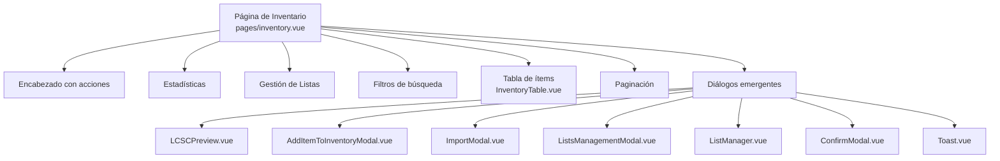
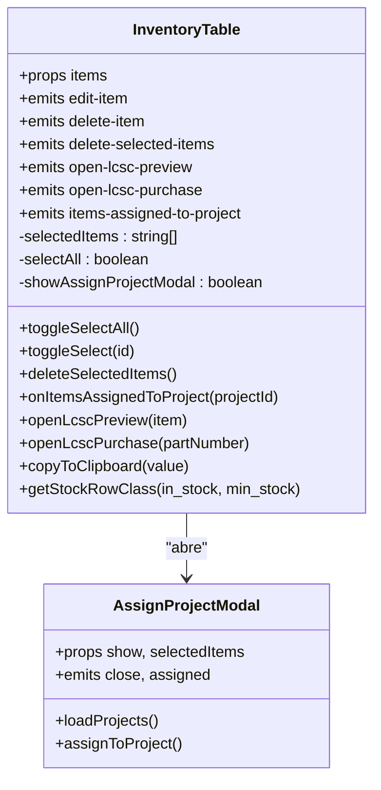
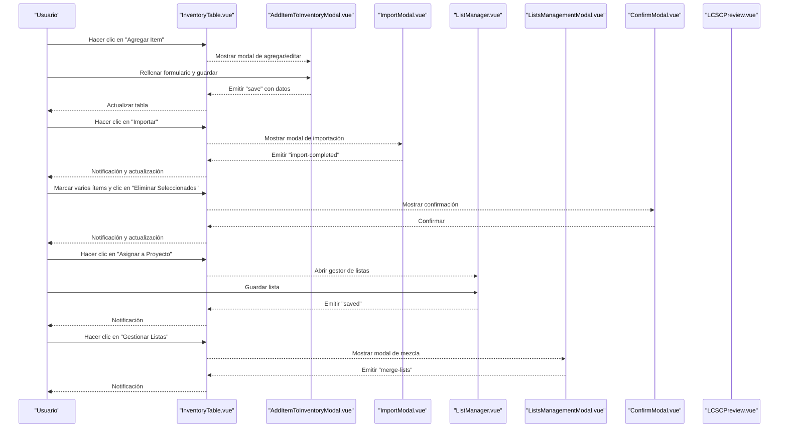
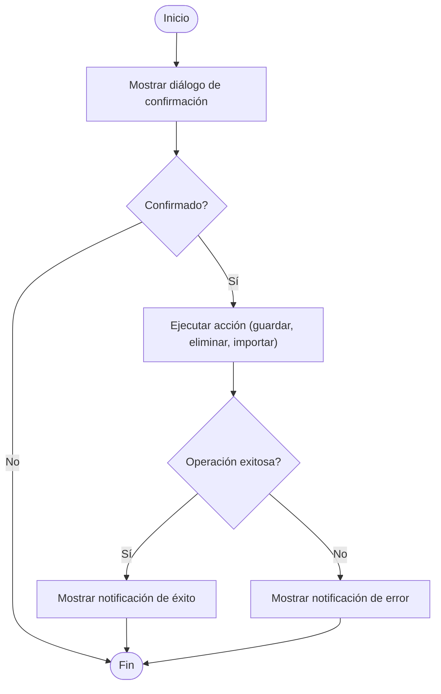
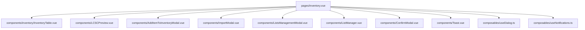

# Interfaz de Usuario de Inventario

<cite>
**Archivos referenciados en este documento**
- [pages/inventory.vue](file://pages/inventory.vue)
- [components/inventory/InventoryTable.vue](file://components/inventory/InventoryTable.vue)
- [components/AddItemToInventoryModal.vue](file://components/AddItemToInventoryModal.vue)
- [components/ConfirmModal.vue](file://components/ConfirmModal.vue)
- [components/ImportModal.vue](file://components/ImportModal.vue)
- [components/LCSCPreview.vue](file://components/LCSCPreview.vue)
- [components/AssignProjectModal.vue](file://components/AssignProjectModal.vue)
- [components/ListManager.vue](file://components/ListManager.vue)
- [components/ListsManagementModal.vue](file://components/ListsManagementModal.vue)
- [components/Toast.vue](file://components/Toast.vue)
- [layouts/default.vue](file://layouts/default.vue)
- [assets/css/app.css](file://assets/css/app.css)
- [composables/useDialog.ts](file://composables/useDialog.ts)
- [composables/useNotifications.ts](file://composables/useNotifications.ts)
</cite>

## Índice
1. [Introducción](#introducción)
2. [Estructura de la página de inventario](#estructura-de-la-página-de-inventario)
3. [Diseño responsive y navegación](#diseño-responsive-y-navegación)
4. [Componente InventoryTable](#componente-inventorytable)
5. [Modales de interacción](#modales-de-interacción)
6. [Manejo de estados de carga, errores y retroalimentación](#manejo-de-estados-de-carga-errores-y-retroalimentación)
7. [Accesibilidad e internacionalización](#accesibilidad-e-internacionalización)
8. [Ejemplos de uso y directrices UX](#ejemplos-de-uso-y-directrices-ux)
9. [Arquitectura general de la interfaz](#arquitectura-general-de-la-interfaz)
10. [Anexo: Columnas y acciones del inventario](#anexo-columnas-y-acciones-del-inventario)

## Introducción
Este documento describe la interfaz de usuario completa para la gestión de inventario, centrada en la página de inventario, su estructura, el componente de tabla de ítems, los modales de interacción, el manejo de estados y retroalimentación al usuario, así como aspectos de diseño responsive, accesibilidad e internacionalización. Se enfoca en cómo se presentan los datos, cómo se filtran y se muestran, cómo se gestionan las acciones de edición, eliminación, importación y asignación a proyectos, y cómo se comunican los resultados al usuario mediante notificaciones y diálogos.

## Estructura de la página de inventario
La página de inventario organiza su contenido en bloques bien definidos:
- Encabezado con acciones principales: importar, crear lista, exportar, agregar ítem.
- Estadísticas resumidas: total de ítems, stock OK, stock bajo y valor total.
- Gestión de listas: botón para administrar listas guardadas.
- Filtros de búsqueda: texto libre, categoría y estado de stock.
- Tabla de ítems paginada con columnas clave y acciones.
- Paginación inferior.

**Diagrama fuente**
- [pages/inventory.vue](file://pages/inventory.vue#L1-L209)
- [components/inventory/InventoryTable.vue](file://components/inventory/InventoryTable.vue#L1-L172)
- [components/LCSCPreview.vue](file://components/LCSCPreview.vue#L1-L150)
- [components/AddItemToInventoryModal.vue](file://components/AddItemToInventoryModal.vue#L1-L196)
- [components/ImportModal.vue](file://components/ImportModal.vue#L1-L269)
- [components/ListsManagementModal.vue](file://components/ListsManagementModal.vue#L1-L95)
- [components/ListManager.vue](file://components/ListManager.vue#L1-L181)
- [components/ConfirmModal.vue](file://components/ConfirmModal.vue#L1-L65)
- [components/Toast.vue](file://components/Toast.vue#L1-L71)

**Sección fuente**
- [pages/inventory.vue](file://pages/inventory.vue#L1-L209)

## Diseño responsive y navegación
- La barra lateral ofrece acceso rápido a Home, Inventario y Proyectos, con iconografía clara y estado activo basado en rutas.
- El contenido principal se despliega a la derecha de la barra lateral y se adapta a distintos anchos de pantalla.
- Los controles de búsqueda y filtros se disponen en una sola columna en móviles y se expanden horizontalmente en pantallas medianas y grandes.
- Las tablas y formularios usan clases de espaciado y sombras que se mantienen en diferentes tamaños de pantalla.

**Sección fuente**
- [layouts/default.vue](file://layouts/default.vue#L1-L57)
- [assets/css/app.css](file://assets/css/app.css#L1-L66)

## Componente InventoryTable
El componente InventoryTable presenta los ítems en una tabla con las siguientes características:
- Columnas: nombre, descripción, categoría, proveedor, parte LCSC, precio unitario, valor total, cantidad inicial, stock actual, stock mínimo, proyecto, acciones.
- Selección múltiple: checkbox en la primera columna, con opción de seleccionar todo y comportamiento sincronizado entre “seleccionar todo” y la lista de seleccionados.
- Acciones por ítem: edición y eliminación.
- Acciones masivas: al seleccionar varios ítems, se muestra una barra de acciones con botones para eliminar seleccionados y asignar a proyecto.
- Integración con LCSC: acciones de copiar parte LCSC, abrir vista previa y abrir sitio de compra.
- Indicadores de stock: color de fila basado en stock actual vs. mínimo.
- Modales secundarios: Asignar a Proyecto.

**Diagrama fuente**
- [components/inventory/InventoryTable.vue](file://components/inventory/InventoryTable.vue#L1-L172)
- [components/AssignProjectModal.vue](file://components/AssignProjectModal.vue#L1-L159)

**Sección fuente**
- [components/inventory/InventoryTable.vue](file://components/inventory/InventoryTable.vue#L1-L331)

## Modales de interacción
- Vista previa LCSC: permite ver información detallada del componente, imágenes, parámetros, datasheet y enlaces de compra. Maneja errores de carga y descarga de PDFs base64.
- Agregar/Editar ítem: formulario completo con campos de texto, números y selects, con validaciones requeridas y actualización automática al cambiar ítem en edición.
- Importar archivo: flujo de tres pasos: upload, mapeo de columnas, revisión y confirmación. Permite elegir destino (inventario global o proyecto) y muestra errores y advertencias.
- Administrar listas: permite mezclar varias listas y generar una nueva combinada.
- Crear lista desde selección: abre el gestor de listas con ítems preseleccionados.
- Confirmación de acciones críticas: diálogo genérico para confirmar eliminación de uno o varios ítems.

**Diagrama fuente**
- [components/inventory/InventoryTable.vue](file://components/inventory/InventoryTable.vue#L1-L172)
- [components/AddItemToInventoryModal.vue](file://components/AddItemToInventoryModal.vue#L1-L196)
- [components/ImportModal.vue](file://components/ImportModal.vue#L1-L269)
- [components/ListManager.vue](file://components/ListManager.vue#L1-L181)
- [components/ListsManagementModal.vue](file://components/ListsManagementModal.vue#L1-L95)
- [components/ConfirmModal.vue](file://components/ConfirmModal.vue#L1-L65)
- [components/LCSCPreview.vue](file://components/LCSCPreview.vue#L1-L150)

**Sección fuente**
- [components/LCSCPreview.vue](file://components/LCSCPreview.vue#L1-L230)
- [components/AddItemToInventoryModal.vue](file://components/AddItemToInventoryModal.vue#L1-L311)
- [components/ImportModal.vue](file://components/ImportModal.vue#L1-L756)
- [components/ListManager.vue](file://components/ListManager.vue#L1-L354)
- [components/ListsManagementModal.vue](file://components/ListsManagementModal.vue#L1-L95)
- [components/ConfirmModal.vue](file://components/ConfirmModal.vue#L1-L65)

## Manejo de estados de carga, errores y retroalimentación
- Diálogos de confirmación: se usa un composable que invoca un diálogo nativo (Tauri) o fallback a confirm del navegador, devolviendo una promesa booleana.
- Notificaciones: se usa un composable que administra notificaciones globales con tipos (éxito, error, advertencia, información), con duración configurable y animaciones.
- Paginación: se calcula el total de páginas y se deshabilitan botones según la posición actual.
- Estados de carga: modales de importación y asignación muestran progreso y manejan errores específicos.
- Retroalimentación visual: colores de filas de la tabla indican stock bajo u agotado; notificaciones emergentes informan sobre operaciones completadas o errores.

**Diagrama fuente**
- [composables/useDialog.ts](file://composables/useDialog.ts#L1-L67)
- [composables/useNotifications.ts](file://composables/useNotifications.ts#L1-L156)
- [pages/inventory.vue](file://pages/inventory.vue#L374-L428)
- [components/AssignProjectModal.vue](file://components/AssignProjectModal.vue#L86-L159)
- [components/ImportModal.vue](file://components/ImportModal.vue#L237-L269)

**Sección fuente**
- [composables/useDialog.ts](file://composables/useDialog.ts#L1-L67)
- [composables/useNotifications.ts](file://composables/useNotifications.ts#L1-L156)
- [pages/inventory.vue](file://pages/inventory.vue#L374-L625)
- [components/AssignProjectModal.vue](file://components/AssignProjectModal.vue#L1-L159)
- [components/ImportModal.vue](file://components/ImportModal.vue#L1-L756)

## Accesibilidad e internacionalización
- Accesibilidad:
  - Etiquetas descriptivas y títulos en botones y encabezados.
  - Uso de iconos con títulos descriptivos (por ejemplo, botones de copiar, vista previa, compra).
  - Indicadores visuales de estado (colores de filas) complementados con texto.
- Internacionalización:
  - Formatos numéricos y moneda se presentan con locale localizado.
  - Textos traducibles en componentes y diálogos.

**Sección fuente**
- [pages/inventory.vue](file://pages/inventory.vue#L363-L371)
- [components/inventory/InventoryTable.vue](file://components/inventory/InventoryTable.vue#L100-L110)

## Ejemplos de uso y directrices UX
- Crear lista desde selección:
  - Seleccionar ítems en la tabla y usar la acción correspondiente para abrir el gestor de listas con los ítems predefinidos.
- Importar desde archivo:
  - Seguir el flujo de tres pasos: upload, mapeo de columnas, revisión y confirmación. Seleccionar destino (global o proyecto).
- Asignar a proyecto:
  - Al seleccionar varios ítems y usar la acción de asignación, se abre un modal que carga proyectos y registra actividades.
- Eliminar ítems:
  - Eliminar uno o varios ítems con confirmación previa. Se notifica el resultado al usuario.

Directrices generales:
- Mantener los filtros limpios y actualizados al importar nuevos ítems.
- Usar la paginación para navegar grandes volúmenes de datos.
- Preferir la acción de “Asignar a Proyecto” para mantener trazabilidad de cambios.

**Sección fuente**
- [pages/inventory.vue](file://pages/inventory.vue#L513-L537)
- [components/ImportModal.vue](file://components/ImportModal.vue#L237-L269)
- [components/AssignProjectModal.vue](file://components/AssignProjectModal.vue#L117-L137)

## Arquitectura general de la interfaz
La página de inventario actúa como contenedor que orquesta:
- Datos: carga inicial de ítems, cálculo de estadísticas, paginación y filtros.
- Interacción: edición, eliminación, importación, creación de listas, asignación a proyectos.
- Diálogos: LCSC preview, confirmación, importación, gestión de listas y notificaciones.

**Diagrama fuente**
- [pages/inventory.vue](file://pages/inventory.vue#L1-L209)
- [components/inventory/InventoryTable.vue](file://components/inventory/InventoryTable.vue#L1-L172)
- [components/LCSCPreview.vue](file://components/LCSCPreview.vue#L1-L150)
- [components/AddItemToInventoryModal.vue](file://components/AddItemToInventoryModal.vue#L1-L196)
- [components/ImportModal.vue](file://components/ImportModal.vue#L1-L269)
- [components/ListsManagementModal.vue](file://components/ListsManagementModal.vue#L1-L95)
- [components/ListManager.vue](file://components/ListManager.vue#L1-L181)
- [components/ConfirmModal.vue](file://components/ConfirmModal.vue#L1-L65)
- [components/Toast.vue](file://components/Toast.vue#L1-L71)
- [composables/useDialog.ts](file://composables/useDialog.ts#L1-L67)
- [composables/useNotifications.ts](file://composables/useNotifications.ts#L1-L156)

## Anexo: Columnas y acciones del inventario
- Columnas de la tabla:
  - Nombre, Descripción, Categoría, Proveedor, LCSC (con acciones de copiar, vista previa y compra), Precio Unitario, Valor Total, Cantidad Inicial, Stock Actual, Stock Mínimo, Proyecto, Acciones.
- Acciones por ítem:
  - Editar, Eliminar.
- Acciones masivas:
  - Eliminar seleccionados, Asignar a Proyecto.
- Menú contextual:
  - No existe un menú contextual tradicional; las acciones se realizan desde la fila o desde la barra de acciones masiva.

**Sección fuente**
- [components/inventory/InventoryTable.vue](file://components/inventory/InventoryTable.vue#L1-L172)