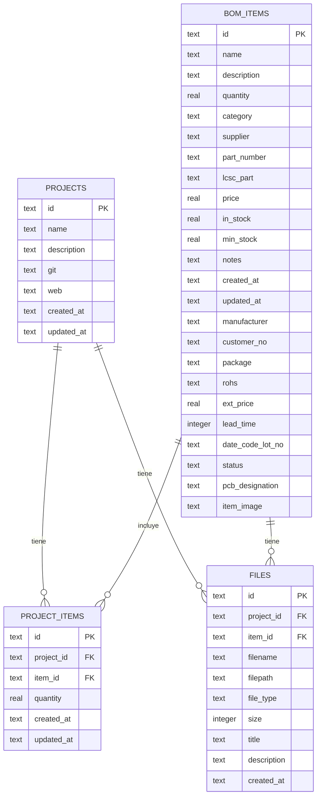
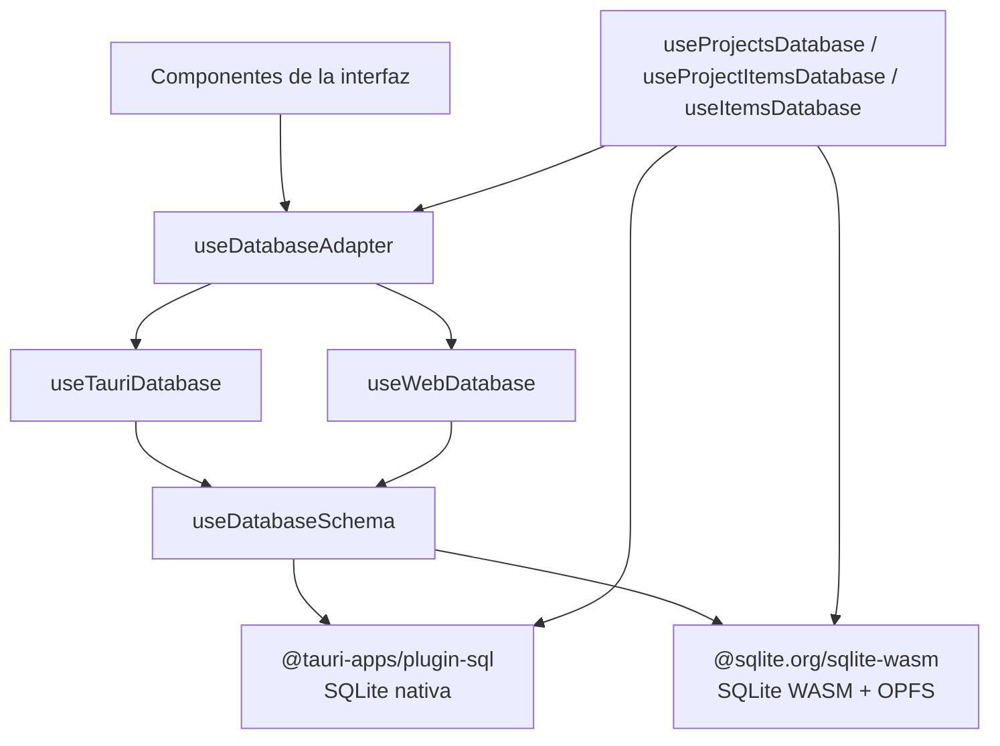
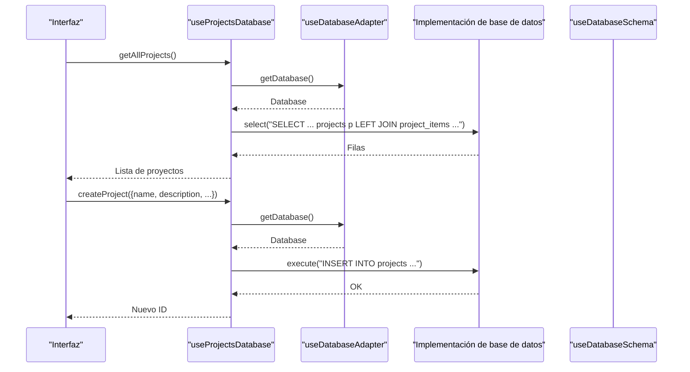
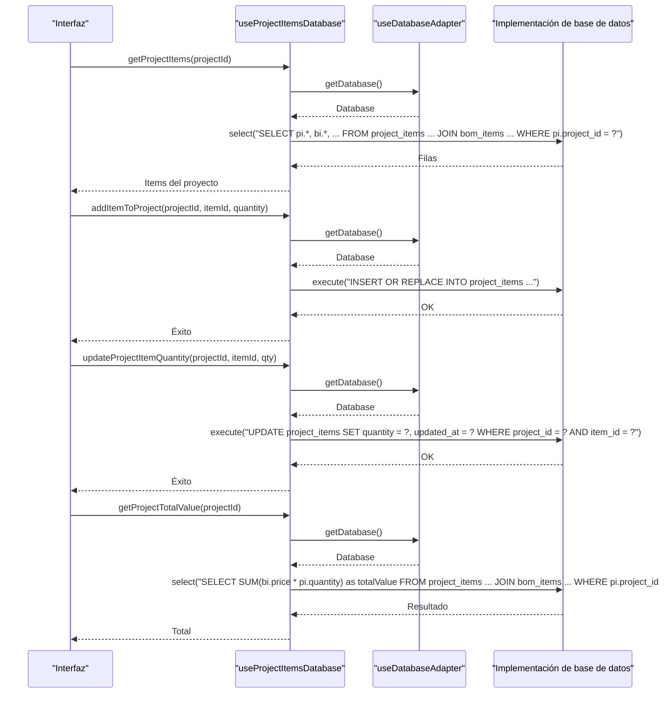
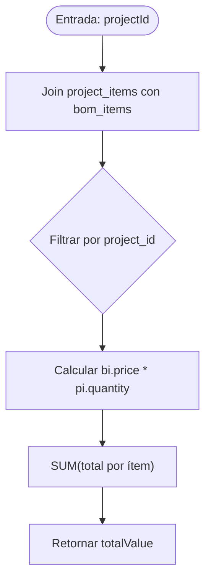

# Base de Datos de Proyectos

<cite>
**Archivos citados en este documento**
- [schema.json](file://data/db/schema.json)
- [useProjectsDatabase.ts](file://composables/useProjectsDatabase.ts)
- [useProjectItemsDatabase.ts](file://composables/useProjectItemsDatabase.ts)
- [useItemsDatabase.ts](file://composables/useItemsDatabase.ts)
- [useDatabaseAdapter.ts](file://composables/useDatabaseAdapter.ts)
- [useDatabaseSchema.ts](file://composables/useDatabaseSchema.ts)
- [useTauriDatabase.ts](file://composables/useTauriDatabase.ts)
- [useWebDatabase.ts](file://composables/useWebDatabase.ts)
- [useDatabase.ts](file://composables/useDatabase.ts)
- [types/database.ts](file://types/database.ts)
- [types/bom.ts](file://types/bom.ts)
- [useCostCalculator.ts](file://composables/useCostCalculator.ts)
</cite>

## Índice
1. [Introducción](#introducción)
2. [Estructura del esquema de base de datos](#estructura-del-esquema-de-base-de-datos)
3. [Componentes de la capa de base de datos](#componentes-de-la-capa-de-base-de-datos)
4. [Arquitectura general de acceso a la base de datos](#arquitectura-general-de-acceso-a-la-base-de-datos)
5. [Operaciones CRUD de proyectos](#operaciones-crud-de-proyectos)
6. [Operaciones CRUD de la relación proyecto-items](#operaciones-crud-de-la-relación-proyecto-items)
7. [Consultas y cálculos de costos](#consultas-y-cálculos-de-costos)
8. [Integridad referencial e índices](#integridad-referencial-e-índices)
9. [Rendimiento y optimización de consultas](#rendimiento-y-optimización-de-consultas)
10. [Guía de solución de problemas](#guía-de-solución-de-problemas)
11. [Conclusión](#conclusión)

## Introducción
Este documento explica la capa de base de datos dedicada a la gestión de proyectos. Cubre el esquema de la tabla de proyectos, su relación con la tabla de items mediante la tabla de relación muchos a muchos project_items, operaciones CRUD completas, consultas SQL específicas, funciones de cálculo de costos totales, y optimización de consultas. También incluye detalles sobre integridad referencial, índices importantes y rendimiento de operaciones comunes.

## Estructura del esquema de base de datos
El esquema está definido en un archivo JSON y contiene las siguientes tablas relevantes para proyectos:
- projects: almacena proyectos con identificador único, nombre, descripción, enlaces a repositorio y web, y marcas de tiempo.
- bom_items: almacena los ítems del BOM con campos como precio, stock actual, stock mínimo, entre otros.
- project_items: tabla de relación muchos a muchos entre proyectos y items, con cantidad asociada y marcas de tiempo.
- files: tabla de archivos asociados a proyectos e ítems (no es parte principal de esta documentación, pero influye en integridad referencial).

**Diagrama fuente**
- [schema.json](file://data/db/schema.json#L1-L37)

**Sección fuente**
- [schema.json](file://data/db/schema.json#L1-L37)

## Componentes de la capa de base de datos
- useProjectsDatabase: encapsula operaciones CRUD sobre la tabla projects y consulta de cantidad de ítems por proyecto.
- useProjectItemsDatabase: encapsula operaciones CRUD sobre la tabla project_items, incluyendo cálculo del valor total de un proyecto.
- useItemsDatabase: operaciones CRUD sobre bom_items, incluyendo actualización de stock y consumo de stock basado en BOM.
- useDatabaseAdapter: detecta entorno (Tauri o Web) y proporciona la implementación de base de datos correspondiente.
- useDatabaseSchema: carga el esquema, crea tablas si no existen, y permite sincronización avanzada.
- useTauriDatabase y useWebDatabase: implementaciones concretas de base de datos (SQLite nativa y SQLite WASM).
- useDatabase: combinador de todos los compositores de base de datos.

**Sección fuente**
- [useProjectsDatabase.ts](file://composables/useProjectsDatabase.ts#L1-L128)
- [useProjectItemsDatabase.ts](file://composables/useProjectItemsDatabase.ts#L1-L144)
- [useItemsDatabase.ts](file://composables/useItemsDatabase.ts#L1-L346)
- [useDatabaseAdapter.ts](file://composables/useDatabaseAdapter.ts#L1-L25)
- [useDatabaseSchema.ts](file://composables/useDatabaseSchema.ts#L1-L302)
- [useTauriDatabase.ts](file://composables/useTauriDatabase.ts#L1-L55)
- [useWebDatabase.ts](file://composables/useWebDatabase.ts#L1-L179)
- [useDatabase.ts](file://composables/useDatabase.ts#L1-L64)
- [types/database.ts](file://types/database.ts#L1-L5)
- [types/bom.ts](file://types/bom.ts#L1-L47)

## Arquitectura general de acceso a la base de datos
La arquitectura sigue un patrón de adaptador que selecciona la implementación según el entorno. Ambas implementaciones exponen las mismas funciones select y execute, permitiendo que los compositores operen de forma transparente.

**Diagrama fuente**
- [useDatabaseAdapter.ts](file://composables/useDatabaseAdapter.ts#L1-L25)
- [useTauriDatabase.ts](file://composables/useTauriDatabase.ts#L1-L55)
- [useWebDatabase.ts](file://composables/useWebDatabase.ts#L1-L179)
- [useDatabaseSchema.ts](file://composables/useDatabaseSchema.ts#L1-L302)
- [types/database.ts](file://types/database.ts#L1-L5)

## Operaciones CRUD de proyectos
- Obtener todos los proyectos con conteo de ítems por proyecto.
- Obtener un proyecto por su identificador.
- Crear un nuevo proyecto con timestamps.
- Actualizar un proyecto existente.
- Eliminar un proyecto, incluyendo eliminación en cascada de archivos asociados.

**Diagrama fuente**
- [useProjectsDatabase.ts](file://composables/useProjectsDatabase.ts#L1-L128)
- [useDatabaseAdapter.ts](file://composables/useDatabaseAdapter.ts#L1-L25)
- [useDatabaseSchema.ts](file://composables/useDatabaseSchema.ts#L1-L302)

**Sección fuente**
- [useProjectsDatabase.ts](file://composables/useProjectsDatabase.ts#L1-L128)

## Operaciones CRUD de la relación proyecto-items
- Listar ítems de un proyecto con datos completos de bom_items y la cantidad asociada.
- Agregar o reemplazar un ítem en un proyecto con cantidad predeterminada.
- Eliminar un ítem específico de un proyecto.
- Actualizar la cantidad de un ítem en un proyecto.
- Calcular el valor total de un proyecto multiplicando precio por cantidad de cada ítem.

**Diagrama fuente**
- [useProjectItemsDatabase.ts](file://composables/useProjectItemsDatabase.ts#L1-L144)
- [useDatabaseAdapter.ts](file://composables/useDatabaseAdapter.ts#L1-L25)

**Sección fuente**
- [useProjectItemsDatabase.ts](file://composables/useProjectItemsDatabase.ts#L1-L144)

## Consultas y cálculos de costos
- Consulta de ítems de un proyecto: join entre project_items y bom_items, ordenado por fecha de creación descendente.
- Cálculo del valor total de un proyecto: suma de bi.price * pi.quantity agrupada por proyecto.
- Cálculo de costos adicionales (impuestos, envío) se realiza en el frontend con useCostCalculator.

**Diagrama fuente**
- [useProjectItemsDatabase.ts](file://composables/useProjectItemsDatabase.ts#L116-L134)
- [useCostCalculator.ts](file://composables/useCostCalculator.ts#L1-L173)

**Sección fuente**
- [useProjectItemsDatabase.ts](file://composables/useProjectItemsDatabase.ts#L116-L134)
- [useCostCalculator.ts](file://composables/useCostCalculator.ts#L1-L173)

## Integridad referencial e índices
- Integridad referencial:
  - project_items.project_id referencia a projects.id con ON DELETE CASCADE.
  - project_items.item_id referencia a bom_items.id con ON DELETE CASCADE.
  - files.project_id referencia a projects.id con ON DELETE CASCADE.
  - files.item_id referencia a bom_items.id con ON DELETE CASCADE.
- Índices:
  - Se recomienda crear índices en:
    - project_items(project_id) y project_items(item_id) para acelerar búsquedas y joins.
    - project_items(project_id, item_id) como clave única (ya presente).
    - bom_items(in_stock) y bom_items(min_stock) para consultas de stock.
    - projects(created_at) y project_items(created_at) para óptimas ordenaciones.
- Configuración de base de datos:
  - SQLite WASM configura PRAGMA foreign_keys = ON, lo cual es crucial para mantener integridad referencial.

**Sección fuente**
- [schema.json](file://data/db/schema.json#L18-L36)
- [useWebDatabase.ts](file://composables/useWebDatabase.ts#L33-L40)

## Rendimiento y optimización de consultas
- Optimización de listado de proyectos:
  - La consulta ya agrupa por p.id y cuenta ítems, evitando subconsultas innecesarias.
  - Recomendación: añadir índice en projects(id) y project_items(project_id) si aún no existe.
- Optimización de listado de ítems de un proyecto:
  - El join es sencillo y usa parámetro de proyecto.
  - Recomendación: añadir índice compuesto project_items(project_id, created_at) para ordenaciones rápidas.
- Cálculo de valor total:
  - La función de cálculo se realiza en base de datos, lo cual es eficiente.
  - Recomendación: añadir índice en bom_items(price) y project_items(quantity) si se usan frecuentemente en filtros.
- Transacciones:
  - Las operaciones de actualización de stock en bom_items usan BEGIN/COMMIT/Rollback, garantizando atomicidad.
- Almacenamiento:
  - SQLite WASM se configura con PRAGMA journal_mode = WAL y synchronous = NORMAL, mejorando concurrencia y rendimiento.

**Sección fuente**
- [useProjectsDatabase.ts](file://composables/useProjectsDatabase.ts#L17-L36)
- [useProjectItemsDatabase.ts](file://composables/useProjectItemsDatabase.ts#L15-L28)
- [useItemsDatabase.ts](file://composables/useItemsDatabase.ts#L201-L252)
- [useWebDatabase.ts](file://composables/useWebDatabase.ts#L33-L40)

## Guía de solución de problemas
- Errores en operaciones CRUD:
  - Los compositores capturan errores e imprimen mensajes en consola. Verificar que getDatabase() devuelva una instancia válida.
- Base de datos no inicializada:
  - useDatabaseSchema crea tablas si no existen. Si persiste un error, forzar actualización de tabla específica o verificar permisos de OPFS (Web).
- Valores nulos o ausentes:
  - En consultas de stock y cálculo de total, se manejan valores nulos. Asegurarse de que los campos de precios y cantidades tengan valores válidos.
- Rendimiento lento:
  - Verificar índices sugeridos y evitar consultas sin parámetros en grandes volúmenes de datos.

**Sección fuente**
- [useProjectsDatabase.ts](file://composables/useProjectsDatabase.ts#L37-L128)
- [useProjectItemsDatabase.ts](file://composables/useProjectItemsDatabase.ts#L1-L144)
- [useItemsDatabase.ts](file://composables/useItemsDatabase.ts#L1-L346)
- [useDatabaseSchema.ts](file://composables/useDatabaseSchema.ts#L202-L236)

## Conclusión
La capa de base de datos para gestión de proyectos está bien estructurada con tablas claras y relaciones sólidas. Se implementan operaciones CRUD completas tanto en proyectos como en la relación proyecto-items, con cálculos de costos integrados. La arquitectura de adaptadores permite ejecutar en Tauri o Web, y se aplican buenas prácticas de integridad referencial y transacciones. Para mejorar aún más el rendimiento, se recomienda añadir los índices sugeridos y monitorear consultas frecuentes.