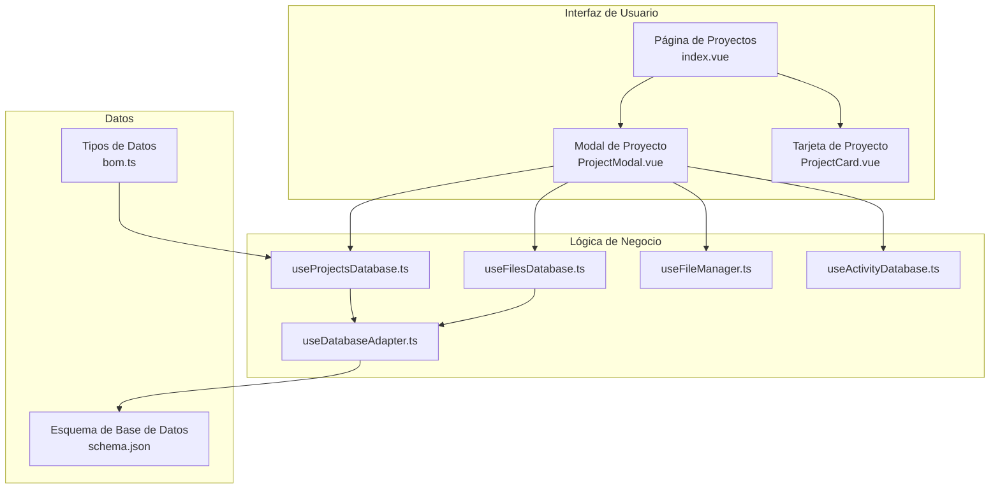
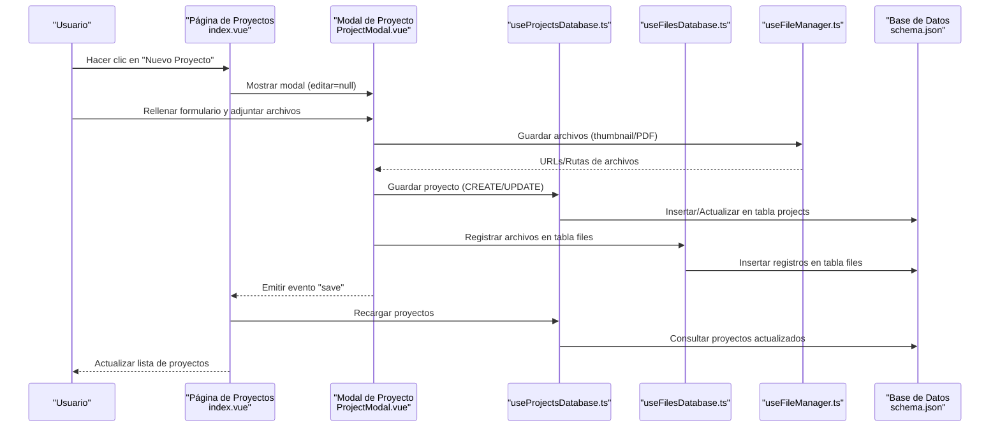
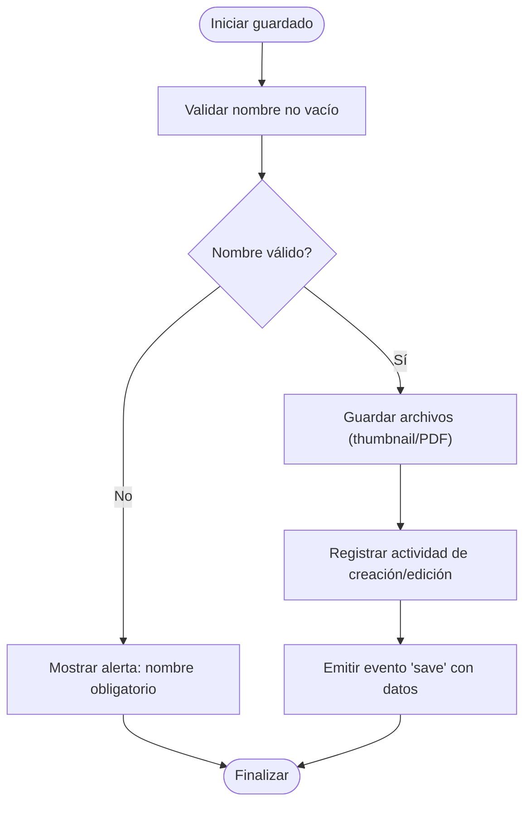
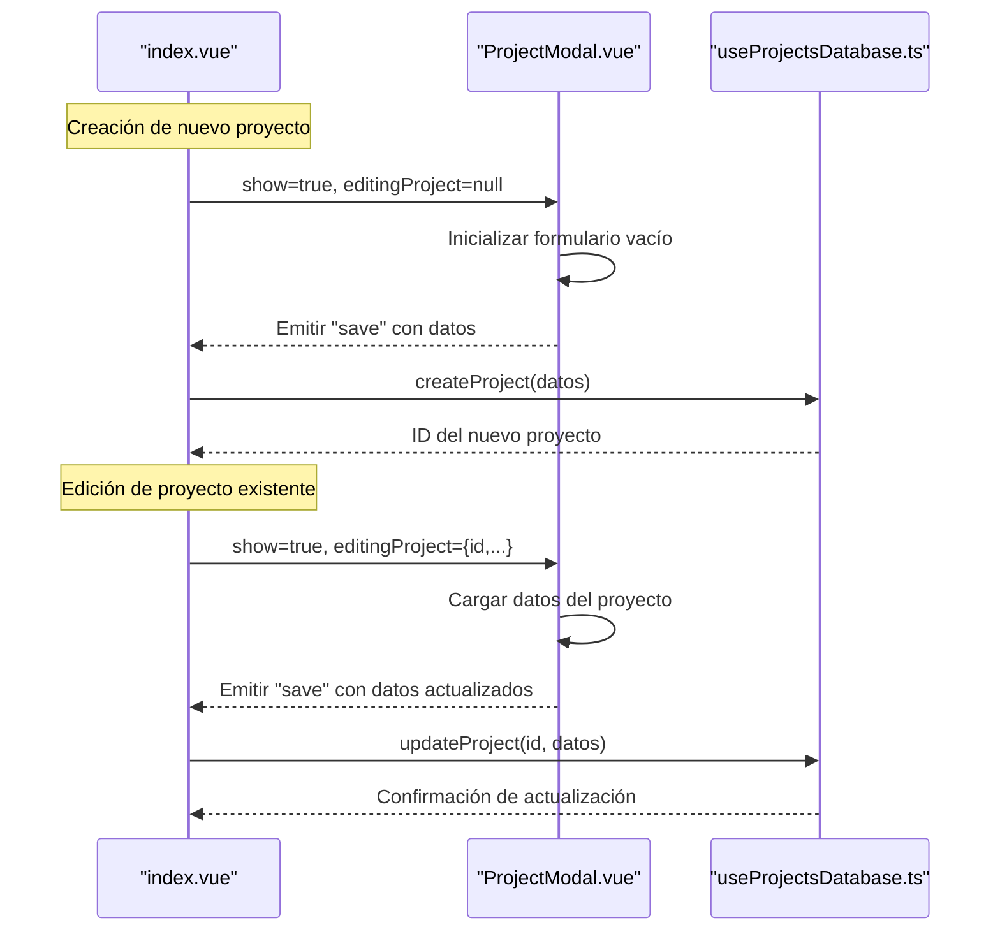
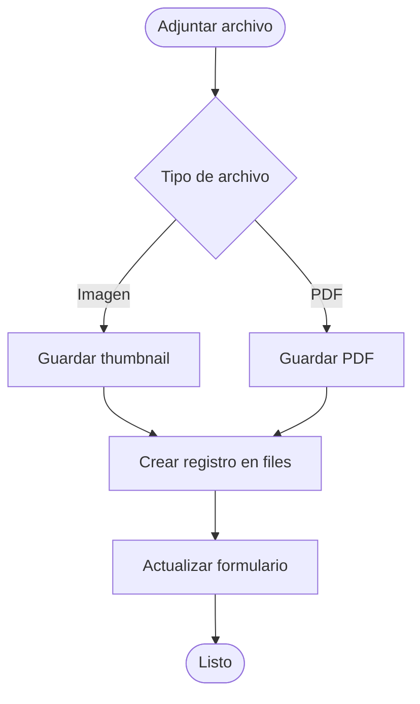

# Creación y Edición de Proyectos

<cite>
**Archivos referenciados en este documento**
- [ProjectModal.vue](file://components/project/ProjectModal.vue)
- [useProjectsDatabase.ts](file://composables/useProjectsDatabase.ts)
- [index.vue](file://pages/projects/index.vue)
- [schema.json](file://data/db/schema.json)
- [useFileManager.ts](file://composables/useFileManager.ts)
- [useFilesDatabase.ts](file://composables/useFilesDatabase.ts)
- [ProjectCard.vue](file://components/project/ProjectCard.vue)
- [bom.ts](file://types/bom.ts)
- [useDatabaseAdapter.ts](file://composables/useDatabaseAdapter.ts)
- [useActivityDatabase.ts](file://composables/useActivityDatabase.ts)
- [[id].vue](file://pages/projects/[id].vue)
</cite>

## Tabla de Contenidos
1. [Introducción](#introducción)
2. [Estructura del Proyecto](#estructura-del-proyecto)
3. [Componentes Principales](#componentes-principales)
4. [Arquitectura General](#arquitectura-general)
5. [Análisis Detallado de Componentes](#análisis-detallado-de-componentes)
6. [Flujo de Trabajo: Creación vs Edición](#flujo-de-trabajo-creación-vs-edición)
7. [Validación de Datos](#validación-de-datos)
8. [Persistencia de Datos](#persistencia-de-datos)
9. [Manejo de Archivos Adjuntos](#manejo-de-archivos-adjuntos)
10. [Casos de Uso y Buenas Prácticas](#casos-de-uso-y-buenas-prácticas)
11. [Gestión de Errores](#gestión-de-errores)
12. [Conclusión](#conclusión)

## Introducción
Este documento detalla la funcionalidad de creación y edición de proyectos dentro de la aplicación BOM Manager. Cubre el formulario modal de proyectos, campos requeridos y opcionales, validación de datos, lógica de creación de nuevos proyectos versus edición de proyectos existentes, manejo de estados de edición y persistencia de datos. También incluye ejemplos de casos de uso, buenas prácticas y cómo se gestionan los errores durante el proceso de creación o edición.

## Estructura del Proyecto
La funcionalidad de proyectos se distribuye entre varios componentes y componibles:

- Página principal de gestión de proyectos: muestra la lista de proyectos, estadísticas y permite abrir el modal de creación/edición.
- Componente modal de proyectos: formulario para crear o editar proyectos con validación y manejo de archivos.
- Composables de base de datos: encapsulan operaciones CRUD para proyectos y archivos.
- Tipos y esquema de base de datos: definen la estructura de los datos y relaciones.

**Diagrama fuente**
- [index.vue](file://pages/projects/index.vue#L1-L273)
- [ProjectModal.vue](file://components/project/ProjectModal.vue#L1-L693)
- [ProjectCard.vue](file://components/project/ProjectCard.vue#L1-L109)
- [useProjectsDatabase.ts](file://composables/useProjectsDatabase.ts#L1-L128)
- [useFilesDatabase.ts](file://composables/useFilesDatabase.ts#L1-L179)
- [useFileManager.ts](file://composables/useFileManager.ts#L1-L260)
- [useActivityDatabase.ts](file://composables/useActivityDatabase.ts#L1-L200)
- [useDatabaseAdapter.ts](file://composables/useDatabaseAdapter.ts#L1-L25)
- [schema.json](file://data/db/schema.json#L1-L37)
- [bom.ts](file://types/bom.ts#L1-L47)

**Sección fuente**
- [index.vue](file://pages/projects/index.vue#L1-L273)
- [ProjectModal.vue](file://components/project/ProjectModal.vue#L1-L693)
- [ProjectCard.vue](file://components/project/ProjectCard.vue#L1-L109)
- [useProjectsDatabase.ts](file://composables/useProjectsDatabase.ts#L1-L128)
- [useFilesDatabase.ts](file://composables/useFilesDatabase.ts#L1-L179)
- [useFileManager.ts](file://composables/useFileManager.ts#L1-L260)
- [useActivityDatabase.ts](file://composables/useActivityDatabase.ts#L1-L200)
- [useDatabaseAdapter.ts](file://composables/useDatabaseAdapter.ts#L1-L25)
- [schema.json](file://data/db/schema.json#L1-L37)
- [bom.ts](file://types/bom.ts#L1-L47)

## Componentes Principales

### Formulario Modal de Proyectos
- Ubicación: [ProjectModal.vue](file://components/project/ProjectModal.vue#L1-L693)
- Propósito: Permite crear nuevos proyectos o editar proyectos existentes mediante un formulario modal.
- Características:
  - Campos requeridos: nombre del proyecto.
  - Campos opcionales: descripción, repositorio Git, sitio web, imagen de portada (thumbnail) y documento PDF.
  - Manejo de archivos: carga, previsualización, eliminación y sincronización con la base de datos.
  - Validación básica del formulario.
  - Registro de actividades de creación/edición y carga de archivos.

**Sección fuente**
- [ProjectModal.vue](file://components/project/ProjectModal.vue#L1-L693)

### Gestión de Proyectos (Base de Datos)
- Ubicación: [useProjectsDatabase.ts](file://composables/useProjectsDatabase.ts#L1-L128)
- Funciones principales:
  - Obtener todos los proyectos con conteo de ítems.
  - Obtener un proyecto por ID.
  - Crear un nuevo proyecto.
  - Actualizar un proyecto existente.
  - Eliminar un proyecto (incluyendo archivos asociados).
- Persistencia: operaciones SQL en la tabla `projects`.

**Sección fuente**
- [useProjectsDatabase.ts](file://composables/useProjectsDatabase.ts#L1-L128)

### Gestión de Archivos Adjuntos
- Ubicación: [useFilesDatabase.ts](file://composables/useFilesDatabase.ts#L1-L179)
- Funciones principales:
  - Crear registros de archivos asociados a proyectos o ítems.
  - Consultar archivos por proyecto o ítem.
  - Actualizar y eliminar archivos.
  - Eliminación en cascada de archivos al eliminar un proyecto.
- Persistencia: tabla `files` con claves foráneas a `projects` y `bom_items`.

**Sección fuente**
- [useFilesDatabase.ts](file://composables/useFilesDatabase.ts#L1-L179)

### Manejo de Archivos (Almacenamiento)
- Ubicación: [useFileManager.ts](file://composables/useFileManager.ts#L1-L260)
- Funciones principales:
  - Guardar archivos (OPFS en web, sistema de archivos en Tauri).
  - Eliminar archivos y liberar URLs.
  - Recuperar archivos por nombre (OPFS).
  - Detectar entorno (Tauri/Web) y adaptar comportamiento.
- Integración con base de datos: se almacena la ruta o URL del archivo y se crea un registro en la tabla `files`.

**Sección fuente**
- [useFileManager.ts](file://composables/useFileManager.ts#L1-L260)

### Página Principal de Gestión de Proyectos
- Ubicación: [index.vue](file://pages/projects/index.vue#L1-L273)
- Funciones principales:
  - Mostrar lista de proyectos con estadísticas.
  - Abrir el modal de creación/edición.
  - Manejar eventos de edición y eliminación.
  - Cargar proyectos desde la base de datos y calcular valores totales.

**Sección fuente**
- [index.vue](file://pages/projects/index.vue#L1-L273)

### Tarjeta de Proyecto
- Ubicación: [ProjectCard.vue](file://components/project/ProjectCard.vue#L1-L109)
- Funciones principales:
  - Representación visual de un proyecto con acciones de edición y eliminación.
  - Formateo de fechas y valores monetarios.

**Sección fuente**
- [ProjectCard.vue](file://components/project/ProjectCard.vue#L1-L109)

## Arquitectura General

**Diagrama fuente**
- [index.vue](file://pages/projects/index.vue#L202-L215)
- [ProjectModal.vue](file://components/project/ProjectModal.vue#L631-L667)
- [useProjectsDatabase.ts](file://composables/useProjectsDatabase.ts#L51-L94)
- [useFilesDatabase.ts](file://composables/useFilesDatabase.ts#L21-L65)
- [useFileManager.ts](file://composables/useFileManager.ts#L111-L117)
- [schema.json](file://data/db/schema.json#L12-L18)

## Análisis Detallado de Componentes

### Formulario Modal de Proyectos
- Campos requeridos:
  - Nombre del proyecto: campo de texto obligatorio.
- Campos opcionales:
  - Descripción: área de texto de múltiples líneas.
  - Repositorio Git: campo URL.
  - Sitio Web: campo URL.
  - Imagen de portada (thumbnail): carga de imagen con soporte drag-and-drop.
  - Documento PDF: carga de archivo PDF.
- Validación:
  - Se verifica que el nombre no esté vacío antes de guardar.
  - Se validan tipos de archivo para imágenes y PDF.
- Procesamiento de entradas:
  - Los archivos se guardan usando el manejador de archivos.
  - Se registran actividades de creación/edición y carga de archivos.
  - Se emite un evento con los datos del proyecto al padre.

**Diagrama fuente**
- [ProjectModal.vue](file://components/project/ProjectModal.vue#L631-L667)

**Sección fuente**
- [ProjectModal.vue](file://components/project/ProjectModal.vue#L13-L142)
- [ProjectModal.vue](file://components/project/ProjectModal.vue#L631-L667)

### Gestión de Proyectos (Base de Datos)
- Operaciones CRUD:
  - Crear: inserta un nuevo proyecto con ID generado y marcas de tiempo.
  - Actualizar: modifica nombre, descripción, repositorio y sitio web.
  - Eliminar: borra el proyecto y sus archivos asociados.
- Relaciones:
  - La tabla `files` tiene claves foráneas a `projects` y `bom_items`, con eliminación en cascada.

**Sección fuente**
- [useProjectsDatabase.ts](file://composables/useProjectsDatabase.ts#L51-L94)
- [schema.json](file://data/db/schema.json#L12-L18)

### Gestión de Archivos Adjuntos
- Crear registros:
  - Se generan IDs únicos para archivos y se almacenan metadatos.
- Consultar archivos:
  - Se pueden obtener archivos por proyecto o ítem.
- Eliminación:
  - Se eliminan registros y archivos físicos, con registro de actividades.

**Sección fuente**
- [useFilesDatabase.ts](file://composables/useFilesDatabase.ts#L21-L65)
- [useFilesDatabase.ts](file://composables/useFilesDatabase.ts#L137-L150)

### Manejo de Archivos (Almacenamiento)
- Almacenamiento:
  - Web: OPFS (Origin Private File System) para guardar y recuperar archivos.
  - Tauri: sistema de archivos del sistema operativo o Data URLs como fallback.
- Operaciones:
  - Guardar, eliminar y recuperar archivos por nombre.
  - Gestión de URLs y limpieza de recursos.

**Sección fuente**
- [useFileManager.ts](file://composables/useFileManager.ts#L51-L117)
- [useFileManager.ts](file://composables/useFileManager.ts#L119-L192)
- [useFileManager.ts](file://composables/useFileManager.ts#L222-L250)

## Flujo de Trabajo: Creación vs Edición

**Diagrama fuente**
- [index.vue](file://pages/projects/index.vue#L202-L215)
- [ProjectModal.vue](file://components/project/ProjectModal.vue#L203-L290)
- [useProjectsDatabase.ts](file://composables/useProjectsDatabase.ts#L51-L94)

**Sección fuente**
- [index.vue](file://pages/projects/index.vue#L202-L215)
- [ProjectModal.vue](file://components/project/ProjectModal.vue#L203-L290)
- [useProjectsDatabase.ts](file://composables/useProjectsDatabase.ts#L51-L94)

## Validación de Datos
- Requerido:
  - Nombre del proyecto: campo obligatorio. Se valida antes de guardar.
- Opcional:
  - Descripción, repositorio Git, sitio web, thumbnail, PDF.
- Tipos de archivo:
  - Imágenes: se verifica que el tipo comience con "image/".
  - PDF: se verifica que el tipo sea "application/pdf".
- Valores nulos:
  - Campos opcionales pueden ser nulos o indefinidos según la base de datos.

**Sección fuente**
- [ProjectModal.vue](file://components/project/ProjectModal.vue#L631-L667)
- [ProjectModal.vue](file://components/project/ProjectModal.vue#L420-L466)
- [ProjectModal.vue](file://components/project/ProjectModal.vue#L531-L576)

## Persistencia de Datos
- Tablas involucradas:
  - `projects`: almacena información del proyecto.
  - `files`: almacena rutas o URLs de archivos y metadatos.
- Claves foráneas:
  - `files.project_id` referencia a `projects.id` con eliminación en cascada.
- Generación de IDs:
  - Se generan IDs únicos para proyectos y archivos.
- Marca de tiempo:
  - Se registran `created_at` y `updated_at` en operaciones CRUD.

**Sección fuente**
- [schema.json](file://data/db/schema.json#L12-L18)
- [useProjectsDatabase.ts](file://composables/useProjectsDatabase.ts#L5-L10)
- [useFilesDatabase.ts](file://composables/useFilesDatabase.ts#L25-L50)

## Manejo de Archivos Adjuntos
- Thumbnail:
  - Se guarda con nombre `thumb-prj-{projectId}.{ext}`.
  - Se actualiza el registro en `files` si se edita un proyecto existente.
- PDF:
  - Se guarda con nombre `pdf-prj-{projectId}.pdf`.
  - Se elimina el archivo anterior si se reemplaza.
- Eliminación:
  - Se busca el archivo en la base de datos y se elimina físicamente.
  - Se registran actividades de eliminación.

**Diagrama fuente**
- [ProjectModal.vue](file://components/project/ProjectModal.vue#L420-L466)
- [ProjectModal.vue](file://components/project/ProjectModal.vue#L531-L576)
- [useFilesDatabase.ts](file://composables/useFilesDatabase.ts#L60-L65)

**Sección fuente**
- [ProjectModal.vue](file://components/project/ProjectModal.vue#L420-L466)
- [ProjectModal.vue](file://components/project/ProjectModal.vue#L531-L576)
- [useFilesDatabase.ts](file://composables/useFilesDatabase.ts#L60-L65)

## Casos de Uso y Buenas Prácticas

### Caso de Uso 1: Crear un Nuevo Proyecto
- Pasos:
  - Abrir el modal de proyectos desde la página principal.
  - Rellenar el nombre del proyecto y opcionalmente otros campos.
  - Adjuntar thumbnail y/o PDF si aplica.
  - Guardar el proyecto.
- Resultado:
  - El proyecto se crea con ID único y se registran actividades.
  - Los archivos se guardan y se registran en la tabla `files`.

**Sección fuente**
- [index.vue](file://pages/projects/index.vue#L112-L116)
- [ProjectModal.vue](file://components/project/ProjectModal.vue#L631-L667)
- [useProjectsDatabase.ts](file://composables/useProjectsDatabase.ts#L51-L72)

### Caso de Uso 2: Editar un Proyecto Existente
- Pasos:
  - Hacer clic en "Editar" en la tarjeta del proyecto.
  - El modal se carga con los datos actuales del proyecto.
  - Realizar cambios en los campos y/o reemplazar archivos.
  - Guardar los cambios.
- Resultado:
  - El proyecto se actualiza y se registran actividades de edición.
  - Se actualizan o reemplazan los registros de archivos.

**Sección fuente**
- [ProjectCard.vue](file://components/project/ProjectCard.vue#L87-L93)
- [ProjectModal.vue](file://components/project/ProjectModal.vue#L203-L290)
- [useProjectsDatabase.ts](file://composables/useProjectsDatabase.ts#L74-L94)

### Caso de Uso 3: Eliminar Archivos Asociados
- Pasos:
  - En el modal, hacer clic en "Eliminar" junto al archivo adjunto.
  - Confirmar la acción si se requiere.
- Resultado:
  - Se elimina el archivo físico y el registro en la base de datos.
  - Se registra la actividad de eliminación.

**Sección fuente**
- [ProjectModal.vue](file://components/project/ProjectModal.vue#L468-L515)
- [ProjectModal.vue](file://components/project/ProjectModal.vue#L578-L625)
- [useFilesDatabase.ts](file://composables/useFilesDatabase.ts#L137-L150)

### Buenas Prácticas
- Relleno de información:
  - Incluir un nombre descriptivo para el proyecto.
  - Agregar una breve descripción útil.
  - Proporcionar enlaces válidos a repositorio y sitio web.
  - Utilizar imágenes de buena calidad y PDFs actualizados.
- Manejo de archivos:
  - Verificar tipos de archivo antes de adjuntar.
  - Reemplazar archivos antiguos solo cuando sea necesario.
  - Limpiar archivos innecesarios para ahorrar espacio.

[No se necesitan fuentes para esta sección, ya que no analiza archivos específicos]

## Gestión de Errores
- Errores comunes:
  - Nombre del proyecto vacío: se muestra una alerta y se detiene el guardado.
  - Archivos inválidos: se muestra un mensaje de error y se evita el guardado.
  - Fallos en la base de datos: se registran errores y se informa al usuario.
- Manejo de errores:
  - Alertas visuales para errores de validación.
  - Registro de actividades de error en la base de datos.
  - Manejo de excepciones en operaciones asíncronas.

**Sección fuente**
- [ProjectModal.vue](file://components/project/ProjectModal.vue#L631-L667)
- [ProjectModal.vue](file://components/project/ProjectModal.vue#L420-L466)
- [ProjectModal.vue](file://components/project/ProjectModal.vue#L531-L576)

## Conclusión
La funcionalidad de creación y edición de proyectos está bien integrada con el formulario modal, la base de datos y el manejo de archivos. El sistema permite crear nuevos proyectos, editar información existente y gestionar archivos adjuntos de manera segura y eficiente. La validación básica del formulario y el registro de actividades garantizan la integridad de los datos y la trazabilidad de las operaciones.

[No se necesitan fuentes para esta sección, ya que resume sin analizar archivos específicos]