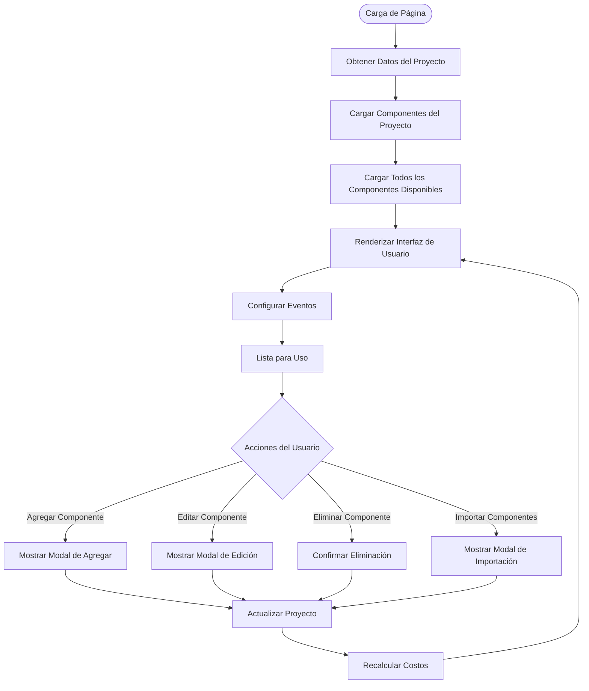
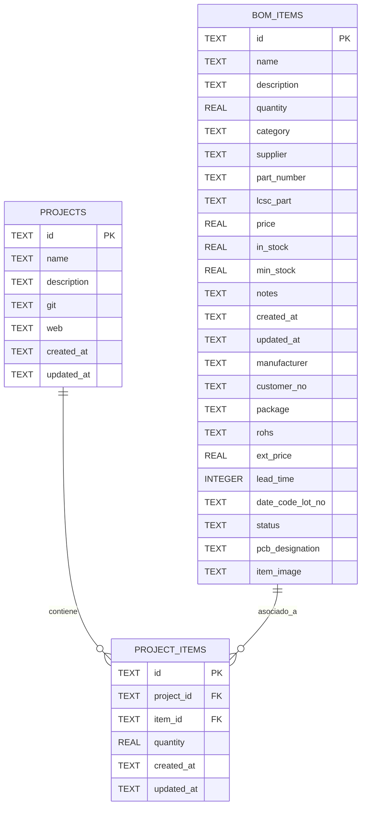
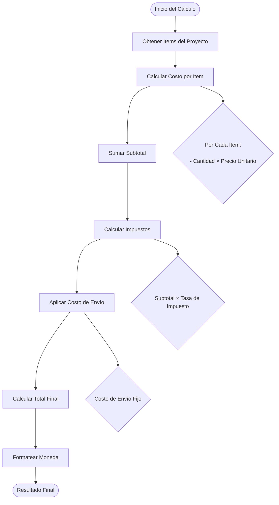
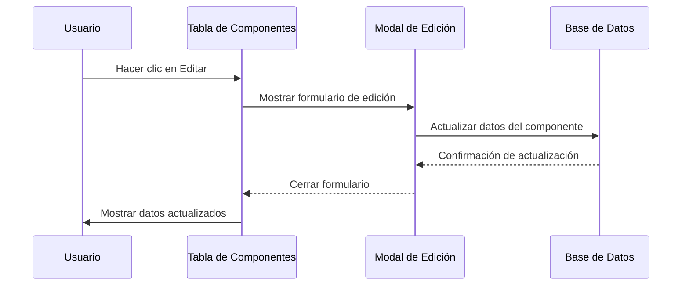
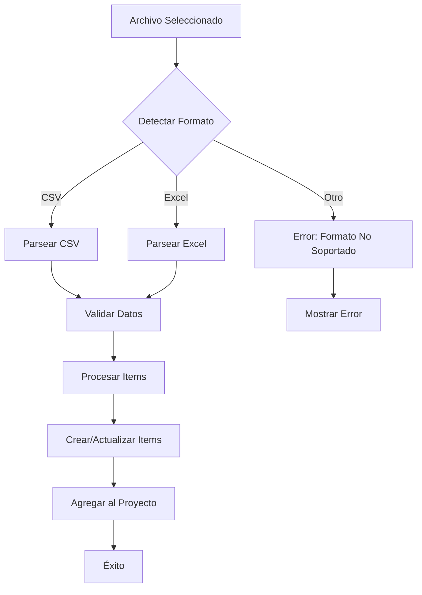
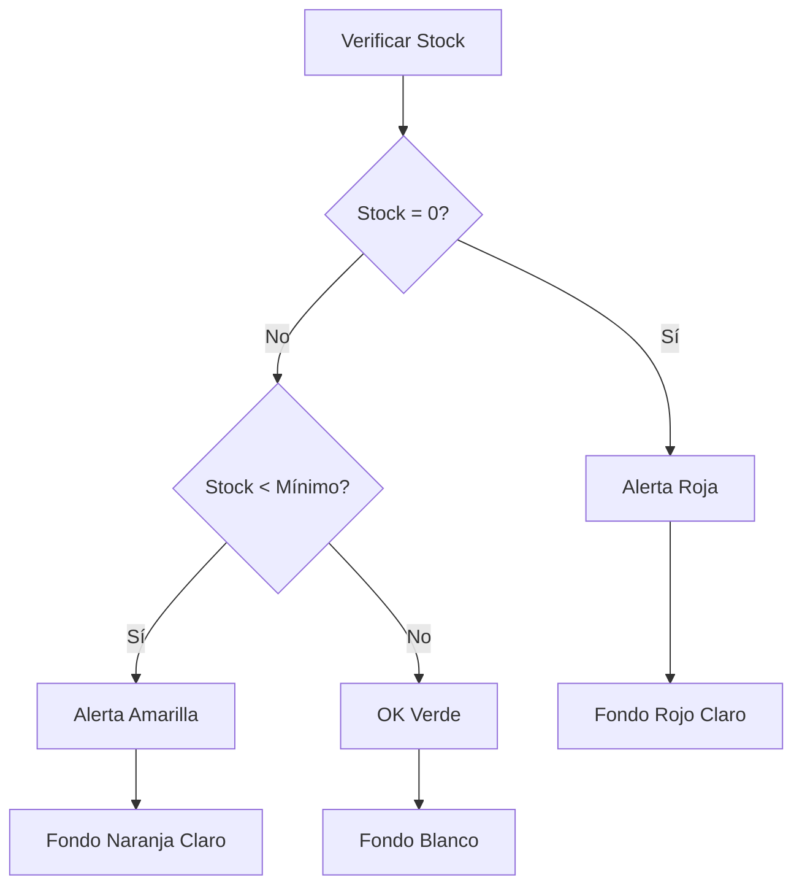

# Detalle del Proyecto

<cite>
**Archivos referenciados en este documento**
- [pages/projects/[id].vue](file://pages/projects/[id].vue)
- [components/project/ProjectItemsTable.vue](file://components/project/ProjectItemsTable.vue)
- [components/AddItemToProjectModal.vue](file://components/AddItemToProjectModal.vue)
- [components/EditItemInProjectModal.vue](file://components/EditItemInProjectModal.vue)
- [composables/useProjectItemsDatabase.ts](file://composables/useProjectItemsDatabase.ts)
- [composables/useProjectsDatabase.ts](file://composables/useProjectsDatabase.ts)
- [composables/useCostCalculator.ts](file://composables/useCostCalculator.ts)
- [composables/useFileParser.ts](file://composables/useFileParser.ts)
- [types/bom.ts](file://types/bom.ts)
- [data/db/schema.json](file://data/db/schema.json)
</cite>

## Tabla de Contenidos
1. [Introducción](#introducción)
2. [Arquitectura General](#arquitectura-general)
3. [Estructura del Proyecto](#estructura-del-proyecto)
4. [Componentes Clave](#componentes-clave)
5. [Relación Muchos a Muchos](#relación-muchos-a-muchos)
6. [Visualización de Datos](#visualización-de-datos)
7. [Sistema de Cálculos](#sistema-de-cálculos)
8. [Funcionalidades de Edición](#funcionalidades-de-edición)
9. [Importación de Componentes](#importación-de-componentes)
10. [Navegación entre Proyectos](#navegación-entre-proyectos)
11. [Gestión de Stock](#gestión-de-stock)
12. [Resumen de Funciones](#resumen-de-funciones)
13. [Consideraciones de Rendimiento](#consideraciones-de-rendimiento)
14. [Conclusión](#conclusión)

## Introducción

La vista de detalle de proyectos es una de las características más importantes del sistema de gestión de BOM (Bill of Materials). Esta interfaz proporciona un panel completo de visualización individual de proyectos, permitiendo a los usuarios gestionar, observar y manipular componentes asociados a proyectos específicos. La implementación sigue principios de arquitectura moderna basada en Vue.js 3 con composables, ofreciendo una experiencia de usuario fluida y funcionalidades avanzadas de cálculo de costos y gestión de inventario.

## Arquitectura General

La aplicación sigue una arquitectura basada en componentes reutilizables con una capa de componibles que manejan la lógica de negocio. La vista de detalle de proyectos se integra con un sistema de base de datos relacional que permite la relación muchos a muchos entre proyectos y componentes.

```mermaid
graph TB
subgraph "Capa de Presentación"
DetailPage[Detalle del Proyecto<br/>[id].vue]
ProjectTable[Tabla de Componentes<br/>ProjectItemsTable.vue]
AddModal[Agregar Componente<br/>AddItemToProjectModal.vue]
EditModal[Editar Componente<br/>EditItemInProjectModal.vue]
end
subgraph "Capa de Lógica de Negocio"
CostCalc[Calculadora de Costos<br/>useCostCalculator.ts]
FileParser[Parser de Archivos<br/>useFileParser.ts]
Dialog[Diálogo de Confirmación<br/>useDialog.ts]
end
subgraph "Capa de Base de Datos"
ProjItemsDB[Proyecto-Items DB<br/>useProjectItemsDatabase.ts]
ProjectsDB[Proyectos DB<br/>useProjectsDatabase.ts]
Schema[Esquema de Base de Datos<br/>schema.json]
end
subgraph "Tipos y Definiciones"
BOMTypes[BOM Types<br/>types/bom.ts]
end
DetailPage --> ProjectTable
DetailPage --> AddModal
DetailPage --> EditModal
DetailPage --> CostCalc
DetailPage --> FileParser
DetailPage --> ProjItemsDB
DetailPage --> ProjectsDB
ProjectTable --> ProjItemsDB
AddModal --> ProjItemsDB
EditModal --> ProjItemsDB
ProjItemsDB --> Schema
ProjectsDB --> Schema
DetailPage --> BOMTypes
```

**Diagrama fuente**
- [pages/projects/[id].vue](file://pages/projects/[id].vue#L147-L585)
- [components/project/ProjectItemsTable.vue](file://components/project/ProjectItemsTable.vue#L1-L267)
- [composables/useProjectItemsDatabase.ts](file://composables/useProjectItemsDatabase.ts#L1-L144)

## Estructura del Proyecto

La implementación se encuentra en la carpeta `pages/projects/[id].vue`, que representa la ruta dinámica para mostrar detalles de proyectos específicos. El sistema utiliza un enfoque de componentes reutilizables donde cada funcionalidad está encapsulada en su propio módulo.



**Diagrama fuente**
- [pages/projects/[id].vue](file://pages/projects/[id].vue#L302-L324)

**Sección fuente**
- [pages/projects/[id].vue](file://pages/projects/[id].vue#L1-L585)

## Componentes Clave

### Vista Principal de Detalle de Proyecto

La vista principal se encuentra en `pages/projects/[id].vue` y maneja toda la lógica de presentación y gestión del proyecto. Utiliza un sistema de estado reactivo con Vue 3 Composition API.

**Sección fuente**
- [pages/projects/[id].vue](file://pages/projects/[id].vue#L147-L585)

### Tabla de Componentes

El componente `ProjectItemsTable.vue` proporciona una interfaz tabular completa para visualizar y gestionar componentes asociados al proyecto, incluyendo funcionalidades de selección múltiple y acciones rápidas.

**Sección fuente**
- [components/project/ProjectItemsTable.vue](file://components/project/ProjectItemsTable.vue#L1-L267)

### Modales de Gestión

Los modales permiten operaciones interactivas sin salir de la vista actual:

- **Agregar Componente**: `AddItemToProjectModal.vue` - Permite seleccionar componentes disponibles
- **Editar Componente**: `EditItemInProjectModal.vue` - Formulario completo para modificar propiedades

**Sección fuente**
- [components/AddItemToProjectModal.vue](file://components/AddItemToProjectModal.vue#L1-L109)
- [components/EditItemInProjectModal.vue](file://components/EditItemInProjectModal.vue#L1-L242)

## Relación Muchos a Muchos

La base de datos implementa una relación muchos a muchos entre proyectos y componentes a través de una tabla intermedia llamada `project_items`. Esta relación permite que un proyecto contenga múltiples componentes y un componente pueda estar asociado a múltiples proyectos.



**Diagrama fuente**
- [data/db/schema.json](file://data/db/schema.json#L8-L22)
- [types/bom.ts](file://types/bom.ts#L3-L32)

### Implementación Técnica

La relación se implementa mediante consultas SQL que combinan las tablas a través de claves foráneas. El composable `useProjectItemsDatabase.ts` proporciona métodos específicos para manejar esta relación:

- **getProjectItems**: Obtiene todos los componentes asociados a un proyecto específico
- **addItemToProject**: Agrega un componente a un proyecto con cantidad específica
- **removeItemFromProject**: Elimina la asociación entre proyecto y componente
- **updateProjectItemQuantity**: Actualiza la cantidad de componentes en un proyecto

**Sección fuente**
- [composables/useProjectItemsDatabase.ts](file://composables/useProjectItemsDatabase.ts#L15-L76)

## Visualización de Datos

### Estadísticas del Proyecto

La interfaz muestra métricas clave del proyecto en tarjetas resumidas:

- **Total de Items**: Cantidad total de componentes en el proyecto
- **Stock OK**: Componentes con suficiente inventario
- **Stock Bajo**: Componentes por debajo del nivel mínimo
- **Valor Total**: Cálculo del costo total del proyecto

```mermaid
flowchart LR
subgraph "Estadísticas del Proyecto"
TotalItems[TOTAL ITEMS<br/>{{ projectItems.length }}]
StockOK[STOCK OK<br/>{{ stockOK }}]
LowStock[STOCK BAJO<br/>{{ lowStockCount }}]
TotalValue[VALOR TOTAL<br/>${{ totalValue }}]
end
subgraph "Cálculos"
CalcTotal[Total = Σ(cantidad × precio)]
CalcStock[Stock OK = in_stock ≥ min_stock]
CalcLow[Stock Bajo = in_stock < min_stock]
end
CalcTotal --> TotalValue
CalcStock --> StockOK
CalcLow --> LowStock
```

**Diagrama fuente**
- [pages/projects/[id].vue](file://pages/projects/[id].vue#L267-L269)
- [pages/projects/[id].vue](file://pages/projects/[id].vue#L259-L265)

### Tabla de Componentes

La tabla presenta información detallada de cada componente:

| Campo | Descripción | Tipo de Dato |
|-------|-------------|--------------|
| Nombre | Nombre del componente | Texto |
| Número de Parte | Identificador único del componente | Texto |
| Categoría | Grupo o tipo del componente | Texto |
| Cantidad | Cantidad requerida en el proyecto | Número |
| Stock Actual | Disponibilidad en inventario | Número |
| Proveedor | Proveedor del componente | Texto |
| Precio Unitario | Costo por unidad | Moneda |
| Precio Total | Cálculo de cantidad × precio | Moneda |

**Sección fuente**
- [components/project/ProjectItemsTable.vue](file://components/project/ProjectItemsTable.vue#L62-L100)

## Sistema de Cálculos

### Cálculo de Costos Totales

El sistema implementa un cálculo de costos completo que incluye impuestos y envío:



**Diagrama fuente**
- [composables/useCostCalculator.ts](file://composables/useCostCalculator.ts#L30-L74)

### Variables de Configuración

El cálculo se basa en parámetros configurables:

- **Tasa de Impuesto**: 19% por defecto (ajustable)
- **Costo de Envío**: 0 por defecto (ajustable)
- **Moneda**: USD por defecto (ajustable)

**Sección fuente**
- [composables/useCostCalculator.ts](file://composables/useCostCalculator.ts#L22-L26)

## Funcionalidades de Edición

### Edición Directa de Componentes

La vista permite editar componentes directamente desde la tabla de proyectos, manteniendo la integridad del inventario global:



**Diagrama fuente**
- [pages/projects/[id].vue](file://pages/projects/[id].vue#L405-L427)
- [components/EditItemInProjectModal.vue](file://components/EditItemInProjectModal.vue#L202-L213)

### Gestión de Cantidades

El sistema permite ajustar cantidades de componentes con validación automática:

- **Actualización en Tiempo Real**: Cambios se reflejan inmediatamente
- **Validación de Entrada**: Solo números positivos permitidos
- **Recálculo Automático**: Costos se actualizan automáticamente

**Sección fuente**
- [pages/projects/[id].vue](file://pages/projects/[id].vue#L330-L346)

## Importación de Componentes

### Soporte de Archivos Variados

El sistema soporta múltiples formatos de archivo para importación masiva:

- **CSV**: Formato de texto plano con separadores
- **Excel**: Archivos XLS y XLSX con múltiples hojas
- **Detección Automática**: Mapeo inteligente de columnas



**Diagrama fuente**
- [composables/useFileParser.ts](file://composables/useFileParser.ts#L379-L396)

### Flujo de Importación

El proceso de importación sigue estos pasos:

1. **Selección de Archivo**: El usuario selecciona un archivo compatible
2. **Detección de Columnas**: El sistema identifica automáticamente los campos
3. **Validación de Datos**: Se verifica la integridad de la información
4. **Creación de Componentes**: Se crean o actualizan componentes en el inventario
5. **Asociación al Proyecto**: Se agrega cada componente al proyecto con la cantidad especificada

**Sección fuente**
- [pages/projects/[id].vue](file://pages/projects/[id].vue#L494-L539)

## Navegación entre Proyectos

### Volver al Listado

La interfaz proporciona una navegación sencilla hacia el listado de proyectos:


**Diagrama fuente**
- [pages/projects/[id].vue](file://pages/projects/[id].vue#L481-L483)

### Gestión de Rutas

La aplicación utiliza rutas dinámicas para manejar proyectos específicos, permitiendo acceso directo a cualquier proyecto mediante su ID.

**Sección fuente**
- [pages/projects/[id].vue](file://pages/projects/[id].vue#L189-L190)

## Gestión de Stock

### Indicadores de Stock

El sistema muestra indicadores visuales del estado del stock:

- **Stock OK**: Verde - Disponible suficiente
- **Stock Bajo**: Amarillo - Por debajo del mínimo recomendado
- **Agotado**: Rojo - Sin disponibilidad



**Diagrama fuente**
- [components/project/ProjectItemsTable.vue](file://components/project/ProjectItemsTable.vue#L230-L258)

### Alertas de Stock Bajo

El sistema puede notificar automáticamente cuando los niveles de stock están por debajo del mínimo establecido, ayudando en la planificación de compras.

**Sección fuente**
- [composables/useProjectItemsDatabase.ts](file://composables/useProjectItemsDatabase.ts#L100-L114)

## Resumen de Funciones

### Funciones Principales

| Función | Descripción | Estado |
|---------|-------------|--------|
| Visualización de Proyecto | Mostrar información general del proyecto | ✅ Completa |
| Tabla de Componentes | Listar componentes asociados | ✅ Completa |
| Cálculo de Costos | Totalizar costos con impuestos | ✅ Completa |
| Edición de Componentes | Modificar propiedades de componentes | ✅ Completa |
| Eliminación de Componentes | Remover componentes del proyecto | ✅ Completa |
| Importación Masiva | Cargar componentes desde archivos | ✅ Completa |
| Gestión de Stock | Monitorear niveles de inventario | ✅ Completa |
| Navegación | Volver al listado de proyectos | ✅ Completa |

### Características Avanzadas

- **Sistema de Cálculos Automáticos**: Actualización en tiempo real de costos
- **Validación de Datos**: Protección contra entradas inválidas
- **Notificaciones**: Feedback visual de operaciones realizadas
- **Persistencia de Datos**: Almacenamiento seguro en base de datos
- **Interfaz Responsiva**: Adaptación a diferentes dispositivos

## Consideraciones de Rendimiento

### Optimizaciones Implementadas

- **Carga Diferida**: Solo se cargan datos necesarios para la vista actual
- **Cálculos Locales**: Recálculo de costos en el frontend reduce llamadas a backend
- **Búsqueda Inteligente**: Filtrado de componentes con múltiples criterios
- **Paginación**: Manejo eficiente de grandes volúmenes de datos

### Mejoras Potenciales

- **Caché de Consultas**: Almacenamiento temporal de resultados frecuentes
- **Lazy Loading**: Carga perezosa de imágenes y contenido pesado
- **Optimización de Búsqueda**: Índices en base de datos para búsquedas complejas
- **Streaming de Datos**: Procesamiento de grandes archivos en bloques

## Conclusión

La vista de detalle de proyectos representa una implementación completa y robusta de gestión de BOM (Bill of Materials). La arquitectura modular, basada en componentes reutilizables y componibles, permite una fácil mantenibilidad y expansión de funcionalidades.

Las características principales incluyen:

- **Gestión Completa de Proyectos**: Desde visualización hasta edición de componentes
- **Sistema de Cálculos Avanzado**: Cálculos automáticos de costos con impuestos y envío
- **Importación Flexible**: Soporte para múltiples formatos de archivo
- **Interfaz Intuitiva**: Experiencia de usuario fluida y responsive
- **Base de Datos Robusta**: Relación muchos a muchos optimizada

La implementación sigue buenas prácticas de desarrollo moderno, utilizando tecnologías como Vue.js 3, TypeScript, y un enfoque basado en composables que facilita la reutilización de lógica de negocio. La solución está lista para producción y puede ser extendida con nuevas funcionalidades según las necesidades del negocio.