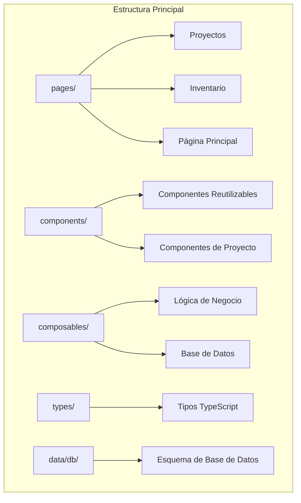
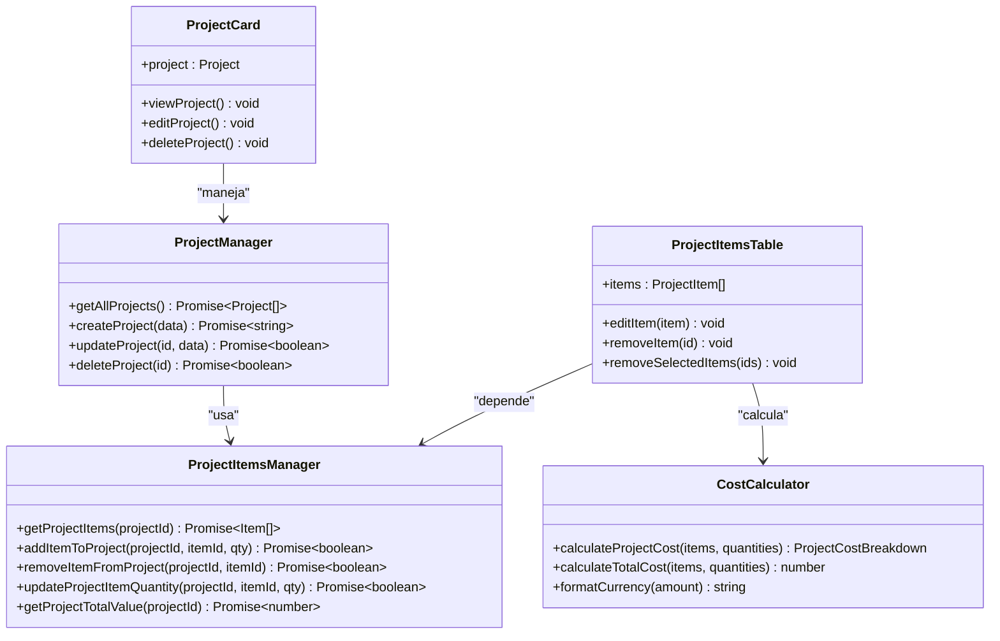
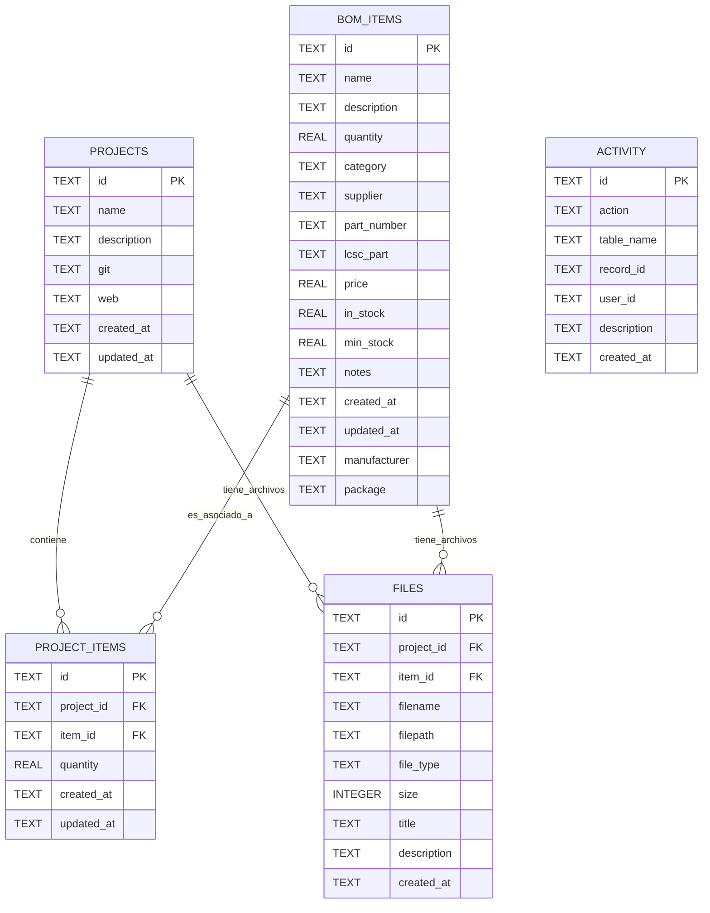
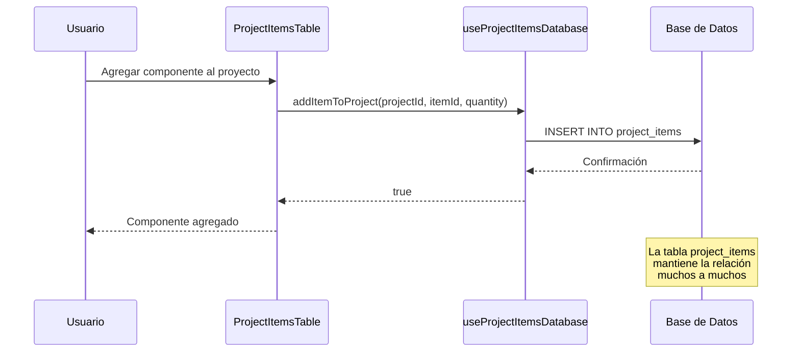
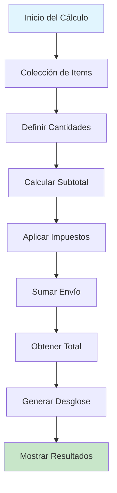
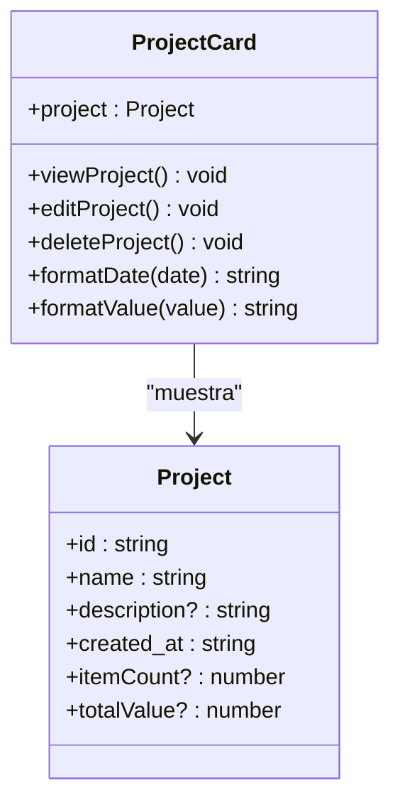
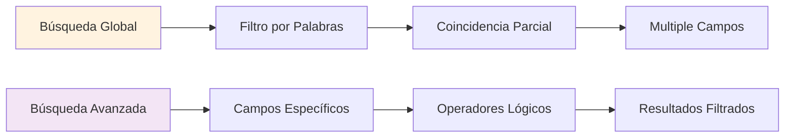
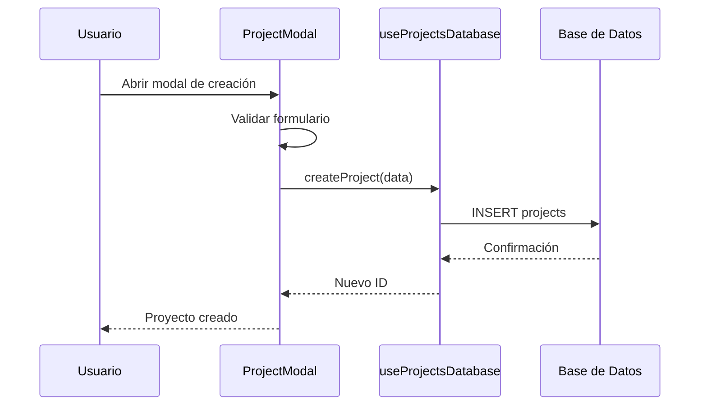
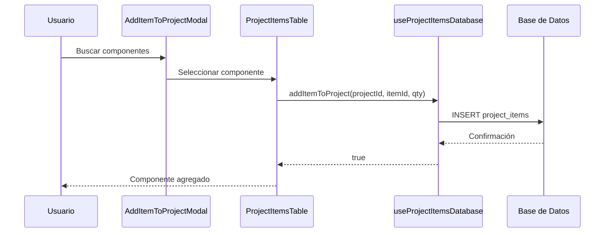

# Gestión de Proyectos

<cite>
**Archivos referenciados en este documento**
- [pages/projects/index.vue](file://pages/projects/index.vue)
- [pages/projects/[id].vue](file://pages/projects/[id].vue)
- [components/project/ProjectCard.vue](file://components/project/ProjectCard.vue)
- [components/project/ProjectItemsTable.vue](file://components/project/ProjectItemsTable.vue)
- [components/project/ProjectModal.vue](file://components/project/ProjectModal.vue)
- [components/AddItemToProjectModal.vue](file://components/AddItemToProjectModal.vue)
- [components/EditItemInProjectModal.vue](file://components/EditItemInProjectModal.vue)
- [composables/useProjectsDatabase.ts](file://composables/useProjectsDatabase.ts)
- [composables/useProjectItemsDatabase.ts](file://composables/useProjectItemsDatabase.ts)
- [composables/useCostCalculator.ts](file://composables/useCostCalculator.ts)
- [types/bom.ts](file://types/bom.ts)
- [data/db/schema.json](file://data/db/schema.json)
</cite>

## Tabla de Contenidos
1. [Introducción](#introducción)
2. [Estructura del Proyecto](#estructura-del-proyecto)
3. [Componentes Principales](#componentes-principales)
4. [Arquitectura de Gestión de Proyectos](#arquitectura-de-gestión-de-proyectos)
5. [Detalles de Implementación](#detalles-de-implementación)
6. [Relación Muchos a Muchos](#relación-muchos-a-muchos)
7. [Cálculo de Costos](#cálculo-de-costos)
8. [Interfaz de Usuario](#interfaz-de-usuario)
9. [Funcionalidades Avanzadas](#funcionalidades-avanzadas)
10. [Flujos de Trabajo](#flujos-de-trabajo)
11. [Mejores Prácticas](#mejores-practicas)
12. [Conclusión](#conclusión)

## Introducción

BOM Manager es una aplicación desarrollada en Vue 3/Nuxt 3 con Tauri que permite la gestión integral de proyectos electrónicos mediante la administración de Bill of Materials (BOM). El sistema proporciona herramientas completas para crear, editar y eliminar proyectos, asociar componentes de manera flexible, calcular costos totales y seguir el progreso de los proyectos.

La gestión de proyectos en BOM Manager se basa en una arquitectura moderna que combina componentes reutilizables, componibles para lógica de negocio y una base de datos SQLite local optimizada para el desarrollo frontend.

## Estructura del Proyecto

La aplicación sigue una estructura de carpetas organizada por funcionalidades:

**Diagrama fuente**
- [pages/projects/index.vue](file://pages/projects/index.vue#L1-L273)
- [components/project/ProjectCard.vue](file://components/project/ProjectCard.vue#L1-L109)

**Sección fuente**
- [README.md](file://README.md#L63-L79)

## Componentes Principales

### Vista de Lista de Proyectos

La interfaz principal de gestión de proyectos se encuentra en la ruta `/projects` y ofrece:

- **Tarjetas de Proyecto**: Vista en cuadrícula con información resumida
- **Búsqueda Avanzada**: Filtrado por nombre y descripción
- **Estadísticas**: Total de proyectos, activos y valor total
- **Acciones Rápidas**: Crear, editar y eliminar proyectos

### Vista Detallada del Proyecto

La ruta `/projects/[id]` proporciona una interfaz completa para el manejo de proyectos:

- **Panel de Estadísticas**: Items, stock OK, stock bajo y valor total
- **Tabla de Componentes**: Listado completo con operaciones CRUD
- **Módulos de Importación**: Soporte para archivos CSV y formatos específicos
- **Notificaciones**: Sistema de mensajes de estado

**Sección fuente**
- [pages/projects/index.vue](file://pages/projects/index.vue#L1-L273)
- [pages/projects/[id].vue](file://pages/projects/[id].vue#L1-L585)

## Arquitectura de Gestión de Proyectos

La arquitectura se basa en una capa de datos separada de la lógica de presentación:

**Diagrama fuente**
- [composables/useProjectsDatabase.ts](file://composables/useProjectsDatabase.ts#L12-L128)
- [composables/useProjectItemsDatabase.ts](file://composables/useProjectItemsDatabase.ts#L10-L144)
- [composables/useCostCalculator.ts](file://composables/useCostCalculator.ts#L22-L174)
- [components/project/ProjectCard.vue](file://components/project/ProjectCard.vue#L47-L109)
- [components/project/ProjectItemsTable.vue](file://components/project/ProjectItemsTable.vue#L145-L267)

## Detalles de Implementación

### Base de Datos y Esquema

La base de datos SQLite contiene cinco tablas principales:

**Diagrama fuente**
- [data/db/schema.json](file://data/db/schema.json#L1-L37)

### Gestión de Proyectos

Los componibles proporcionan métodos CRUD completos:

**Sección fuente**
- [composables/useProjectsDatabase.ts](file://composables/useProjectsDatabase.ts#L17-L36)
- [composables/useProjectsDatabase.ts](file://composables/useProjectsDatabase.ts#L51-L72)

### Gestión de Items de Proyecto

La relación muchos a muchos se maneja a través de la tabla `project_items`:

**Sección fuente**
- [composables/useProjectItemsDatabase.ts](file://composables/useProjectItemsDatabase.ts#L15-L32)
- [composables/useProjectItemsDatabase.ts](file://composables/useProjectItemsDatabase.ts#L34-L55)

## Relación Muchos a Muchos

La relación entre proyectos y componentes se implementa mediante una tabla intermedia:

**Diagrama fuente**
- [composables/useProjectItemsDatabase.ts](file://composables/useProjectItemsDatabase.ts#L34-L55)
- [data/db/schema.json](file://data/db/schema.json#L20-L22)

**Sección fuente**
- [composables/useProjectItemsDatabase.ts](file://composables/useProjectItemsDatabase.ts#L117-L134)

## Cálculo de Costos

El sistema implementa un cálculo de costos detallado con impuestos y envío:

**Diagrama fuente**
- [composables/useCostCalculator.ts](file://composables/useCostCalculator.ts#L30-L74)

### Características del Cálculo

- **Impuestos**: Tasa configurable (por defecto 19%)
- **Envío**: Costo adicional configurable
- **Moneda**: Soporte para múltiples divisas
- **Desglose Detallado**: Costo unitario, total por ítem y totales

**Sección fuente**
- [composables/useCostCalculator.ts](file://composables/useCostCalculator.ts#L22-L174)

## Interfaz de Usuario

### Tarjeta de Proyecto

La interfaz de tarjeta muestra información resumida con acciones rápidas:

**Diagrama fuente**
- [components/project/ProjectCard.vue](file://components/project/ProjectCard.vue#L62-L109)

### Tabla de Componentes

La tabla de componentes incluye:

- **Filtrado Avanzado**: Búsqueda por múltiples campos
- **Selección Múltiple**: Checkbox para operaciones grupales
- **Indicadores de Stock**: Colores para estado de inventario
- **Edición Directa**: Acciones inline para modificar ítems

**Sección fuente**
- [components/project/ProjectItemsTable.vue](file://components/project/ProjectItemsTable.vue#L1-L267)

### Modal de Edición

El modal de edición permite modificar todos los atributos del componente:

**Sección fuente**
- [components/EditItemInProjectModal.vue](file://components/EditItemInProjectModal.vue#L1-L242)

## Funcionalidades Avanzadas

### Búsqueda y Filtrado

El sistema implementa búsquedas avanzadas tanto en la vista de lista como en la vista detallada:

**Diagrama fuente**
- [pages/projects/index.vue](file://pages/projects/index.vue#L173-L180)
- [pages/projects/[id].vue](file://pages/projects/[id].vue#L225-L247)

### Importación de Componentes

Soporte para importar componentes desde archivos:

**Sección fuente**
- [pages/projects/[id].vue](file://pages/projects/[id].vue#L490-L539)

### Notificaciones y Confirmaciones

Sistema de notificaciones tipo Toast y confirmaciones modales:

**Sección fuente**
- [pages/projects/[id].vue](file://pages/projects/[id].vue#L562-L571)

## Flujos de Trabajo

### Flujo de Creación de Proyecto

**Diagrama fuente**
- [components/project/ProjectModal.vue](file://components/project/ProjectModal.vue#L631-L667)
- [composables/useProjectsDatabase.ts](file://composables/useProjectsDatabase.ts#L51-L72)

### Flujo de Asociación de Componentes

**Diagrama fuente**
- [components/AddItemToProjectModal.vue](file://components/AddItemToProjectModal.vue#L104-L107)
- [components/project/ProjectItemsTable.vue](file://components/project/ProjectItemsTable.vue#L222-L228)
- [composables/useProjectItemsDatabase.ts](file://composables/useProjectItemsDatabase.ts#L34-L55)

## Mejores Prácticas

### Gestión de Cantidades

- **Valores por Defecto**: Cantidad mínima de 1 para evitar errores
- **Validación en Tiempo Real**: Control de valores numéricos
- **Actualización Automática**: Recálculo de costos tras cambios

### Manejo de Stock

- **Indicadores Visuales**: Colores para estados de stock (agotado, bajo, ok)
- **Alertas Personalizadas**: Niveles mínimos configurables
- **Seguimiento de Inventario**: Monitoreo continuo de disponibilidad

### Organización de Proyectos

- **Categorización**: Clasificación por categorías y proveedores
- **Documentación**: Soporte para archivos PDF y thumbnails
- **Versionado**: Registro de actividades y cambios

## Conclusión

BOM Manager proporciona una solución completa para la gestión de proyectos electrónicos con una arquitectura sólida y funcionalidades avanzadas. La implementación de la relación muchos a muchos entre proyectos y componentes, junto con el cálculo detallado de costos y el manejo eficiente de inventario, permite una experiencia de usuario fluida y poderosa.

Los componentes reutilizables y la separación clara de responsabilidades facilitan el mantenimiento y la extensión del sistema, mientras que la base de datos SQLite ofrece rendimiento óptimo para aplicaciones de escritorio.

La combinación de interfaces intuitivas, funcionalidades avanzadas de búsqueda y filtrado, y un sistema de notificaciones efectivo convierte a BOM Manager en una herramienta indispensable para la gestión de proyectos electrónicos modernos.