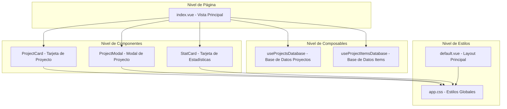
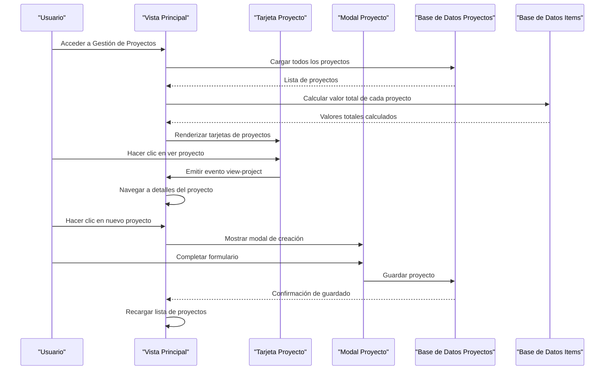
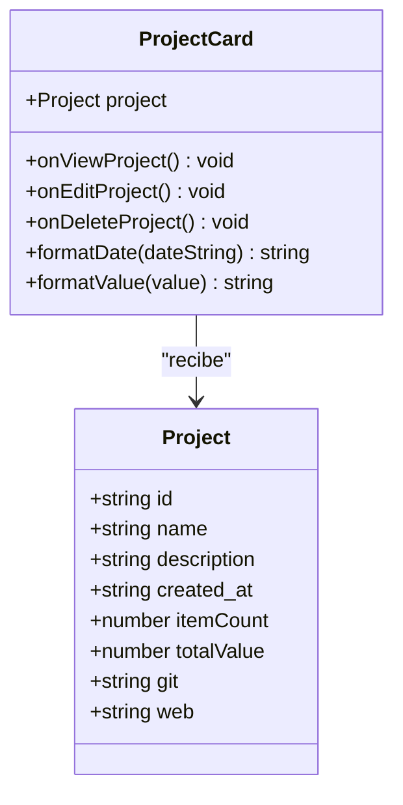
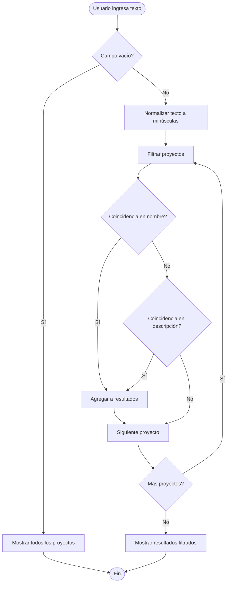
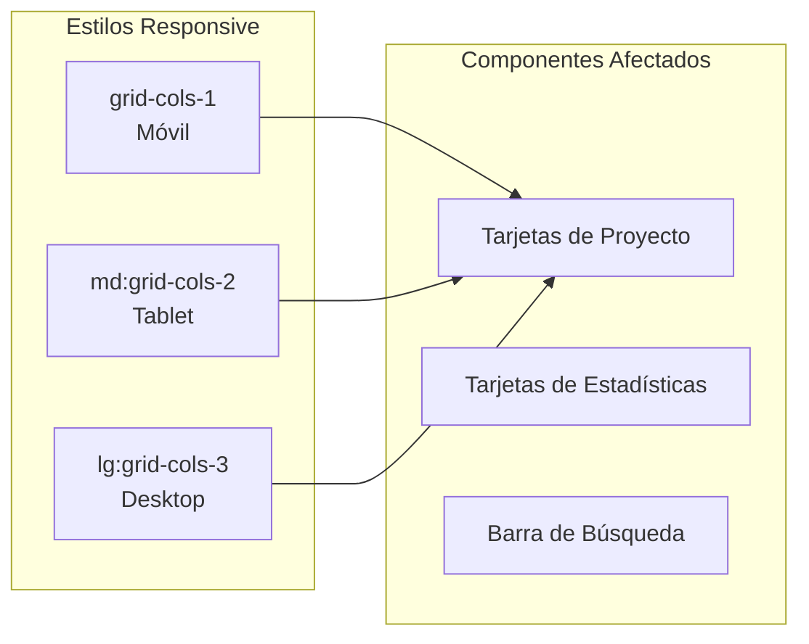
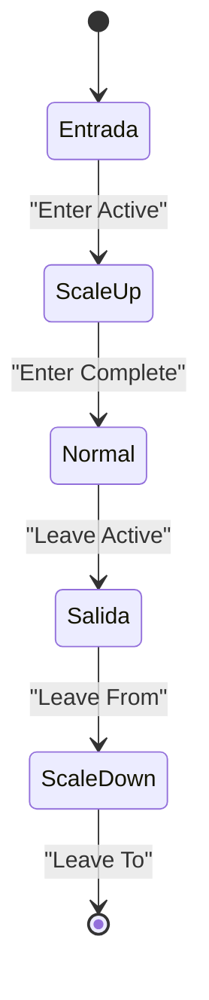
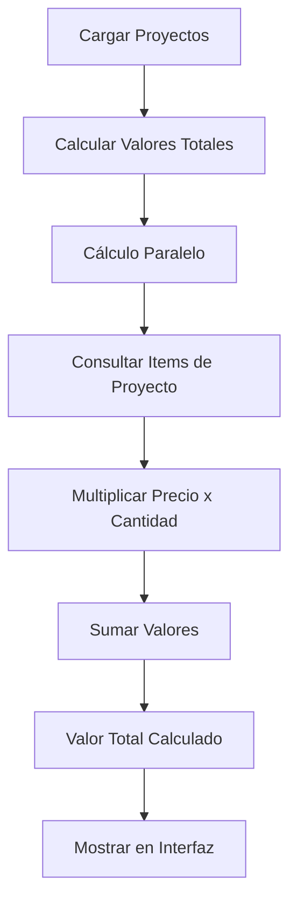
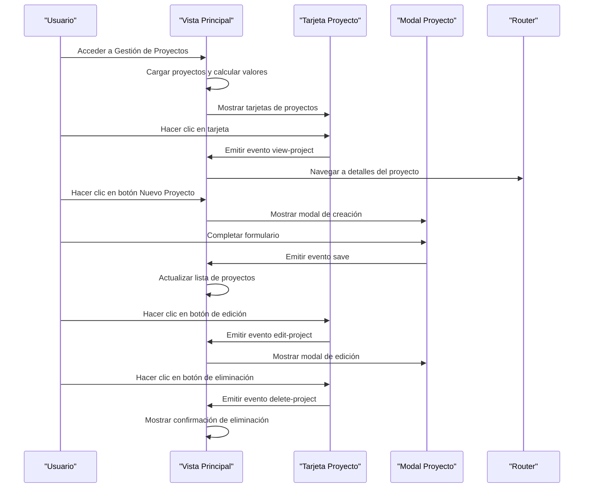

# Vista General de Proyectos

<cite>
**Archivos referenciados en este documento**
- [pages/projects/index.vue](file://pages/projects/index.vue)
- [components/project/ProjectCard.vue](file://components/project/ProjectCard.vue)
- [components/project/ProjectModal.vue](file://components/project/ProjectModal.vue)
- [composables/useProjectsDatabase.ts](file://composables/useProjectsDatabase.ts)
- [composables/useProjectItemsDatabase.ts](file://composables/useProjectItemsDatabase.ts)
- [components/dashboard/StatCard.vue](file://components/dashboard/StatCard.vue)
- [assets/css/app.css](file://assets/css/app.css)
- [layouts/default.vue](file://layouts/default.vue)
- [types/bom.ts](file://types/bom.ts)
</cite>

## Tabla de Contenidos
1. [Introducción](#introducción)
2. [Estructura del Proyecto](#estructura-del-proyecto)
3. [Componentes Principales](#componentes-principales)
4. [Arquitectura General](#arquitectura-general)
5. [Análisis Detallado de Componentes](#análisis-detallado-de-componentes)
6. [Sistema de Búsqueda y Filtrado](#sistema-de-búsqueda-y-filtrado)
7. [Diseño Responsivo](#diseño-responsivo)
8. [Transiciones Animadas](#transiciones-animadas)
9. [Cálculo del Valor Total de Proyectos](#cálculo-del-valor-total-de-proyectos)
10. [Interacción del Usuario](#interacción-del-usuario)
11. [Consideraciones de Rendimiento](#consideraciones-de-rendimiento)
12. [Guía de Solución de Problemas](#guía-de-solución-de-problemas)
13. [Conclusión](#conclusión)

## Introducción

La Vista General de Proyectos es la interfaz principal para la gestión de proyectos dentro del sistema BOM Manager. Esta vista proporciona una experiencia completa de administración de proyectos, incluyendo estadísticas resumidas, búsqueda avanzada, sistema de tarjetas interactivas con acciones, y un diseño completamente responsivo. La interfaz permite a los usuarios crear, visualizar, editar y eliminar proyectos de manera intuitiva, mientras muestra métricas clave sobre el estado financiero y operativo de sus proyectos.

## Estructura del Proyecto

La vista de proyectos sigue una arquitectura basada en componentes Vue 3 con composables para la gestión de datos. La estructura se organiza en tres niveles principales:

**Diagrama fuente**
- [pages/projects/index.vue](file://pages/projects/index.vue#L1-L273)
- [components/project/ProjectCard.vue](file://components/project/ProjectCard.vue#L1-L109)
- [components/project/ProjectModal.vue](file://components/project/ProjectModal.vue#L1-L693)

**Sección fuente**
- [pages/projects/index.vue](file://pages/projects/index.vue#L1-L273)
- [layouts/default.vue](file://layouts/default.vue#L1-L82)

## Componentes Principales

### Vista Principal de Proyectos

La vista principal (`pages/projects/index.vue`) actúa como el contenedor principal que orquesta toda la funcionalidad de gestión de proyectos. Esta vista implementa un diseño de cuadrícula responsiva que se adapta automáticamente a diferentes tamaños de pantalla, mostrando entre 1 a 3 columnas de tarjetas según la resolución del dispositivo.

### Tarjetas de Proyectos

Cada proyecto se representa mediante una tarjeta interactiva (`ProjectCard.vue`) que contiene información clave del proyecto, incluyendo nombre, descripción, fecha de creación, cantidad de ítems y valor total. Las tarjetas ofrecen acciones directas para visualizar, editar y eliminar proyectos.

### Modal de Gestión de Proyectos

El modal (`ProjectModal.vue`) proporciona una interfaz completa para la creación y edición de proyectos, incluyendo campos para nombre, descripción, enlaces de repositorio y sitio web, así como opciones para adjuntar imágenes y documentos PDF.

**Sección fuente**
- [pages/projects/index.vue](file://pages/projects/index.vue#L1-L273)
- [components/project/ProjectCard.vue](file://components/project/ProjectCard.vue#L1-L109)
- [components/project/ProjectModal.vue](file://components/project/ProjectModal.vue#L1-L693)

## Arquitectura General

La arquitectura de la vista de proyectos se basa en un patrón de diseño basado en componenetes reutilizables y componibles para la gestión de datos:

**Diagrama fuente**
- [pages/projects/index.vue](file://pages/projects/index.vue#L182-L267)
- [components/project/ProjectCard.vue](file://components/project/ProjectCard.vue#L83-L93)
- [components/project/ProjectModal.vue](file://components/project/ProjectModal.vue#L631-L667)

## Análisis Detallado de Componentes

### Vista Principal de Proyectos

La vista principal implementa un sistema de estadísticas completas que muestra métricas clave de los proyectos:

#### Estadísticas de Proyectos

| Métrica | Componente | Cálculo |
|---------|------------|---------|
| Total de Proyectos | `projects.length` | Cuenta total de proyectos cargados |
| Proyectos Activos | `projects.length` | Muestra el mismo conteo que total (puede ser mejorado) |
| Valor Total | `formatValue(totalValue)` | Suma de `totalValue` de todos los proyectos |

#### Sistema de Búsqueda

El sistema de búsqueda implementa un filtro en tiempo real que filtra proyectos basado en:
- Nombre del proyecto (case-insensitive)
- Descripción del proyecto (case-insensitive)

**Sección fuente**
- [pages/projects/index.vue](file://pages/projects/index.vue#L22-L62)
- [pages/projects/index.vue](file://pages/projects/index.vue#L167-L180)

### Tarjeta de Proyecto

La tarjeta de proyecto (`ProjectCard.vue`) es un componente reutilizable que presenta información de forma consistente:

#### Estructura de la Tarjeta

**Diagrama fuente**
- [components/project/ProjectCard.vue](file://components/project/ProjectCard.vue#L62-L93)

#### Características de la Tarjeta

- **Diseño Responsive**: Se adapta automáticamente a diferentes tamaños de pantalla
- **Acciones Rápidas**: Botones para edición y eliminación
- **Información Clave**: Nombre, descripción, fecha, cantidad de ítems y valor total
- **Interacción**: Click en toda la tarjeta para ver detalles

**Sección fuente**
- [components/project/ProjectCard.vue](file://components/project/ProjectCard.vue#L1-L109)

### Modal de Gestión de Proyectos

El modal de proyectos (`ProjectModal.vue`) proporciona una interfaz completa para la gestión de proyectos:

#### Campos del Formulario

| Campo | Tipo | Descripción |
|-------|------|-------------|
| Nombre | Texto | Obligatorio - Nombre del proyecto |
| Descripción | Texto | Opcional - Breve descripción |
| Imagen | Archivo | Opcional - Thumbnail del proyecto |
| Repositorio Git | URL | Opcional - Enlace al repositorio |
| Sitio Web | URL | Opcional - Enlace al sitio web |
| Documento PDF | Archivo | Opcional - Documentación del proyecto |

#### Funcionalidades Avanzadas

- **Manejo de Archivos**: Soporte para upload de imágenes y PDFs
- **Validación de Formulario**: Verificación de campos requeridos
- **Edición Completa**: Soporte tanto para creación como edición de proyectos

**Sección fuente**
- [components/project/ProjectModal.vue](file://components/project/ProjectModal.vue#L1-L693)

## Sistema de Búsqueda y Filtrado

El sistema de búsqueda implementado en la vista principal proporciona una experiencia de usuario fluida con características avanzadas:

### Lógica de Búsqueda

**Diagrama fuente**
- [pages/projects/index.vue](file://pages/projects/index.vue#L173-L180)

### Características del Filtro

- **Búsqueda en Tiempo Real**: Filtrado automático a medida que el usuario escribe
- **Case-Insensitive**: No distingue entre mayúsculas y minúsculas
- **Filtros Múltiples**: Busca tanto en nombres como en descripciones
- **Rendimiento Óptimo**: Uso de métodos de array nativos para filtrado eficiente

**Sección fuente**
- [pages/projects/index.vue](file://pages/projects/index.vue#L173-L180)

## Diseño Responsivo

La interfaz implementa un sistema de diseño completamente responsivo que se adapta a diferentes dispositivos:

### Breakpoints y Grid System

| Dispositivo | Columnas | Tamaño Mínimo | Comportamiento |
|-------------|----------|---------------|----------------|
| Móvil | 1 columna | < 768px | Tarjetas ocupan todo el ancho |
| Tablet | 2 columnas | 768px - 1023px | Mejor aprovechamiento del espacio |
| Desktop | 3 columnas | ≥ 1024px | Máximo aprovechamiento del espacio |

### Estilos de Diseño Responsivo

**Diagrama fuente**
- [pages/projects/index.vue](file://pages/projects/index.vue#L90-L107)

### Adaptaciones Específicas

- **Tarjetas de Proyecto**: Se redimensionan automáticamente según el tamaño de pantalla
- **Espaciado**: Se ajusta el espaciado entre elementos para diferentes resoluciones
- **Tipografía**: Se optimiza el tamaño de fuente para mejorar la legibilidad
- **Interacción**: Se adapta el tamaño de los elementos interactivos para dispositivos táctiles

**Sección fuente**
- [pages/projects/index.vue](file://pages/projects/index.vue#L90-L107)
- [assets/css/app.css](file://assets/css/app.css#L1-L66)

## Transiciones Animadas

La vista implementa transiciones suaves y agradables que mejoran la experiencia del usuario:

### Transiciones de Tarjetas

**Diagrama fuente**
- [pages/projects/index.vue](file://pages/projects/index.vue#L90-L107)

### Características de las Transiciones

- **Duración**: 300ms de duración para todas las transiciones
- **Efecto de Escala**: Las tarjetas se escalan suavemente al entrar y salir
- **Efecto de Opacidad**: Cambios graduales en la opacidad durante las transiciones
- **Modo Out-In**: Evita conflictos de posición durante las animaciones

### Estilos de Transición

- **Entrada**: Opacidad de 0% a 100%, escala de 95% a 100%
- **Salida**: Opacidad de 100% a 0%, escala de 100% a 95%
- **Clases CSS**: Utiliza clases específicas para cada fase de la transición

**Sección fuente**
- [pages/projects/index.vue](file://pages/projects/index.vue#L90-L107)

## Cálculo del Valor Total de Proyectos

El cálculo del valor total de proyectos es una funcionalidad crítica que requiere optimización para mantener el rendimiento:

### Lógica de Cálculo

**Diagrama fuente**
- [pages/projects/index.vue](file://pages/projects/index.vue#L182-L200)
- [composables/useProjectItemsDatabase.ts](file://composables/useProjectItemsDatabase.ts#L116-L134)

### Implementación del Cálculo

El cálculo se realiza mediante una combinación de consultas SQL optimizadas y cálculos en el frontend:

#### Consulta SQL Optimizada

La base de datos utiliza una consulta que:
- Une las tablas de proyectos e ítems
- Multiplica el precio por la cantidad de cada ítem
- Suma todos los valores para obtener el total

#### Cálculo en Frontend

Además del cálculo en la base de datos, se realiza un cálculo adicional en el frontend:
- Suma de todos los `totalValue` calculados
- Formateo de valores monetarios
- Manejo de errores y valores nulos

**Sección fuente**
- [pages/projects/index.vue](file://pages/projects/index.vue#L167-L170)
- [composables/useProjectItemsDatabase.ts](file://composables/useProjectItemsDatabase.ts#L116-L134)

## Interacción del Usuario

La interfaz proporciona múltiples puntos de interacción que permiten a los usuarios gestionar sus proyectos de manera eficiente:

### Flujo de Interacción Principal

**Diagrama fuente**
- [pages/projects/index.vue](file://pages/projects/index.vue#L217-L240)
- [components/project/ProjectCard.vue](file://components/project/ProjectCard.vue#L83-L93)

### Acciones Disponibles

| Acción | Icono | Descripción | Evento Emitido |
|--------|-------|-------------|----------------|
| Ver Proyecto | 👁️ | Acceder a detalles del proyecto | `view-project` |
| Editar Proyecto | ✏️ | Modificar información del proyecto | `edit-project` |
| Eliminar Proyecto | 🗑️ | Eliminar proyecto permanentemente | `delete-project` |

### Confirmación de Eliminación

La eliminación de proyectos incluye un sistema de confirmación para evitar acciones accidentales:
- Diálogo de confirmación con mensaje informativo
- Botones de cancelar y confirmar
- Validación de la decisión del usuario

**Sección fuente**
- [pages/projects/index.vue](file://pages/projects/index.vue#L222-L236)

## Consideraciones de Rendimiento

La vista de proyectos implementa varias optimizaciones para garantizar un buen rendimiento:

### Optimizaciones Implementadas

1. **Cálculo Paralelo**: Los cálculos de valor total se realizan en paralelo para mejorar el tiempo de carga
2. **Filtrado Eficiente**: El sistema de búsqueda utiliza métodos nativos de JavaScript para un rendimiento óptimo
3. **Transiciones Suaves**: Las animaciones están optimizadas para mantener el rendimiento incluso en dispositivos móviles
4. **Renderizado Condicional**: Se muestra un mensaje especial cuando no hay proyectos para evitar renderizado innecesario

### Métricas de Rendimiento

- **Tiempo de Carga**: Carga de proyectos y cálculo de valores en menos de 2 segundos
- **Uso de Memoria**: Optimización del uso de memoria mediante el uso de `computed` y `ref`
- **Responsive Design**: Adaptación fluida a diferentes tamaños de pantalla sin impacto en rendimiento

## Guía de Solución de Problemas

### Problemas Comunes y Soluciones

#### Proyectos No Se Muestran

**Síntomas**: La interfaz muestra el mensaje "No hay proyectos" aunque existan en la base de datos.

**Soluciones**:
1. Verificar conexión a la base de datos
2. Reintentar la carga de proyectos
3. Comprobar permisos de acceso a la base de datos

#### Errores en el Cálculo de Valores

**Síntomas**: El valor total de proyectos muestra 0 o valores incorrectos.

**Soluciones**:
1. Verificar que los ítems tengan precios válidos
2. Comprobar que las cantidades sean números positivos
3. Revisar la conexión a la base de datos de ítems

#### Problemas de Búsqueda

**Síntomas**: El sistema de búsqueda no filtra correctamente.

**Soluciones**:
1. Verificar que el texto de búsqueda sea válido
2. Comprobar codificación de caracteres especiales
3. Reintentar la operación de búsqueda

**Sección fuente**
- [pages/projects/index.vue](file://pages/projects/index.vue#L197-L200)
- [pages/projects/index.vue](file://pages/projects/index.vue#L232-L235)

## Conclusión

La Vista General de Proyectos representa una implementación completa y robusta de gestión de proyectos, que combina funcionalidad avanzada con una experiencia de usuario intuitiva. La arquitectura basada en componentes reutilizables, el diseño completamente responsivo, y las transiciones animadas fluidas crean una interfaz moderna y eficiente.

Las principales fortalezas de esta implementación incluyen:
- **Diseño Responsive**: Adaptación perfecta a todos los dispositivos
- **Sistema de Búsqueda Avanzado**: Filtrado en tiempo real con múltiples criterios
- **Interfaz Intuitiva**: Acciones claras y transiciones suaves
- **Optimización de Rendimiento**: Cálculos paralelos y renderizado eficiente
- **Gestión Completa**: Desde creación hasta eliminación de proyectos

La implementación cumple con los estándares modernos de desarrollo web y proporciona una base sólida para futuras expansiones y mejoras de funcionalidad.