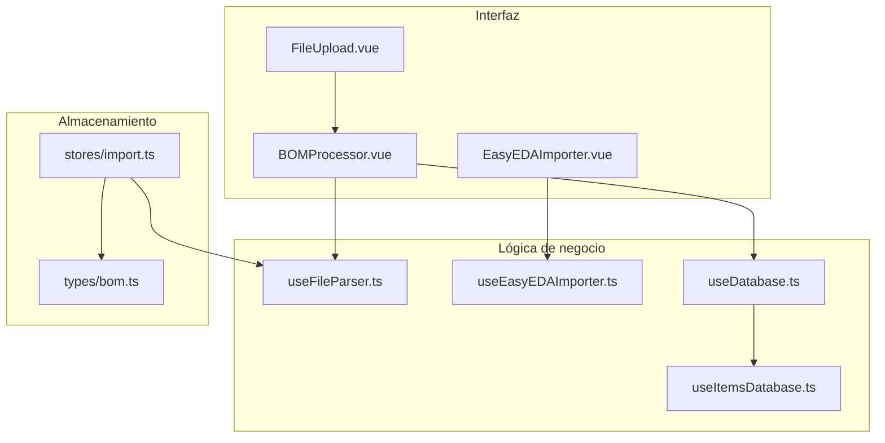
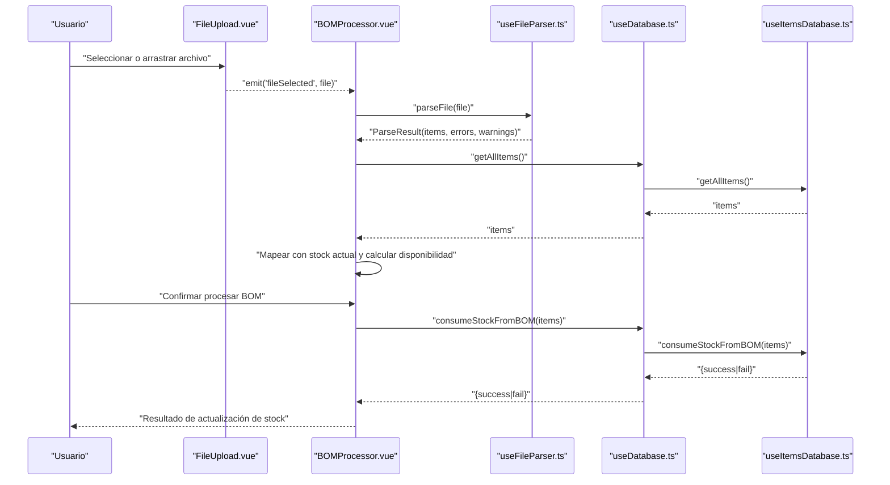
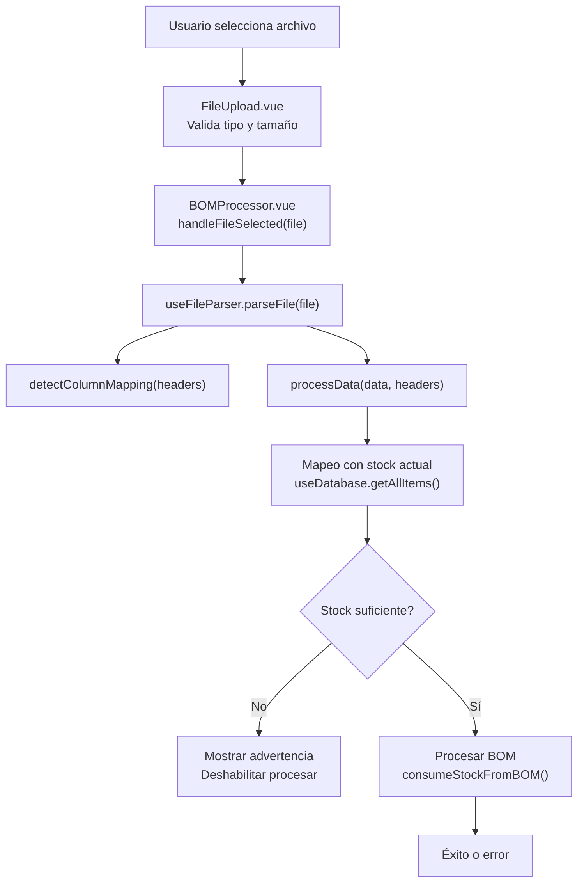
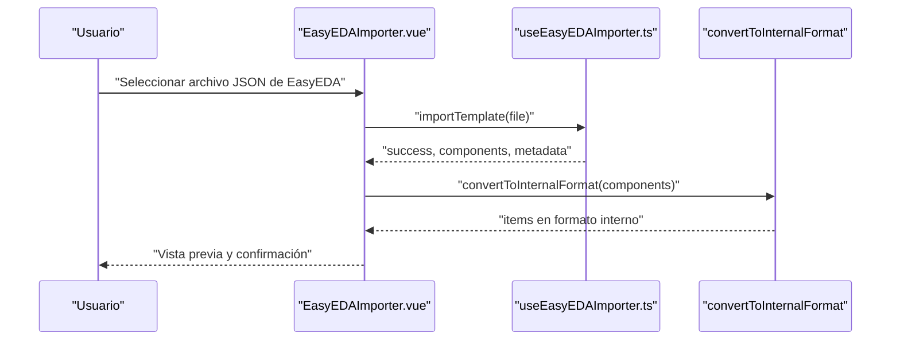
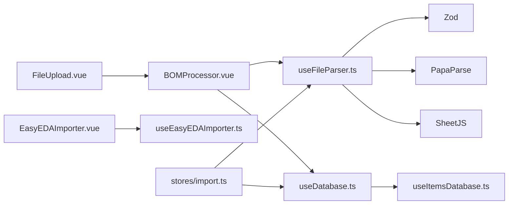

# Importación de BOM

<cite>
**Archivos citados en este documento**
- [BOMProcessor.vue](file://components/BOMProcessor.vue)
- [EasyEDAImporter.vue](file://components/EasyEDAImporter.vue)
- [useFileParser.ts](file://composables/useFileParser.ts)
- [useEasyEDAImporter.ts](file://composables/useEasyEDAImporter.ts)
- [useDatabase.ts](file://composables/useDatabase.ts)
- [useItemsDatabase.ts](file://composables/useItemsDatabase.ts)
- [FileUpload.vue](file://components/FileUpload.vue)
- [stores/import.ts](file://stores/import.ts)
- [types/bom.ts](file://types/bom.ts)
- [MANEJO_ARCHIVOS.md](file://wiki/MANEJO_ARCHIVOS.md)
- [EASYEDA_API_INTEGRATION.md](file://wiki/EASYEDA_API_INTEGRATION.md)
</cite>

## Índice
1. [Introducción](#introducción)
2. [Estructura del proyecto](#estructura-del-proyecto)
3. [Componentes principales](#componentes-principales)
4. [Arquitectura general](#arquitectura-general)
5. [Análisis detallado de componentes](#análisis-detallado-de-componentes)
6. [Análisis de dependencias](#análisis-de-dependencias)
7. [Consideraciones de rendimiento](#consideraciones-de-rendimiento)
8. [Guía de solución de problemas](#guía-de-solución-de-problemas)
9. [Conclusiones](#conclusiones)
10. [Apéndices](#apéndices)

## Introducción
Este documento explica cómo se realiza la importación de listas de materiales (BOM) en la aplicación, desde la selección de archivos CSV/XLSX hasta el procesamiento, validación, mapeo de columnas y actualización del stock. También describe la integración con EasyEDA mediante la importación de plantillas JSON, extracción de componentes y conversión al formato interno del sistema. Se cubren formatos soportados, plantillas recomendadas, límites de tamaño, tiempos de procesamiento y casos de uso comunes.

## Estructura del proyecto
La funcionalidad de importación se distribuye entre componentes de interfaz, componibles (composables) de lógica de negocio y almacén de estado (store). Los flujos principales son:
- Importación de BOM desde archivos locales (CSV/XLSX).
- Importación de plantillas EasyEDA desde JSON.
Ambos flujos pasan por validación, mapeo de columnas, y operaciones de base de datos.

**Diagrama fuente**
- [FileUpload.vue](file://components/FileUpload.vue#L1-L283)
- [BOMProcessor.vue](file://components/BOMProcessor.vue#L1-L387)
- [EasyEDAImporter.vue](file://components/EasyEDAImporter.vue#L1-L311)
- [useFileParser.ts](file://composables/useFileParser.ts#L1-L422)
- [useEasyEDAImporter.ts](file://composables/useEasyEDAImporter.ts#L1-L187)
- [useDatabase.ts](file://composables/useDatabase.ts#L1-L89)
- [useItemsDatabase.ts](file://composables/useItemsDatabase.ts#L1-L346)
- [stores/import.ts](file://stores/import.ts#L1-L344)
- [types/bom.ts](file://types/bom.ts#L1-L47)

**Sección fuente**
- [FileUpload.vue](file://components/FileUpload.vue#L1-L283)
- [BOMProcessor.vue](file://components/BOMProcessor.vue#L1-L387)
- [EasyEDAImporter.vue](file://components/EasyEDAImporter.vue#L1-L311)
- [useFileParser.ts](file://composables/useFileParser.ts#L1-L422)
- [useEasyEDAImporter.ts](file://composables/useEasyEDAImporter.ts#L1-L187)
- [useDatabase.ts](file://composables/useDatabase.ts#L1-L89)
- [useItemsDatabase.ts](file://composables/useItemsDatabase.ts#L1-L346)
- [stores/import.ts](file://stores/import.ts#L1-L344)
- [types/bom.ts](file://types/bom.ts#L1-L47)

## Componentes principales
- FileUpload.vue: Permite arrastrar o seleccionar archivos CSV/XLS/XLSX, validando tipo y tamaño, y emitiendo eventos al padre.
- BOMProcessor.vue: Ventana modal que recibe el archivo, lo parsea, muestra una vista previa, mapea con stock actual y permite procesar el BOM actualizando el inventario.
- useFileParser.ts: Contiene la lógica de detección automática de columnas, parseo de CSV/XLSX, validación Zod y transformación a items internos.
- EasyEDAImporter.vue: Interfaz para importar plantillas JSON de EasyEDA, mostrar metadatos y componentes, y convertirlos al formato interno.
- useEasyEDAImporter.ts: Lee y valida archivos JSON de EasyEDA, extrae componentes de múltiples ubicaciones, y convierte al formato interno.
- useDatabase.ts y useItemsDatabase.ts: Interfaces de base de datos para operaciones CRUD, actualización de stock y descontar stock desde BOM.
- stores/import.ts: Almacén de estado para la importación paso a paso, mapeo de columnas y confirmación de importación.
- types/bom.ts: Tipos de datos para BOMItem y otros modelos relacionados.

**Sección fuente**
- [FileUpload.vue](file://components/FileUpload.vue#L1-L283)
- [BOMProcessor.vue](file://components/BOMProcessor.vue#L1-L387)
- [useFileParser.ts](file://composables/useFileParser.ts#L1-L422)
- [EasyEDAImporter.vue](file://components/EasyEDAImporter.vue#L1-L311)
- [useEasyEDAImporter.ts](file://composables/useEasyEDAImporter.ts#L1-L187)
- [useDatabase.ts](file://composables/useDatabase.ts#L1-L89)
- [useItemsDatabase.ts](file://composables/useItemsDatabase.ts#L1-L346)
- [stores/import.ts](file://stores/import.ts#L1-L344)
- [types/bom.ts](file://types/bom.ts#L1-L47)

## Arquitectura general
Flujo de importación de BOM desde archivo:
1. El usuario selecciona o arrastra un archivo en FileUpload.vue.
2. BOMProcessor.vue recibe el archivo y lo pasa a useFileParser.parseFile().
3. useFileParser.detectColumnMapping() detecta automáticamente columnas clave.
4. useFileParser.processData() convierte filas en items internos y aplica validación Zod.
5. BOMProcessor.vue mapea los items con stock actual desde useDatabase.useItemsDatabase.getAllItems() y calcula disponibilidad.
6. Al confirmar, se llama a useDatabase.useItemsDatabase.consumeStockFromBOM() para descontar stock.

**Diagrama fuente**
- [FileUpload.vue](file://components/FileUpload.vue#L1-L283)
- [BOMProcessor.vue](file://components/BOMProcessor.vue#L1-L387)
- [useFileParser.ts](file://composables/useFileParser.ts#L1-L422)
- [useDatabase.ts](file://composables/useDatabase.ts#L1-L89)
- [useItemsDatabase.ts](file://composables/useItemsDatabase.ts#L1-L346)

## Análisis detallado de componentes

### Procesamiento de archivos CSV/XLSX
- Detección automática de columnas: useFileParser.detectColumnMapping() compara encabezados con patrones clave (nombre, cantidad, proveedor, número de parte, LCSC, categoría, precio, stock mínimo, notas, fabricante, empaque, fecha código/lote, estado, etc.).
- Parseo:
  - CSV: Se usa papaparse con cabecera, tipado dinámico y salto de líneas vacías.
  - XLS/XLSX: Se usa SheetJS (xlsx) para leer binariamente, tomar la primera hoja y convertir a JSON.
- Validación: Zod aplica reglas de tipo y rangos (por ejemplo, cantidad >= 0). Se generan errores por fila y advertencias cuando faltan columnas esenciales.
- Transformación: processData() mapea valores, convierte numéricos, normaliza strings y asegura valores mínimos (ej. nombre predeterminado si falta).
- Resultado: ParseResult con items válidos, errores y advertencias, además de campos originales y valores de datos.

**Sección fuente**
- [useFileParser.ts](file://composables/useFileParser.ts#L1-L422)
- [types/bom.ts](file://types/bom.ts#L1-L47)

### Mapeo de columnas y validación
- Columnas clave detectadas automáticamente: name, quantity, description, category, supplier, partNumber, lcscPart, price, minStock, notes, manufacturer, package, dateCodeLotNo, status.
- Reglas de validación:
  - name: obligatorio.
  - quantity: numérico y >= 0.
  - price, minStock, leadTime, extPrice: numéricos y >= 0 (si se proveen).
  - Otros campos: strings opcionales.
- Advertencias:
  - Si no se detecta name o quantity, se emite una advertencia.
  - Si hay errores pero algunos items son válidos, se informa cuántos se procesaron correctamente.

**Sección fuente**
- [useFileParser.ts](file://composables/useFileParser.ts#L1-L422)

### Flujo de importación de BOM (desde selección hasta procesamiento)
- FileUpload.vue:
  - Valida tipo de archivo (.csv, .xlsx, .xls) y tamaño máximo configurable.
  - Emite eventos de error o fileSelected.
- BOMProcessor.vue:
  - Recibe el archivo, llama a parseFile().
  - Muestra vista previa de componentes y resumen de stock suficiente/insuficiente.
  - Al confirmar, descontar stock con consumeStockFromBOM() y notificar resultado.

**Diagrama fuente**
- [FileUpload.vue](file://components/FileUpload.vue#L1-L283)
- [BOMProcessor.vue](file://components/BOMProcessor.vue#L1-L387)
- [useFileParser.ts](file://composables/useFileParser.ts#L1-L422)
- [useDatabase.ts](file://composables/useDatabase.ts#L1-L89)
- [useItemsDatabase.ts](file://composables/useItemsDatabase.ts#L1-L346)

**Sección fuente**
- [FileUpload.vue](file://components/FileUpload.vue#L1-L283)
- [BOMProcessor.vue](file://components/BOMProcessor.vue#L1-L387)
- [useFileParser.ts](file://composables/useFileParser.ts#L1-L422)
- [useDatabase.ts](file://composables/useDatabase.ts#L1-L89)
- [useItemsDatabase.ts](file://composables/useItemsDatabase.ts#L1-L346)

### Integración con EasyEDA (plantillas JSON)
- EasyEDAImporter.vue:
  - Permite arrastrar o seleccionar un archivo .json.
  - Muestra estados de carga, errores y resultados con metadatos y vista previa de componentes.
  - Al confirmar, convierte componentes a formato interno.
- useEasyEDAImporter.ts:
  - Valida extensión y estructura JSON.
  - Extrae componentes de varias ubicaciones (head.symbols, modules.symbols, shapes con type='lib', parts).
  - Extrae metadatos (título, autor, cantidad de componentes).
  - Convierte a formato interno: name, description, category, supplier, part_number, lcsc_part, unit, quantity, notes.

**Diagrama fuente**
- [EasyEDAImporter.vue](file://components/EasyEDAImporter.vue#L1-L311)
- [useEasyEDAImporter.ts](file://composables/useEasyEDAImporter.ts#L1-L187)

**Sección fuente**
- [EasyEDAImporter.vue](file://components/EasyEDAImporter.vue#L1-L311)
- [useEasyEDAImporter.ts](file://composables/useEasyEDAImporter.ts#L1-L187)
- [EASYEDA_API_INTEGRATION.md](file://wiki/EASYEDA_API_INTEGRATION.md#L1-L114)

### Almacenamiento de imágenes y PDFs (contexto)
- En entornos Tauri (escritorio) se pueden almacenar imágenes/PDFs como Data URLs o en directorios del sistema.
- En web (navegador) se usa OPFS (Origin Private File System) con cuotas típicas y mínimos garantizados.
- Se recomienda compresión, formatos eficientes y limpieza periódica.

**Sección fuente**
- [MANEJO_ARCHIVOS.md](file://wiki/MANEJO_ARCHIVOS.md#L1-L46)

## Análisis de dependencias
- BOMProcessor.vue depende de:
  - FileUpload.vue (para entrada de archivo).
  - useFileParser.ts (parseo y validación).
  - useDatabase.ts (acceso a useItemsDatabase.ts).
- useFileParser.ts depende de:
  - Zod (validación).
  - PapaParse (CSV).
  - SheetJS (XLS/XLSX).
- EasyEDAImporter.vue depende de:
  - useEasyEDAImporter.ts (lectura, validación y conversión).
- stores/import.ts depende de:
  - useFileParser.ts (parseo).
  - useDatabase.ts (operaciones de base de datos).

**Diagrama fuente**
- [FileUpload.vue](file://components/FileUpload.vue#L1-L283)
- [BOMProcessor.vue](file://components/BOMProcessor.vue#L1-L387)
- [useFileParser.ts](file://composables/useFileParser.ts#L1-L422)
- [useDatabase.ts](file://composables/useDatabase.ts#L1-L89)
- [useItemsDatabase.ts](file://composables/useItemsDatabase.ts#L1-L346)
- [EasyEDAImporter.vue](file://components/EasyEDAImporter.vue#L1-L311)
- [useEasyEDAImporter.ts](file://composables/useEasyEDAImporter.ts#L1-L187)
- [stores/import.ts](file://stores/import.ts#L1-L344)

**Sección fuente**
- [BOMProcessor.vue](file://components/BOMProcessor.vue#L1-L387)
- [useFileParser.ts](file://composables/useFileParser.ts#L1-L422)
- [useDatabase.ts](file://composables/useDatabase.ts#L1-L89)
- [useItemsDatabase.ts](file://composables/useItemsDatabase.ts#L1-L346)
- [EasyEDAImporter.vue](file://components/EasyEDAImporter.vue#L1-L311)
- [useEasyEDAImporter.ts](file://composables/useEasyEDAImporter.ts#L1-L187)
- [stores/import.ts](file://stores/import.ts#L1-L344)

## Consideraciones de rendimiento
- CSV:
  - El parseo se realiza en memoria; grandes archivos pueden impactar el tiempo de respuesta. Se recomienda evitar archivos muy grandes o dividirlos en partes.
- XLS/XLSX:
  - La lectura binaria y conversión a JSON requiere procesamiento adicional. Para hojas muy grandes, considerar paginar o limitar el número de filas procesadas.
- Validación Zod:
  - Se ejecuta fila a fila; en archivos grandes, el tiempo de validación crece linealmente con el número de filas.
- Búsqueda de coincidencias en base de datos:
  - BOMProcessor.vue busca coincidencias de componentes en getAllItems(). Para grandes catálogos, esto puede ser costoso. Se recomienda:
    - Usar búsquedas parciales eficientes (lowercase e índices).
    - Limitar la cantidad de resultados o usar sugerencias al usuario.
- Transacciones de stock:
  - consumeStockFromBOM() opera en transacción. En lotes grandes, el tiempo de commit puede incrementarse. Considerar batch updates si se requiere mayor rendimiento.

[No se añaden fuentes ya que esta sección ofrece recomendaciones generales]

## Guía de solución de problemas
- Errores al parsear CSV:
  - Verifique que el archivo tenga encabezados válidos y que las columnas clave estén presentes o puedan ser detectadas automáticamente.
  - Revise que los valores numéricos estén en formato adecuado (no contengan caracteres no numéricos innecesarios).
- Errores al parsear XLS/XLSX:
  - Asegúrese de que la hoja tenga datos y que la primera hoja contenga la tabla esperada.
  - Confirme que el archivo no esté dañado o protegido.
- Columnas no reconocidas:
  - Si se reporta que no se detectó name o quantity, revise que los encabezados contengan palabras clave reconocibles (por ejemplo, “nombre”, “cantidad”, “part number”, “lcsc”).
- Stock insuficiente:
  - BOMProcessor.vue impide procesar si hay componentes con stock insuficiente. Añada stock o ajuste cantidades antes de continuar.
- Archivo demasiado grande:
  - FileUpload.vue aplica un límite configurable. Reduzca el tamaño del archivo o divídalo en partes.
- Plantilla EasyEDA inválida:
  - useEasyEDAImporter.ts valida que el archivo sea JSON y contenga estructura de EasyEDA. Asegúrese de exportar desde EasyEDA en el formato esperado.

**Sección fuente**
- [useFileParser.ts](file://composables/useFileParser.ts#L1-L422)
- [FileUpload.vue](file://components/FileUpload.vue#L1-L283)
- [BOMProcessor.vue](file://components/BOMProcessor.vue#L1-L387)
- [useEasyEDAImporter.ts](file://composables/useEasyEDAImporter.ts#L1-L187)

## Conclusiones
- La importación de BOM desde CSV/XLSX es robusta gracias a la detección automática de columnas, validación Zod y vistas previas.
- El mapeo con stock actual permite tomar decisiones informadas antes de descontar.
- La integración con EasyEDA permite importar plantillas JSON y convertirlas al formato interno del sistema.
- Se recomienda seguir buenas prácticas de manejo de archivos y considerar límites de tamaño y tiempos de procesamiento.

[No se añaden fuentes ya que esta sección resume sin analizar archivos específicos]

## Apéndices

### Formatos de archivo soportados
- CSV: Texto plano con cabeceras.
- XLS/XLSX: Hojas de cálculo binarias.

**Sección fuente**
- [FileUpload.vue](file://components/FileUpload.vue#L1-L283)
- [useFileParser.ts](file://composables/useFileParser.ts#L1-L422)

### Plantillas recomendadas
- CSV: Incluir columnas clave (nombre, cantidad, proveedor, número de parte, LCSC, categoría, precio, stock mínimo, notas, fabricante, empaque, fecha código/lote, estado). Deje en blanco o omita columnas no aplicables.
- XLS/XLSX: Utilice una sola hoja con encabezados claros en la primera fila.

**Sección fuente**
- [useFileParser.ts](file://composables/useFileParser.ts#L1-L422)

### Límites de tamaño y tiempos de procesamiento
- Límite de tamaño de archivo: FileUpload.vue permite un tamaño máximo configurable (por defecto 10 MB).
- Tiempos de procesamiento: Dependen del tamaño del archivo y cantidad de filas. Para archivos grandes, considere dividirlos o usar formatos más ligeros.

**Sección fuente**
- [FileUpload.vue](file://components/FileUpload.vue#L1-L283)

### Casos de uso típicos
- Importar BOM de proveedores en CSV/XLSX para actualizar stock.
- Importar plantillas EasyEDA JSON para agregar componentes al inventario.
- Procesar BOM y descontar stock de forma segura con validación previa.

**Sección fuente**
- [BOMProcessor.vue](file://components/BOMProcessor.vue#L1-L387)
- [EasyEDAImporter.vue](file://components/EasyEDAImporter.vue#L1-L311)

### Solución a problemas comunes
- Columnas mal nombradas: Reemplace encabezados por términos reconocibles (ej. “nombre”, “cantidad”, “part number”, “lcsc”).
- Errores de formato: Corrija valores numéricos y evite símbolos innecesarios.
- Archivo corrupto o sin hojas: Verifique la integridad del archivo y que contenga datos.

**Sección fuente**
- [useFileParser.ts](file://composables/useFileParser.ts#L1-L422)
- [FileUpload.vue](file://components/FileUpload.vue#L1-L283)