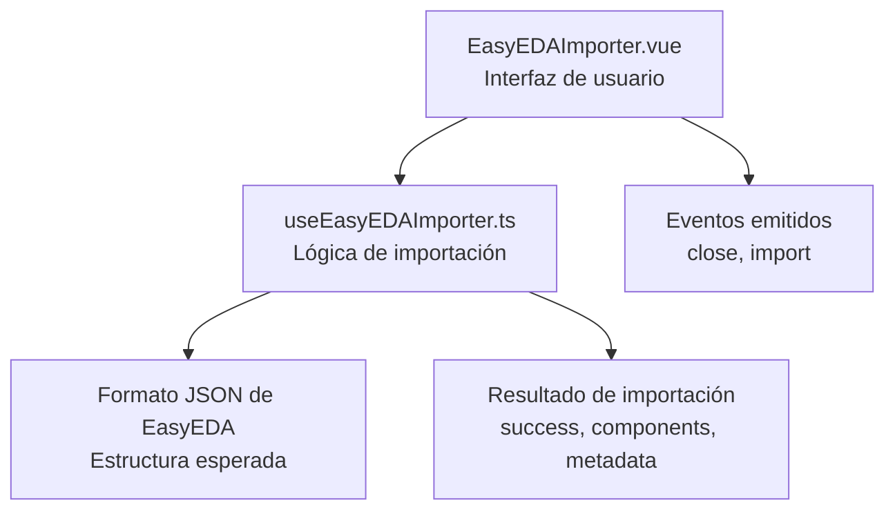
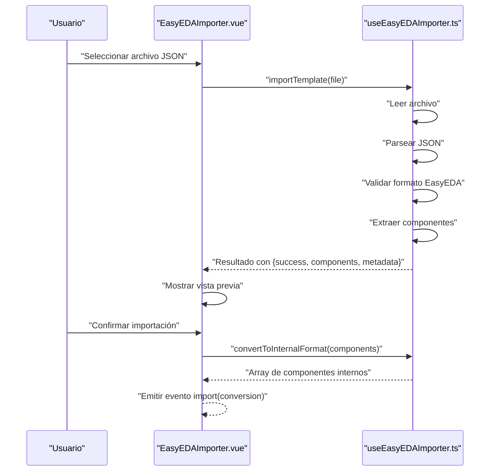
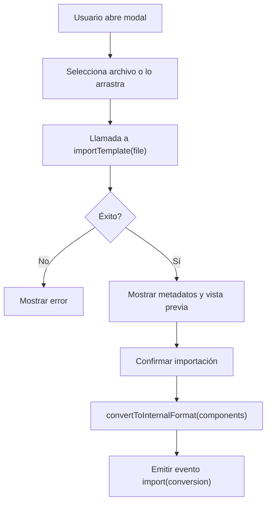
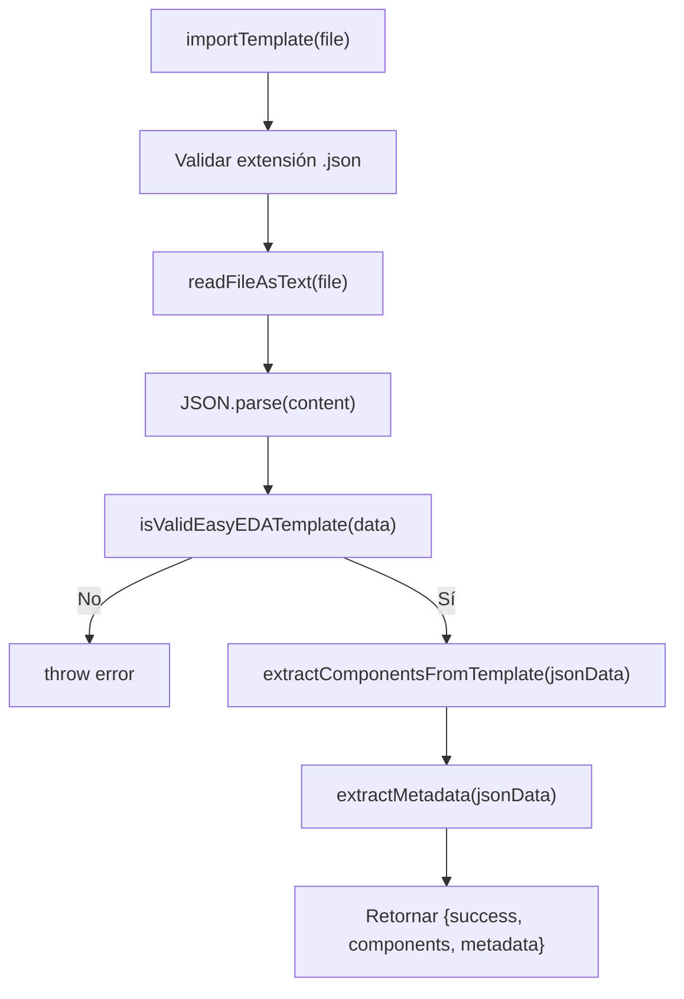
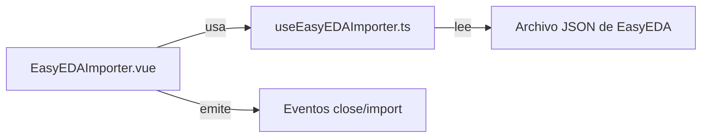

# Integración EasyEDA

<cite>
**Archivos referenciados en este documento**
- [EasyEDAImporter.vue](file://components/EasyEDAImporter.vue)
- [useEasyEDAImporter.ts](file://composables/useEasyEDAImporter.ts)
- [EASYEDA_API_INTEGRATION.md](file://wiki/EASYEDA_API_INTEGRATION.md)
- [ProjectItemsTable.vue](file://components/project/ProjectItemsTable.vue)
</cite>

## Índice
1. [Introducción](#introducción)
2. [Estructura del proyecto](#estructura-del-proyecto)
3. [Componentes principales](#componentes-principales)
4. [Visión general de la arquitectura](#visión-general-de-la-arquitectura)
5. [Análisis detallado de componentes](#análisis-detallado-de-componentes)
6. [Análisis de dependencias](#análisis-de-dependencias)
7. [Consideraciones de rendimiento](#consideraciones-de-rendimiento)
8. [Guía de solución de problemas](#guía-de-solución-de-problemas)
9. [Conclusión](#conclusión)
10. [Apéndices](#apéndices)

## Introducción
Este documento describe la integración con EasyEDA centrada en la importación de BOM mediante plantillas JSON generadas por EasyEDA. Se enfoca en dos piezas clave:
- El componente de interfaz de usuario que permite cargar y previsualizar plantillas de EasyEDA.
- El composable que encapsula toda la lógica de lectura, validación, extracción de componentes y conversión al formato interno de la aplicación.

Además, se documenta cómo se obtienen las listas de materiales desde EasyEDA (desde archivos JSON), qué estructura de datos se espera, cómo se mapean a la base de datos local, y cómo se manejan errores comunes durante la importación.

## Estructura del proyecto
La funcionalidad de importación EasyEDA se distribuye entre:
- Un componente de interfaz de usuario que gestiona la carga de archivos, estados de carga y errores, y emite eventos de confirmación.
- Un composable que contiene la lógica de negocio: lectura de archivos, validación de formato, extracción de componentes, y conversión al formato interno.

**Diagrama fuente**
- [EasyEDAImporter.vue](file://components/EasyEDAImporter.vue#L1-L217)
- [useEasyEDAImporter.ts](file://composables/useEasyEDAImporter.ts#L1-L187)

**Sección fuente**
- [EasyEDAImporter.vue](file://components/EasyEDAImporter.vue#L1-L217)
- [useEasyEDAImporter.ts](file://composables/useEasyEDAImporter.ts#L1-L187)

## Componentes principales
- EasyEDAImporter.vue
  - Permite seleccionar un archivo JSON de EasyEDA mediante click o arrastrar y soltar.
  - Muestra estados de carga, errores y resultados de previsualización.
  - Al confirmar, convierte los componentes al formato interno y emite un evento con los datos listos para importar.
- useEasyEDAImporter.ts
  - Lee y parsea el archivo JSON.
  - Valida que tenga la estructura esperada de EasyEDA.
  - Extrae componentes de múltiples ubicaciones posibles dentro del JSON.
  - Genera metadatos básicos (título, autor, cantidad de componentes).
  - Convierte los componentes al formato interno de la aplicación.

**Sección fuente**
- [EasyEDAImporter.vue](file://components/EasyEDAImporter.vue#L1-L217)
- [useEasyEDAImporter.ts](file://composables/useEasyEDAImporter.ts#L1-L187)

## Visión general de la arquitectura
El flujo de importación sigue estos pasos:
1. El usuario selecciona un archivo JSON de EasyEDA en la interfaz.
2. El composable lee el archivo, lo parsea y valida su estructura.
3. Se extraen componentes de distintas ubicaciones del JSON.
4. Se generan metadatos y se muestra una vista previa.
5. Al confirmar, se convierten los componentes al formato interno y se emite un evento con los datos.

**Diagrama fuente**
- [EasyEDAImporter.vue](file://components/EasyEDAImporter.vue#L219-L311)
- [useEasyEDAImporter.ts](file://composables/useEasyEDAImporter.ts#L1-L187)

## Análisis detallado de componentes

### EasyEDAImporter.vue
- Gestiona la entrada de archivos (input, drag & drop).
- Controla estados de carga, error y éxito.
- Presenta metadatos y una tabla resumida de componentes.
- Emite eventos:
  - close: al cancelar.
  - import: con los componentes convertidos al formato interno.

**Diagrama fuente**
- [EasyEDAImporter.vue](file://components/EasyEDAImporter.vue#L1-L217)
- [EasyEDAImporter.vue](file://components/EasyEDAImporter.vue#L219-L311)

**Sección fuente**
- [EasyEDAImporter.vue](file://components/EasyEDAImporter.vue#L1-L217)
- [EasyEDAImporter.vue](file://components/EasyEDAImporter.vue#L219-L311)

### useEasyEDAImporter.ts
- importTemplate(file):
  - Valida extensión del archivo.
  - Lee el contenido como texto.
  - Parsea JSON.
  - Valida estructura con isValidEasyEDATemplate.
  - Extrae componentes con extractComponentsFromTemplate.
  - Devuelve resultado con éxito, componentes y metadatos.
- readFileAsText(file):
  - Promesa basada en FileReader.
- isValidEasyEDATemplate(data):
  - Verifica presencia de campos mínimos de EasyEDA.
- extractComponentsFromTemplate(jsonData):
  - Busca componentes en varias ubicaciones del JSON (head.symbols, modules.symbols, shapes, parts).
  - Normaliza tipos y propiedades.
- extractMetadata(jsonData):
  - Recopila título, autor, fechas y cuenta de componentes.
- convertToInternalFormat(components):
  - Mapea campos de EasyEDA a formato interno (nombre, descripción, categoría, proveedor, número de parte, LCSC, unidad, cantidad, notas).

**Diagrama fuente**
- [useEasyEDAImporter.ts](file://composables/useEasyEDAImporter.ts#L1-L187)

**Sección fuente**
- [useEasyEDAImporter.ts](file://composables/useEasyEDAImporter.ts#L1-L187)

## Análisis de dependencias
- El componente EasyEDAImporter.vue depende del composable useEasyEDAImporter.ts para toda la lógica de importación.
- El composable no tiene dependencias externas a la API de EasyEDA; todo se basa en archivos JSON locales.
- La aplicación no requiere autenticación ni tokens de API para esta funcionalidad de importación de plantillas.

**Diagrama fuente**
- [EasyEDAImporter.vue](file://components/EasyEDAImporter.vue#L219-L311)
- [useEasyEDAImporter.ts](file://composables/useEasyEDAImporter.ts#L1-L187)

**Sección fuente**
- [EasyEDAImporter.vue](file://components/EasyEDAImporter.vue#L219-L311)
- [useEasyEDAImporter.ts](file://composables/useEasyEDAImporter.ts#L1-L187)

## Consideraciones de rendimiento
- Lectura de archivos: La importación se realiza en el navegador mediante FileReader, lo cual es adecuado para archivos de tamaño razonable. Para archivos muy grandes, podría considerarse dividir la carga o mostrar progreso.
- Parsing y validación: El JSON se parsea y se validan campos mínimos; esto es rápido pero puede ser sensible a formatos incompletos.
- Extracción de componentes: Itera sobre múltiples secciones del JSON; el rendimiento dependerá del tamaño del archivo. En caso de archivos muy grandes, se recomienda limitar el tamaño o mostrar vistas previas parciales.

[No se necesitan fuentes ya que esta sección ofrece orientación general]

## Guía de solución de problemas
- Archivo no es JSON o tiene extensión incorrecta:
  - El composable lanza un error si la extensión no es .json o si el contenido no es un JSON válido.
- Archivo no contiene formato de EasyEDA válido:
  - La validación verifica campos mínimos. Si no están presentes, se reporta un error.
- Fallo al leer el archivo:
  - FileReader puede fallar si el archivo es corrupto o accesible. El composable captura el error y lo presenta.
- No se muestran componentes en la vista previa:
  - Revisar que el archivo contenga alguna de las ubicaciones esperadas (head.symbols, modules.symbols, shapes, parts).
- Al confirmar, no se reciben datos:
  - Asegurarse de que el composable haya devuelto un resultado exitoso y que el componente emita correctamente el evento import.

**Sección fuente**
- [useEasyEDAImporter.ts](file://composables/useEasyEDAImporter.ts#L1-L187)
- [EasyEDAImporter.vue](file://components/EasyEDAImporter.vue#L1-L217)

## Conclusión
La integración EasyEDA en la importación de BOM se basa en la carga local de archivos JSON de EasyEDA. El composable encapsula toda la lógica de validación, extracción y conversión, mientras que el componente de interfaz se encarga de la experiencia de usuario y la emisión de eventos. No se requieren credenciales ni autenticación, y la funcionalidad se centra en la conversión de componentes al formato interno de la aplicación.

[No se necesitan fuentes ya que esta sección resume sin analizar archivos específicos]

## Apéndices

### Estructura de datos recibida (formato JSON de EasyEDA)
- Campos mínimos esperados:
  - head o type o modules
  - Contenido estructurado con símbolos, shapes o parts
- Ubicaciones comunes de componentes:
  - head.symbols
  - modules.symbols
  - shapes (con tipo lib)
  - parts

**Sección fuente**
- [useEasyEDAImporter.ts](file://composables/useEasyEDAImporter.ts#L60-L138)
- [EASYEDA_API_INTEGRATION.md](file://wiki/EASYEDA_API_INTEGRATION.md#L1-L114)

### Mapeo de campos a la base de datos local
- Campos de EasyEDA mapeados al formato interno:
  - name → nombre del componente
  - title → nombre alternativo si no hay name
  - properties.description o properties.desc → descripción
  - properties.category → categoría (por defecto Electrónico si no existe)
  - supplier → EasyEDA
  - properties.partNumber o properties.lcsc → part_number
  - properties.lcsc o properties.partNumber → lcsc_part
  - price, in_stock, min_stock → 0 (no disponibles en el template)
  - unit → pcs si no se especifica
  - quantity → 1 si no se especifica
  - notes → texto informativo sobre la importación y tipo de componente

**Sección fuente**
- [useEasyEDAImporter.ts](file://composables/useEasyEDAImporter.ts#L160-L187)

### Flujo completo de importación desde EasyEDA
- Pasos:
  1. Exportar proyecto de EasyEDA como archivo JSON.
  2. Abrir el modal de importación en la aplicación.
  3. Seleccionar o arrastrar el archivo JSON.
  4. Validar y previsualizar componentes.
  5. Confirmar importación para recibir los datos listos para agregar al inventario.

**Sección fuente**
- [EasyEDAImporter.vue](file://components/EasyEDAImporter.vue#L1-L217)
- [useEasyEDAImporter.ts](file://composables/useEasyEDAImporter.ts#L1-L187)
- [EASYEDA_API_INTEGRATION.md](file://wiki/EASYEDA_API_INTEGRATION.md#L42-L77)

### Casos de uso típicos
- Importar plantillas de símbolos de EasyEDA.
- Importar bibliotecas de componentes en formato JSON.
- Migrar proyectos entre versiones de EasyEDA usando archivos JSON.

**Sección fuente**
- [EASYEDA_API_INTEGRATION.md](file://wiki/EASYEDA_API_INTEGRATION.md#L42-L77)

### Autenticación, tokens y límites de API
- La funcionalidad descrita no requiere autenticación ni tokens de API. Todo se basa en archivos JSON locales.
- No se han encontrado límites de rate limiting asociados a esta funcionalidad en el código.

**Sección fuente**
- [useEasyEDAImporter.ts](file://composables/useEasyEDAImporter.ts#L1-L187)

### Notas adicionales sobre integración
- El documento wiki menciona otras APIs de EasyEDA (getSource, applySource, getShape, etc.) que permiten manipular diseños y objetos. Sin embargo, la importación de BOM descrita en este documento se centra en archivos JSON locales.

**Sección fuente**
- [EASYEDA_API_INTEGRATION.md](file://wiki/EASYEDA_API_INTEGRATION.md#L1-L114)