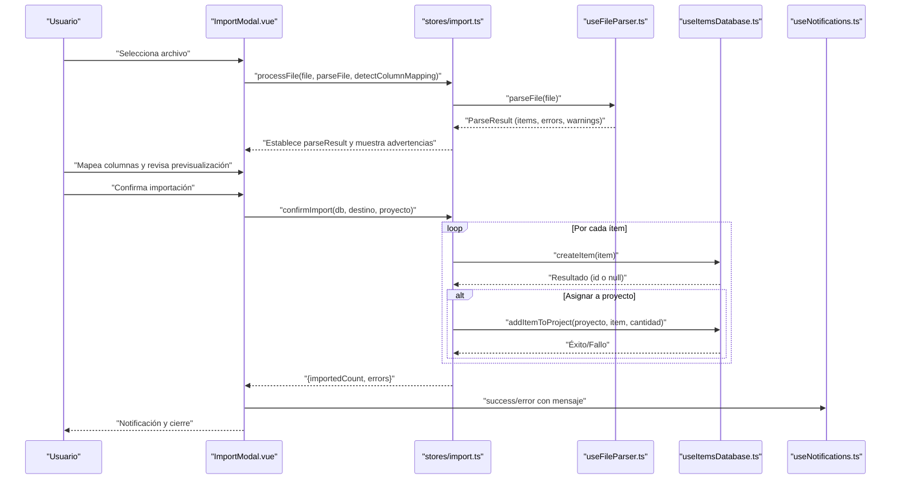
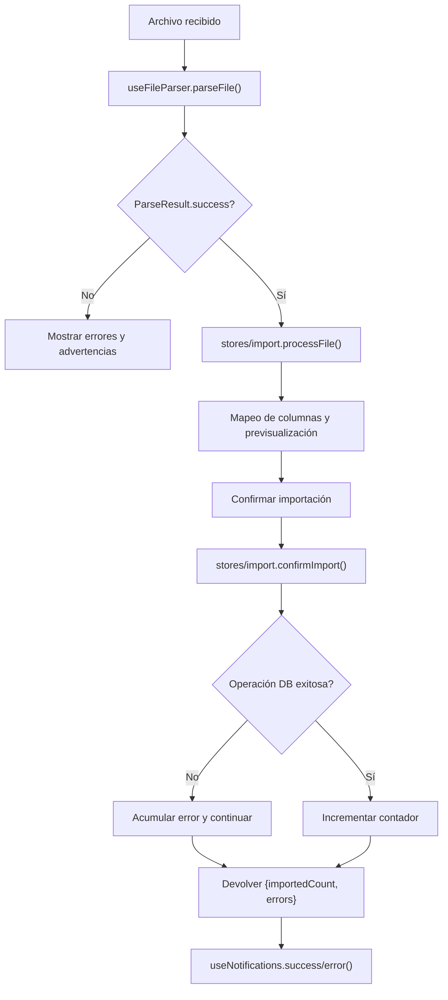
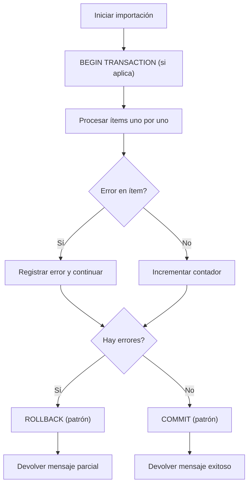

# Manejo de Errores

<cite>
**Archivos citados en este documento**
- [useFileParser.ts](file://composables/useFileParser.ts)
- [stores/import.ts](file://stores/import.ts)
- [components/ImportModal.vue](file://components/ImportModal.vue)
- [components/FileUpload.vue](file://components/FileUpload.vue)
- [composables/useEasyEDAImporter.ts](file://composables/useEasyEDAImporter.ts)
- [components/EasyEDAImporter.vue](file://components/EasyEDAImporter.vue)
- [composables/useNotifications.ts](file://composables/useNotifications.ts)
- [components/Toast.vue](file://components/Toast.vue)
- [composables/useDialog.ts](file://composables/useDialog.ts)
- [composables/useItemsDatabase.ts](file://composables/useItemsDatabase.ts)
- [composables/useDatabase.ts](file://composables/useDatabase.ts)
- [public/assets/sql-wasm-debug.js](file://public/assets/sql-wasm-debug.js)
- [types/sqlite-wasm.d.ts](file://types/sqlite-wasm.d.ts)
- [wiki/MANEJO_ARCHIVOS.md](file://wiki/MANEJO_ARCHIVOS.md)
- [wiki/EASYEDA_API_INTEGRATION.md](file://wiki/EASYEDA_API_INTEGRATION.md)
</cite>

## Índice
1. [Introducción](#introducción)
2. [Estructura del sistema de importación](#estructura-del-sistema-de-importación)
3. [Tipos de errores en la importación](#tipos-de-errores-en-la-importación)
4. [Sistema de notificaciones y retroalimentación](#sistema-de-notificaciones-y-retroalimentación)
5. [Arquitectura de manejo de errores](#arquitectura-de-manejo-de-errores)
6. [Detalles técnicos de componentes críticos](#detalles-técnicos-de-componentes-críticos)
7. [Transacciones, reversión y conservación de datos](#transacciones-reversión-y-conservación-de-datos)
8. [Logs, diagnóstico y procedimientos de solución](#logs-diagnóstico-y-procedimientos-de-solución)
9. [Casos típicos, soluciones paso a paso y prevención](#casos-típicos-soluciones-paso-a-paso-y-prevención)
10. [Conclusión](#conclusión)

## Introducción
Este documento detalla cómo se manejan los errores durante la importación de BOM en la aplicación. Cubre los tipos de errores (archivo, conexión, validación, procesamiento), el sistema de notificaciones, mensajes descriptivos, opciones de recuperación, transacciones y reversión parcial, así como logs, diagnóstico y procedimientos operativos. Se enfoca en el flujo completo desde la carga del archivo hasta la confirmación de importación, incluyendo el manejo de errores en el parser, en la base de datos y en flujos externos como EasyEDA.

## Estructura del sistema de importación
El flujo de importación se organiza en tres pasos principales:
- Paso 1: Carga y análisis del archivo (CSV/XLSX) con detección automática de columnas y validación básica.
- Paso 2: Mapeo de columnas y previsualización de datos editables.
- Paso 3: Confirmación de importación con destino global o proyecto, incluyendo registro de actividades.

**Diagrama fuente**
- [components/ImportModal.vue](file://components/ImportModal.vue#L503-L755)
- [stores/import.ts](file://stores/import.ts#L195-L342)
- [composables/useFileParser.ts](file://composables/useFileParser.ts#L263-L396)
- [composables/useItemsDatabase.ts](file://composables/useItemsDatabase.ts#L52-L105)
- [composables/useNotifications.ts](file://composables/useNotifications.ts#L71-L100)

**Sección fuente**
- [components/ImportModal.vue](file://components/ImportModal.vue#L1-L268)
- [stores/import.ts](file://stores/import.ts#L195-L342)
- [composables/useFileParser.ts](file://composables/useFileParser.ts#L106-L202)

## Tipos de errores en la importación
- Errores de archivo:
  - Formato no soportado (extensión inválida).
  - Archivo vacío o sin hojas.
  - Fallo al leer o parsear CSV/XLSX.
  - Codificación o caracteres inválidos.
- Errores de conexión:
  - No aplica directamente en este flujo de archivo local, pero se documenta el contexto de integración con EasyEDA.
- Errores de validación:
  - Campos requeridos faltantes (nombre, cantidad).
  - Valores inválidos según esquema Zod (tipos, rangos).
  - Advertencias de mapeo incompleto o inconsistencias menores.
- Errores de procesamiento:
  - Fallos al insertar o actualizar ítems en la base de datos.
  - Errores de transacción (en operaciones múltiples).
  - Errores de memoria o límites de almacenamiento (OPFS).

**Sección fuente**
- [composables/useFileParser.ts](file://composables/useFileParser.ts#L106-L202)
- [composables/useFileParser.ts](file://composables/useFileParser.ts#L263-L396)
- [composables/useItemsDatabase.ts](file://composables/useItemsDatabase.ts#L52-L105)
- [wiki/MANEJO_ARCHIVOS.md](file://wiki/MANEJO_ARCHIVOS.md#L1-L46)

## Sistema de notificaciones y retroalimentación
- Notificaciones locales:
  - Se usan notificaciones de tipo éxito, error, advertencia e información.
  - Se limita a un número máximo de notificaciones concurrentes.
  - Se pueden autoeliminar tras un tiempo configurable.
- Retroalimentación visual:
  - Componente Toast muestra iconos y barras de progreso.
- Diálogos:
  - En entornos Tauri se usan diálogos nativos con fallback a notificaciones.

**Sección fuente**
- [composables/useNotifications.ts](file://composables/useNotifications.ts#L1-L156)
- [components/Toast.vue](file://components/Toast.vue#L1-L158)
- [composables/useDialog.ts](file://composables/useDialog.ts#L1-L67)

## Arquitectura de manejo de errores
- Parser de archivos:
  - Devuelve ParseResult con items válidos, errores y advertencias.
  - Si hay errores pero también items válidos, se marca como éxito parcial con advertencia.
- Store de importación:
  - Recibe ParseResult, prepara destino y proyecto, y ejecuta confirmImport.
  - Recopila errores de base de datos y reporta cantidad importada.
- Base de datos:
  - Operaciones CRUD registran errores y devuelven null o false en caso de fallo.
  - No se implementa rollback explícito en createItem, pero se documenta el patrón de transacción en otros métodos.
- Notificaciones:
  - Se emiten desde ImportModal.vue y componentes secundarios con mensajes descriptivos.

**Diagrama fuente**
- [composables/useFileParser.ts](file://composables/useFileParser.ts#L263-L396)
- [stores/import.ts](file://stores/import.ts#L195-L342)
- [components/ImportModal.vue](file://components/ImportModal.vue#L702-L755)
- [composables/useNotifications.ts](file://composables/useNotifications.ts#L71-L100)

**Sección fuente**
- [components/ImportModal.vue](file://components/ImportModal.vue#L503-L755)
- [stores/import.ts](file://stores/import.ts#L263-L342)

## Detalles técnicos de componentes críticos
- Parser de archivos:
  - Detección automática de columnas con patrones de búsqueda.
  - Validación Zod de cada ítem.
  - Manejo de errores en CSV y Excel con mensajes específicos.
- Store de importación:
  - Gestiona pasos, validaciones de mapeo y destino.
  - Recopila errores durante la importación y reporta cantidad importada.
- Base de datos:
  - createItem inserta ítems y registra actividad.
  - Otros métodos muestran patrón de BEGIN/COMMIT/ROLLBACK en operaciones múltiples.
- EasyEDA:
  - Importación de plantillas JSON con validación de formato y extracción de componentes.
  - Manejo de errores y estados isLoading/error.

**Sección fuente**
- [composables/useFileParser.ts](file://composables/useFileParser.ts#L47-L202)
- [stores/import.ts](file://stores/import.ts#L195-L342)
- [composables/useItemsDatabase.ts](file://composables/useItemsDatabase.ts#L52-L105)
- [composables/useEasyEDAImporter.ts](file://composables/useEasyEDAImporter.ts#L1-L187)

## Transacciones, reversión y conservación de datos
- En operaciones de actualización de stock se implementa el patrón de transacción:
  - BEGIN TRANSACTION
  - Validación de errores acumulados
  - COMMIT o ROLLBACK según resultado
- En importación de ítems:
  - No se observa rollback explícito en createItem.
  - Sin embargo, se acumulan errores y se continúa con la importación de ítems restantes, permitiendo conservar los datos válidos.

**Diagrama fuente**
- [composables/useItemsDatabase.ts](file://composables/useItemsDatabase.ts#L237-L264)

**Sección fuente**
- [composables/useItemsDatabase.ts](file://composables/useItemsDatabase.ts#L237-L264)
- [stores/import.ts](file://stores/import.ts#L275-L332)

## Logs, diagnóstico y procedimientos de solución
- Logs:
  - Se registran errores en consola desde componentes y stores.
  - Se emiten eventos de error hacia componentes padres.
- Diagnóstico:
  - Revisar ParseResult para identificar errores y advertencias.
  - Validar mapeo de columnas y campos requeridos.
  - Verificar disponibilidad de base de datos y permisos de almacenamiento (OPFS).
- Solución:
  - Corregir formato de archivo y codificación.
  - Ajustar mapeo de columnas y valores.
  - Reintentar importación parcial si hay errores menores.

**Sección fuente**
- [components/ImportModal.vue](file://components/ImportModal.vue#L503-L523)
- [components/FileUpload.vue](file://components/FileUpload.vue#L101-L133)
- [wiki/MANEJO_ARCHIVOS.md](file://wiki/MANEJO_ARCHIVOS.md#L1-L46)

## Casos típicos, soluciones paso a paso y prevención
- Caso 1: Archivo CSV con codificación incorrecta
  - Síntomas: Errores al parsear CSV.
  - Solución:
    1. Reexportar el archivo en UTF-8.
    2. Volver a seleccionar el archivo.
    3. Reintentar el análisis.
  - Prevención: Establecer codificación UTF-8 en la fuente de datos.
- Caso 2: Columnas sin mapear (falta de nombre o cantidad)
  - Síntomas: Advertencias o imposibilidad de avanzar al paso siguiente.
  - Solución:
    1. Seleccionar columnas correspondientes en el mapeo.
    2. Validar que haya al menos nombre y cantidad.
  - Prevención: Usar encabezados claros y consistentes.
- Caso 3: Valores inválidos (tipos numéricos incorrectos)
  - Síntomas: Errores de validación Zod.
  - Solución:
    1. Corregir valores numéricos en cantidades, precios, etc.
    2. Revalidar con la vista previa.
  - Prevención: Normalizar formatos numéricos y evitar celdas mezcladas.
- Caso 4: Fallo al crear ítems en base de datos
  - Síntomas: Errores en confirmImport y mensajes de fallo.
  - Solución:
    1. Verificar disponibilidad de base de datos.
    2. Reintentar importación parcial.
    3. Registrar errores y continuar con los ítems válidos.
  - Prevención: Monitorear espacio de almacenamiento (OPFS) y límites.
- Caso 5: Plantilla EasyEDA inválida
  - Síntomas: Error al importar JSON de plantilla.
  - Solución:
    1. Validar que el archivo tenga estructura de EasyEDA.
    2. Reintentar con un archivo compatible.
  - Prevención: Usar plantillas exportadas desde la misma versión de EasyEDA.

**Sección fuente**
- [composables/useFileParser.ts](file://composables/useFileParser.ts#L106-L202)
- [stores/import.ts](file://stores/import.ts#L275-L332)
- [composables/useEasyEDAImporter.ts](file://composables/useEasyEDAImporter.ts#L1-L187)
- [wiki/EASYEDA_API_INTEGRATION.md](file://wiki/EASYEDA_API_INTEGRATION.md#L1-L114)

## Conclusión
El sistema implementa un manejo robusto de errores en la importación de BOM, con validación temprana, retroalimentación clara al usuario y mecanismos para continuar con datos válidos incluso en presencia de errores menores. Se recomienda seguir las prácticas de prevención y diagnosticar con los mensajes descriptivos proporcionados para resolver problemas de forma eficiente.