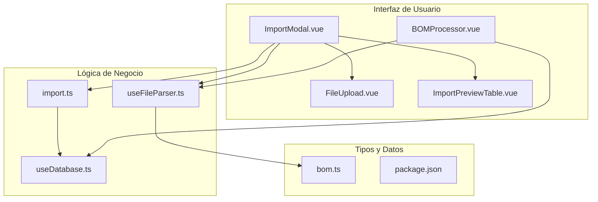
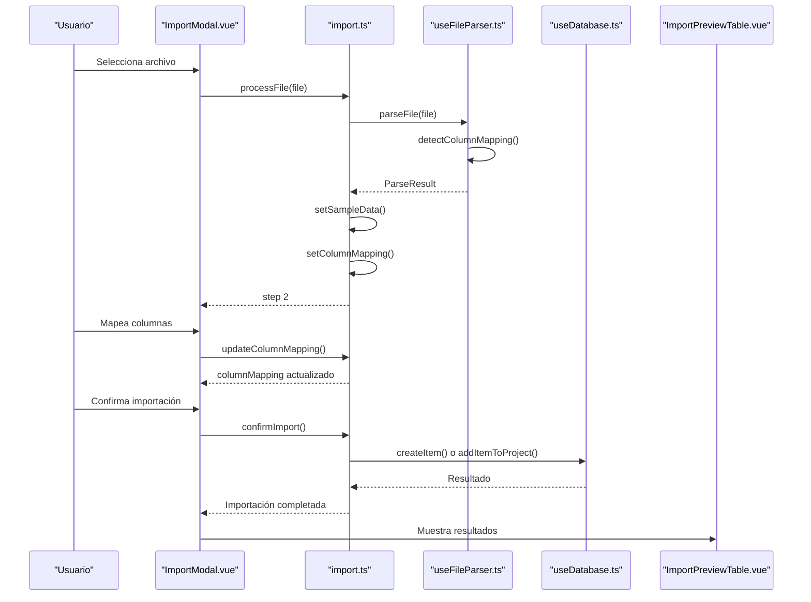
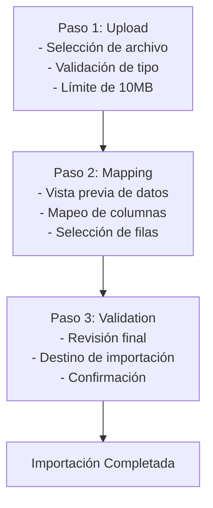
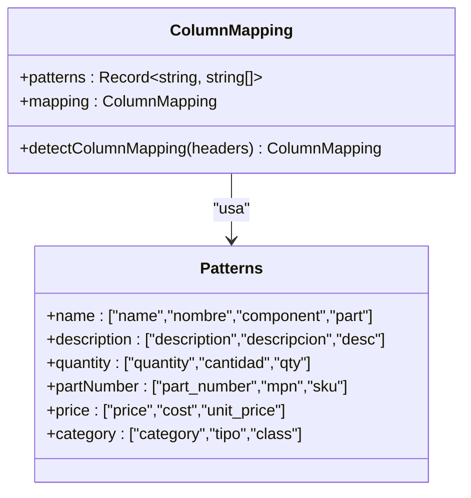
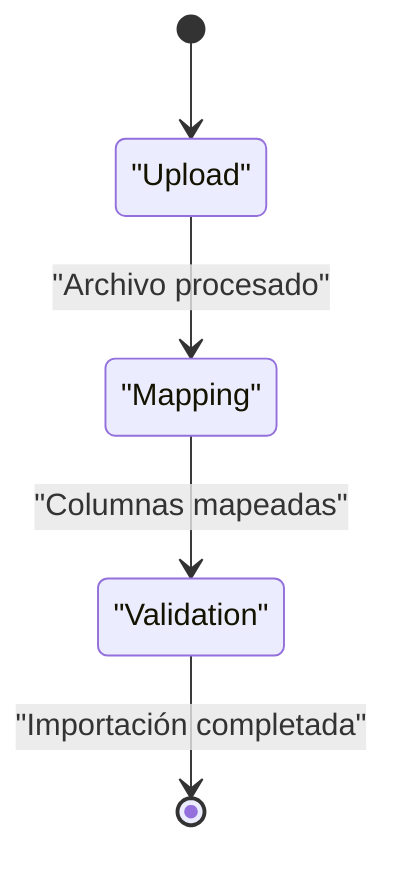
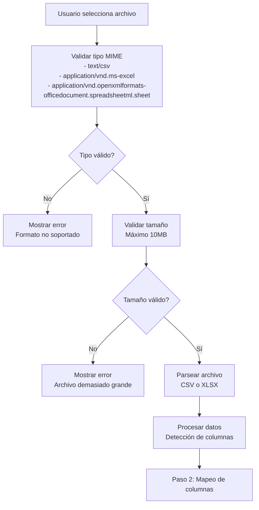
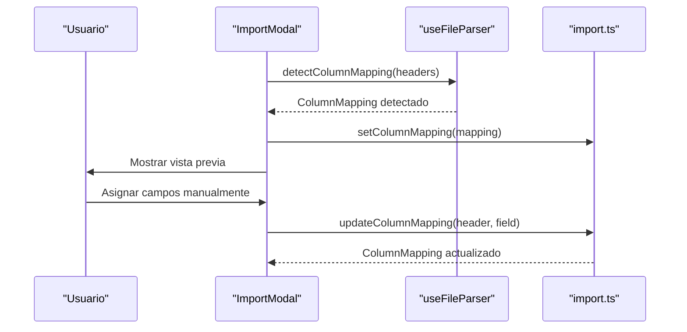
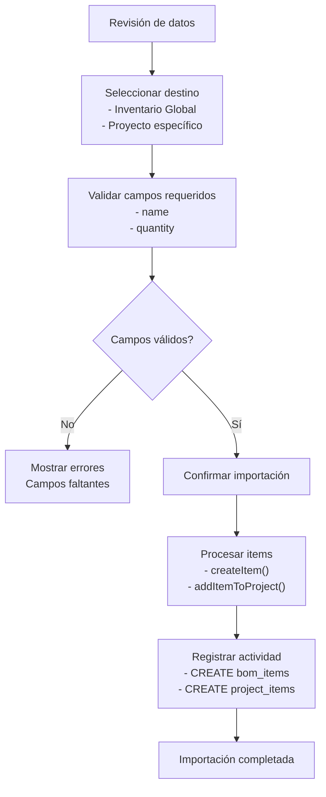
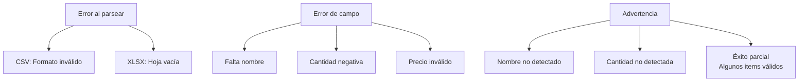
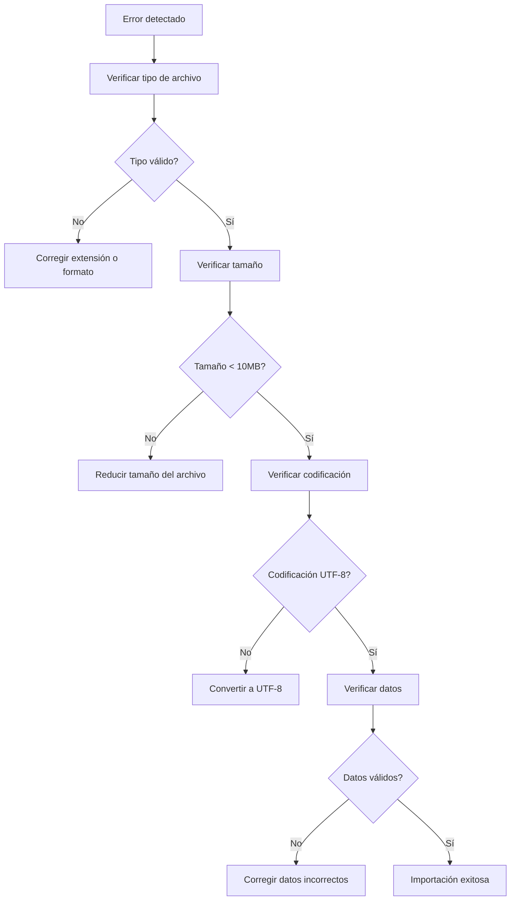

# Procesamiento de Archivos

<cite>
**Archivos referenciados en este documento**
- [ImportModal.vue](file://components/ImportModal.vue)
- [BOMProcessor.vue](file://components/BOMProcessor.vue)
- [import.ts](file://stores/import.ts)
- [useFileParser.ts](file://composables/useFileParser.ts)
- [FileUpload.vue](file://components/FileUpload.vue)
- [ImportPreviewTable.vue](file://components/ImportPreviewTable.vue)
- [bom.ts](file://types/bom.ts)
- [useDatabase.ts](file://composables/useDatabase.ts)
- [MANEJO_ARCHIVOS.md](file://wiki/MANEJO_ARCHIVOS.md)
- [README.md](file://README.md)
- [package.json](file://package.json)
</cite>

## Tabla de Contenidos
1. [Introducción](#introducción)
2. [Estructura del Proyecto](#estructura-del-proyecto)
3. [Componentes Clave](#componentes-clave)
4. [Arquitectura General](#arquitectura-general)
5. [Análisis Detallado de Componentes](#análisis-detallado-de-componentes)
6. [Flujo de Importación Completo](#flujo-de-importación-completo)
7. [Validaciones y Reglas de Negocio](#validaciones-y-reglas-de-negocio)
8. [Manejo de Codificaciones y Caracteres Especiales](#manejo-de-codificaciones-y-caracteres-especiales)
9. [Formatos Soportados y Límites](#formatos-soportados-y-límites)
10. [Ejemplos de Estructuras Válidas](#ejemplos-de-estructuras-válidas)
11. [Casos de Uso Típicos](#casos-de-uso-típicos)
12. [Soluciones a Problemas Comunes](#soluciones-a-problemas-comunes)
13. [Consideraciones de Rendimiento](#consideraciones-de-rendimiento)
14. [Guía de Resolución de Problemas](#guía-de-resolución-de-problemas)
15. [Conclusión](#conclusión)

## Introducción
Este documento proporciona una guía completa sobre el procesamiento de archivos CSV/XLSX en la importación de BOM (Bill of Materials) dentro de la aplicación. Cubre el flujo completo desde la selección del archivo hasta la validación y procesamiento de datos, incluyendo los componentes principales, algoritmos de mapeo de columnas, manejo de codificaciones y soluciones a problemas comunes.

## Estructura del Proyecto
La funcionalidad de importación se distribuye entre varios componentes clave:



**Diagrama fuente**
- [ImportModal.vue](file://components/ImportModal.vue#L1-L756)
- [useFileParser.ts](file://composables/useFileParser.ts#L1-L422)
- [import.ts](file://stores/import.ts#L1-L344)

**Sección fuente**
- [README.md](file://README.md#L63-L79)

## Componentes Clave

### ImportModal.vue
El componente principal que maneja todo el proceso de importación en tres pasos:

1. **Selección de Archivo**: Permite arrastrar y soltar o seleccionar archivos
2. **Mapeo de Columnas**: Permite asignar encabezados CSV a campos BOM
3. **Validación y Confirmación**: Muestra vista previa y permite confirmar la importación

### useFileParser.ts
Composable que contiene toda la lógica de parsing y validación de archivos:

- Detección automática de mapeo de columnas
- Validación Zod de datos
- Soporte para CSV y XLSX/XLS
- Manejo de errores y advertencias

### stores/import.ts
Store Pinia que gestiona el estado completo del proceso de importación:

- Estado de pasos y progreso
- Mapeo de columnas
- Resultados de parsing
- Acciones de importación

**Sección fuente**
- [ImportModal.vue](file://components/ImportModal.vue#L1-L756)
- [useFileParser.ts](file://composables/useFileParser.ts#L1-L422)
- [import.ts](file://stores/import.ts#L1-L344)

## Arquitectura General



**Diagrama fuente**
- [ImportModal.vue](file://components/ImportModal.vue#L503-L754)
- [import.ts](file://stores/import.ts#L195-L342)
- [useFileParser.ts](file://composables/useFileParser.ts#L379-L396)

## Análisis Detallado de Componentes

### ImportModal.vue - Gestión Completa del Flujo

#### Estructura de Pasos
El componente implementa un flujo de tres pasos con progreso visual:



**Diagrama fuente**
- [ImportModal.vue](file://components/ImportModal.vue#L18-L33)

#### Mapeo de Columnas Automático
El sistema detecta automáticamente los campos requeridos y opcionales:

**Campos Requeridos:**
- `name`: Nombre del componente
- `quantity`: Cantidad requerida

**Campos Opcionales:**
- `description`, `category`, `supplier`
- `partNumber`, `lcscPart`, `price`
- `inStock`, `minStock`, `notes`
- `manufacturer`, `package`, `status`
- `customerNo`, `rohs`, `extPrice`
- `leadTime`, `dateCodeLotNo`, `pcbDesignation`
- `itemImage`

**Sección fuente**
- [ImportModal.vue](file://components/ImportModal.vue#L452-L477)

### useFileParser.ts - Lógica de Parsing Avanzada

#### Detección Inteligente de Columnas
El parser utiliza patrones de búsqueda para mapear automáticamente columnas:



**Diagrama fuente**
- [useFileParser.ts](file://composables/useFileParser.ts#L51-L104)

#### Validación Zod
Cada campo se valida con reglas específicas:

| Campo | Tipo | Requerido | Validación |
|-------|------|-----------|------------|
| `name` | string | Sí | min(1) |
| `quantity` | number | Sí | min(0) |
| `price` | number | No | min(0) |
| `minStock` | number | No | min(0) |
| `description` | string | No | optional() |
| `category` | string | No | optional() |

**Sección fuente**
- [useFileParser.ts](file://composables/useFileParser.ts#L6-L32)

### stores/import.ts - Gestión de Estado

#### Estados del Proceso


**Diagrama fuente**
- [import.ts](file://stores/import.ts#L24-L41)

#### Acciones Principales
- `processFile()`: Procesamiento completo del archivo
- `confirmImport()`: Importación real a la base de datos
- `resetImport()`: Reinicio del proceso
- `setColumnMapping()`: Actualización del mapeo

**Sección fuente**
- [import.ts](file://stores/import.ts#L91-L342)

## Flujo de Importación Completo

### Paso 1: Selección y Validación de Archivo



**Diagrama fuente**
- [FileUpload.vue](file://components/FileUpload.vue#L168-L199)
- [useFileParser.ts](file://composables/useFileParser.ts#L379-L396)

### Paso 2: Mapeo de Columnas



**Diagrama fuente**
- [ImportModal.vue](file://components/ImportModal.vue#L614-L625)
- [useFileParser.ts](file://composables/useFileParser.ts#L51-L104)

### Paso 3: Validación y Confirmación



**Diagrama fuente**
- [ImportModal.vue](file://components/ImportModal.vue#L702-L754)
- [import.ts](file://stores/import.ts#L263-L342)

**Sección fuente**
- [ImportModal.vue](file://components/ImportModal.vue#L1-L756)
- [import.ts](file://stores/import.ts#L1-L344)

## Validaciones y Reglas de Negocio

### Validaciones de Campo

| Campo | Tipo | Requerido | Validación | Valor por Defecto |
|-------|------|-----------|------------|-------------------|
| `name` | string | Sí | min(1) | Obligatorio |
| `quantity` | number | Sí | min(0) | 0 |
| `price` | number | No | min(0) | undefined |
| `minStock` | number | No | min(0) | undefined |
| `inStock` | number | No | min(0) | 0 (eliminado) |

### Errores Comunes y Advertencias



**Diagrama fuente**
- [useFileParser.ts](file://composables/useFileParser.ts#L109-L202)

**Sección fuente**
- [useFileParser.ts](file://composables/useFileParser.ts#L109-L202)

## Manejo de Codificaciones y Caracteres Especiales

### Codificaciones Soportadas
- **CSV**: UTF-8 (por defecto)
- **XLS/XLSX**: Se detecta automáticamente mediante librerías de lectura

### Caracteres Especiales
- **Separadores de campo**: Coma (,), punto y coma (;), tabulador (\t)
- **Caracteres de escape**: Comillas dobles (")
- **Caracteres Unicode**: Soportados completamente
- **Valores nulos**: Convertidos a string vacío

### Manejo de Valores Numéricos
Los valores numéricos se limpian automáticamente:
- Elimina caracteres no numéricos: `[^0-9.-]`
- Convierte a float: `parseFloat(value.replace(/[^0-9.-]/g, ''))`
- Valores inválidos se convierten a 0 o undefined según el campo

**Sección fuente**
- [useFileParser.ts](file://composables/useFileParser.ts#L158-L166)

## Formatos Soportados y Límites

### Formatos de Archivo
| Formato | Extensión | MIME Type | Descripción |
|---------|-----------|-----------|-------------|
| CSV | `.csv` | `text/csv` | Archivo de texto plano |
| XLSX | `.xlsx` | `application/vnd.openxmlformats-officedocument.spreadsheetml.sheet` | Excel moderno |
| XLS | `.xls` | `application/vnd.ms-excel` | Excel clásico |

### Límites de Tamaño
- **Máximo archivo**: 10 MB
- **Máximo filas**: 50 filas para vista previa
- **Máximo columnas**: Ilimitado (limitado por rendimiento)

### Tipos MIME Permitidos
```javascript
const validTypes = [
    "text/csv",
    "application/vnd.ms-excel",
    "application/vnd.openxmlformats-officedocument.spreadsheetml.sheet"
];
```

**Sección fuente**
- [FileUpload.vue](file://components/FileUpload.vue#L172-L178)
- [useFileParser.ts](file://composables/useFileParser.ts#L379-L396)

## Ejemplos de Estructuras Válidas

### CSV BOM Estándar
```csv
Part Number,Description,Quantity,Unit Price,Category,Supplier
C7472949,"10uF ±20% 10V Ceramic Capacitor X5R 0402",200,0.0063,Capacitores,Chinocera
HGC0402R5106M100NTEJ,"10uF ±20% 10V Ceramic Capacitor X5R 0402",200,0.0063,Capacitores,Chinocera
```

### XLSX BOM Personalizado
| Nombre del Componente | Cantidad | Precio Unitario | Proveedor | Número de Parte |
|----------------------|----------|-----------------|-----------|-----------------|
| HGC0402R5106M100NTEJ | 200 | 0.0063 | Chinocera | C7472949 |
| 10uF Capacitor | 150 | 0.0120 | Farnell | MPN-12345 |

### Estructura Interna de Items
```typescript
interface BOMItem {
  id: string;
  name: string;
  description?: string;
  quantity: number;
  unit?: string;
  category?: string;
  supplier?: string;
  partNumber?: string;
  lcscPart?: string;
  price?: number;
  inStock?: number;
  minStock?: number;
  notes?: string;
  manufacturer?: string;
  package?: string;
  status?: string;
  createdAt: string;
  updatedAt: string;
}
```

**Sección fuente**
- [bom.ts](file://types/bom.ts#L3-L32)

## Casos de Uso Típicos

### Importación Masiva de Componentes
1. **Preparación del archivo**: Exportar desde herramientas de diseño electrónico
2. **Validación de datos**: Verificar que todos los componentes tengan nombre y cantidad
3. **Mapeo de campos**: Ajustar encabezados si no se detectan automáticamente
4. **Importación**: Procesar y crear nuevos ítems en el inventario

### Importación a Proyectos Específicos
1. **Selección del proyecto**: Elegir destino de importación
2. **Creación de ítems**: Cada ítem se crea en el inventario global
3. **Asignación automática**: Cada ítem se asigna al proyecto con la cantidad especificada

### Importación Parcial de Componentes
1. **Selección de filas**: Marcar únicamente las filas que se desean importar
2. **Validación previa**: Verificar que las filas seleccionadas sean válidas
3. **Importación selectiva**: Solo se importarán las filas marcadas

**Sección fuente**
- [ImportModal.vue](file://components/ImportModal.vue#L627-L644)
- [import.ts](file://stores/import.ts#L294-L327)

## Soluciones a Problemas Comunes

### Archivos Corruptos o Formatos Incorrectos
**Síntomas:**
- Error "Formato de archivo no soportado"
- Mensaje "No se pudo procesar ningún item válido"

**Soluciones:**
1. **Verificar extensión**: Asegurarse de que el archivo tenga extensión .csv, .xlsx o .xls
2. **Reparar archivo**: Abrir en Excel y guardar como nuevo archivo
3. **Convertir formato**: Usar herramientas de conversión de CSV a XLSX

### Errores de Codificación
**Síntomas:**
- Caracteres extraños en los datos
- Problemas con tildes o ñ

**Soluciones:**
1. **Guardar en UTF-8**: Exportar desde la aplicación original en UTF-8
2. **Usar CSV directamente**: Evitar formatos binarios cuando haya problemas de codificación
3. **Limpiar datos**: Eliminar caracteres especiales antes de importar

### Archivos Muy Grandes
**Síntomas:**
- Error "Archivo demasiado grande"
- Tiempo de procesamiento excesivo

**Soluciones:**
1. **Dividir archivo**: Separar en múltiples archivos más pequeños
2. **Reducir columnas**: Eliminar columnas no necesarias
3. **Usar CSV**: Preferir CSV sobre XLSX para archivos grandes

### Errores de Mapeo de Columnas
**Síntomas:**
- Advertencia "No se detectó una columna de 'nombre'"
- Todos los items tienen nombre "Componente sin nombre"

**Soluciones:**
1. **Revisar encabezados**: Asegurarse de que los encabezados sean claros
2. **Mapeo manual**: Asignar manualmente los campos en la interfaz
3. **Patrones comunes**: Usar nombres reconocibles como "Nombre", "Cantidad", "Precio"

**Sección fuente**
- [useFileParser.ts](file://composables/useFileParser.ts#L126-L141)
- [FileUpload.vue](file://components/FileUpload.vue#L190-L196)

## Consideraciones de Rendimiento

### Optimizaciones Implementadas
- **Límite de filas**: Solo se muestran 50 filas para la vista previa
- **Procesamiento asíncrono**: Todo el proceso se realiza de forma no bloqueante
- **Validación incremental**: Se validan los datos mientras se procesan
- **Memoria limitada**: Se evita cargar archivos muy grandes en memoria

### Recomendaciones de Rendimiento
1. **Tamaño óptimo**: Mantener archivos menores a 5MB para mejor experiencia
2. **Formato preferencial**: CSV para archivos grandes, XLSX para archivos pequeños
3. **Limpieza de datos**: Eliminar filas vacías y columnas innecesarias
4. **Mapeo automático**: Aprovechar la detección automática de columnas

**Sección fuente**
- [useFileParser.ts](file://composables/useFileParser.ts#L213-L235)

## Guía de Resolución de Problemas

### Diagnóstico de Errores



### Pasos de Resolución

1. **Verificar archivo**: Confirmar extensión y tipo MIME
2. **Validar tamaño**: Asegurar que sea menor a 10MB
3. **Revisar codificación**: Usar UTF-8 para CSV
4. **Limpiar datos**: Eliminar filas vacías y caracteres especiales
5. **Probar con ejemplo**: Usar archivo de muestra para validar el proceso

**Sección fuente**
- [FileUpload.vue](file://components/FileUpload.vue#L168-L199)
- [useFileParser.ts](file://composables/useFileParser.ts#L189-L199)

## Conclusión

El sistema de importación de BOM en la aplicación ofrece una solución completa y robusta para procesar archivos CSV/XLSX con las siguientes características clave:

- **Interfaz intuitiva**: Flujo de tres pasos con retroalimentación visual
- **Validación rigurosa**: Detección automática de errores y advertencias
- **Flexibilidad**: Soporte para múltiples formatos y configuraciones
- **Seguridad**: Manejo seguro de datos y registro de actividades
- **Rendimiento**: Optimizaciones para manejar archivos grandes de manera eficiente

La implementación combina técnicas modernas de validación (Zod), detección automática de patrones y gestión de estado centralizada, proporcionando una experiencia de usuario fluida y confiable para la importación de datos de BOM.