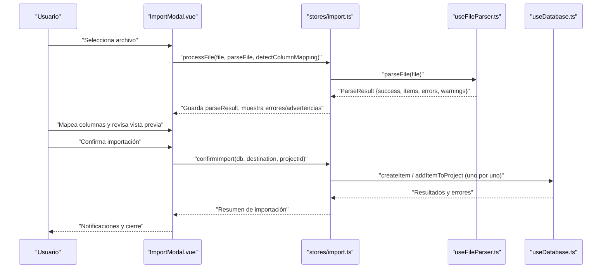
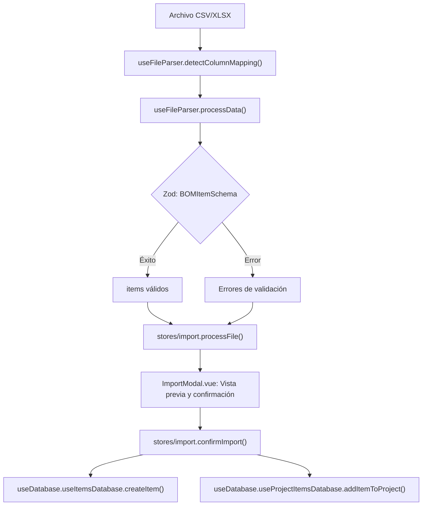

# Validación de Datos

<cite>
**Archivos mencionados en este documento**
- [useFileParser.ts](file://composables/useFileParser.ts)
- [ImportModal.vue](file://components/ImportModal.vue)
- [ImportPreviewTable.vue](file://components/ImportPreviewTable.vue)
- [stores/import.ts](file://stores/import.ts)
- [useItemsDatabase.ts](file://composables/useItemsDatabase.ts)
- [useProjectItemsDatabase.ts](file://composables/useProjectItemsDatabase.ts)
- [useDatabase.ts](file://composables/useDatabase.ts)
- [types/bom.ts](file://types/bom.ts)
- [BOMProcessor.vue](file://components/BOMProcessor.vue)
- [useEasyEDAImporter.ts](file://composables/useEasyEDAImporter.ts)
- [useLCSC.ts](file://composables/useLCSC.ts)
</cite>

## Índice
1. [Introducción](#introducción)
2. [Estructura del proceso de importación y validación](#estructura-del-proceso-de-importación-y-validación)
3. [Reglas de validación implementadas](#reglas-de-validación-implementadas)
4. [Manejo de datos inválidos, duplicados y componentes no encontrados](#manejo-de-datos-inválidos-duplicados-y-componentes-no-encontrados)
5. [Sistema de reporte de errores y presentación al usuario](#sistema-de-reporte-de-errores-y-presentación-al-usuario)
6. [Corrección automática, sugerencias y decisiones de importación](#corrección-automática-sugerencias-y-decisiones-de-importación)
7. [Ejemplos de casos de validación](#ejemplos-de-casos-de-validación)
8. [Arquitectura de validación y flujo de datos](#arquitectura-de-validación-y-flujo-de-datos)
9. [Consideraciones de rendimiento](#consideraciones-de-rendimiento)
10. [Guía de solución de problemas](#guía-de-solución-de-problemas)
11. [Conclusiones](#conclusiones)

## Introducción
Este documento detalla el sistema de validación de datos durante la importación de BOM (Lista de Materiales). Cubre las reglas implementadas, cómo se manejan los datos inválidos, la detección de errores, la presentación de reportes al usuario, y las decisiones respecto a importación parcial o completa. También incluye recomendaciones de tolerancia de errores y buenas prácticas para garantizar la calidad de los datos importados.

## Estructura del proceso de importación y validación
El flujo de trabajo se organiza en tres pasos principales:
- Paso 1: Carga del archivo y detección automática de columnas.
- Paso 2: Mapeo de columnas a campos del modelo BOM.
- Paso 3: Vista previa, validación y confirmación de importación.

**Diagram sources**
- [ImportModal.vue](file://components/ImportModal.vue#L300-L370)
- [stores/import.ts](file://stores/import.ts#L195-L342)
- [useFileParser.ts](file://composables/useFileParser.ts#L379-L421)
- [useDatabase.ts](file://composables/useDatabase.ts#L25-L89)

**Section sources**
- [ImportModal.vue](file://components/ImportModal.vue#L300-L370)
- [stores/import.ts](file://stores/import.ts#L195-L342)

## Reglas de validación implementadas
Las reglas se aplican durante el análisis del archivo y la transformación de datos:

- Campos obligatorios detectados automáticamente:
  - Nombre: se requiere al menos una columna que coincida con “nombre”, “item”, “part” u otras variantes.
  - Cantidad: se requiere al menos una columna que coincida con “cantidad”, “qty”, “cant”, “amount”.
  - Unidad: no es requerida (se eliminó de los requisitos).

- Validación de tipos y rangos:
  - Cantidad: debe ser numérica y mayor o igual a cero.
  - Precios, tiempos de entrega, precios extendidos: deben ser numéricos y mayores o iguales a cero (si se proveen).
  - Mínimo de stock: debe ser numérico y mayor o igual a cero.
  - Otros campos: strings opcionales, con limpieza de espacios y conversión de valores vacíos.

- Detección automática de columnas:
  - Se buscan palabras clave en los encabezados para mapear automáticamente a campos del modelo BOM.
  - Si no se encuentra una columna clave, se emite una advertencia y se aplica un valor por defecto cuando aplica (por ejemplo, cantidad cero).

- Valores por defecto:
  - Si el nombre está vacío, se asigna un valor por defecto temporal.
  - Si no se detecta unidad, no se asigna valor (ya no es requerido).

**Section sources**
- [useFileParser.ts](file://composables/useFileParser.ts#L1-L120)
- [useFileParser.ts](file://composables/useFileParser.ts#L120-L202)
- [useFileParser.ts](file://composables/useFileParser.ts#L204-L396)
- [ImportModal.vue](file://components/ImportModal.vue#L452-L477)

## Manejo de datos inválidos, duplicados y componentes no encontrados
- Datos inválidos:
  - Se generan errores detallados con el número de fila y la descripción del problema.
  - Si hay errores pero también items válidos, se considera un “éxito parcial” y se muestran advertencias.

- Duplicados:
  - No se detectan ni se eliminan duplicados en esta implementación. La importación crea nuevos ítems en el inventario global o asigna ítems a proyectos sin deduplicación explícita.

- Componentes no encontrados en el catálogo:
  - Durante la importación, se crean ítems nuevos con los datos proporcionados. No se realiza búsqueda de coincidencias previas en el catálogo durante la importación masiva.

**Section sources**
- [useFileParser.ts](file://composables/useFileParser.ts#L174-L202)
- [stores/import.ts](file://stores/import.ts#L275-L342)

## Sistema de reporte de errores y presentación al usuario
- Reporte de errores:
  - Se acumulan mensajes de error con el número de fila y la descripción del problema.
  - Se emiten advertencias cuando faltan columnas clave o se aplican valores por defecto.

- Presentación al usuario:
  - En la interfaz de importación, se muestran secciones de “Errores detectados” y “Advertencias”.
  - Se permite revisar la vista previa de los datos antes de confirmar la importación.

- Notificaciones:
  - Se utilizan notificaciones de éxito o error al finalizar la importación, mostrando el número de ítems importados y errores encontrados.

**Section sources**
- [ImportModal.vue](file://components/ImportModal.vue#L209-L225)
- [ImportModal.vue](file://components/ImportModal.vue#L702-L755)
- [stores/import.ts](file://stores/import.ts#L275-L342)

## Corrección automática, sugerencias y decisiones de importación
- Corrección automática:
  - Conversión numérica flexible: se limpian caracteres no numéricos y se convierte a número, rechazando valores inválidos con un valor por defecto cuando aplica.
  - Asignación de valores por defecto: nombre sin especificar se sustituye temporalmente; cantidad sin columna se asume como cero.

- Sugerencias de corrección:
  - Recomendación: mapear explícitamente las columnas clave (“Nombre” y “Cantidad”) en la interfaz de mapeo.
  - Recomendación: normalizar los datos (mayúsculas, símbolos, separadores) antes de importar.

- Decisiones de importación:
  - Importación parcial vs completa:
    - Si hay errores, se permite continuar con los ítems válidos (éxito parcial) y se informa al usuario.
    - No se implementa una tolerancia configurable de errores; se importan solo los ítems que pasan la validación.

**Section sources**
- [useFileParser.ts](file://composables/useFileParser.ts#L144-L186)
- [ImportModal.vue](file://components/ImportModal.vue#L480-L500)

## Ejemplos de casos de validación
- Caso exitoso:
  - Archivo con columnas “Nombre”, “Cantidad”, “Precio”, “Categoría”.
  - Todos los campos tienen valores válidos y correctos.
  - Resultado: importación completa con cero errores.

- Caso con errores:
  - Fila con “Cantidad” no numérica o negativa.
  - Fila con “Nombre” vacío.
  - Resultado: se muestran errores detallados y se permite importar los ítems válidos restantes.

- Caso con advertencias:
  - Falta la columna “Cantidad”; se asume cero y se muestra advertencia.
  - No se detecta columna “Nombre”; se asigna nombre temporal.
  - Resultado: se importan los ítems con valores por defecto y se notifica al usuario.

**Section sources**
- [useFileParser.ts](file://composables/useFileParser.ts#L120-L202)
- [ImportModal.vue](file://components/ImportModal.vue#L209-L225)

## Arquitectura de validación y flujo de datos

**Diagram sources**
- [useFileParser.ts](file://composables/useFileParser.ts#L47-L120)
- [useFileParser.ts](file://composables/useFileParser.ts#L120-L202)
- [stores/import.ts](file://stores/import.ts#L195-L342)
- [ImportModal.vue](file://components/ImportModal.vue#L300-L370)
- [useDatabase.ts](file://composables/useDatabase.ts#L25-L89)

## Consideraciones de rendimiento
- Procesamiento de archivos grandes:
  - La importación se realiza línea por línea con validación y mapeo, lo cual es eficiente para archivos medianos.
  - Para archivos muy grandes, se recomienda dividir en partes o usar herramientas de procesamiento externo.

- Validación en tiempo real:
  - La validación Zod se ejecuta sobre cada fila, lo cual puede ser costoso si hay miles de registros. Considerar optimizar con validación parcial o paginación.

- Base de datos:
  - Las operaciones de creación de ítems se realizan una a una, lo cual puede ralentizar la importación masiva. Para mejor rendimiento, se puede considerar transacciones por lotes o inserciones masivas.

[No sources needed since this sección provides general guidance]

## Guía de solución de problemas
- Errores comunes:
  - Columnas mal nombradas o ausentes: revisar el mapeo de columnas y asegurar que “Nombre” y “Cantidad” estén mapeados.
  - Valores no numéricos en campos numéricos: corregir o limpiar los datos antes de importar.
  - Archivo en formato no soportado: solo se aceptan CSV, XLS y XLSX.

- Pasos a seguir:
  - Verificar errores y advertencias en la interfaz de importación.
  - Revisar la vista previa de datos y corregir manualmente si es necesario.
  - Confirmar la importación y observar las notificaciones de éxito o error.

**Section sources**
- [ImportModal.vue](file://components/ImportModal.vue#L209-L225)
- [ImportModal.vue](file://components/ImportModal.vue#L702-L755)
- [useFileParser.ts](file://composables/useFileParser.ts#L379-L396)

## Conclusiones
El sistema implementa una validación sólida basada en detección automática de columnas, conversiones numéricas robustas y reporte claro de errores. Permite importaciones parciales y ofrece sugerencias para mejorar la calidad de los datos. Para entornos con grandes volúmenes de datos, se recomienda considerar mejoras de rendimiento y tolerancia configurable de errores.