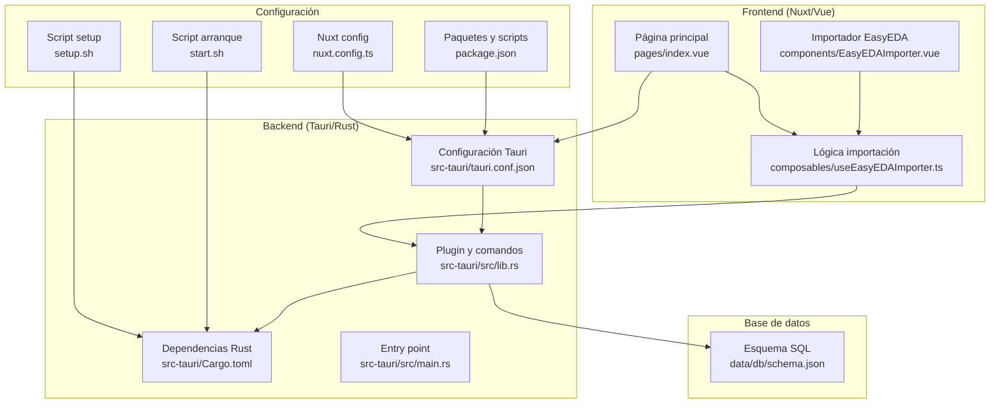
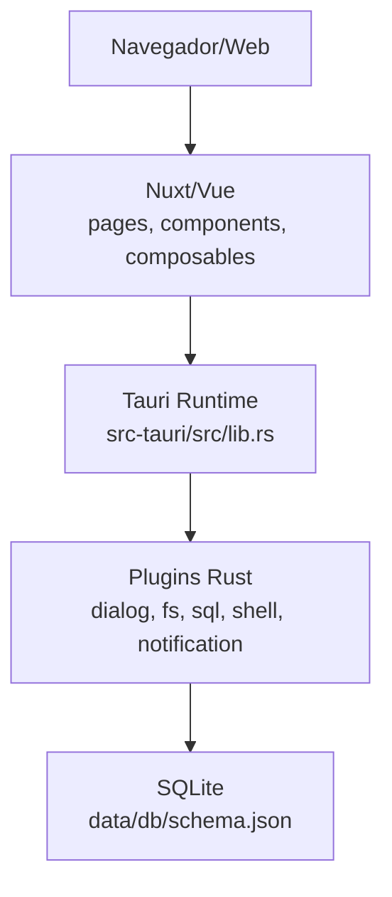
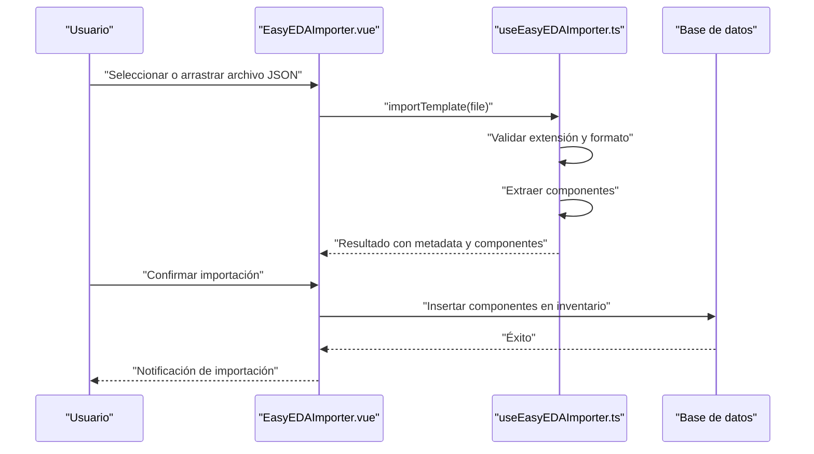
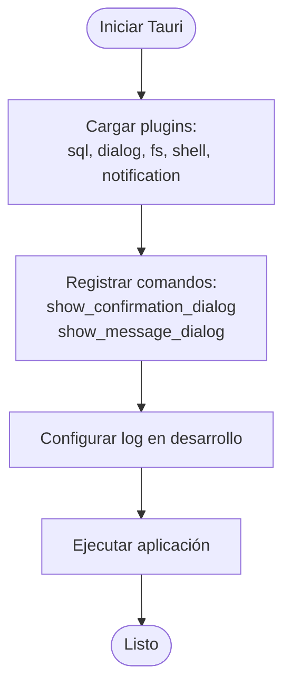

# Inicio Rápido

<cite>
**Archivos referenciados en este documento**
- [README.md](file://README.md)
- [package.json](file://package.json)
- [setup.sh](file://setup.sh)
- [start.sh](file://start.sh)
- [src-tauri/Cargo.toml](file://src-tauri/Cargo.toml)
- [src-tauri/tauri.conf.json](file://src-tauri/tauri.conf.json)
- [src-tauri/src/main.rs](file://src-tauri/src/main.rs)
- [src-tauri/src/lib.rs](file://src-tauri/src/lib.rs)
- [nuxt.config.ts](file://nuxt.config.ts)
- [data/db/schema.json](file://data/db/schema.json)
- [pages/index.vue](file://pages/index.vue)
- [components/EasyEDAImporter.vue](file://components/EasyEDAImporter.vue)
- [composables/useEasyEDAImporter.ts](file://composables/useEasyEDAImporter.ts)
- [wiki/MANEJO_ARCHIVOS.md](file://wiki/MANEJO_ARCHIVOS.md)
- [wiki/LCSC_API_INTEGRATION.md](file://wiki/LCSC_API_INTEGRATION.md)
</cite>

## Índice
1. [Introducción](#introducción)
2. [Estructura del proyecto](#estructura-del-proyecto)
3. [Requisitos previos](#requisitos-previos)
4. [Instalación automática](#instalación-automática)
5. [Instalación manual](#instalación-manual)
6. [Ejecución y primeros pasos](#ejecución-y-primeros-pasos)
7. [Configuración inicial](#configuración-inicial)
8. [Primeros usos recomendados](#primeros-usos-recomendados)
9. [Ejemplos prácticos](#ejemplos-prácticos)
10. [Solución de problemas comunes](#solución-de-problemas-comunes)
11. [Consejos para nuevos en Tauri](#consejos-para-nuevos-en-tauri)
12. [Arquitectura general](#arquitectura-general)
13. [Análisis detallado de componentes](#análisis-detallado-de-componentes)
14. [Consideraciones de rendimiento](#consideraciones-de-rendimiento)
15. [Guía de solución de problemas](#guía-de-solución-de-problemas)
16. [Conclusión](#conclusión)

## Introducción
BOM Manager es una aplicación multiplataforma para gestionar listas de materiales (BOM) de componentes electrónicos, con soporte para importar plantillas de EasyEDA, mantener inventarios, proyectos y notificaciones. La aplicación se ejecuta en entornos web gracias a Nuxt 4 y se empaqueta como aplicación de escritorio usando Tauri. El backend Rust se encarga de plugins como diálogo, notificaciones, shell, sistema de archivos y base de datos SQL.

## Estructura del proyecto
La estructura principal está dividida en frontend (Vue/Nuxt), backend Rust (Tauri), configuraciones de compilación y documentación. Los componentes clave incluyen:
- Frontend: páginas, componentes reutilizables, componibles (hooks lógicos), stores y utilidades.
- Backend: código Rust en src-tauri con configuración de plugins y comandos.
- Configuración: tauri.conf.json, Cargo.toml, nuxt.config.ts, package.json.
- Base de datos: esquema SQL en data/db/schema.json.

**Diagrama fuente**
- [pages/index.vue](file://pages/index.vue#L1-L294)
- [components/EasyEDAImporter.vue](file://components/EasyEDAImporter.vue#L1-L311)
- [composables/useEasyEDAImporter.ts](file://composables/useEasyEDAImporter.ts#L1-L187)
- [src-tauri/tauri.conf.json](file://src-tauri/tauri.conf.json#L1-L37)
- [src-tauri/Cargo.toml](file://src-tauri/Cargo.toml#L1-L31)
- [src-tauri/src/lib.rs](file://src-tauri/src/lib.rs#L1-L79)
- [src-tauri/src/main.rs](file://src-tauri/src/main.rs#L1-L7)
- [nuxt.config.ts](file://nuxt.config.ts#L1-L67)
- [package.json](file://package.json#L1-L50)
- [setup.sh](file://setup.sh#L1-L47)
- [start.sh](file://start.sh#L1-L36)
- [data/db/schema.json](file://data/db/schema.json#L1-L37)

**Sección fuente**
- [README.md](file://README.md#L63-L101)
- [nuxt.config.ts](file://nuxt.config.ts#L1-L67)
- [src-tauri/tauri.conf.json](file://src-tauri/tauri.conf.json#L1-L37)
- [src-tauri/Cargo.toml](file://src-tauri/Cargo.toml#L1-L31)
- [data/db/schema.json](file://data/db/schema.json#L1-L37)

## Requisitos previos
- Node.js versión 18 o superior.
- Rust (necesario para Tauri).
- Xcode Command Line Tools (solo macOS).
- Git (recomendado) para clonar el repositorio.

**Sección fuente**
- [README.md](file://README.md#L43-L55)
- [src-tauri/Cargo.toml](file://src-tauri/Cargo.toml#L1-L31)

## Instalación automática
El script de configuración automática verifica e instala automáticamente:
- Node.js (si no está presente).
- Rust (si no está presente).
- Xcode Command Line Tools (solo macOS).
- Dependencias de npm.

Pasos:
1. Dar permisos de ejecución al script.
2. Ejecutar el script de configuración.
3. Una vez completado, iniciar la aplicación con el comando correspondiente.

**Sección fuente**
- [README.md](file://README.md#L29-L41)
- [setup.sh](file://setup.sh#L1-L47)

## Instalación manual
Pasos:
1. Asegúrate de tener Node.js 18+ y Rust instalados.
2. En macOS, instala Xcode Command Line Tools.
3. Instala dependencias con npm.
4. Inicia el modo desarrollo con el script de Tauri.

**Sección fuente**
- [README.md](file://README.md#L41-L62)
- [package.json](file://package.json#L1-L50)

## Ejecución y primeros pasos
- Iniciar en desarrollo: ejecuta el script de arranque o usa el comando de Tauri.
- Abrir la aplicación: se iniciará en el navegador local y luego se empaquetará como aplicación de escritorio.

**Sección fuente**
- [start.sh](file://start.sh#L1-L36)
- [package.json](file://package.json#L1-L50)
- [src-tauri/tauri.conf.json](file://src-tauri/tauri.conf.json#L1-L37)

## Configuración inicial
- Configuración de Tauri: rutas de construcción, ventana principal, seguridad y plugins.
- Configuración de Nuxt: módulos, plugins Vite, cabeceras CORS y optimización de dependencias.
- Esquema de base de datos: tablas predefinidas (meta, bom_items, projects, files, project_items, activity, notifications, settings).

**Sección fuente**
- [src-tauri/tauri.conf.json](file://src-tauri/tauri.conf.json#L1-L37)
- [nuxt.config.ts](file://nuxt.config.ts#L1-L67)
- [data/db/schema.json](file://data/db/schema.json#L1-L37)

## Primeros usos recomendados
- Importar BOM inicial desde CSV/XLSX o plantilla de EasyEDA.
- Crear proyectos y asignar ítems.
- Revisar alertas de stock bajo y notificaciones.
- Explorar el inventario y realizar búsquedas.

**Sección fuente**
- [pages/index.vue](file://pages/index.vue#L63-L96)
- [components/EasyEDAImporter.vue](file://components/EasyEDAImporter.vue#L1-L311)

## Ejemplos prácticos
- Importar plantilla de EasyEDA:
  - Abrir el modal de importación.
  - Seleccionar o arrastrar un archivo JSON de EasyEDA.
  - Validar y previsualizar componentes.
  - Confirmar importación al inventario.

- Importar BOM desde archivo:
  - Usar el modal de importación desde la página principal.
  - Seleccionar archivo CSV/XLSX.
  - Revisar errores y confirmar importación.

**Sección fuente**
- [components/EasyEDAImporter.vue](file://components/EasyEDAImporter.vue#L1-L311)
- [composables/useEasyEDAImporter.ts](file://composables/useEasyEDAImporter.ts#L1-L187)
- [pages/index.vue](file://pages/index.vue#L132-L138)

## Solución de problemas comunes
- Falta de Rust:
  - Instálalo siguiendo las instrucciones del script o manual.
- Falta de Xcode Command Line Tools (macOS):
  - Ejecuta la instalación desde la terminal y vuelve a correr el script.
- Dependencias de npm no instaladas:
  - Ejecuta la instalación con npm.
- Errores de CORS o OPFS en navegadores:
  - Verifica las cabeceras configuradas en Nuxt y las limitaciones de almacenamiento.

**Sección fuente**
- [setup.sh](file://setup.sh#L1-L47)
- [start.sh](file://start.sh#L1-L36)
- [nuxt.config.ts](file://nuxt.config.ts#L20-L46)
- [wiki/MANEJO_ARCHIVOS.md](file://wiki/MANEJO_ARCHIVOS.md#L1-L46)

## Consejos para nuevos en Tauri
- Asegúrate de tener Rust instalado y actualizado.
- En macOS, instala Xcode Command Line Tools antes de compilar.
- Usa el script de setup para evitar errores de configuración.
- Para pruebas locales, ejecuta en modo desarrollo con Tauri.

**Sección fuente**
- [README.md](file://README.md#L9-L26)
- [src-tauri/Cargo.toml](file://src-tauri/Cargo.toml#L1-L31)

## Arquitectura general
La aplicación sigue un patrón frontend/backend separado:
- Frontend: Nuxt/Vue con componentes reutilizables, componibles y rutas.
- Backend: Tauri/Rust con plugins habilitados (diálogo, notificaciones, shell, fs, sql).
- Base de datos: SQLite con esquema predefinido.

**Diagrama fuente**
- [src-tauri/src/lib.rs](file://src-tauri/src/lib.rs#L1-L79)
- [src-tauri/tauri.conf.json](file://src-tauri/tauri.conf.json#L1-L37)
- [data/db/schema.json](file://data/db/schema.json#L1-L37)

## Análisis detallado de componentes
### Importador de EasyEDA
- Interfaz de usuario para cargar plantillas JSON.
- Lógica de validación y extracción de componentes.
- Conversión al formato interno de la aplicación.

**Diagrama fuente**
- [components/EasyEDAImporter.vue](file://components/EasyEDAImporter.vue#L1-L311)
- [composables/useEasyEDAImporter.ts](file://composables/useEasyEDAImporter.ts#L1-L187)

**Sección fuente**
- [components/EasyEDAImporter.vue](file://components/EasyEDAImporter.vue#L1-L311)
- [composables/useEasyEDAImporter.ts](file://composables/useEasyEDAImporter.ts#L1-L187)

### Configuración de Tauri
- Plugins activados: sql, dialog, fs, shell, notification.
- Comandos personalizados expuestos al frontend.
- Configuración de ventana, rutas de build/dev y seguridad.

**Diagrama fuente**
- [src-tauri/src/lib.rs](file://src-tauri/src/lib.rs#L1-L79)
- [src-tauri/tauri.conf.json](file://src-tauri/tauri.conf.json#L1-L37)

**Sección fuente**
- [src-tauri/src/lib.rs](file://src-tauri/src/lib.rs#L1-L79)
- [src-tauri/tauri.conf.json](file://src-tauri/tauri.conf.json#L1-L37)

## Consideraciones de rendimiento
- Optimización de dependencias en Nuxt y Vite.
- Uso de SQLite con preload de base de datos.
- Gestión de archivos en OPFS en navegadores y en sistema de archivos en escritorio.

**Sección fuente**
- [nuxt.config.ts](file://nuxt.config.ts#L37-L46)
- [src-tauri/tauri.conf.json](file://src-tauri/tauri.conf.json#L31-L35)
- [wiki/MANEJO_ARCHIVOS.md](file://wiki/MANEJO_ARCHIVOS.md#L1-L46)

## Guía de solución de problemas
- Verificar instalación de Rust y Node.js.
- En macOS, asegurar Xcode Command Line Tools instalados.
- Reinstalar dependencias de npm si hay errores de módulos.
- Revisar cabeceras CORS y limitaciones de OPFS en navegadores.

**Sección fuente**
- [setup.sh](file://setup.sh#L1-L47)
- [start.sh](file://start.sh#L1-L36)
- [nuxt.config.ts](file://nuxt.config.ts#L20-L46)
- [wiki/MANEJO_ARCHIVOS.md](file://wiki/MANEJO_ARCHIVOS.md#L1-L46)

## Conclusión
Con esta guía rápida, deberías poder instalar, configurar y ejecutar BOM Manager en tu máquina. Usa el importador de EasyEDA o archivos CSV/XLSX para poblar tu inventario, crea proyectos y explora las funcionalidades de alertas y notificaciones. Si encuentras problemas, sigue los pasos de solución de problemas y consulta la documentación adicional sobre manejo de archivos y posibles integraciones.