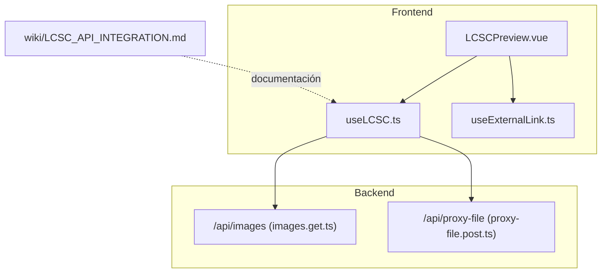
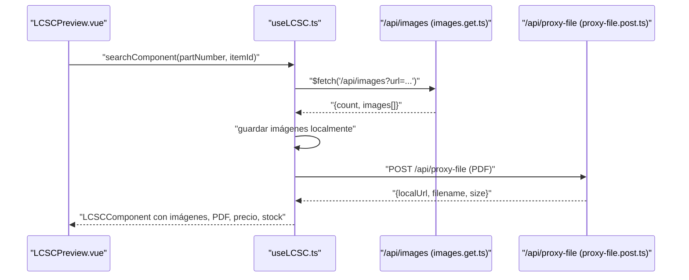
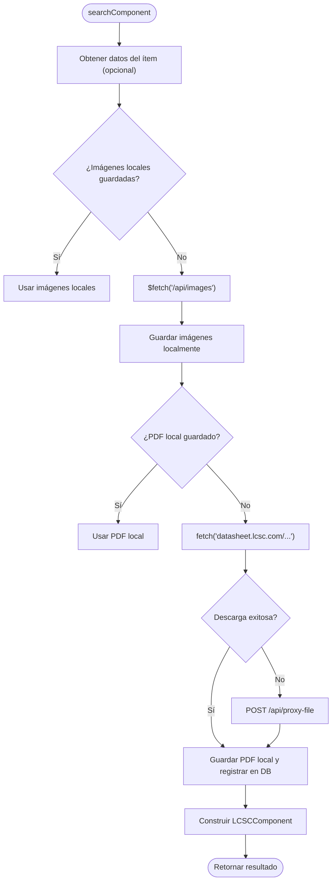
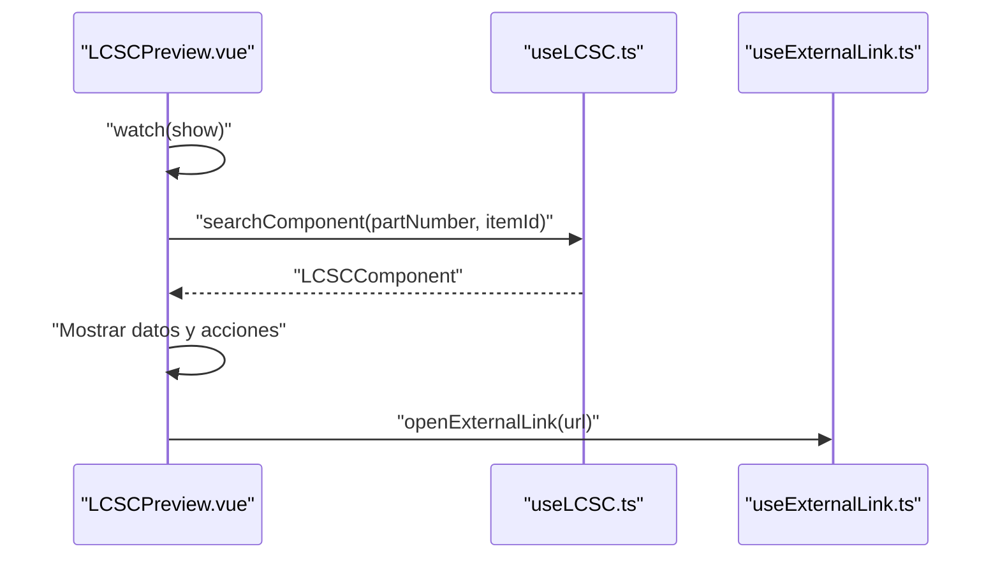
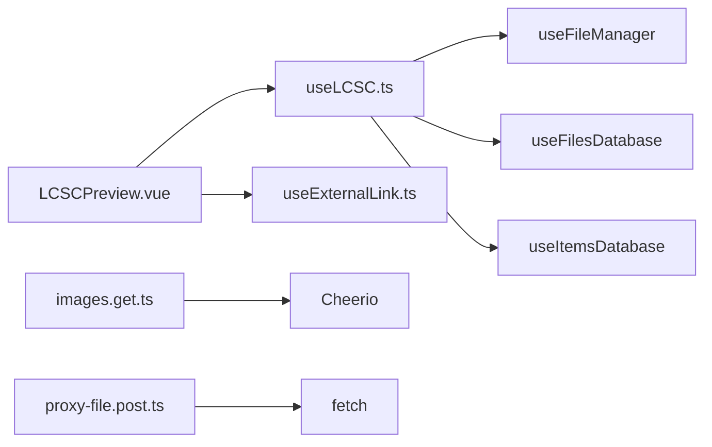

# Integración LCSC

<cite>
**Archivos citados en este documento**
- [wiki/LCSC_API_INTEGRATION.md](file://wiki/LCSC_API_INTEGRATION.md)
- [composables/useLCSC.ts](file://composables/useLCSC.ts)
- [components/LCSCPreview.vue](file://components/LCSCPreview.vue)
- [server/api/images.get.ts](file://server/api/images.get.ts)
- [server/api/proxy-file.post.ts](file://server/api/proxy-file.post.ts)
- [composables/useExternalLink.ts](file://composables/useExternalLink.ts)
- [pages/projects/[id].vue](file://pages/projects/[id].vue)
- [README.md](file://README.md)
</cite>

## Índice
1. [Introducción](#introducción)
2. [Estructura del proyecto](#estructura-del-proyecto)
3. [Componentes principales](#componentes-principales)
4. [Visión general de la arquitectura](#visión-general-de-la-arquitectura)
5. [Análisis detallado de componentes](#análisis-detallado-de-componentes)
6. [Análisis de dependencias](#análisis-de-dependencias)
7. [Consideraciones de rendimiento](#consideraciones-de-rendimiento)
8. [Guía de resolución de problemas](#guía-de-resolución-de-problemas)
9. [Conclusión](#conclusión)
10. [Apéndices](#apéndices)

## Introducción
Este documento describe la integración con la API de LCSC implementada en la aplicación. Cubre cómo se realiza la búsqueda de componentes, la previsualización de datos, la descarga de imágenes y PDFs, y cómo se manejan precios, disponibilidad y enlaces directos al sitio. También incluye recomendaciones de uso, casos de prueba y buenas prácticas para aprovechar al máximo la integración.

La integración contempla:
- Búsqueda de componentes por número de parte
- Previsualización detallada con imágenes, especificaciones y enlaces
- Descarga y almacenamiento local de PDFs de datasheet
- Generación de enlaces directos al sitio LCSC
- Validación de números de parte
- Soporte de proxy para evitar problemas de CORS al descargar archivos

**Sección fuente**
- [README.md](file://README.md#L1-L101)

## Estructura del proyecto
La integración se construye sobre una arquitectura frontend basada en Vue/Nuxt, con lógica reutilizable en componibles y rutas backend para operaciones auxiliares (extracción de imágenes y descarga de archivos).

**Diagrama fuente**
- [components/LCSCPreview.vue](file://components/LCSCPreview.vue#L1-L198)
- [composables/useLCSC.ts](file://composables/useLCSC.ts#L1-L353)
- [server/api/images.get.ts](file://server/api/images.get.ts#L1-L120)
- [server/api/proxy-file.post.ts](file://server/api/proxy-file.post.ts#L1-L78)
- [composables/useExternalLink.ts](file://composables/useExternalLink.ts#L1-L28)
- [wiki/LCSC_API_INTEGRATION.md](file://wiki/LCSC_API_INTEGRATION.md#L1-L108)

**Sección fuente**
- [components/LCSCPreview.vue](file://components/LCSCPreview.vue#L1-L198)
- [composables/useLCSC.ts](file://composables/useLCSC.ts#L1-L353)
- [server/api/images.get.ts](file://server/api/images.get.ts#L1-L120)
- [server/api/proxy-file.post.ts](file://server/api/proxy-file.post.ts#L1-L78)
- [composables/useExternalLink.ts](file://composables/useExternalLink.ts#L1-L28)
- [wiki/LCSC_API_INTEGRATION.md](file://wiki/LCSC_API_INTEGRATION.md#L1-L108)

## Componentes principales
- useLCSC: Componible que encapsula toda la lógica de búsqueda, descarga de imágenes y PDFs, validación de números de parte y generación de enlaces.
- LCSCPreview: Componente de interfaz que muestra la previsualización de un componente LCSC, incluyendo imágenes, especificaciones, precio, stock y acciones (abrir PDF, ir al sitio).
- Rutas backend:
  - /api/images: Extrae imágenes de la página del producto LCSC.
  - /api/proxy-file: Descarga archivos remotos (PDFs) evitando problemas de CORS.

**Sección fuente**
- [composables/useLCSC.ts](file://composables/useLCSC.ts#L1-L353)
- [components/LCSCPreview.vue](file://components/LCSCPreview.vue#L1-L198)
- [server/api/images.get.ts](file://server/api/images.get.ts#L1-L120)
- [server/api/proxy-file.post.ts](file://server/api/proxy-file.post.ts#L1-L78)

## Visión general de la arquitectura
La integración sigue un flujo de llamadas asíncronas desde el frontend hacia rutas backend, que a su vez acceden a recursos externos de LCSC. El componible useLCSC se encarga de coordinar la obtención de datos, imágenes y PDFs, y de persistirlos localmente cuando es posible.

**Diagrama fuente**
- [components/LCSCPreview.vue](file://components/LCSCPreview.vue#L176-L189)
- [composables/useLCSC.ts](file://composables/useLCSC.ts#L27-L261)
- [server/api/images.get.ts](file://server/api/images.get.ts#L1-L120)
- [server/api/proxy-file.post.ts](file://server/api/proxy-file.post.ts#L1-L78)

**Sección fuente**
- [components/LCSCPreview.vue](file://components/LCSCPreview.vue#L176-L189)
- [composables/useLCSC.ts](file://composables/useLCSC.ts#L27-L261)
- [server/api/images.get.ts](file://server/api/images.get.ts#L1-L120)
- [server/api/proxy-file.post.ts](file://server/api/proxy-file.post.ts#L1-L78)

## Análisis detallado de componentes

### useLCSC: Funcionalidad de búsqueda, imágenes y PDFs
- Búsqueda de componentes: Recibe un número de parte y opcionalmente un ID de ítem. Obtiene datos provisionales del ítem si está disponible, busca imágenes locales previas y, si no hay imágenes guardadas, llama a la ruta /api/images para extraer imágenes de la página del producto LCSC.
- Descarga de PDFs: Si no hay un PDF guardado localmente, descarga el PDF del datasheet desde el dominio LCSC. En caso de fallo, utiliza el proxy /api/proxy-file para obtener el archivo como base64 y guardarlo localmente.
- Persistencia local: Las imágenes y PDFs se guardan usando un sistema de archivos local (OPFS o Tauri), y se registran en la base de datos de archivos asociados al ítem.
- Enlaces y validación: Genera enlaces directos al sitio LCSC y valida números de parte con una expresión regular.

**Diagrama fuente**
- [composables/useLCSC.ts](file://composables/useLCSC.ts#L27-L261)
- [server/api/images.get.ts](file://server/api/images.get.ts#L1-L120)
- [server/api/proxy-file.post.ts](file://server/api/proxy-file.post.ts#L1-L78)

**Sección fuente**
- [composables/useLCSC.ts](file://composables/useLCSC.ts#L1-L353)

### LCSCPreview: Vista previa de componentes
- Interfaz de usuario que muestra:
  - Imágenes múltiples o una sola imagen
  - Nombre, número de parte, fabricante, categoría, precio, stock y parámetros
  - Acciones: abrir PDF del datasheet (desde local/base64/remoto) y abrir enlace directo al sitio LCSC
- Manejo de errores: Muestra un mensaje de error si ocurre algún problema durante la carga.
- Flujo reactivo: Observa cambios en la propiedad show y, cuando se activa, invoca searchComponent con el número de parte o el ítem correspondiente.

**Diagrama fuente**
- [components/LCSCPreview.vue](file://components/LCSCPreview.vue#L176-L189)
- [composables/useLCSC.ts](file://composables/useLCSC.ts#L332-L352)
- [composables/useExternalLink.ts](file://composables/useExternalLink.ts#L1-L28)

**Sección fuente**
- [components/LCSCPreview.vue](file://components/LCSCPreview.vue#L1-L198)
- [composables/useExternalLink.ts](file://composables/useExternalLink.ts#L1-L28)

### Ruta /api/images: Extracción de imágenes
- Obtiene la URL de la página del producto LCSC, hace fetch del HTML, y extrae la imagen principal mediante meta tags.
- Genera variaciones de imagen (front/back/blank) basadas en la URL base y retorna hasta tres imágenes únicas.

**Sección fuente**
- [server/api/images.get.ts](file://server/api/images.get.ts#L1-L120)

### Ruta /api/proxy-file: Descarga de archivos remotos
- Valida que la URL sea de dominio LCSC, descarga el archivo remoto, lo convierte a base64 y lo devuelve junto con el tamaño y nombre. Útil para PDFs de datasheet.

**Sección fuente**
- [server/api/proxy-file.post.ts](file://server/api/proxy-file.post.ts#L1-L78)

### Validación de números de parte
- Se utiliza una expresión regular para validar que el número de parte tenga el formato típico de LCSC (letra seguida de al menos 6 dígitos).

**Sección fuente**
- [composables/useLCSC.ts](file://composables/useLCSC.ts#L337-L344)

## Análisis de dependencias
- useLCSC depende de:
  - useFileManager: Para guardar archivos localmente
  - useFilesDatabase: Para registrar archivos en la base de datos
  - useItemsDatabase: Para recuperar archivos previos de un ítem
- LCSCPreview depende de:
  - useLCSC: Para obtener datos del componente
  - useExternalLink: Para abrir enlaces externos (Tauri o navegador)
- Rutas backend:
  - images.get.ts: Utiliza Cheerio para parsear HTML y extraer imágenes
  - proxy-file.post.ts: Realiza descargas HTTP y conversión a base64

**Diagrama fuente**
- [composables/useLCSC.ts](file://composables/useLCSC.ts#L1-L353)
- [components/LCSCPreview.vue](file://components/LCSCPreview.vue#L1-L198)
- [server/api/images.get.ts](file://server/api/images.get.ts#L1-L120)
- [server/api/proxy-file.post.ts](file://server/api/proxy-file.post.ts#L1-L78)

**Sección fuente**
- [composables/useLCSC.ts](file://composables/useLCSC.ts#L1-L353)
- [components/LCSCPreview.vue](file://components/LCSCPreview.vue#L1-L198)
- [server/api/images.get.ts](file://server/api/images.get.ts#L1-L120)
- [server/api/proxy-file.post.ts](file://server/api/proxy-file.post.ts#L1-L78)

## Consideraciones de rendimiento
- Caché local de imágenes y PDFs: Almacenar archivos localmente reduce llamadas a recursos externos y mejora tiempos de carga.
- Uso de proxy: La ruta /api/proxy-file evita problemas de CORS y permite manejar descargas de manera controlada.
- Extracción selectiva de imágenes: La ruta /api/images limita a un máximo de tres imágenes únicas, optimizando el tráfico.
- Validación de entradas: Ambas rutas backend validan parámetros y lanzan errores específicos, mejorando robustez.

[No secciones fuentes adicionales]

## Guía de resolución de problemas
- Errores comunes en la integración LCSC:
  - Clave, nonce, timestamp o firma requeridos: Requiere autenticación válida (ver documentación).
  - Producto no encontrado: El número de parte puede ser inválido o inexistente.
  - Límites de tasa: Reintentar después del tiempo indicado.
- Errores en rutas backend:
  - /api/images: Parámetro faltante, formato inválido o error al obtener la URL.
  - /api/proxy-file: Método no permitido, URL inválida o error en la descarga.
- Manejo de PDFs:
  - Si la descarga directa falla, se usa el proxy. Si también falla, se muestra un mensaje de error y se recomienda abrir el PDF desde el sitio LCSC.

**Sección fuente**
- [wiki/LCSC_API_INTEGRATION.md](file://wiki/LCSC_API_INTEGRATION.md#L1-L108)
- [server/api/images.get.ts](file://server/api/images.get.ts#L1-L120)
- [server/api/proxy-file.post.ts](file://server/api/proxy-file.post.ts#L1-L78)

## Conclusión
La integración con LCSC en la aplicación permite una experiencia completa de búsqueda, previsualización y acceso a información técnica de componentes. Gracias a la combinación de rutas backend y componibles frontend, se logra una experiencia fluida tanto en navegadores como en aplicaciones nativas, con soporte para imágenes, PDFs y enlaces directos. Se recomienda seguir las buenas prácticas descritas a continuación para mantener la calidad y eficiencia de la integración.

[No secciones fuentes adicionales]

## Apéndices

### Casos de uso típicos
- Previsualización de un componente desde el listado de proyectos:
  - Abrir el modal de previsualización pasando el número de parte y el ID del ítem.
  - El componente mostrará imágenes, especificaciones, precio y stock, y permitirá abrir el PDF o ir al sitio LCSC.
- Validación de números de parte antes de agregar un ítem al inventario o proyecto.
- Comparación de precios y disponibilidad:
  - Aunque la implementación actual simula precios y stock, se puede extender para consumir datos reales de LCSC (ver documentación de APIs).

**Sección fuente**
- [components/LCSCPreview.vue](file://components/LCSCPreview.vue#L176-L189)
- [pages/projects/[id].vue](file://pages/projects/[id].vue#L225-L247)
- [wiki/LCSC_API_INTEGRATION.md](file://wiki/LCSC_API_INTEGRATION.md#L1-L108)

### Mejores prácticas
- Almacenar imágenes y PDFs localmente para mejorar tiempos de carga y evitar dependencias externas constantes.
- Validar siempre los números de parte antes de realizar búsquedas.
- Usar el proxy para descargas de PDFs cuando haya problemas de CORS.
- Limitar el número de llamadas concurrentes a recursos externos y aplicar reintentos con temporizadores.
- Mantener actualizada la documentación de las APIs de LCSC y adaptar la implementación en caso de cambios.

**Sección fuente**
- [composables/useLCSC.ts](file://composables/useLCSC.ts#L1-L353)
- [server/api/images.get.ts](file://server/api/images.get.ts#L1-L120)
- [server/api/proxy-file.post.ts](file://server/api/proxy-file.post.ts#L1-L78)
- [wiki/LCSC_API_INTEGRATION.md](file://wiki/LCSC_API_INTEGRATION.md#L1-L108)