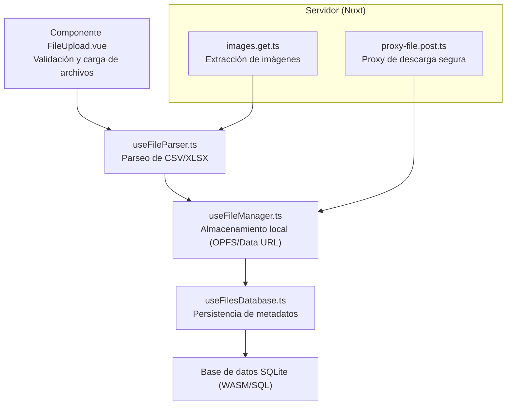
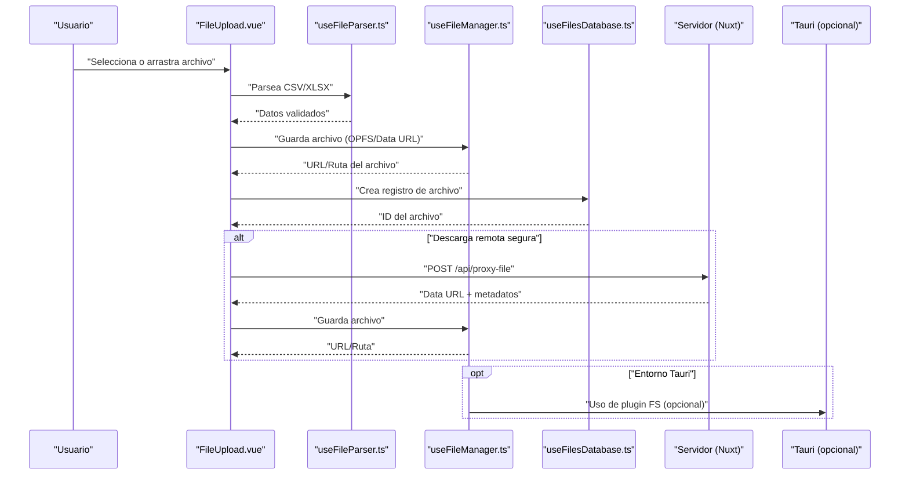
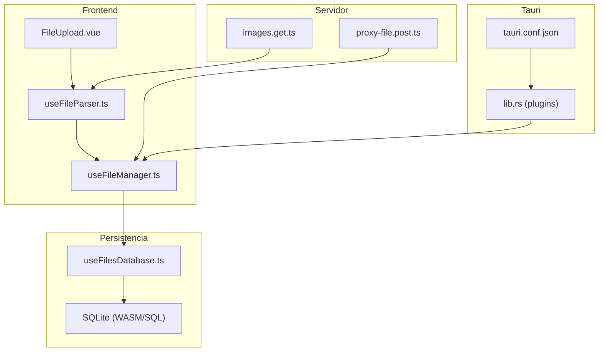
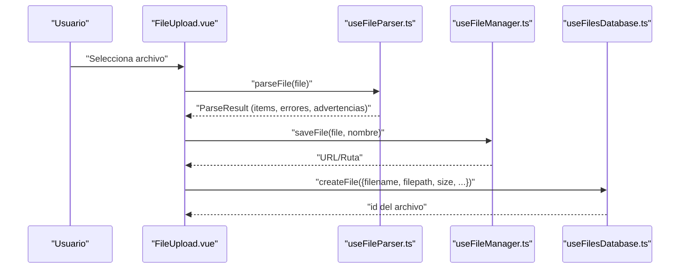
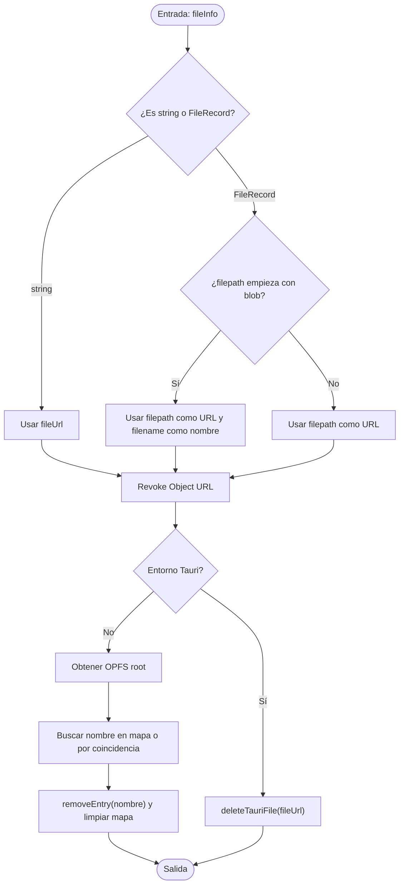
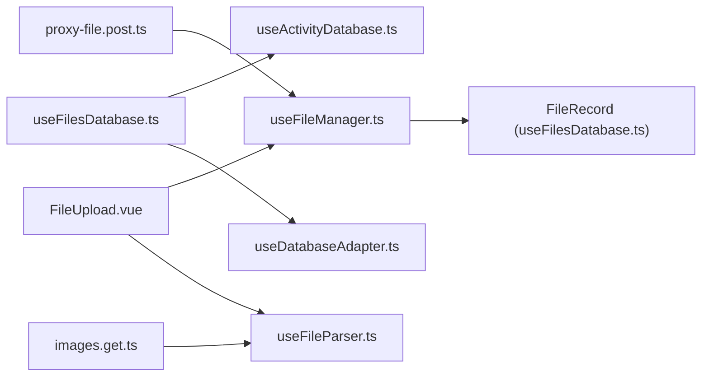
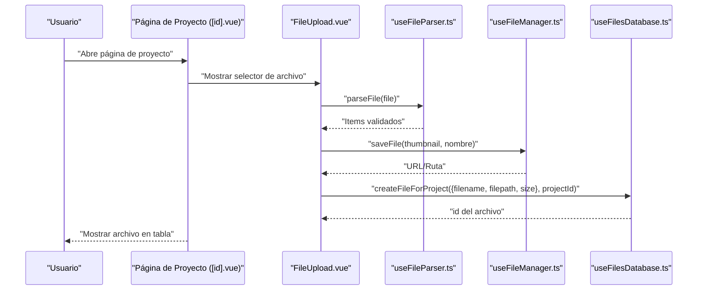

# Manejo de Archivos

<cite>
**Archivos mencionados en este documento**
- [useFileManager.ts](file://composables/useFileManager.ts)
- [useFilesDatabase.ts](file://composables/useFilesDatabase.ts)
- [FileUpload.vue](file://components/FileUpload.vue)
- [useFileParser.ts](file://composables/useFileParser.ts)
- [images.get.ts](file://server/api/images.get.ts)
- [proxy-file.post.ts](file://server/api/proxy-file.post.ts)
- [MANEJO_ARCHIVOS.md](file://wiki/MANEJO_ARCHIVOS.md)
- [lib.rs](file://src-tauri/src/lib.rs)
- [tauri.conf.json](file://src-tauri/tauri.conf.json)
- [main.rs](file://src-tauri/src/main.rs)
- [sql-wasm-debug.js](file://public/assets/sql-wasm-debug.js)
- [useBackup.ts](file://composables/useBackup.ts)
- [pages/projects/[id].vue](file://pages/projects/[id].vue)
</cite>

## Índice
1. [Introducción](#introducción)
2. [Estructura del sistema de archivos](#estructura-del-sistema-de-archivos)
3. [Componentes principales](#componentes-principales)
4. [Arquitectura general](#arquitectura-general)
5. [Análisis detallado de componentes](#análisis-detallado-de-componentes)
6. [Análisis de dependencias](#análisis-de-dependencias)
7. [Consideraciones de rendimiento](#consideraciones-de-rendimiento)
8. [Guía de solución de problemas](#guía-de-solución-de-problemas)
9. [Conclusión](#conclusión)
10. [Apéndices](#apéndices)

## Introducción
Este documento describe el sistema completo de manejo de archivos en BOM Manager, incluyendo el almacenamiento de imágenes y PDFs, el uso del Origin Private File System (OPFS) en entornos web, la gestión de archivos locales en aplicaciones Tauri, y las consideraciones de seguridad. Cubre el proceso de carga, organización, búsqueda y eliminación de archivos, así como rutas de archivo, permisos de acceso, limpieza de archivos temporales, optimización de espacio de almacenamiento, integración con el sistema de archivos del sistema operativo, sincronización de datos y respaldo de archivos importantes. También incluye flujos de trabajo típicos, casos de uso y mejores prácticas.

## Estructura del sistema de archivos
El sistema de archivos se organiza en tres capas principales:
- Interfaz de usuario y carga de archivos: componente de carga de archivos con validación de tipos y tamaños.
- Lógica de manejo de archivos: composable que gestiona el almacenamiento local (OPFS en web, Data URLs en Tauri) y operaciones de borrado y estimación de espacio.
- Persistencia de metadatos: base de datos de archivos con registros de nombre, ruta, tipo, tamaño, título, descripción y fechas de creación.

**Diagrama fuente**
- [FileUpload.vue](file://components/FileUpload.vue#L1-L283)
- [useFileParser.ts](file://composables/useFileParser.ts#L1-L422)
- [useFileManager.ts](file://composables/useFileManager.ts#L1-L260)
- [useFilesDatabase.ts](file://composables/useFilesDatabase.ts#L1-L179)
- [proxy-file.post.ts](file://server/api/proxy-file.post.ts#L1-L78)
- [images.get.ts](file://server/api/images.get.ts#L1-L120)

**Sección fuente**
- [useFileManager.ts](file://composables/useFileManager.ts#L1-L260)
- [useFilesDatabase.ts](file://composables/useFilesDatabase.ts#L1-L179)
- [FileUpload.vue](file://components/FileUpload.vue#L1-L283)
- [useFileParser.ts](file://composables/useFileParser.ts#L1-L422)
- [images.get.ts](file://server/api/images.get.ts#L1-L120)
- [proxy-file.post.ts](file://server/api/proxy-file.post.ts#L1-L78)
- [MANEJO_ARCHIVOS.md](file://wiki/MANEJO_ARCHIVOS.md#L1-L46)

## Componentes principales
- useFileManager.ts: Gestiona el almacenamiento local (OPFS en web, Data URLs en Tauri), operaciones de guardado, eliminación, obtención de información de almacenamiento y verificación de disponibilidad de OPFS.
- useFilesDatabase.ts: Persiste metadatos de archivos en la base de datos (SQLite/WASM), permite crear, leer, actualizar, eliminar y buscar archivos asociados a proyectos o ítems.
- FileUpload.vue: Componente de interfaz que permite arrastrar o seleccionar archivos, validar tipos y tamaños, mostrar progreso y errores.
- useFileParser.ts: Parsea archivos CSV y XLSX, detecta automáticamente columnas relevantes y valida los datos con Zod.
- Servidor (Nuxt): endpoints images.get.ts y proxy-file.post.ts para extracción de imágenes y descarga segura de archivos remotos.
- Tauri: Plugins habilitados en tiempo de ejecución y configuración de confianza de rutas de base de datos.

**Sección fuente**
- [useFileManager.ts](file://composables/useFileManager.ts#L1-L260)
- [useFilesDatabase.ts](file://composables/useFilesDatabase.ts#L1-L179)
- [FileUpload.vue](file://components/FileUpload.vue#L1-L283)
- [useFileParser.ts](file://composables/useFileParser.ts#L1-L422)
- [images.get.ts](file://server/api/images.get.ts#L1-L120)
- [proxy-file.post.ts](file://server/api/proxy-file.post.ts#L1-L78)
- [lib.rs](file://src-tauri/src/lib.rs#L1-L79)
- [tauri.conf.json](file://src-tauri/tauri.conf.json#L1-L37)

## Arquitectura general
La arquitectura sigue un flujo de carga, parseo, almacenamiento y persistencia de metadatos. En web se usa OPFS para almacenamiento local; en Tauri se almacenan Data URLs en la base de datos. El servidor expone endpoints para imágenes y descargas seguras, restringidas a dominios permitidos.

**Diagrama fuente**
- [FileUpload.vue](file://components/FileUpload.vue#L1-L283)
- [useFileParser.ts](file://composables/useFileParser.ts#L1-L422)
- [useFileManager.ts](file://composables/useFileManager.ts#L1-L260)
- [useFilesDatabase.ts](file://composables/useFilesDatabase.ts#L1-L179)
- [proxy-file.post.ts](file://server/api/proxy-file.post.ts#L1-L78)
- [lib.rs](file://src-tauri/src/lib.rs#L1-L79)

## Análisis detallado de componentes

### useFileManager.ts
- Almacenamiento local:
  - Web (OPFS): Guarda archivos en el directorio privado del origen y devuelve una URL de objeto para acceso temporal. Mantiene un mapa de URL a nombre de archivo para facilitar la eliminación.
  - Tauri: Almacena Data URLs en la base de datos. En entornos donde el plugin FS está disponible, puede escribir en el sistema de archivos del sistema operativo.
- Operaciones:
  - Guardar archivo: saveFile determina el entorno y delega a saveFileToOPFS o saveFileToTauri.
  - Eliminar archivo: deleteFile revoca la URL de objeto y elimina el archivo en OPFS o registra la intención de eliminación en Tauri.
  - Información de almacenamiento: getStorageInfo proporciona cuota, uso y disponible (solo web).
  - Disponibilidad de OPFS: isOPFSAvailable verifica compatibilidad del navegador.
  - Recuperar archivo por nombre: getFileByName (limitaciones en Tauri).
- Seguridad:
  - URLs de objetos son temporales y deben ser revocadas al eliminar.
  - En OPFS, el almacenamiento es privado al origen.

**Sección fuente**
- [useFileManager.ts](file://composables/useFileManager.ts#L1-L260)
- [MANEJO_ARCHIVOS.md](file://wiki/MANEJO_ARCHIVOS.md#L1-L46)

### useFilesDatabase.ts
- Estructura de FileRecord: id, project_id, item_id, filename, filepath, file_type, size, title, description, created_at.
- Operaciones CRUD:
  - Crear archivo (y sobrecargas para proyecto/ítem).
  - Leer por id, por proyecto o por ítem.
  - Actualizar y eliminar, con registro de actividad.
- Integración:
  - Se usa junto con useFileManager.ts para vincular rutas/URLs con metadatos persistentes.

**Sección fuente**
- [useFilesDatabase.ts](file://composables/useFilesDatabase.ts#L1-L179)

### FileUpload.vue
- Validación de tipos: CSV, XLSX, XLS.
- Validación de tamaño máximo configurable.
- Interfaz drag-and-drop y selección de archivo.
- Emisión de eventos fileSelected y error.
- Formateo de tamaño de archivo.

**Sección fuente**
- [FileUpload.vue](file://components/FileUpload.vue#L1-L283)

### useFileParser.ts
- Detección automática de columnas mediante patrones de nombres comunes.
- Procesamiento de datos y validación con Zod.
- Soporte para CSV (PapaParse) y XLS/XLSX (SheetJS).
- Resultados incluyen items procesados, errores y advertencias.

**Sección fuente**
- [useFileParser.ts](file://composables/useFileParser.ts#L1-L422)

### Servidor: images.get.ts y proxy-file.post.ts
- images.get.ts: Extrae imágenes de una URL dada, priorizando meta tag og:image y generando variaciones (front/back/blank) si aplica.
- proxy-file.post.ts: Descarga archivos remotos (solo dominios LCSC), evita problemas de CORS, devuelve un Data URL y metadatos del archivo.

**Sección fuente**
- [images.get.ts](file://server/api/images.get.ts#L1-L120)
- [proxy-file.post.ts](file://server/api/proxy-file.post.ts#L1-L78)

### Tauri: Plugins y configuración
- Plugins cargados en tiempo de ejecución: shell, fs, sql, dialog, notification.
- Configuración de base de datos: preload de SQLite con ruta fija.
- Entrada principal: main.rs llama a app_lib::run.

**Sección fuente**
- [lib.rs](file://src-tauri/src/lib.rs#L1-L79)
- [tauri.conf.json](file://src-tauri/tauri.conf.json#L1-L37)
- [main.rs](file://src-tauri/src/main.rs#L1-L7)

### Respaldo de archivos importantes
- useBackup.ts: Crea copias de seguridad completas de ítems, proyectos y listas, exporta como JSON y permite importar respaldos validando estructura.

**Sección fuente**
- [useBackup.ts](file://composables/useBackup.ts#L1-L129)

## Arquitectura general

**Diagrama fuente**
- [FileUpload.vue](file://components/FileUpload.vue#L1-L283)
- [useFileParser.ts](file://composables/useFileParser.ts#L1-L422)
- [useFileManager.ts](file://composables/useFileManager.ts#L1-L260)
- [useFilesDatabase.ts](file://composables/useFilesDatabase.ts#L1-L179)
- [images.get.ts](file://server/api/images.get.ts#L1-L120)
- [proxy-file.post.ts](file://server/api/proxy-file.post.ts#L1-L78)
- [lib.rs](file://src-tauri/src/lib.rs#L1-L79)
- [tauri.conf.json](file://src-tauri/tauri.conf.json#L1-L37)

## Análisis detallado de componentes

### Flujo de carga de archivos (CSV/XLSX)

**Diagrama fuente**
- [FileUpload.vue](file://components/FileUpload.vue#L1-L283)
- [useFileParser.ts](file://composables/useFileParser.ts#L1-L422)
- [useFileManager.ts](file://composables/useFileManager.ts#L1-L260)
- [useFilesDatabase.ts](file://composables/useFilesDatabase.ts#L1-L179)

**Sección fuente**
- [FileUpload.vue](file://components/FileUpload.vue#L1-L283)
- [useFileParser.ts](file://composables/useFileParser.ts#L1-L422)
- [useFileManager.ts](file://composables/useFileManager.ts#L1-L260)
- [useFilesDatabase.ts](file://composables/useFilesDatabase.ts#L1-L179)

### Algoritmo de eliminación de archivos

**Diagrama fuente**
- [useFileManager.ts](file://composables/useFileManager.ts#L119-L192)

**Sección fuente**
- [useFileManager.ts](file://composables/useFileManager.ts#L119-L192)

### Integración con el sistema operativo (Tauri)
- Plugins activos: fs, shell, sql, dialog, notification.
- Base de datos: SQLite pre-cargada con ruta fija.
- Comandos personalizados expuestos al frontend (diálogos).

**Sección fuente**
- [lib.rs](file://src-tauri/src/lib.rs#L1-L79)
- [tauri.conf.json](file://src-tauri/tauri.conf.json#L1-L37)

### Consideraciones de seguridad
- OPFS es privado al origen; no se comparte entre sitios.
- URLs de objetos son temporales y deben ser revocadas.
- Proxy de descarga restringe a dominios permitidos (LCSC).
- Se recomienda implementar políticas de retención de datos.

**Sección fuente**
- [MANEJO_ARCHIVOS.md](file://wiki/MANEJO_ARCHIVOS.md#L41-L46)
- [proxy-file.post.ts](file://server/api/proxy-file.post.ts#L1-L78)

### Casos de uso típicos
- Importar BOM desde CSV/XLSX: Validar archivo, parsear, guardar thumbnails o adjuntos, registrar metadatos.
- Descargar imagen de producto: Usar endpoint images.get.ts para obtener variaciones.
- Descargar archivo remoto: Usar proxy-file.post.ts con validación de dominio.
- Eliminar archivos obsoletos: Revocar URLs y eliminar entradas de OPFS/Tauri.

**Sección fuente**
- [FileUpload.vue](file://components/FileUpload.vue#L1-L283)
- [useFileParser.ts](file://composables/useFileParser.ts#L1-L422)
- [images.get.ts](file://server/api/images.get.ts#L1-L120)
- [proxy-file.post.ts](file://server/api/proxy-file.post.ts#L1-L78)
- [useFileManager.ts](file://composables/useFileManager.ts#L1-L260)

### Mejores prácticas
- Compresión de imágenes y uso de formatos eficientes.
- Limpieza periódica de archivos temporales.
- Manejo de fallback cuando OPFS no está disponible.
- Validación estricta de tipos y tamaños en la interfaz.
- Registro de actividad al crear, actualizar y eliminar archivos.

**Sección fuente**
- [MANEJO_ARCHIVOS.md](file://wiki/MANEJO_ARCHIVOS.md#L34-L40)
- [FileUpload.vue](file://components/FileUpload.vue#L1-L283)
- [useFilesDatabase.ts](file://composables/useFilesDatabase.ts#L1-L179)

## Análisis de dependencias
- useFileManager.ts depende de:
  - useFilesDatabase.ts (tipado de FileRecord).
  - Plugins de Tauri (opcional).
  - API Navigator Storage (OPFS).
- useFilesDatabase.ts depende de:
  - useDatabaseAdapter (acceso a base de datos).
  - useActivityDatabase (registro de actividad).
- FileUpload.vue depende de:
  - useFileParser.ts (parseo).
  - useFileManager.ts (almacenamiento).
- Servidor:
  - images.get.ts y proxy-file.post.ts son endpoints Nuxt independientes.

**Diagrama fuente**
- [useFileManager.ts](file://composables/useFileManager.ts#L1-L260)
- [useFilesDatabase.ts](file://composables/useFilesDatabase.ts#L1-L179)
- [FileUpload.vue](file://components/FileUpload.vue#L1-L283)
- [useFileParser.ts](file://composables/useFileParser.ts#L1-L422)
- [images.get.ts](file://server/api/images.get.ts#L1-L120)
- [proxy-file.post.ts](file://server/api/proxy-file.post.ts#L1-L78)

**Sección fuente**
- [useFileManager.ts](file://composables/useFileManager.ts#L1-L260)
- [useFilesDatabase.ts](file://composables/useFilesDatabase.ts#L1-L179)
- [FileUpload.vue](file://components/FileUpload.vue#L1-L283)
- [useFileParser.ts](file://composables/useFileParser.ts#L1-L422)
- [images.get.ts](file://server/api/images.get.ts#L1-L120)
- [proxy-file.post.ts](file://server/api/proxy-file.post.ts#L1-L78)

## Consideraciones de rendimiento
- OPFS: Estimación de cuota y uso disponible ayuda a prevenir desbordamientos.
- Data URLs: Son útiles para almacenamiento temporal pero consumen memoria; revocar URLs y eliminar entradas es crucial.
- Parseo de archivos grandes: Limitar tamaño máximo y usar streaming o paginación si es posible.
- Uso de plugins Tauri: Escribir directamente en disco mejora el rendimiento en entornos nativos.

[No se necesitan fuentes adicionales ya que esta sección ofrece orientación general]

## Guía de solución de problemas
- Archivo no guardado en OPFS:
  - Verificar compatibilidad del navegador y disponibilidad de OPFS.
  - Revisar errores en la consola durante el proceso de escritura.
- No se puede eliminar archivo:
  - Asegurar que la URL fue revocada y que se encuentra el nombre en el mapa.
  - En Tauri, verificar disponibilidad del plugin FS.
- Descarga remota fallida:
  - Validar que la URL pertenece al dominio permitido.
  - Revisar códigos de estado HTTP y mensajes de error del endpoint proxy.
- Fallo en parseo de archivo:
  - Verificar formato y cabeceras.
  - Revisar errores y advertencias devueltos por el parser.

**Sección fuente**
- [useFileManager.ts](file://composables/useFileManager.ts#L1-L260)
- [proxy-file.post.ts](file://server/api/proxy-file.post.ts#L1-L78)
- [useFileParser.ts](file://composables/useFileParser.ts#L1-L422)

## Conclusión
BOM Manager implementa un sistema robusto de manejo de archivos que se adapta a entornos web y nativos. En web, utiliza OPFS para almacenamiento local y Data URLs temporales, mientras que en Tauri almacena Data URLs en la base de datos y puede aprovechar plugins del sistema operativo. El sistema incluye validación de archivos, parseo flexible, persistencia de metadatos, protección de datos mediante políticas de retención y endpoints seguros. La integración con el backend permite descargas remotas controladas y extracción de imágenes para mejorar la experiencia del usuario.

[No se necesitan fuentes adicionales]

## Apéndices

### Referencias de rutas y permisos
- OPFS: Disponible en navegadores modernos; almacenamiento privado al origen.
- FS WASM: Permisos de apertura y creación validados en tiempo de ejecución.
- Rutas de base de datos: Pre-cargadas en configuración de Tauri.

**Sección fuente**
- [MANEJO_ARCHIVOS.md](file://wiki/MANEJO_ARCHIVOS.md#L1-L46)
- [sql-wasm-debug.js](file://public/assets/sql-wasm-debug.js#L3820-L4523)
- [tauri.conf.json](file://src-tauri/tauri.conf.json#L1-L37)

### Flujo de trabajo típico: Importar BOM y asociar archivos

**Diagrama fuente**
- [pages/projects/[id].vue](file://pages/projects/[id].vue#L1-L200)
- [FileUpload.vue](file://components/FileUpload.vue#L1-L283)
- [useFileParser.ts](file://composables/useFileParser.ts#L1-L422)
- [useFileManager.ts](file://composables/useFileManager.ts#L1-L260)
- [useFilesDatabase.ts](file://composables/useFilesDatabase.ts#L1-L179)