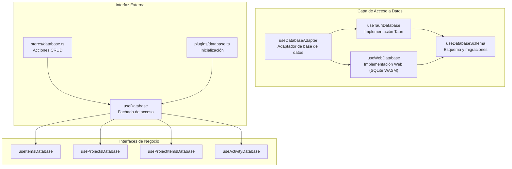
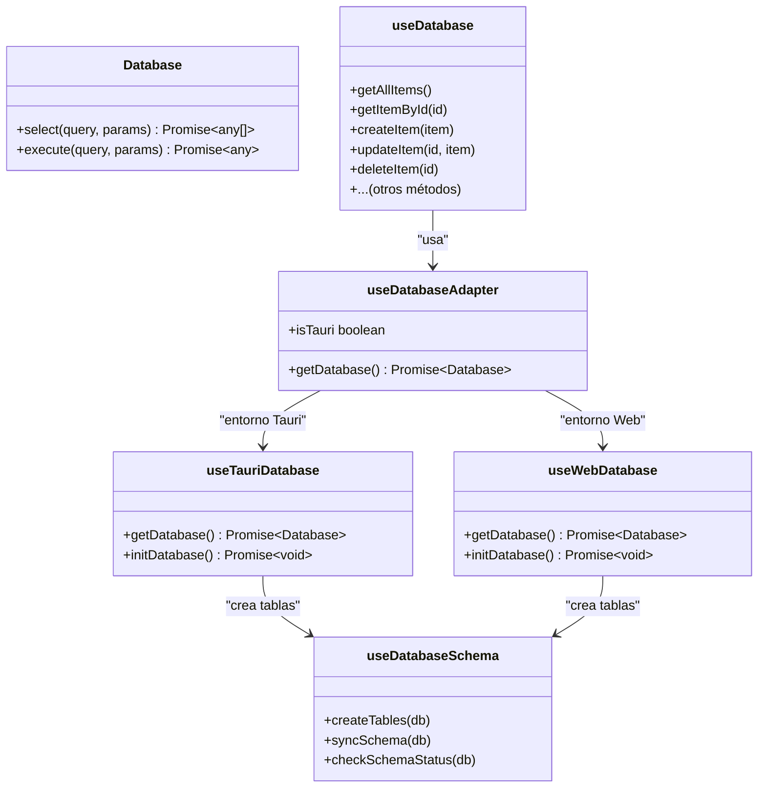
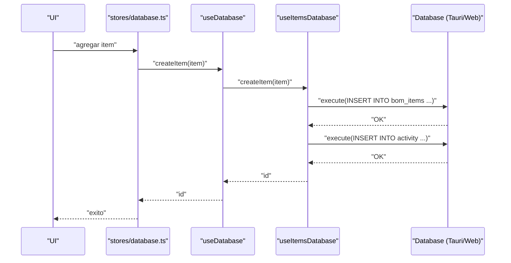
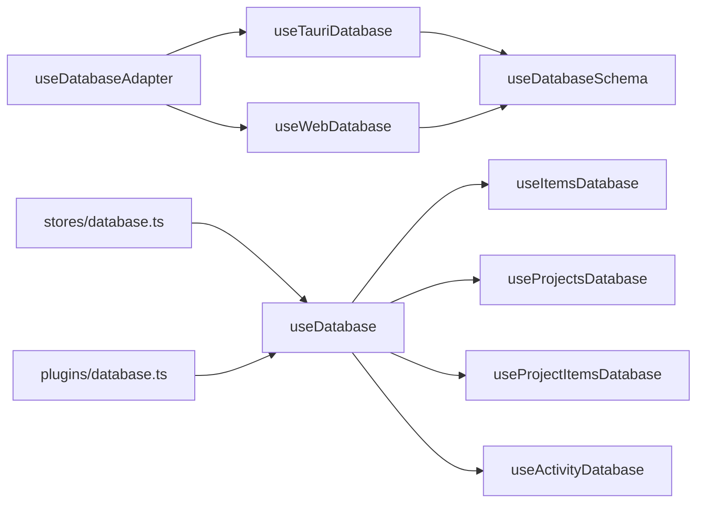

# API de Base de Datos

<cite>
**Archivos referenciados en este documento**
- [composables/useDatabase.ts](file://composables/useDatabase.ts)
- [composables/useDatabaseMain.ts](file://composables/useDatabaseMain.ts)
- [composables/useDatabaseAdapter.ts](file://composables/useDatabaseAdapter.ts)
- [composables/useTauriDatabase.ts](file://composables/useTauriDatabase.ts)
- [composables/useWebDatabase.ts](file://composables/useWebDatabase.ts)
- [composables/useDatabaseSchema.ts](file://composables/useDatabaseSchema.ts)
- [composables/useItemsDatabase.ts](file://composables/useItemsDatabase.ts)
- [composables/useProjectsDatabase.ts](file://composables/useProjectsDatabase.ts)
- [composables/useProjectItemsDatabase.ts](file://composables/useProjectItemsDatabase.ts)
- [composables/useActivityDatabase.ts](file://composables/useActivityDatabase.ts)
- [composables/useDatabaseUtils.ts](file://composables/useDatabaseUtils.ts)
- [plugins/database.ts](file://plugins/database.ts)
- [stores/database.ts](file://stores/database.ts)
- [types/database.ts](file://types/database.ts)
- [data/db/schema.json](file://data/db/schema.json)
</cite>

## Índice
1. [Introducción](#introducción)
2. [Estructura del Proyecto](#estructura-del-proyecto)
3. [Componentes Principales](#componentes-principales)
4. [Visión General de la Arquitectura](#visión-general-de-la-arquitectura)
5. [Análisis Detallado de Componentes](#análisis-detallado-de-componentes)
6. [Análisis de Dependencias](#análisis-de-dependencias)
7. [Consideraciones de Rendimiento](#consideraciones-de-rendimiento)
8. [Guía de Resolución de Problemas](#guía-de-resolución-de-problemas)
9. [Conclusión](#conclusión)
10. [Apéndices](#apéndices)

## Introducción
Este documento describe la API de base de datos de BOM Manager, enfocándose en las interfaces de acceso a datos, operaciones CRUD, métodos de conexión y transacciones. Se explica cómo se abstrae la base de datos mediante un adaptador que permite ejecutar el mismo código tanto en entornos Tauri (aplicación nativa) como en navegadores (SQLite WASM). También se documentan los componibles useDatabase, useDatabaseMain y useDatabaseAdapter, junto con patrones de persistencia, consultas SQL, validación de datos, manejo de errores y buenas prácticas.

## Estructura del Proyecto
El sistema de base de datos se organiza en capas:
- Adaptador de base de datos: detecta el entorno y proporciona una implementación de base de datos compatible.
- Implementaciones concretas: Tauri (plugin SQL) y Web (SQLite WASM con OPFS).
- Esquema y migraciones: carga de definiciones de tablas desde un archivo JSON y sincronización automática.
- Interfaces de negocio: componibles para cada entidad (items, proyectos, relaciones, actividad, notificaciones, configuración).
- Almacén central: composición de todas las interfaces en useDatabase.
- Plugin e inicialización: plugin Nuxt que inicia la base de datos al arrancar.
- Tienda Pinia: acciones que consumen useDatabase para operaciones CRUD.

**Diagrama fuente**
- [composables/useDatabaseAdapter.ts](file://composables/useDatabaseAdapter.ts#L1-L25)
- [composables/useTauriDatabase.ts](file://composables/useTauriDatabase.ts#L1-L55)
- [composables/useWebDatabase.ts](file://composables/useWebDatabase.ts#L1-L179)
- [composables/useDatabaseSchema.ts](file://composables/useDatabaseSchema.ts#L1-L302)
- [composables/useDatabase.ts](file://composables/useDatabase.ts#L1-L89)
- [stores/database.ts](file://stores/database.ts#L1-L198)
- [plugins/database.ts](file://plugins/database.ts#L1-L13)

**Sección fuente**
- [composables/useDatabase.ts](file://composables/useDatabase.ts#L1-L89)
- [composables/useDatabaseMain.ts](file://composables/useDatabaseMain.ts#L1-L17)
- [composables/useDatabaseAdapter.ts](file://composables/useDatabaseAdapter.ts#L1-L25)
- [plugins/database.ts](file://plugins/database.ts#L1-L13)
- [stores/database.ts](file://stores/database.ts#L1-L198)

## Componentes Principales
- useDatabaseAdapter: detecta entorno y devuelve getDatabase, que apunta a la implementación Tauri o Web.
- useTauriDatabase: inicializa base de datos local SQLite mediante el plugin Tauri, crea tablas si no existen.
- useWebDatabase: inicializa SQLite WASM con worker oficial y OPFS, configura pragmas, y expone select/execute.
- useDatabaseSchema: carga el esquema desde data/db/schema.json, crea o sincroniza tablas, compara columnas y puede forzar actualizaciones.
- useDatabase: fachada que reúne todos los métodos CRUD de items, proyectos, relaciones, actividad y notificaciones.
- useItemsDatabase, useProjectsDatabase, useProjectItemsDatabase, useActivityDatabase: implementan operaciones CRUD y lógica de negocio.
- useDatabaseUtils: utilidades de conversión camelCase/snake_case para compatibilidad con columnas de base de datos.
- plugins/database.ts: plugin Nuxt que llama a initDatabase al iniciar.
- stores/database.ts: tienda Pinia que consume useDatabase para operaciones CRUD y maneja loading/error.

**Sección fuente**
- [composables/useDatabaseAdapter.ts](file://composables/useDatabaseAdapter.ts#L1-L25)
- [composables/useTauriDatabase.ts](file://composables/useTauriDatabase.ts#L1-L55)
- [composables/useWebDatabase.ts](file://composables/useWebDatabase.ts#L1-L179)
- [composables/useDatabaseSchema.ts](file://composables/useDatabaseSchema.ts#L1-L302)
- [composables/useDatabase.ts](file://composables/useDatabase.ts#L1-L89)
- [composables/useItemsDatabase.ts](file://composables/useItemsDatabase.ts#L1-L346)
- [composables/useProjectsDatabase.ts](file://composables/useProjectsDatabase.ts#L1-L128)
- [composables/useProjectItemsDatabase.ts](file://composables/useProjectItemsDatabase.ts#L1-L144)
- [composables/useActivityDatabase.ts](file://composables/useActivityDatabase.ts#L1-L87)
- [composables/useDatabaseUtils.ts](file://composables/useDatabaseUtils.ts#L1-L157)
- [plugins/database.ts](file://plugins/database.ts#L1-L13)
- [stores/database.ts](file://stores/database.ts#L1-L198)

## Visión General de la Arquitectura
La arquitectura sigue un patrón de adaptador y fachada:
- El adaptador determina el entorno y proporciona un objeto Database con dos métodos: select(query, params) y execute(query, params).
- Las implementaciones Tauri y Web devuelven objetos Database consistentes, permitiendo que el resto del código sea independiente del motor subyacente.
- useDatabaseSchema se encarga de crear o actualizar tablas según data/db/schema.json.
- Los componibles de negocio encapsulan operaciones CRUD y consultas SQL específicas.
- useDatabase actúa como fachada única expuesta a la aplicación.

**Diagrama fuente**
- [types/database.ts](file://types/database.ts#L1-L5)
- [composables/useDatabaseAdapter.ts](file://composables/useDatabaseAdapter.ts#L1-L25)
- [composables/useTauriDatabase.ts](file://composables/useTauriDatabase.ts#L1-L55)
- [composables/useWebDatabase.ts](file://composables/useWebDatabase.ts#L1-L179)
- [composables/useDatabaseSchema.ts](file://composables/useDatabaseSchema.ts#L1-L302)
- [composables/useDatabase.ts](file://composables/useDatabase.ts#L1-L89)

## Análisis Detallado de Componentes

### useDatabaseAdapter
- Detecta si se ejecuta dentro de Tauri (variable global) y selecciona la implementación correspondiente.
- Devuelve getDatabase y isTauri, facilitando el desacoplamiento del motor de base de datos.

**Sección fuente**
- [composables/useDatabaseAdapter.ts](file://composables/useDatabaseAdapter.ts#L1-L25)

### useTauriDatabase
- Carga la base de datos SQLite local con el plugin Tauri.
- Inicializa la base de datos y crea las tablas usando useDatabaseSchema.
- Proporciona select y execute consistentes.

**Sección fuente**
- [composables/useTauriDatabase.ts](file://composables/useTauriDatabase.ts#L1-L55)
- [composables/useDatabaseSchema.ts](file://composables/useDatabaseSchema.ts#L1-L302)

### useWebDatabase
- Inicializa SQLite WASM con worker oficial y VFS OPFS.
- Configura pragmas de rendimiento y seguridad.
- Implementa select y execute, convirtiendo resultados en objetos fila.

**Sección fuente**
- [composables/useWebDatabase.ts](file://composables/useWebDatabase.ts#L1-L179)

### useDatabaseSchema
- Carga data/db/schema.json y crea tablas si no existen.
- Puede sincronizar columnas faltantes y reportar estado del esquema.
- Permite forzar actualización de tablas existentes.

**Sección fuente**
- [composables/useDatabaseSchema.ts](file://composables/useDatabaseSchema.ts#L1-L302)
- [data/db/schema.json](file://data/db/schema.json#L1-L37)

### useDatabase
- Fachada que reúne métodos CRUD de items, proyectos, relaciones, actividad, notificaciones y configuración.
- Facilita el acceso centralizado a todas las operaciones de base de datos.

**Sección fuente**
- [composables/useDatabase.ts](file://composables/useDatabase.ts#L1-L89)

### useItemsDatabase
- Operaciones CRUD completas para la tabla bom_items.
- Actualización de stock, consumo de stock desde BOM, adición de stock, y búsqueda de items con bajo stock.
- Transacciones explícitas para operaciones en lote (consumeStockFromBOM, addStockToItems).
- Registro de actividad en cada operación.

**Diagrama fuente**
- [stores/database.ts](file://stores/database.ts#L1-L198)
- [composables/useDatabase.ts](file://composables/useDatabase.ts#L1-L89)
- [composables/useItemsDatabase.ts](file://composables/useItemsDatabase.ts#L1-L346)
- [composables/useActivityDatabase.ts](file://composables/useActivityDatabase.ts#L1-L87)
- [types/database.ts](file://types/database.ts#L1-L5)

**Sección fuente**
- [composables/useItemsDatabase.ts](file://composables/useItemsDatabase.ts#L1-L346)
- [composables/useActivityDatabase.ts](file://composables/useActivityDatabase.ts#L1-L87)

### useProjectsDatabase
- Operaciones CRUD para proyectos.
- Al eliminar un proyecto, se eliminan archivos asociados (eliminación en cascada).
- Registro de actividad.

**Sección fuente**
- [composables/useProjectsDatabase.ts](file://composables/useProjectsDatabase.ts#L1-L128)

### useProjectItemsDatabase
- Gestiona la relación muchos a muchos entre proyectos e ítems.
- Métodos CRUD para la tabla project_items, incluyendo actualización de cantidades.
- Verificación de stock bajo y cálculo del valor total de un proyecto.

**Sección fuente**
- [composables/useProjectItemsDatabase.ts](file://composables/useProjectItemsDatabase.ts#L1-L144)

### useActivityDatabase
- Registra eventos de actividad con acción, tabla, registro afectado y descripción.
- Consultas de actividad filtradas por tabla, acción o límite.

**Sección fuente**
- [composables/useActivityDatabase.ts](file://composables/useActivityDatabase.ts#L1-L87)

### useDatabaseUtils
- Conversión de campos camelCase/snake_case para compatibilidad con columnas de base de datos.
- Mapeo específico para BOMItem.

**Sección fuente**
- [composables/useDatabaseUtils.ts](file://composables/useDatabaseUtils.ts#L1-L157)

### useDatabaseMain
- Exporta getDatabase e isTauri, además de exponer funcionalidades de actividad y notificaciones.
- Útil para casos donde se necesita acceso directo a la base de datos sin pasar por useDatabase.

**Sección fuente**
- [composables/useDatabaseMain.ts](file://composables/useDatabaseMain.ts#L1-L17)

### plugins/database.ts
- Plugin Nuxt que inicia la base de datos al arrancar la aplicación.
- Llama a initDatabase, que fuerza la inicialización de todas las bases de datos.

**Sección fuente**
- [plugins/database.ts](file://plugins/database.ts#L1-L13)

### stores/database.ts
- Acciones CRUD que consumen useDatabase.
- Manejo de loading y error, recarga automática de listas tras operaciones exitosas.

**Sección fuente**
- [stores/database.ts](file://stores/database.ts#L1-L198)

## Análisis de Dependencias
- useDatabaseAdapter depende de useTauriDatabase y useWebDatabase.
- useTauriDatabase y useWebDatabase dependen de useDatabaseSchema.
- useDatabase reúne todos los componibles de negocio.
- stores/database.ts depende de useDatabase.
- plugins/database.ts depende de useDatabase.

**Diagrama fuente**
- [composables/useDatabaseAdapter.ts](file://composables/useDatabaseAdapter.ts#L1-L25)
- [composables/useTauriDatabase.ts](file://composables/useTauriDatabase.ts#L1-L55)
- [composables/useWebDatabase.ts](file://composables/useWebDatabase.ts#L1-L179)
- [composables/useDatabaseSchema.ts](file://composables/useDatabaseSchema.ts#L1-L302)
- [composables/useDatabase.ts](file://composables/useDatabase.ts#L1-L89)
- [stores/database.ts](file://stores/database.ts#L1-L198)
- [plugins/database.ts](file://plugins/database.ts#L1-L13)

**Sección fuente**
- [composables/useDatabaseAdapter.ts](file://composables/useDatabaseAdapter.ts#L1-L25)
- [composables/useDatabase.ts](file://composables/useDatabase.ts#L1-L89)
- [stores/database.ts](file://stores/database.ts#L1-L198)

## Consideraciones de Rendimiento
- SQLite WASM con OPFS: se configuran pragmas para mejorar el rendimiento (journal_mode=WAL, synchronous=NORMAL, foreign_keys=ON).
- Uso de transacciones en operaciones en lote (consumeStockFromBOM, addStockToItems) mejora consistencia y eficiencia.
- Consultas con índices implícitos en claves primarias y foráneas; se recomienda mantener estas columnas bien pobladas.
- Evitar grandes volúmenes de datos en una sola transacción si es posible; dividir en lotes pequeños.

[No se necesitan fuentes adicionales ya que esta sección ofrece orientación general]

## Guía de Resolución de Problemas
- Error al inicializar base de datos:
  - Verifica que se haya cargado el esquema y que las tablas existan.
  - En Web, asegúrate de que el worker de SQLite WASM esté disponible y que OPFS esté habilitado.
- Errores en operaciones CRUD:
  - Revisa que los parámetros de las consultas sean correctos y que se aplique la conversión camelCase/snake_case cuando sea necesario.
  - Confirma que las transacciones se completen (commit/rollback) en operaciones en lote.
- Fallo en eliminación de proyecto:
  - Asegúrate de que se eliminen archivos asociados previamente (eliminación en cascada).

**Sección fuente**
- [composables/useWebDatabase.ts](file://composables/useWebDatabase.ts#L1-L179)
- [composables/useDatabaseSchema.ts](file://composables/useDatabaseSchema.ts#L1-L302)
- [composables/useItemsDatabase.ts](file://composables/useItemsDatabase.ts#L1-L346)
- [composables/useProjectsDatabase.ts](file://composables/useProjectsDatabase.ts#L1-L128)

## Conclusión
La API de base de datos de BOM Manager está diseñada con una arquitectura modular y adaptable. Gracias al adaptador de base de datos, el mismo código funciona tanto en Tauri como en navegadores. La fachada useDatabase simplifica el acceso a operaciones CRUD, mientras que las implementaciones de negocio encapsulan lógica específica y transacciones. El esquema se gestiona automáticamente desde un archivo JSON, lo que permite evoluciones seguras de la base de datos. Se recomienda seguir las prácticas documentadas para mantener la integridad de datos, la consistencia de transacciones y el rendimiento del sistema.

[No se necesitan fuentes adicionales ya que esta sección resume sin analizar archivos específicos]

## Apéndices

### Interfaces de Acceso a Datos
- Database: interfaz con select y execute.
- useDatabase: fachada de acceso a todas las operaciones.
- useDatabaseMain: acceso directo a getDatabase e isTauri, más funcionalidades de actividad y notificaciones.
- useDatabaseAdapter: selector de implementación Tauri o Web.

**Sección fuente**
- [types/database.ts](file://types/database.ts#L1-L5)
- [composables/useDatabase.ts](file://composables/useDatabase.ts#L1-L89)
- [composables/useDatabaseMain.ts](file://composables/useDatabaseMain.ts#L1-L17)
- [composables/useDatabaseAdapter.ts](file://composables/useDatabaseAdapter.ts#L1-L25)

### Operaciones CRUD Disponibles
- Items: getAllItems, getItemById, createItem, updateItem, deleteItem, updateItemStock, consumeStockFromBOM, addStockToItems, getLowStockItems.
- Proyectos: getAllProjects, getProjectById, createProject, updateProject, deleteProject.
- Relación proyecto-ítems: getProjectItems, addItemToProject, removeItemFromProject, updateProjectItemQuantity, checkLowStockAndNotify, getProjectTotalValue.
- Actividad: logActivity, getActivityByTable, getAllActivity, getActivityByAction.

**Sección fuente**
- [composables/useItemsDatabase.ts](file://composables/useItemsDatabase.ts#L1-L346)
- [composables/useProjectsDatabase.ts](file://composables/useProjectsDatabase.ts#L1-L128)
- [composables/useProjectItemsDatabase.ts](file://composables/useProjectItemsDatabase.ts#L1-L144)
- [composables/useActivityDatabase.ts](file://composables/useActivityDatabase.ts#L1-L87)

### Patrones de Persistencia y Consultas SQL
- Uso de parámetros en consultas (prepared statements) para prevenir inyección SQL.
- Conversión automática de nombres de campos camelCase a snake_case en inserciones/actualizaciones.
- Consultas JOIN para obtener datos relacionados (ej. items con proyecto asociado).
- Pragmas configurados en SQLite WASM (OPFS) para rendimiento y consistencia.

**Sección fuente**
- [composables/useDatabaseUtils.ts](file://composables/useDatabaseUtils.ts#L1-L157)
- [composables/useItemsDatabase.ts](file://composables/useItemsDatabase.ts#L1-L346)
- [composables/useWebDatabase.ts](file://composables/useWebDatabase.ts#L1-L179)

### Manejo de Errores
- Cada método de negocio captura errores y devuelve valores neutros (null, false, []) o mensajes de error.
- En operaciones en lote, se usan transacciones con rollback en caso de fallo.
- El plugin Nuxt registra errores durante la inicialización.

**Sección fuente**
- [composables/useItemsDatabase.ts](file://composables/useItemsDatabase.ts#L1-L346)
- [composables/useProjectsDatabase.ts](file://composables/useProjectsDatabase.ts#L1-L128)
- [plugins/database.ts](file://plugins/database.ts#L1-L13)

### Mejores Prácticas
- Utiliza transacciones para operaciones en lote (stock).
- Valida datos antes de insertar o actualizar.
- Mantén el esquema actualizado con useDatabaseSchema.syncSchema.
- Evita consultas costosas sin índice; usa columnas de búsqueda frecuente (id, created_at).

**Sección fuente**
- [composables/useItemsDatabase.ts](file://composables/useItemsDatabase.ts#L1-L346)
- [composables/useDatabaseSchema.ts](file://composables/useDatabaseSchema.ts#L1-L302)