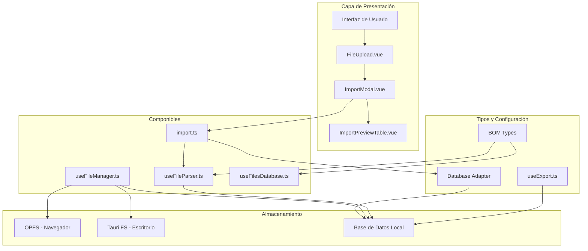
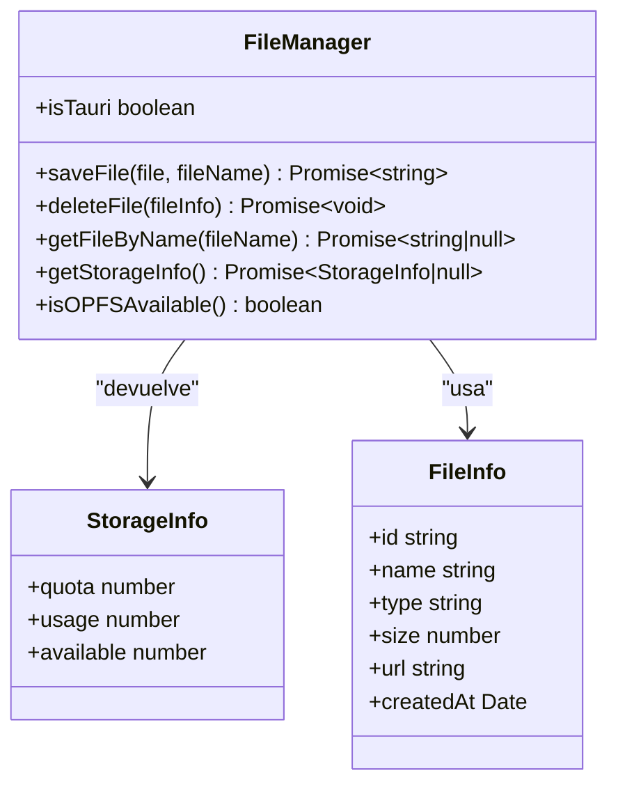
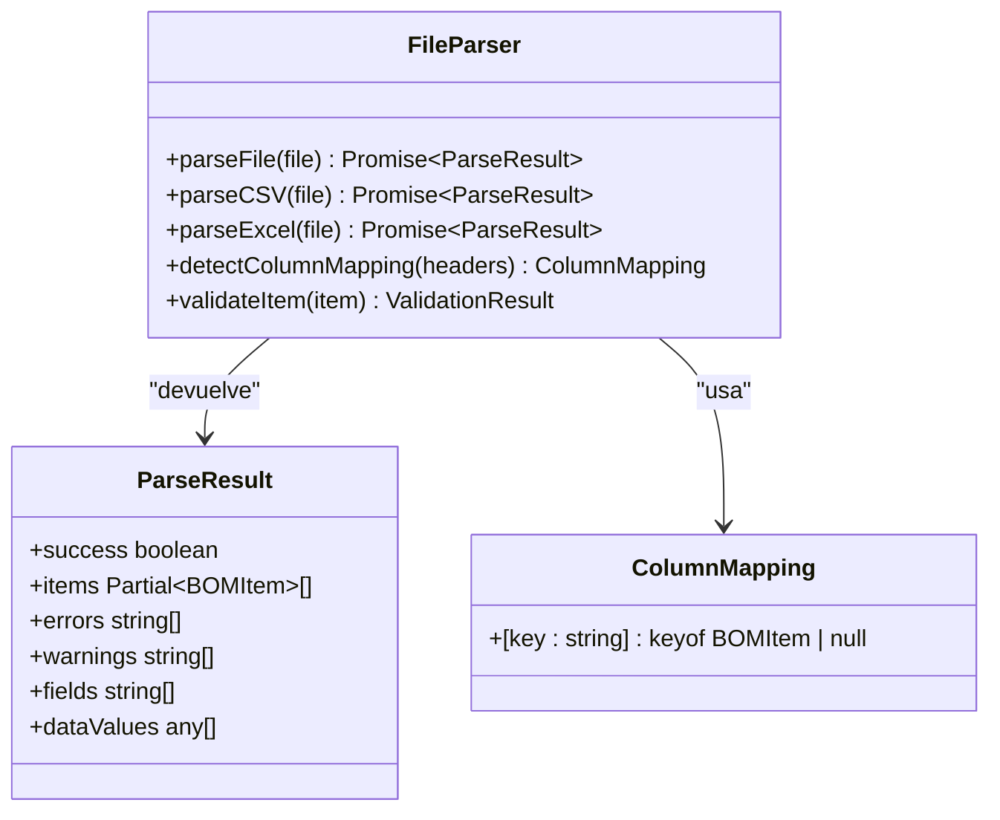
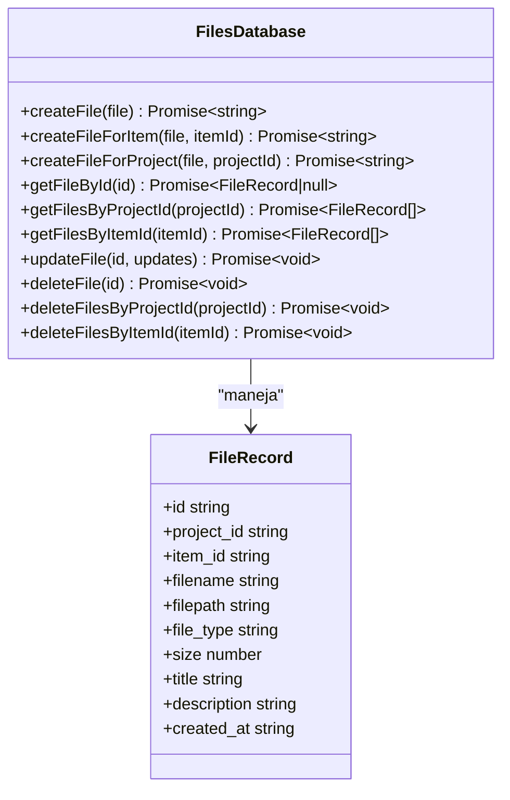
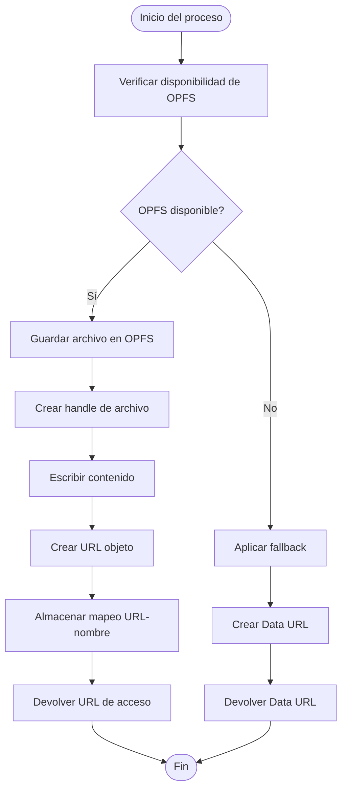
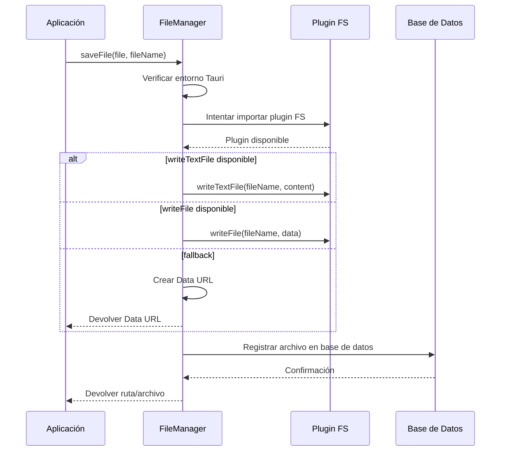
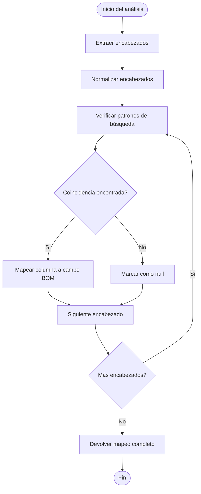
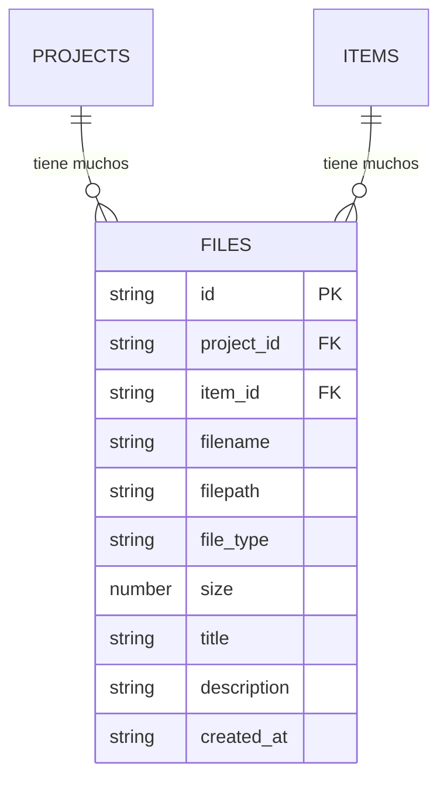
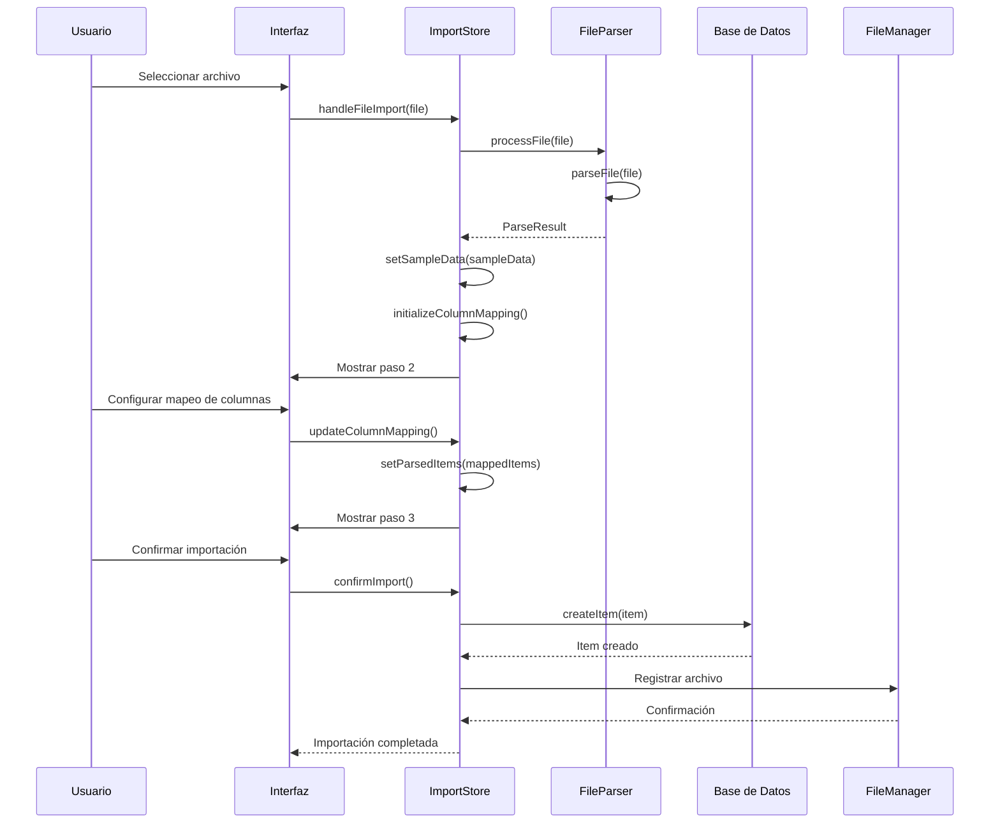
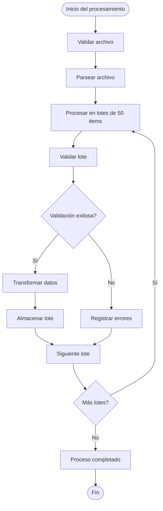

# API de Gestión de Archivos

<cite>
**Archivos referenciados en este documento**
- [useFileManager.ts](file://composables/useFileManager.ts)
- [useFileParser.ts](file://composables/useFileParser.ts)
- [useFilesDatabase.ts](file://composables/useFilesDatabase.ts)
- [FileUpload.vue](file://components/FileUpload.vue)
- [ImportModal.vue](file://components/ImportModal.vue)
- [ImportPreviewTable.vue](file://components/ImportPreviewTable.vue)
- [import.ts](file://stores/import.ts)
- [useDatabaseAdapter.ts](file://composables/useDatabaseAdapter.ts)
- [useExport.ts](file://composables/useExport.ts)
- [MANEJO_ARCHIVOS.md](file://wiki/MANEJO_ARCHIVOS.md)
- [bom.ts](file://types/bom.ts)
</cite>

## Tabla de Contenidos
1. [Introducción](#introducción)
2. [Arquitectura General](#arquitectura-general)
3. [Componentes Clave](#componentes-clave)
4. [Gestión de Archivos Locales y OPFS](#gestión-de-archivos-locales-y-opfs)
5. [Procesamiento de Archivos CSV y Excel](#procesamiento-de-archivos-csv-y-excel)
6. [Almacenamiento de Registros de Archivos](#almacenamiento-de-registros-de-archivos)
7. [Flujo de Importación Completo](#flujo-de-importación-completo)
8. [Validación de Datos y Procesamiento por Lotes](#validación-de-datos-y-procesamiento-por-lotes)
9. [Ejemplos de Uso](#ejemplos-de-uso)
10. [Casos de Prueba](#casos-de-prueba)
11. [Mejores Prácticas](#mejores-prácticas)
12. [Consideraciones de Seguridad, Privacidad y Rendimiento](#consideraciones-de-seguridad-privacidad-y-rendimiento)
13. [Conclusión](#conclusión)

## Introducción

La API de Gestión de Archivos de BOM Manager proporciona una solución integral para el manejo de archivos en el contexto de la gestión de materiales básicos (BOM). Esta API permite la lectura, escritura, eliminación y manipulación de archivos, incluyendo tanto archivos locales como almacenamiento en OPFS (Origin Private File System) para navegadores web, y transferencia de datos entre diferentes formatos de archivo.

La implementación se centra en tres pilares principales: gestión de archivos locales y OPFS, procesamiento de archivos CSV y Excel con validación avanzada, y almacenamiento persistente de registros de archivos en bases de datos locales.

## Arquitectura General

La arquitectura de la API de gestión de archivos se basa en una combinación de componibles Vue.js, componentes de interfaz de usuario y almacenamiento de datos:



**Diagrama fuente**
- [useFileManager.ts](file://composables/useFileManager.ts#L44-L260)
- [useFileParser.ts](file://composables/useFileParser.ts#L47-L421)
- [useFilesDatabase.ts](file://composables/useFilesDatabase.ts#L17-L179)
- [FileUpload.vue](file://components/FileUpload.vue#L136-L283)

## Componentes Clave

### useFileManager

El composable `useFileManager` proporciona funcionalidades para la gestión de archivos tanto en entornos Tauri (escritorio) como en navegadores web:



**Diagrama fuente**
- [useFileManager.ts](file://composables/useFileManager.ts#L35-L42)
- [useFileManager.ts](file://composables/useFileManager.ts#L111-L192)

### useFileParser

El composable `useFileParser` implementa un motor de parsing avanzado para archivos CSV y Excel con validación Zod:



**Diagrama fuente**
- [useFileParser.ts](file://composables/useFileParser.ts#L34-L41)
- [useFileParser.ts](file://composables/useFileParser.ts#L47-L421)

### useFilesDatabase

El composable `useFilesDatabase` maneja el almacenamiento persistente de registros de archivos:



**Diagrama fuente**
- [useFilesDatabase.ts](file://composables/useFilesDatabase.ts#L4-L15)
- [useFilesDatabase.ts](file://composables/useFilesDatabase.ts#L17-L179)

## Gestión de Archivos Locales y OPFS

### Almacenamiento en OPFS (Navegadores Web)

Para entornos web modernos, la API utiliza el Origin Private File System (OPFS) para almacenamiento persistente:



**Diagrama fuente**
- [useFileManager.ts](file://composables/useFileManager.ts#L51-L72)
- [useFileManager.ts](file://composables/useFileManager.ts#L111-L117)

### Almacenamiento en Tauri (Escritorio)

Para aplicaciones de escritorio, se utiliza el sistema de archivos nativo con soporte para el plugin de filesystem:



**Diagrama fuente**
- [useFileManager.ts](file://composables/useFileManager.ts#L75-L109)
- [useFileManager.ts](file://composables/useFileManager.ts#L111-L117)

## Procesamiento de Archivos CSV y Excel

### Detección Automática de Columnas

El sistema implementa un mecanismo avanzado de detección automática de columnas basado en patrones de palabras clave:



**Diagrama fuente**
- [useFileParser.ts](file://composables/useFileParser.ts#L51-L104)
- [useFileParser.ts](file://composables/useFileParser.ts#L109-L202)

### Validación Zod Avanzada

La validación de datos se realiza mediante Zod con reglas específicas para cada campo:

| Campo | Tipo | Requerido | Valores Válidos | Descripción |
|-------|------|-----------|-----------------|-------------|
| name | string | Sí | Min length: 1 | Nombre del componente |
| description | string | No | - | Descripción del componente |
| quantity | number | Sí | >= 0 | Cantidad requerida |
| category | string | No | - | Categoría del componente |
| supplier | string | No | - | Proveedor del componente |
| partNumber | string | No | - | Número de parte del fabricante |
| lcscPart | string | No | - | Referencia LCSC |
| price | number | No | >= 0 | Precio unitario |
| minStock | number | No | >= 0 | Stock mínimo |
| notes | string | No | - | Notas adicionales |
| manufacturer | string | No | - | Fabricante del componente |
| package | string | No | - | Tipo de empaque |
| unit | string | No | - | Unidad de medida |
| customerNo | string | No | - | Número de cliente |
| rohs | string | No | - | Cumplimiento RoHS |
| extPrice | number | No | >= 0 | Precio extendido |
| leadTime | number | No | >= 0 | Tiempo de entrega |
| dateCodeLotNo | string | No | - | Código de fecha/lote |
| status | string | No | - | Estado del componente |
| createdAt | string | No | - | Fecha de creación |
| updatedAt | string | No | - | Fecha de actualización |

**Diagrama fuente**
- [useFileParser.ts](file://composables/useFileParser.ts#L6-L32)
- [bom.ts](file://types/bom.ts#L3-L32)

## Almacenamiento de Registros de Archivos

### Estructura de la Base de Datos

Los registros de archivos se almacenan en una tabla con la siguiente estructura:



**Diagrama fuente**
- [useFilesDatabase.ts](file://composables/useFilesDatabase.ts#L4-L15)

### Operaciones CRUD

Las operaciones CRUD para archivos incluyen:

1. **Creación**: Registro de nuevos archivos con metadatos
2. **Lectura**: Búsqueda por ID, proyecto o ítem
3. **Actualización**: Modificación de metadatos
4. **Eliminación**: Eliminación física y registro de actividad

**Diagrama fuente**
- [useFilesDatabase.ts](file://composables/useFilesDatabase.ts#L21-L51)
- [useFilesDatabase.ts](file://composables/useFilesDatabase.ts#L67-L104)

## Flujo de Importación Completo

El proceso de importación sigue un flujo de tres pasos:



**Diagrama fuente**
- [ImportModal.vue](file://components/ImportModal.vue#L503-L523)
- [ImportModal.vue](file://components/ImportModal.vue#L702-L754)
- [import.ts](file://stores/import.ts#L195-L261)
- [import.ts](file://stores/import.ts#L263-L342)

## Validación de Datos y Procesamiento por Lotes

### Procesamiento por Lotes

El sistema maneja grandes volúmenes de datos mediante procesamiento por lotes:



**Diagrama fuente**
- [useFileParser.ts](file://composables/useFileParser.ts#L109-L202)
- [import.ts](file://stores/import.ts#L263-L342)

### Manejo de Errores

El sistema implementa un robusto sistema de manejo de errores:

| Tipo de Error | Categoría | Acción Recomendada |
|---------------|-----------|-------------------|
| Formato de archivo inválido | Entrada | Mostrar mensaje de error específico |
| Columna no reconocida | Mapeo | Sugerir corrección o dejar como null |
| Valor numérico inválido | Validación | Asignar valor por defecto o 0 |
| Falta de campos requeridos | Validación | Marcar como advertencia |
| Error de base de datos | Persistencia | Reintentar operación o rollback |

**Diagrama fuente**
- [useFileParser.ts](file://composables/useFileParser.ts#L174-L185)
- [useFileParser.ts](file://composables/useFileParser.ts#L389-L395)

## Ejemplos de Uso

### Ejemplo 1: Importación de Archivo CSV

```typescript
// Componente de ejemplo para importar archivos CSV
const handleCSVImport = async (file: File) => {
    try {
        // Validar archivo
        const isValid = validateFile(file);
        if (!isValid) return;
        
        // Procesar archivo
        const result = await parseFile(file);
        
        if (result.success) {
            // Mostrar vista previa
            showPreview(result.items);
        } else {
            showError(result.errors[0]);
        }
    } catch (error) {
        handleError(error);
    }
};
```

### Ejemplo 2: Almacenamiento de Archivos OPFS

```typescript
// Ejemplo de guardado de archivo en OPFS
const saveOPFSFile = async (file: File, fileName: string) => {
    try {
        const storageInfo = await getStorageInfo();
        if (!storageInfo || storageInfo.available < file.size) {
            throw new Error('Espacio insuficiente en OPFS');
        }
        
        const fileUrl = await saveFile(file, fileName);
        return fileUrl;
    } catch (error) {
        console.error('Error al guardar archivo:', error);
        throw error;
    }
};
```

### Ejemplo 3: Importación Masiva

```typescript
// Ejemplo de importación masiva de ítems
const importMultipleItems = async (items: BOMItem[]) => {
    const batchSize = 50;
    const results = [];
    
    for (let i = 0; i < items.length; i += batchSize) {
        const batch = items.slice(i, i + batchSize);
        const batchResults = await Promise.allSettled(
            batch.map(item => db.createItem(item))
        );
        results.push(...batchResults);
        
        // Pequeña pausa para evitar bloqueos
        await new Promise(resolve => setTimeout(resolve, 10));
    }
    
    return results;
};
```

## Casos de Prueba

### Caso de Prueba 1: Validación de CSV

**Objetivo**: Verificar que se puedan importar archivos CSV con diferentes formatos

**Pasos**:
1. Crear archivo CSV con encabezados en español
2. Procesar archivo con `parseFile()`
3. Validar que se detecten automáticamente las columnas
4. Verificar que se aplique la validación Zod

**Resultado Esperado**: Archivo procesado exitosamente con 100% de mapeo automático

### Caso de Prueba 2: Almacenamiento OPFS

**Objetivo**: Verificar almacenamiento persistente en OPFS

**Pasos**:
1. Verificar disponibilidad de OPFS
2. Guardar archivo de prueba
3. Verificar que se cree URL válida
4. Eliminar archivo y verificar limpieza

**Resultado Esperado**: Archivo guardado correctamente y accesible posteriormente

### Caso de Prueba 3: Importación de Excel

**Objetivo**: Verificar importación de archivos Excel

**Pasos**:
1. Crear archivo XLSX con múltiples hojas
2. Procesar archivo con `parseExcel()`
3. Validar que se use la primera hoja
4. Verificar conversión a JSON

**Resultado Esperado**: Archivo Excel procesado correctamente con datos extraídos

## Mejores Prácticas

### Gestión de Memoria

1. **Liberación de URLs**: Siempre liberar URLs creadas con `URL.createObjectURL()`
2. **Control de tamaño**: Verificar espacio disponible antes de guardar archivos
3. **Limpieza periódica**: Implementar mantenimiento de archivos antiguos

### Seguridad

1. **Validación de tipos**: Verificar tipos MIME y extensiones
2. **Límites de tamaño**: Establecer límites máximos para archivos
3. **Filtros de contenido**: Validar contenido de archivos antes de procesar

### Rendimiento

1. **Procesamiento asíncrono**: Usar operaciones asíncronas para evitar bloqueos
2. **Caché de mapeos**: Almacenar mapeos de columnas detectados
3. **Procesamiento por lotes**: Dividir grandes volúmenes en lotes manejables

### Mantenimiento

1. **Logs detallados**: Registrar operaciones de archivo con timestamps
2. **Manejo de errores**: Implementar estrategias de retry para operaciones críticas
3. **Actualizaciones de compatibilidad**: Monitorear cambios en APIs de navegador

## Consideraciones de Seguridad, Privacidad y Rendimiento

### Seguridad

- **Aislamiento de datos**: Los archivos en OPFS son privados al origen (dominio)
- **Control de acceso**: Solo la aplicación puede acceder a sus archivos
- **Validación de entrada**: Todos los archivos son validados antes de procesar
- **Políticas de retención**: Implementar políticas de limpieza automática

### Privacidad

- **Datos sensibles**: No se comparten archivos entre diferentes sitios web
- **Acceso restringido**: Solo usuarios autenticados pueden acceder a archivos
- **Encriptación**: Los archivos se almacenan en formato original sin encriptación adicional

### Rendimiento

- **Almacenamiento local**: OPFS proporciona acceso rápido a archivos locales
- **Carga diferida**: Archivos grandes se cargan bajo demanda
- **Compresión**: Implementar compresión para reducir tamaño de archivos
- **Caché**: Almacenar resultados de procesamiento para mejor rendimiento

### Consideraciones Técnicas

- **Compatibilidad**: Verificar soporte de OPFS en navegadores modernos
- **Fallbacks**: Implementar alternativas cuando OPFS no esté disponible
- **Actualizaciones**: Monitorear cambios en APIs de navegador y Tauri
- **Pruebas**: Realizar pruebas exhaustivas en diferentes entornos

**Diagrama fuente**
- [MANEJO_ARCHIVOS.md](file://wiki/MANEJO_ARCHIVOS.md#L41-L46)

## Conclusión

La API de Gestión de Archivos de BOM Manager proporciona una solución completa y robusta para el manejo de archivos en aplicaciones de gestión de materiales básicos. La implementación combina técnicas modernas de almacenamiento (OPFS), validación avanzada de datos, y un flujo de importación intuitivo que facilita la integración de datos desde múltiples fuentes.

Los componentes clave (`useFileManager`, `useFileParser`, `useFilesDatabase`) trabajan en conjunto para ofrecer una experiencia de usuario fluida mientras garantizan la integridad de los datos y la seguridad del sistema. La arquitectura modular permite fácil mantenimiento y expansión de funcionalidades según las necesidades del proyecto.

La implementación demuestra un enfoque equilibrado entre usabilidad, rendimiento y seguridad, haciendo de esta API una solución sólida para la gestión de archivos en entornos empresariales y de desarrollo.