# APIs de Integración

<cite>
**Archivos referenciados en este documento**
- [wiki/LCSC_API_INTEGRATION.md](file://wiki/LCSC_API_INTEGRATION.md)
- [wiki/EASYEDA_API_INTEGRATION.md](file://wiki/EASYEDA_API_INTEGRATION.md)
- [useLCSC.ts](file://composables/useLCSC.ts)
- [LCSCPreview.vue](file://components/LCSCPreview.vue)
- [useEasyEDAImporter.ts](file://composables/useEasyEDAImporter.ts)
- [EasyEDAImporter.vue](file://components/EasyEDAImporter.vue)
- [images.get.ts](file://server/api/images.get.ts)
- [proxy-file.post.ts](file://server/api/proxy-file.post.ts)
- [setHeaders.ts](file://server/middleware/setHeaders.ts)
- [useItemsDatabase.ts](file://composables/useItemsDatabase.ts)
- [useFilesDatabase.ts](file://composables/useFilesDatabase.ts)
- [useFileManager.ts](file://composables/useFileManager.ts)
- [bom.ts](file://types/bom.ts)
- [package.json](file://package.json)
</cite>

## Tabla de Contenidos
1. [Introducción](#introducción)
2. [Estructura del Proyecto](#estructura-del-proyecto)
3. [Componentes Principales](#componentes-principales)
4. [Arquitectura General](#arquitectura-general)
5. [Análisis Detallado de Componentes](#análisis-detallado-de-componentes)
6. [Análisis de Dependencias](#análisis-de-dependencias)
7. [Consideraciones de Rendimiento](#consideraciones-de-rendimiento)
8. [Guía de Solución de Problemas](#guía-de-solución-de-problemas)
9. [Conclusión](#conclusión)

## Introducción
Este documento proporciona una guía completa de las APIs de integración implementadas en BOM Manager, enfocándose en dos principales integraciones:

- **LCSC API**: Integración para búsqueda de componentes, obtención de imágenes, descarga de datasheets y validación de números de parte
- **EasyEDA API**: Integración para importación de plantillas de diseño y extracción de componentes

El sistema combina una interfaz frontend Vue 3 con composable functions, un backend Nuxt API server y una base de datos local SQLite/WASM, con soporte para Tauri en entornos nativos.

## Estructura del Proyecto
La solución se organiza en módulos bien definidos:

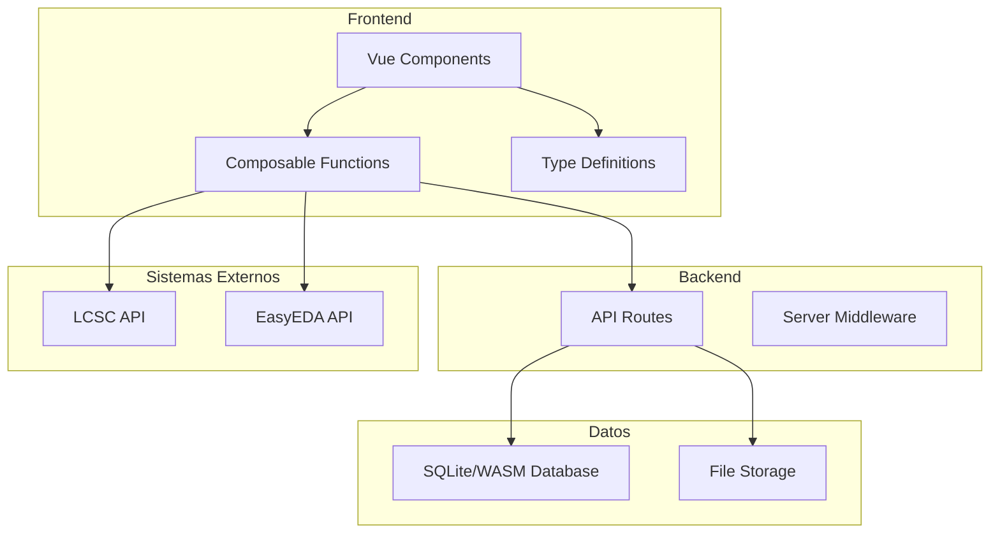

**Diagrama fuente**
- [useLCSC.ts](file://composables/useLCSC.ts#L1-L353)
- [useEasyEDAImporter.ts](file://composables/useEasyEDAImporter.ts#L1-L187)
- [images.get.ts](file://server/api/images.get.ts#L1-L120)
- [proxy-file.post.ts](file://server/api/proxy-file.post.ts#L1-L78)

**Sección fuente**
- [package.json](file://package.json#L1-L50)

## Componentes Principales

### Integración LCSC
La integración LCSC se implementa a través de un composable que maneja toda la lógica de búsqueda, descarga y almacenamiento de componentes:

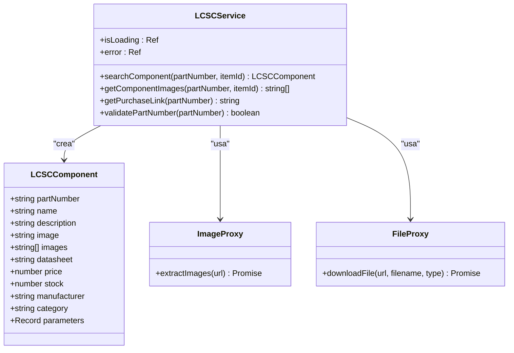

**Diagrama fuente**
- [useLCSC.ts](file://composables/useLCSC.ts#L6-L18)
- [useLCSC.ts](file://composables/useLCSC.ts#L20-L353)
- [images.get.ts](file://server/api/images.get.ts#L19-L120)
- [proxy-file.post.ts](file://server/api/proxy-file.post.ts#L8-L78)

### Integración EasyEDA
La integración EasyEDA permite importar plantillas JSON y extraer componentes para su procesamiento:

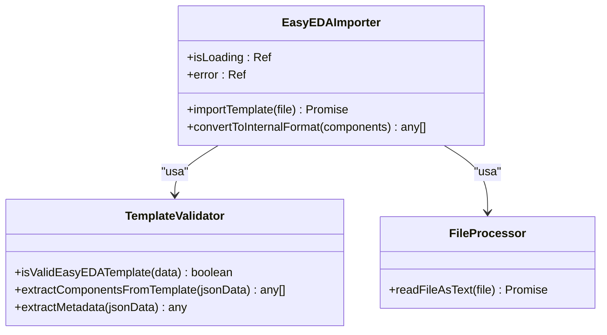

**Diagrama fuente**
- [useEasyEDAImporter.ts](file://composables/useEasyEDAImporter.ts#L3-L187)

**Sección fuente**
- [useLCSC.ts](file://composables/useLCSC.ts#L1-L353)
- [useEasyEDAImporter.ts](file://composables/useEasyEDAImporter.ts#L1-L187)

## Arquitectura General

### Flujo de Integración LCSC
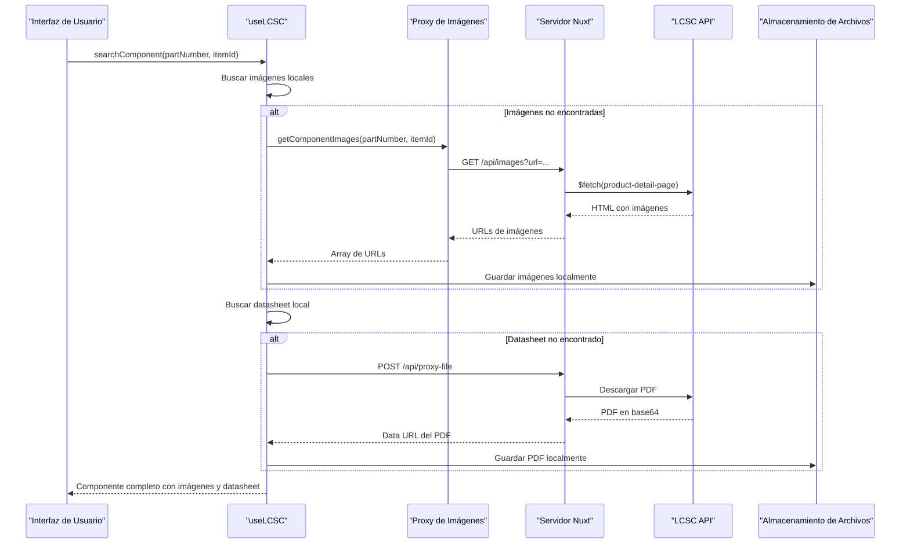

**Diagrama fuente**
- [useLCSC.ts](file://composables/useLCSC.ts#L26-L261)
- [images.get.ts](file://server/api/images.get.ts#L23-L97)
- [proxy-file.post.ts](file://server/api/proxy-file.post.ts#L8-L70)

### Flujo de Integración EasyEDA
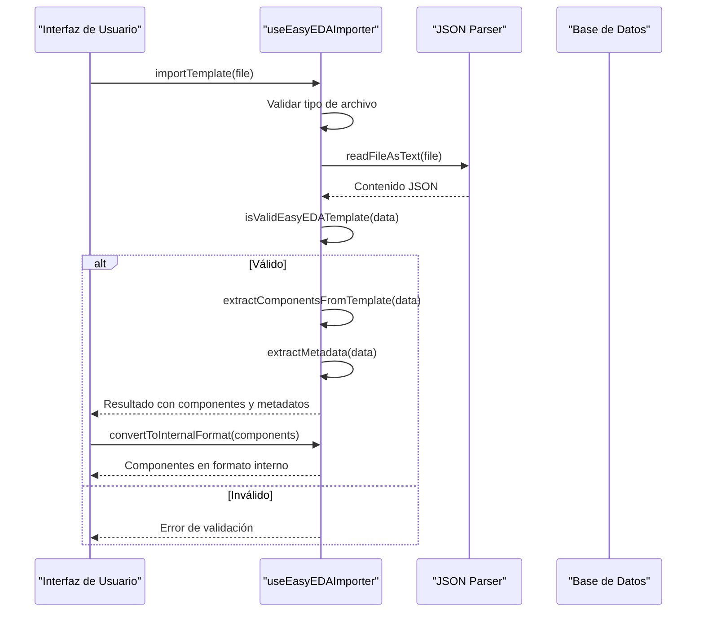

**Diagrama fuente**
- [useEasyEDAImporter.ts](file://composables/useEasyEDAImporter.ts#L7-L48)
- [EasyEDAImporter.vue](file://components/EasyEDAImporter.vue#L291-L304)

## Análisis Detallado de Componentes

### Composable LCSC (useLCSC)
El composable LCSC implementa una estrategia de caché inteligente combinando almacenamiento local con descargas remotas:

#### Estructura de Datos
```typescript
interface LCSCComponent {
    partNumber: string;
    name?: string;
    description?: string;
    image?: string;
    images?: string[];
    datasheet?: string;
    price?: number;
    stock?: number;
    manufacturer?: string;
    category?: string;
    parameters?: Record<string, any>;
}
```

#### Funciones Principales

##### Búsqueda de Componentes
La función `searchComponent` implementa un flujo de búsqueda con múltiples niveles de caché:

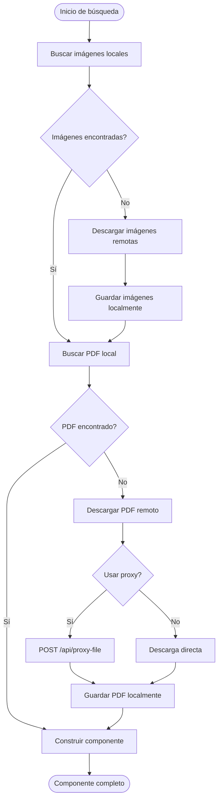

**Diagrama fuente**
- [useLCSC.ts](file://composables/useLCSC.ts#L26-L261)

##### Gestión de Archivos
El sistema maneja archivos de manera diferente según el entorno:

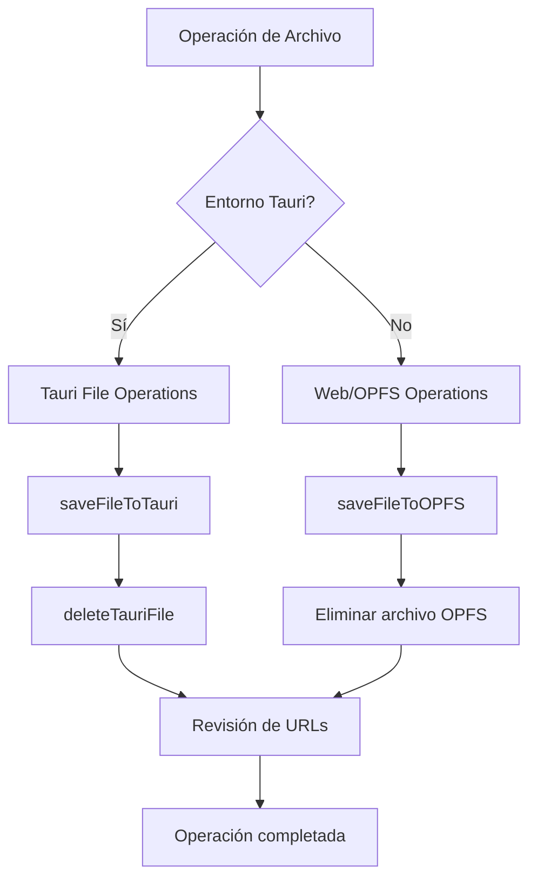

**Diagrama fuente**
- [useFileManager.ts](file://composables/useFileManager.ts#L111-L192)

#### Validación de Números de Parte
La implementación incluye validación de números de parte LCSC:

```mermaid
flowchart TD
Validate[Validar Part Number] --> PatternCheck{"Coincide patrón LCSC?"}
PatternCheck --> |Sí| Valid[Part Number Válido]
PatternCheck --> |No| Invalid[Part Number Inválido]
PatternCheck --> Pattern[/^[A-Z]\\d{6,}$/i/]
```

**Diagrama fuente**
- [useLCSC.ts](file://composables/useLCSC.ts#L337-L343)

### Composable EasyEDA (useEasyEDAImporter)
El composable EasyEDA implementa un parser flexible para diferentes formatos de plantillas:

#### Estructura de Componentes
```typescript
interface EasyEDAComponent {
    id: string;
    name: string;
    type: string;
    properties?: any;
}
```

#### Procesamiento de Plantillas
El sistema puede manejar múltiples formatos de EasyEDA:

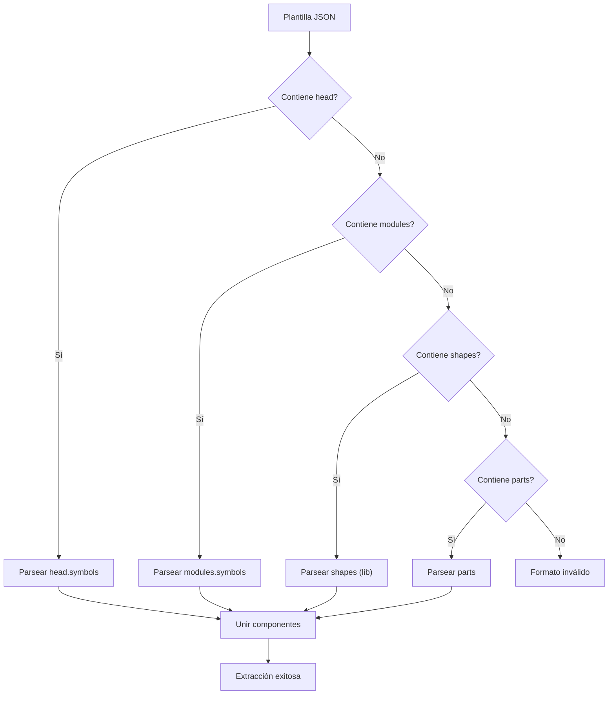

**Diagrama fuente**
- [useEasyEDAImporter.ts](file://composables/useEasyEDAImporter.ts#L70-L138)

### Componentes de Interfaz

#### Vista Previa LCSC
El componente LCSCPreview proporciona una interfaz completa para mostrar información de componentes:

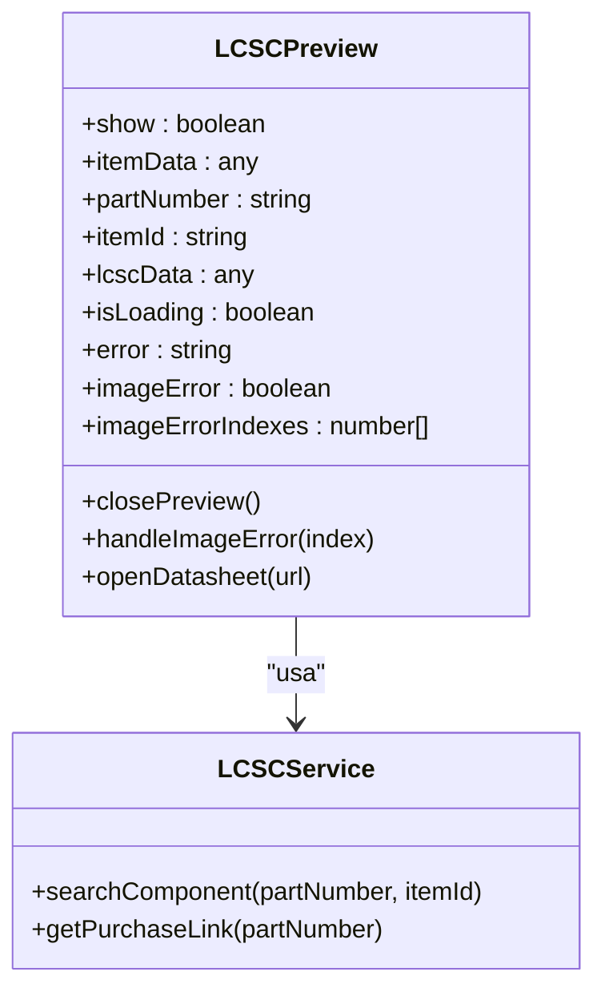

**Diagrama fuente**
- [LCSCPreview.vue](file://components/LCSCPreview.vue#L152-L230)

#### Importador EasyEDA
El componente EasyEDAImporter implementa una interfaz drag-and-drop para importación de plantillas:

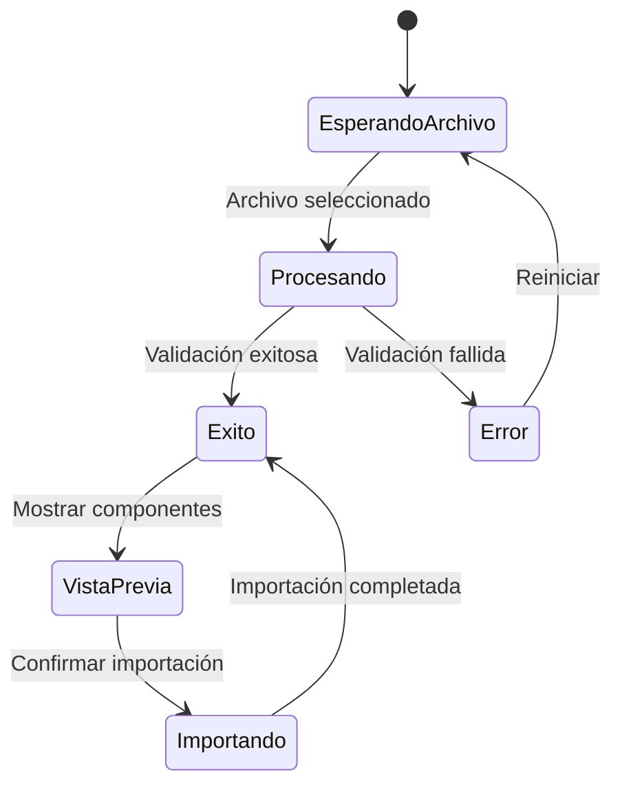

**Diagrama fuente**
- [EasyEDAImporter.vue](file://components/EasyEDAImporter.vue#L236-L310)

**Sección fuente**
- [LCSCPreview.vue](file://components/LCSCPreview.vue#L1-L230)
- [EasyEDAImporter.vue](file://components/EasyEDAImporter.vue#L1-L311)

## Análisis de Dependencias

### Dependencias Externas
El proyecto depende de varias bibliotecas clave:

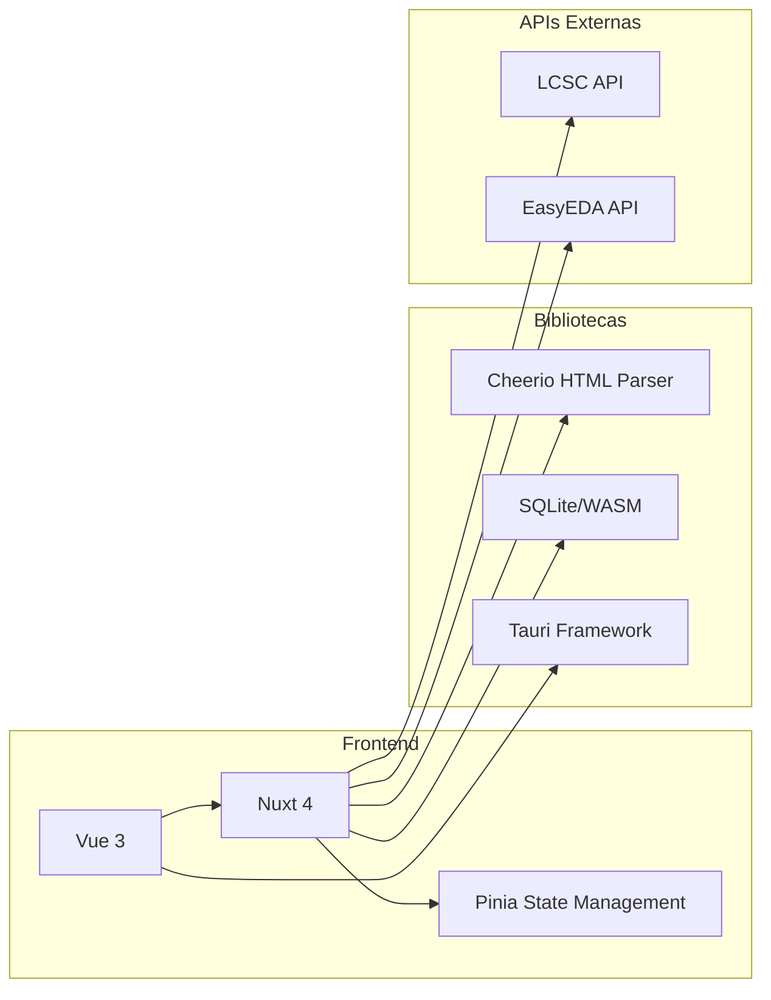

**Diagrama fuente**
- [package.json](file://package.json#L16-L29)

### Middleware de Seguridad
El servidor implementa políticas de seguridad CORS:

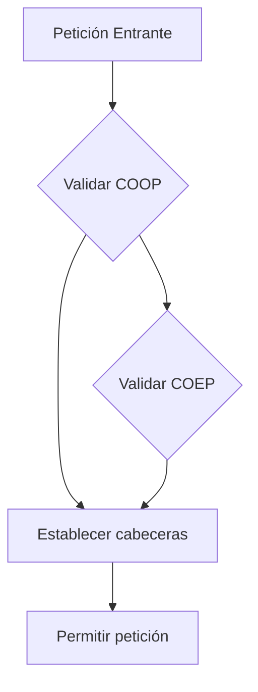

**Diagrama fuente**
- [setHeaders.ts](file://server/middleware/setHeaders.ts#L3-L6)

**Sección fuente**
- [package.json](file://package.json#L16-L49)

## Consideraciones de Rendimiento

### Optimizaciones Implementadas
1. **Caché Inteligente**: Las imágenes y PDFs se almacenan localmente para evitar descargas repetidas
2. **Descarga Asíncrona**: Las operaciones de descarga no bloquean la interfaz de usuario
3. **Validación Temprana**: Los formatos de archivo se validan antes del procesamiento completo
4. **Gestión de Memoria**: Los componentes de imagen manejan errores de carga sin afectar el rendimiento general

### Límites de Tasa y Manejo de Errores
- **LCSC API**: Implementar límites de tasa basados en el tiempo de espera de las respuestas
- **CORS Proxy**: El proxy de archivos evita problemas de CORS y limita descargas a dominios LCSC
- **Fallbacks**: Implementación de mecanismos de fallback cuando las descargas directas fallan

### Mejores Prácticas
1. **Almacenamiento Local**: Utilizar OPFS en navegadores modernos para almacenamiento persistente
2. **Validación de Entrada**: Verificar siempre los formatos de entrada antes del procesamiento
3. **Manejo de Errores**: Implementar bloques try-catch para operaciones críticas
4. **Optimización de Imágenes**: Reducir el tamaño de las imágenes antes de almacenarlas

## Guía de Solución de Problemas

### Errores Comunes en LCSC API
- **424-438**: Errores de autenticación y límites de tasa según la documentación oficial
- **Timeout de Descarga**: Implementar reintentos con backoff exponencial
- **Formato de URL Inválido**: Validar URLs antes de realizar solicitudes

### Errores en EasyEDA Importer
- **Formato JSON Inválido**: Verificar estructura antes de parsear
- **Archivos No Soportados**: Validar extensiones permitidas (.json)
- **Componentes Sin Nombre**: Proporcionar valores por defecto

### Diagnóstico de Problemas
1. **Verificar Conexión**: Confirmar acceso a internet y dominios LCSC/EasyEDA
2. **Revisar Almacenamiento**: Verificar espacio disponible en OPFS/Tauri
3. **Monitorear Errores**: Revisar consola del navegador para mensajes de error
4. **Pruebas Unitarias**: Implementar pruebas para validaciones críticas

**Sección fuente**
- [wiki/LCSC_API_INTEGRATION.md](file://wiki/LCSC_API_INTEGRATION.md#L99-L108)

## Conclusión

La implementación de las APIs de integración en BOM Manager demuestra un enfoque robusto y escalable para trabajar con servicios externos:

### Logros Alcanzados
- **Integración Completa**: Implementación funcional de ambas APIs con manejo de errores adecuado
- **Almacenamiento Inteligente**: Estrategias de caché que mejoran el rendimiento
- **Interfaz Amigable**: Componentes de UI que facilitan la experiencia del usuario
- **Seguridad**: Implementación de políticas de seguridad y validación de datos

### Consideraciones Futuras
1. **Mejoras de Rendimiento**: Implementar cacheado más avanzado y prefetching
2. **Monitoreo**: Agregar métricas de rendimiento y monitoreo de errores
3. **Escalabilidad**: Considerar implementación de workers para procesamiento pesado
4. **Documentación**: Expandir la documentación técnica con ejemplos completos

La arquitectura actual proporciona una base sólida para futuras expansiones y mejora continua de las capacidades de integración.