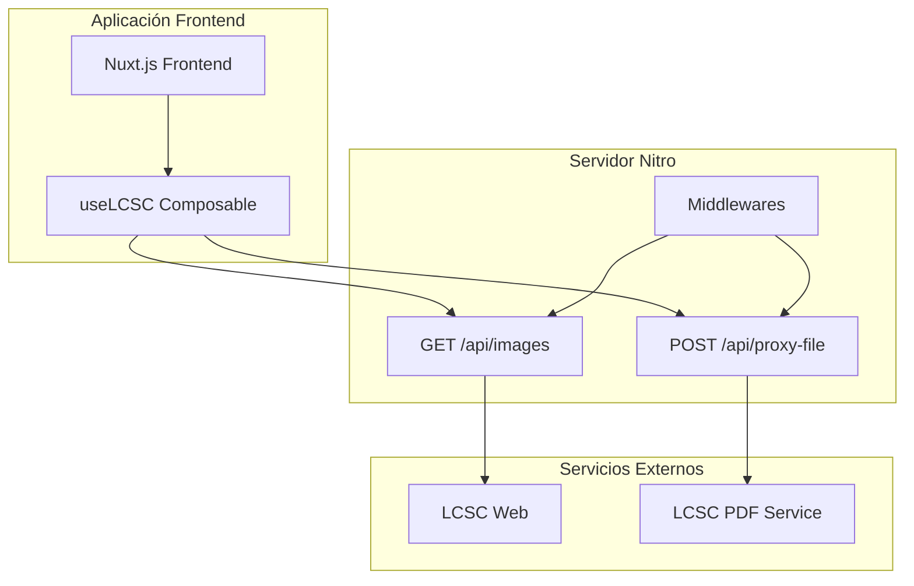
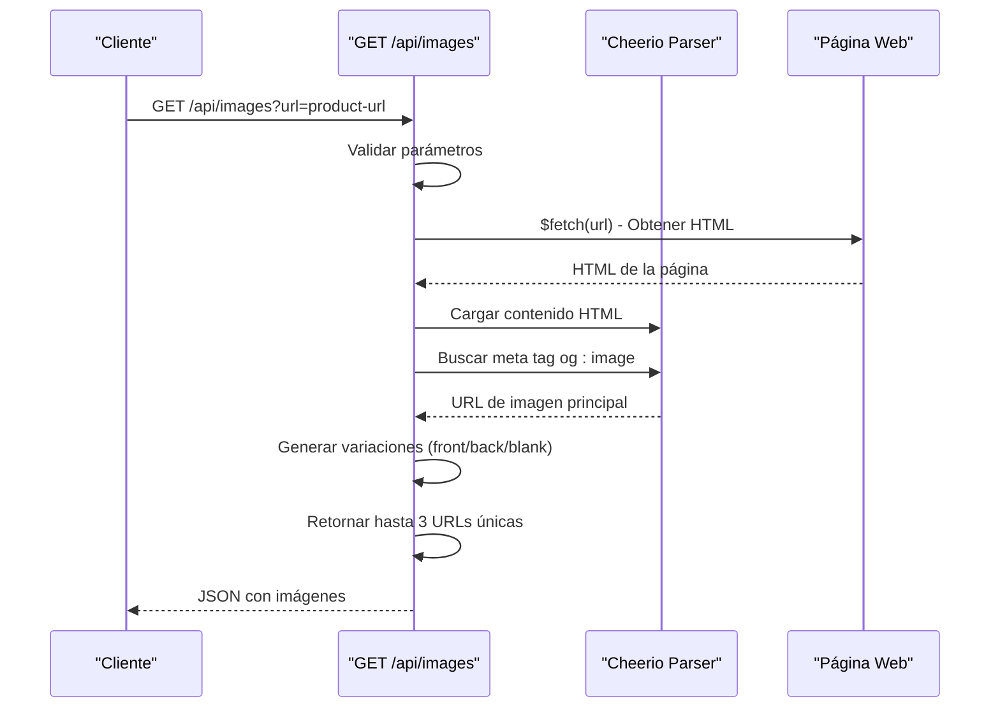
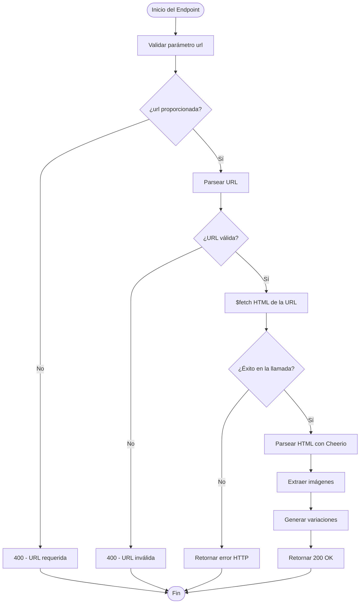
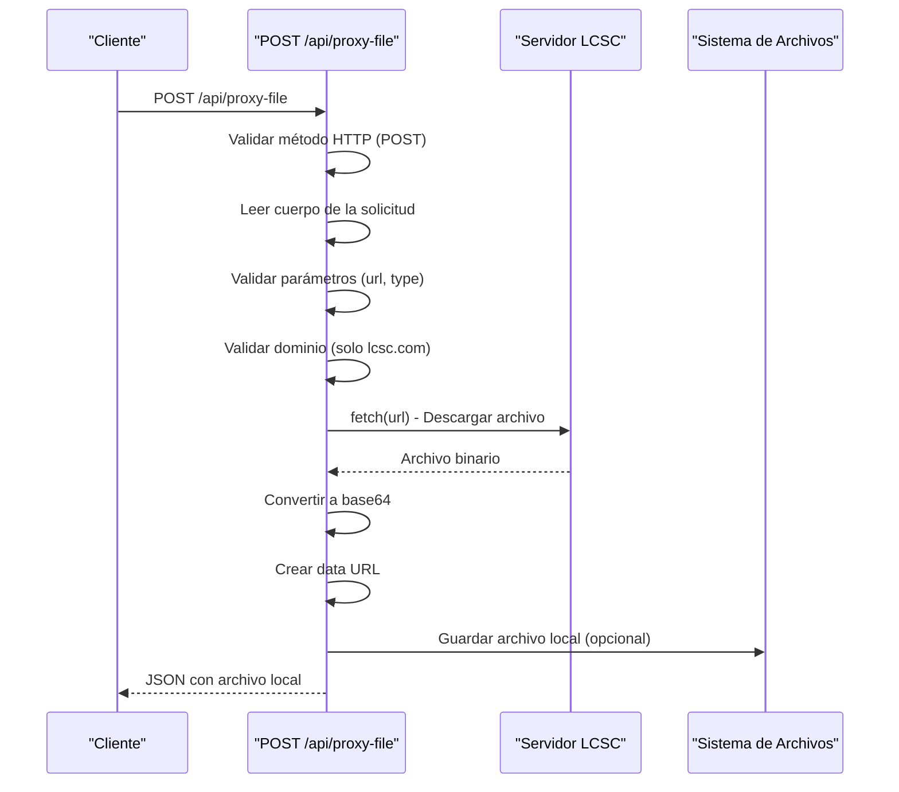
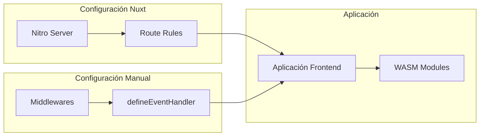
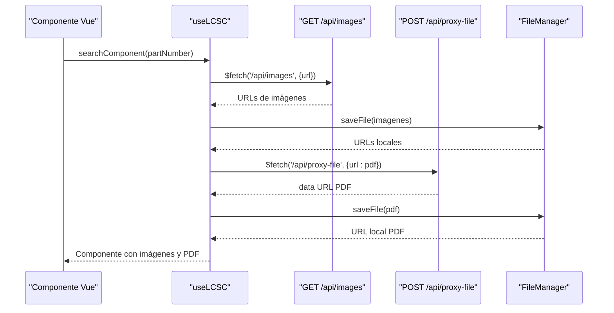
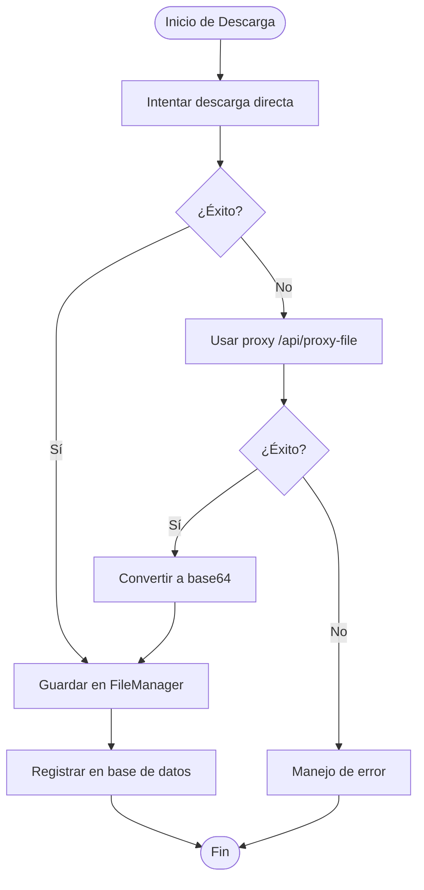

# Endpoints del Servidor

<cite>
**Archivos referenciados en este documento**
- [images.get.ts](file://server/api/images.get.ts)
- [proxy-file.post.ts](file://server/api/proxy-file.post.ts)
- [setHeaders.ts](file://server/middleware/setHeaders.ts)
- [nuxt.config.ts](file://nuxt.config.ts)
- [useLCSC.ts](file://composables/useLCSC.ts)
</cite>

## Tabla de Contenidos
1. [Introducción](#introducción)
2. [Arquitectura General](#arquitectura-general)
3. [Endpoint GET /api/images](#endpoint-get-apiimages)
4. [Endpoint POST /api/proxy-file](#endpoint-post-apiproxy-file)
5. [Middleware setHeaders](#middleware-setheaders)
6. [Integración con la Aplicación](#integración-con-la-aplicación)
7. [Consideraciones de Seguridad](#consideraciones-de-seguridad)
8. [Mejores Prácticas](#mejores-prácticas)
9. [Ejemplos de Uso](#ejemplos-de-uso)
10. [Conclusión](#conclusión)

## Introducción

El servidor de BOM Manager proporciona dos endpoints especializados para la gestión de imágenes y archivos externos. Estos endpoints son fundamentales para la integración con la API de LCSC (Lumens Components) y permiten la obtención de imágenes de productos y la descarga de archivos PDF de datasheets mientras se evita el problema de CORS (Cross-Origin Resource Sharing).

Los endpoints están diseñados para trabajar en conjunto con la aplicación frontend desarrollada en Nuxt.js, proporcionando funcionalidad robusta para la gestión de componentes electrónicos y su documentación asociada.

## Arquitectura General

La arquitectura del servidor se basa en un enfoque modular donde cada endpoint tiene una responsabilidad específica:



**Diagrama fuente**
- [images.get.ts](file://server/api/images.get.ts#L19-L22)
- [proxy-file.post.ts](file://server/api/proxy-file.post.ts#L1-L3)
- [nuxt.config.ts](file://nuxt.config.ts#L48-L57)

**Sección fuente**
- [images.get.ts](file://server/api/images.get.ts#L19-L22)
- [proxy-file.post.ts](file://server/api/proxy-file.post.ts#L1-L3)
- [nuxt.config.ts](file://nuxt.config.ts#L48-L57)

## Endpoint GET /api/images

### Descripción General

El endpoint GET `/api/images` está diseñado para extraer imágenes de páginas web específicas, particularmente útiles para obtener imágenes de productos de la plataforma LCSC. Este endpoint utiliza técnicas de scraping para encontrar imágenes relevantes y generar variaciones de imágenes disponibles.

### Parámetros de Consulta

| Parámetro | Tipo | Obligatorio | Descripción | Valores Válidos |
|-----------|------|-------------|-------------|-----------------|
| url | string | Sí | URL de la página web desde la cual extraer imágenes | Cualquier URL válida |

### Funcionamiento Interno



**Diagrama fuente**
- [images.get.ts](file://server/api/images.get.ts#L23-L32)
- [images.get.ts](file://server/api/images.get.ts#L38-L47)
- [images.get.ts](file://server/api/images.get.ts#L51-L89)

### Respuesta Esperada

**Formato de Respuesta:**
```json
{
  "count": 2,
  "images": [
    "https://example.com/image-front.jpg",
    "https://example.com/image-back.jpg"
  ]
}
```

**Campos de la Respuesta:**
- `count`: Número de imágenes encontradas (entero)
- `images`: Array de URLs de imágenes (máximo 3 elementos)

### Códigos de Estado HTTP

| Código | Descripción | Causa Principal |
|--------|-------------|-----------------|
| 200 | Éxito | URL válida y imágenes encontradas |
| 400 | Solicitud Incorrecta | Parámetro `url` faltante o inválido |
| 500 | Error Interno | Problemas al acceder a la URL o procesar el contenido |

### Manejo de Errores



**Diagrama fuente**
- [images.get.ts](file://server/api/images.get.ts#L27-L32)
- [images.get.ts](file://server/api/images.get.ts#L35-L36)
- [images.get.ts](file://server/api/images.get.ts#L98-L118)

**Sección fuente**
- [images.get.ts](file://server/api/images.get.ts#L23-L119)

## Endpoint POST /api/proxy-file

### Descripción General

El endpoint POST `/api/proxy-file` actúa como un proxy para descargar archivos remotos, especialmente útil para evitar problemas de CORS al acceder a archivos PDF de datasheets de la plataforma LCSC. Este endpoint permite la descarga segura de archivos y su conversión a formatos compatibles con la aplicación.

### Parámetros de Solicitud

**Cuerpo de la Solicitud (JSON):**
```json
{
  "url": "https://datasheet.lcsc.com/datasheet.pdf",
  "filename": "component-datasheet.pdf",
  "type": "application/pdf"
}
```

| Campo | Tipo | Obligatorio | Descripción | Valores Válidos |
|-------|------|-------------|-------------|-----------------|
| url | string | Sí | URL del archivo a descargar | Cualquier URL válida |
| filename | string | No | Nombre del archivo local | Cualquier cadena válida |
| type | string | Sí | Tipo MIME del archivo | Cualquier tipo MIME válido |

### Funcionamiento Interno



**Diagrama fuente**
- [proxy-file.post.ts](file://server/api/proxy-file.post.ts#L8-L14)
- [proxy-file.post.ts](file://server/api/proxy-file.post.ts#L16-L25)
- [proxy-file.post.ts](file://server/api/proxy-file.post.ts#L27-L41)
- [proxy-file.post.ts](file://server/api/proxy-file.post.ts#L43-L51)

### Respuesta Esperada

**Formato de Respuesta:**
```json
{
  "localUrl": "data:application/pdf;base64,JVBERi0xLjQKJcOkw7zDtsO...",
  "filename": "lcsc-datasheet-C123456.pdf",
  "size": 123456
}
```

**Campos de la Respuesta:**
- `localUrl`: URL de datos (data URL) con el archivo codificado en base64
- `filename`: Nombre del archivo asignado
- `size`: Tamaño del archivo en bytes

### Códigos de Estado HTTP

| Código | Descripción | Causa Principal |
|--------|-------------|-----------------|
| 200 | Éxito | Archivo descargado correctamente |
| 400 | Solicitud Incorrecta | Parámetros faltantes o inválidos |
| 405 | Método No Permitido | Método HTTP incorrecto |
| 500 | Error Interno | Problemas al descargar o procesar el archivo |

### Manejo de Errores

El endpoint implementa un control de errores específico para diferentes tipos de fallos:

1. **Validación de Método HTTP**: Solo acepta POST
2. **Validación de Parámetros**: Verifica la presencia de `url` y `type`
3. **Validación de Dominio**: Solo permite URLs de `lcsc.com`
4. **Manejo de Errores de Red**: Captura errores de conexión y respuesta HTTP

**Sección fuente**
- [proxy-file.post.ts](file://server/api/proxy-file.post.ts#L8-L78)

## Middleware setHeaders

### Descripción General

El middleware `setHeaders` establece políticas de seguridad relacionadas con la política de CORS (COOP/COEP) para permitir el uso seguro de WebAssembly y otros recursos web avanzados. Estas cabeceras son cruciales para el funcionamiento correcto de ciertas características de la aplicación.

### Cabeceras Establecidas

| Cabecera | Valor | Propósito |
|----------|-------|-----------|
| Cross-Origin-Opener-Policy | same-origin | Permite compartir contexto entre ventanas del mismo origen |
| Cross-Origin-Embedder-Policy | require-corp | Requiere políticas de embedding compatibles |

### Configuración en el Servidor



**Diagrama fuente**
- [nuxt.config.ts](file://nuxt.config.ts#L48-L57)
- [setHeaders.ts](file://server/middleware/setHeaders.ts#L3-L6)

### Impacto en la Aplicación

El middleware asegura que:

1. **Compatibilidad con WASM**: Permite el uso de módulos WebAssembly sin restricciones
2. **Seguridad de Orígenes Cruzados**: Controla qué recursos pueden ser compartidos
3. **Funcionalidad Avanzada**: Habilita características como SharedArrayBuffer

**Sección fuente**
- [setHeaders.ts](file://server/middleware/setHeaders.ts#L1-L6)
- [nuxt.config.ts](file://nuxt.config.ts#L31-L34)
- [nuxt.config.ts](file://nuxt.config.ts#L48-L57)

## Integración con la Aplicación

### Uso en el Composable useLCSC

La integración con la aplicación se realiza principalmente a través del composable `useLCSC`, que coordina la obtención de imágenes y datasheets de manera eficiente:



**Diagrama fuente**
- [useLCSC.ts](file://composables/useLCSC.ts#L269-L330)
- [useLCSC.ts](file://composables/useLCSC.ts#L187-L235)

### Flujo de Descarga de Datasheets



**Diagrama fuente**
- [useLCSC.ts](file://composables/useLCSC.ts#L147-L235)

**Sección fuente**
- [useLCSC.ts](file://composables/useLCSC.ts#L1-L353)

## Consideraciones de Seguridad

### Restricciones de Dominio

El endpoint `/api/proxy-file` implementa restricciones de seguridad importantes:

1. **Dominio Requerido**: Solo permite URLs de `lcsc.com`
2. **Validación de URL**: Verifica el formato de las URLs antes de procesarlas
3. **Control de Métodos HTTP**: Solo acepta POST para evitar ataques de tipo GET

### Protección contra Ataques

- **Limitación de Orígenes**: El middleware COOP/COEP previene ataques de tipo Spectre
- **Validación de Entrada**: Todos los parámetros son validados antes de ser procesados
- **Timeout de Conexión**: Límites de tiempo para evitar ataques de denegación de servicio

### Mejores Prácticas de Seguridad

1. **Validar siempre las URLs de entrada**
2. **Limitar el tamaño de los archivos descargados**
3. **Implementar rate limiting en producción**
4. **Monitorear y registrar todas las solicitudes**

**Sección fuente**
- [proxy-file.post.ts](file://server/api/proxy-file.post.ts#L27-L41)
- [setHeaders.ts](file://server/middleware/setHeaders.ts#L3-L6)

## Mejores Prácticas

### Consumo Eficiente de los Endpoints

1. **Caché de Resultados**: Almacenar temporalmente las imágenes obtenidas
2. **Validación de Parámetros**: Asegurar que las URLs sean válidas antes de llamar al endpoint
3. **Manejo de Errores**: Implementar retry mechanisms para caídas temporales
4. **Optimización de Imágenes**: Reducir el tamaño de las imágenes cuando sea posible

### Gestión de Recursos

1. **Límites de Tiempo**: Configurar timeouts adecuados para evitar bloqueos
2. **Control de Memoria**: Liberar recursos después de procesar archivos grandes
3. **Monitoreo de Rendimiento**: Registrar tiempos de respuesta y errores

### Escalabilidad

1. **Rate Limiting**: Implementar límites de solicitudes por IP
2. **Caching**: Utilizar caché para imágenes y archivos frecuentemente accedidos
3. **Fallbacks**: Tener alternativas cuando los servicios externos fallen

## Ejemplos de Uso

### Ejemplo 1: Obtener Imágenes de un Producto LCSC

**Petición:**
```
GET /api/images?url=https://lcsc.com/product-detail/C123456.html
```

**Respuesta:**
```json
{
  "count": 3,
  "images": [
    "https://example.com/C123456_C313368_front.jpg",
    "https://example.com/C123456_C313368_back.jpg",
    "https://example.com/C123456_C313368_blank.jpg"
  ]
}
```

### Ejemplo 2: Descargar PDF de Datasheet

**Petición:**
```
POST /api/proxy-file
Content-Type: application/json

{
  "url": "https://datasheet.lcsc.com/C123456.pdf",
  "filename": "lcsc-datasheet-C123456.pdf",
  "type": "application/pdf"
}
```

**Respuesta:**
```json
{
  "localUrl": "data:application/pdf;base64,JVBERi0xLjQKJcOkw7zDtsO...",
  "filename": "lcsc-datasheet-C123456.pdf",
  "size": 123456
}
```

### Ejemplo 3: Manejo de Errores

**Petición con URL Inválida:**
```
GET /api/images?url=invalid-url
```

**Respuesta de Error:**
```json
{
  "statusCode": 400,
  "statusMessage": "Invalid URL format"
}
```

## Conclusión

Los endpoints del servidor de BOM Manager proporcionan una solución completa para la gestión de imágenes y archivos externos en entornos de desarrollo web moderno. La combinación de técnicas de scraping, proxy de descarga y middleware de seguridad permite una integración fluida con servicios externos como LCSC mientras mantiene altos estándares de seguridad y rendimiento.

Las implementaciones presentan buenas prácticas de manejo de errores, validación de entrada y optimización de recursos, haciendo que el sistema sea robusto y escalable para aplicaciones de gestión de inventarios electrónicos.

La arquitectura modular y la separación clara de responsabilidades facilitan el mantenimiento y la extensión del sistema, permitiendo futuras mejoras y la integración con otros servicios externos según las necesidades del proyecto.