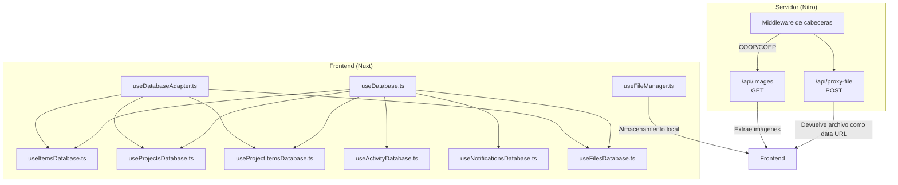
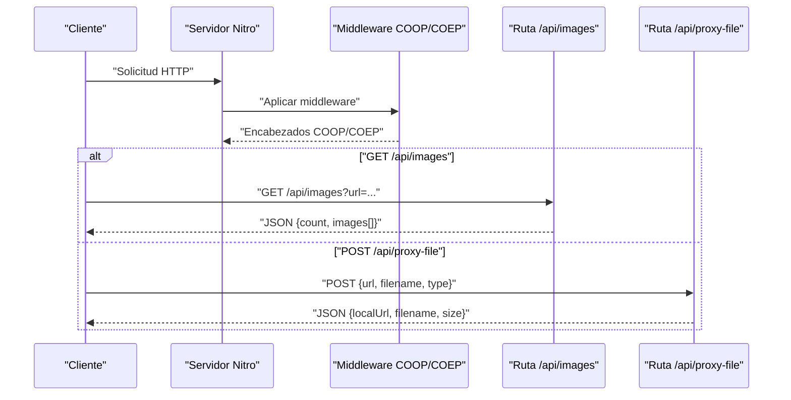
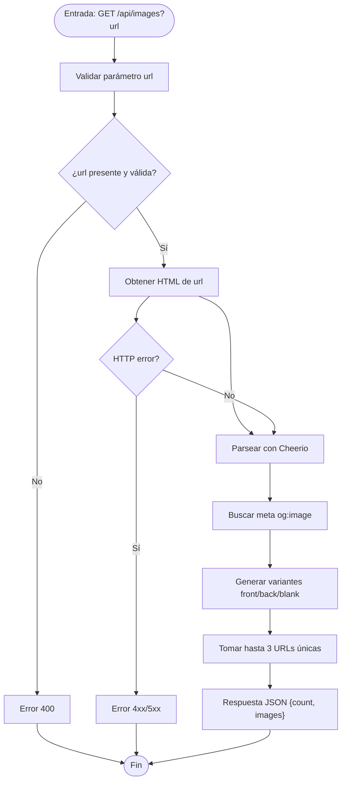
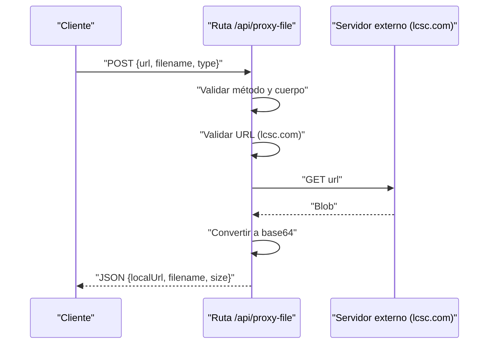
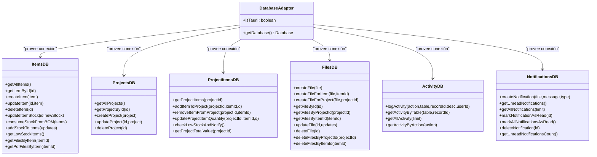
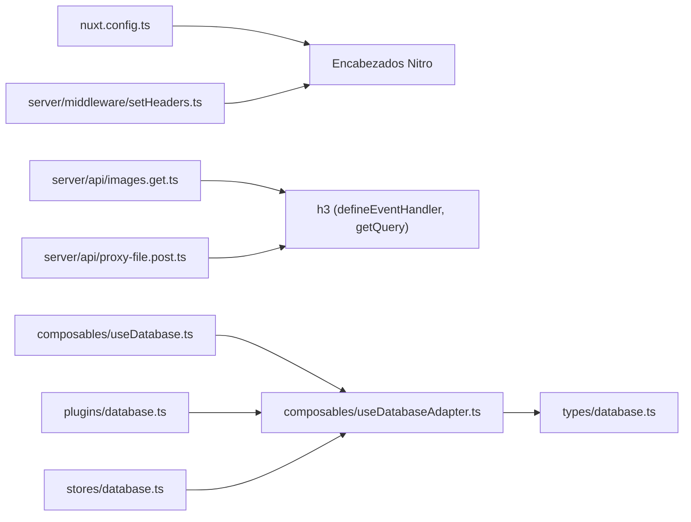

# Referencia de API

<cite>
**Archivos mencionados en este documento**
- [images.get.ts](file://server/api/images.get.ts)
- [proxy-file.post.ts](file://server/api/proxy-file.post.ts)
- [setHeaders.ts](file://server/middleware/setHeaders.ts)
- [nuxt.config.ts](file://nuxt.config.ts)
- [useFileManager.ts](file://composables/useFileManager.ts)
- [useFilesDatabase.ts](file://composables/useFilesDatabase.ts)
- [useDatabaseAdapter.ts](file://composables/useDatabaseAdapter.ts)
- [useDatabase.ts](file://composables/useDatabase.ts)
- [useItemsDatabase.ts](file://composables/useItemsDatabase.ts)
- [useProjectsDatabase.ts](file://composables/useProjectsDatabase.ts)
- [useProjectItemsDatabase.ts](file://composables/useProjectItemsDatabase.ts)
- [useActivityDatabase.ts](file://composables/useActivityDatabase.ts)
- [useNotificationsDatabase.ts](file://composables/useNotificationsDatabase.ts)
- [database.ts](file://plugins/database.ts)
- [database.ts](file://stores/database.ts)
- [database.ts](file://types/database.ts)
</cite>

## Índice
1. [Introducción](#introducción)
2. [Estructura del proyecto](#estructura-del-proyecto)
3. [Componentes principales](#componentes-principales)
4. [Visión general de la arquitectura](#visión-general-de-la-arquitectura)
5. [Análisis detallado de componentes](#análisis-detallado-de-componentes)
6. [Análisis de dependencias](#análisis-de-dependencias)
7. [Consideraciones de rendimiento](#consideraciones-de-rendimiento)
8. [Guía de solución de problemas](#guía-de-solución-de-problemas)
9. [Conclusión](#conclusión)

## Introducción
Esta documentación describe la API de BOM Manager, enfocándose en:
- Endpoints HTTP expuestos por el servidor integrado (Nitro) y su protocolo de comunicación.
- Autenticación, cabeceras, parámetros de consulta y cuerpo de solicitud.
- Esquemas de respuesta, códigos de estado y manejo de errores.
- Rutas de servidor, middleware y políticas de seguridad.
- Base de datos y servicios backend expuestos a través de componibles.
- Imágenes, proxy de archivos y mecanismos de almacenamiento local (OPFS/Tauri).
- Casos de uso comunes, mejores prácticas y consideraciones de rendimiento.

## Estructura del proyecto
El repositorio incluye:
- Servidor integrado (Nitro) con rutas API y middleware.
- Componibles que exponen servicios de base de datos y gestión de archivos.
- Configuración de Nuxt/Nitro que establece encabezados de seguridad CORS y HMR.
- Plugins y stores relacionados con la base de datos.

**Diagrama fuente**
- [images.get.ts](file://server/api/images.get.ts#L1-L120)
- [proxy-file.post.ts](file://server/api/proxy-file.post.ts#L1-L78)
- [setHeaders.ts](file://server/middleware/setHeaders.ts#L1-L6)
- [nuxt.config.ts](file://nuxt.config.ts#L1-L67)
- [useFileManager.ts](file://composables/useFileManager.ts#L1-L260)
- [useDatabaseAdapter.ts](file://composables/useDatabaseAdapter.ts#L1-L25)
- [useDatabase.ts](file://composables/useDatabase.ts#L1-L89)
- [useItemsDatabase.ts](file://composables/useItemsDatabase.ts#L1-L346)
- [useProjectsDatabase.ts](file://composables/useProjectsDatabase.ts#L1-L128)
- [useProjectItemsDatabase.ts](file://composables/useProjectItemsDatabase.ts#L1-L144)
- [useActivityDatabase.ts](file://composables/useActivityDatabase.ts#L1-L87)
- [useNotificationsDatabase.ts](file://composables/useNotificationsDatabase.ts#L1-L138)
- [useFilesDatabase.ts](file://composables/useFilesDatabase.ts#L1-L179)

**Sección fuente**
- [nuxt.config.ts](file://nuxt.config.ts#L1-L67)

## Componentes principales
- Rutas API:
  - GET /api/images: Extrae imágenes desde una URL externa.
  - POST /api/proxy-file: Descarga un archivo desde una URL permitida y lo devuelve como data URL.
- Middleware:
  - Establece encabezados COOP/COEP en todas las respuestas del servidor.
- Base de datos:
  - Adaptador de base de datos (entorno web o Tauri).
  - Componibles para items, proyectos, relaciones, archivos, actividad y notificaciones.
- Almacenamiento local:
  - Gestión de archivos locales (OPFS en web, plugin FS en Tauri) y Data URLs.

**Sección fuente**
- [images.get.ts](file://server/api/images.get.ts#L1-L120)
- [proxy-file.post.ts](file://server/api/proxy-file.post.ts#L1-L78)
- [setHeaders.ts](file://server/middleware/setHeaders.ts#L1-L6)
- [useDatabaseAdapter.ts](file://composables/useDatabaseAdapter.ts#L1-L25)
- [useDatabase.ts](file://composables/useDatabase.ts#L1-L89)
- [useFileManager.ts](file://composables/useFileManager.ts#L1-L260)

## Visión general de la arquitectura
La aplicación combina un frontend Nuxt con un servidor Nitro integrado. El frontend consume servicios expuestos mediante componibles de base de datos y también consume directamente endpoints del servidor. El middleware establece políticas de seguridad para permitir el uso de WebAssembly y recursos compartidos.

**Diagrama fuente**
- [images.get.ts](file://server/api/images.get.ts#L1-L120)
- [proxy-file.post.ts](file://server/api/proxy-file.post.ts#L1-L78)
- [setHeaders.ts](file://server/middleware/setHeaders.ts#L1-L6)

## Análisis detallado de componentes

### Endpoint: GET /api/images
- Método: GET
- URL: /api/images
- Parámetros de consulta:
  - url (requerido): URL válida de la página a scrapear.
- Autenticación: No requiere.
- Cabeceras:
  - user-agent y accept configuradas al hacer la solicitud interna.
- Cuerpo de solicitud: Ninguno.
- Respuesta exitosa:
  - count: número de imágenes únicas encontradas.
  - images: arreglo de hasta 3 URLs de imagen.
- Errores:
  - 400: Falta el parámetro url o formato inválido.
  - 500: Error interno o fallo al obtener la URL externa.
- Comportamiento adicional:
  - Busca meta tag og:image y genera variaciones front/back/blank si aplica.

**Diagrama fuente**
- [images.get.ts](file://server/api/images.get.ts#L1-L120)

**Sección fuente**
- [images.get.ts](file://server/api/images.get.ts#L1-L120)

### Endpoint: POST /api/proxy-file
- Método: POST
- URL: /api/proxy-file
- Autenticación: No requiere.
- Cabeceras: Ninguna especial requerida.
- Cuerpo de solicitud (JSON):
  - url (requerido): debe ser una URL válida de lcsc.com.
  - filename (opcional): nombre sugerido del archivo descargado.
  - type (requerido): tipo MIME del archivo.
- Respuesta exitosa:
  - localUrl: data URL del archivo descargado.
  - filename: nombre del archivo (del body o predeterminado).
  - size: tamaño en bytes.
- Errores:
  - 400: Falta url, formato inválido o host no permitido.
  - 405: Método no permitido (si no es POST).
  - 500: Error interno o fallo al obtener el archivo.
- Seguridad:
  - Se restringe a dominios lcsc.com.

**Diagrama fuente**
- [proxy-file.post.ts](file://server/api/proxy-file.post.ts#L1-L78)

**Sección fuente**
- [proxy-file.post.ts](file://server/api/proxy-file.post.ts#L1-L78)

### Middleware de cabeceras
- Aplica Cross-Origin-Opener-Policy: same-origin
- Aplica Cross-Origin-Embedder-Policy: require-corp
- Se ejecuta en todas las rutas del servidor.

**Sección fuente**
- [setHeaders.ts](file://server/middleware/setHeaders.ts#L1-L6)
- [nuxt.config.ts](file://nuxt.config.ts#L1-L67)

### Base de datos y servicios backend
Los componibles exponen métodos CRUD y operaciones de negocio. La base de datos se adapta automáticamente entre entornos web y Tauri.

**Diagrama fuente**
- [useDatabaseAdapter.ts](file://composables/useDatabaseAdapter.ts#L1-L25)
- [useItemsDatabase.ts](file://composables/useItemsDatabase.ts#L1-L346)
- [useProjectsDatabase.ts](file://composables/useProjectsDatabase.ts#L1-L128)
- [useProjectItemsDatabase.ts](file://composables/useProjectItemsDatabase.ts#L1-L144)
- [useFilesDatabase.ts](file://composables/useFilesDatabase.ts#L1-L179)
- [useActivityDatabase.ts](file://composables/useActivityDatabase.ts#L1-L87)
- [useNotificationsDatabase.ts](file://composables/useNotificationsDatabase.ts#L1-L138)

**Sección fuente**
- [useDatabaseAdapter.ts](file://composables/useDatabaseAdapter.ts#L1-L25)
- [useDatabase.ts](file://composables/useDatabase.ts#L1-L89)
- [useItemsDatabase.ts](file://composables/useItemsDatabase.ts#L1-L346)
- [useProjectsDatabase.ts](file://composables/useProjectsDatabase.ts#L1-L128)
- [useProjectItemsDatabase.ts](file://composables/useProjectItemsDatabase.ts#L1-L144)
- [useFilesDatabase.ts](file://composables/useFilesDatabase.ts#L1-L179)
- [useActivityDatabase.ts](file://composables/useActivityDatabase.ts#L1-L87)
- [useNotificationsDatabase.ts](file://composables/useNotificationsDatabase.ts#L1-L138)

### Almacenamiento local de archivos
- Web (OPFS): Guarda y recupera archivos en el sistema de archivos privado del origen. Genera URLs objetos para acceso temporal.
- Tauri: Usa plugin FS si está disponible; si no, devuelve Data URLs como fallback.
- Operaciones: guardar, eliminar, consultar disponibilidad y recuperar por nombre.

**Sección fuente**
- [useFileManager.ts](file://composables/useFileManager.ts#L1-L260)

## Análisis de dependencias
- Nitro:
  - Rutas API definidas en server/api.
  - Middleware en server/middleware.
  - Configuración de encabezados globales en nuxt.config.ts.
- Base de datos:
  - useDatabaseAdapter detecta entorno y provee la conexión.
  - Componibles de negocio dependen de useDatabaseAdapter.
- Plugins y stores:
  - plugins/database.ts y stores/database.ts definen el acceso a la base de datos.
  - types/database.ts define la interfaz de base de datos.

**Diagrama fuente**
- [nuxt.config.ts](file://nuxt.config.ts#L1-L67)
- [images.get.ts](file://server/api/images.get.ts#L1-L120)
- [proxy-file.post.ts](file://server/api/proxy-file.post.ts#L1-L78)
- [setHeaders.ts](file://server/middleware/setHeaders.ts#L1-L6)
- [useDatabaseAdapter.ts](file://composables/useDatabaseAdapter.ts#L1-L25)
- [useDatabase.ts](file://composables/useDatabase.ts#L1-L89)
- [database.ts](file://plugins/database.ts)
- [database.ts](file://stores/database.ts)
- [database.ts](file://types/database.ts)

**Sección fuente**
- [nuxt.config.ts](file://nuxt.config.ts#L1-L67)
- [useDatabaseAdapter.ts](file://composables/useDatabaseAdapter.ts#L1-L25)
- [useDatabase.ts](file://composables/useDatabase.ts#L1-L89)

## Consideraciones de rendimiento
- Límites de tiempo:
  - GET /api/images tiene un límite de espera al hacer $fetch a la URL externa.
- Procesamiento:
  - La extracción de imágenes y generación de variantes es ligera, pero puede aumentar con más imágenes.
- Proxy de archivos:
  - La descarga se realiza en memoria; para archivos grandes, considerar streaming o límites de tamaño.
- Base de datos:
  - Transacciones en operaciones de stock evitan inconsistencias y mejoran atomicidad.
- Almacenamiento local:
  - OPFS reduce I/O en disco; Tauri puede usar Data URLs como fallback.

[No se necesitan fuentes para esta sección]

## Guía de solución de problemas
- Errores HTTP comunes:
  - 400: Parámetro url faltante o inválido en GET /api/images.
  - 400: URL inválida o host no permitido en POST /api/proxy-file.
  - 405: Método no permitido si no se usa POST en /api/proxy-file.
  - 500: Errores internos o fallos al acceder a URLs externas o al servidor.
- Manejo de errores en endpoints:
  - Ambos endpoints usan createError de h3 con códigos y mensajes descriptivos.
- Seguridad:
  - El middleware establece COOP/COEP. Asegúrate de que el frontend y recursos compartidos cumplan con estas políticas.
  - El proxy de archivos restringe dominios a lcsc.com.

**Sección fuente**
- [images.get.ts](file://server/api/images.get.ts#L1-L120)
- [proxy-file.post.ts](file://server/api/proxy-file.post.ts#L1-L78)
- [setHeaders.ts](file://server/middleware/setHeaders.ts#L1-L6)

## Conclusión
La API de BOM Manager proporciona endpoints para extraer imágenes de páginas externas y descargar archivos desde dominios permitidos, junto con una base de datos robusta expuesta a través de componibles. La configuración de seguridad COOP/COEP facilita el uso de WebAssembly y recursos compartidos. Para consumidores de la API, se recomienda validar entradas, manejar códigos de estado y seguir buenas prácticas de rendimiento al trabajar con archivos grandes o múltiples solicitudes.