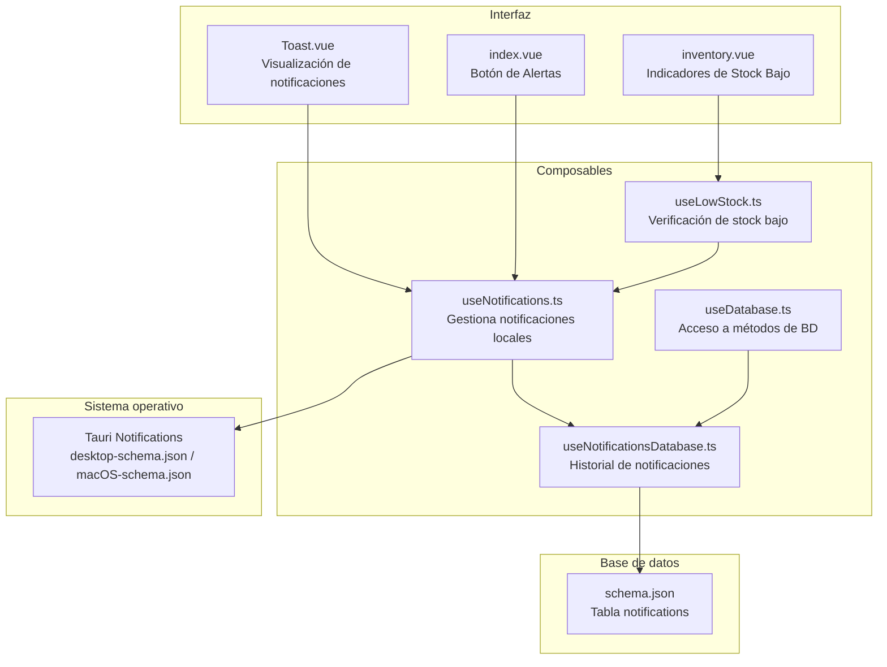
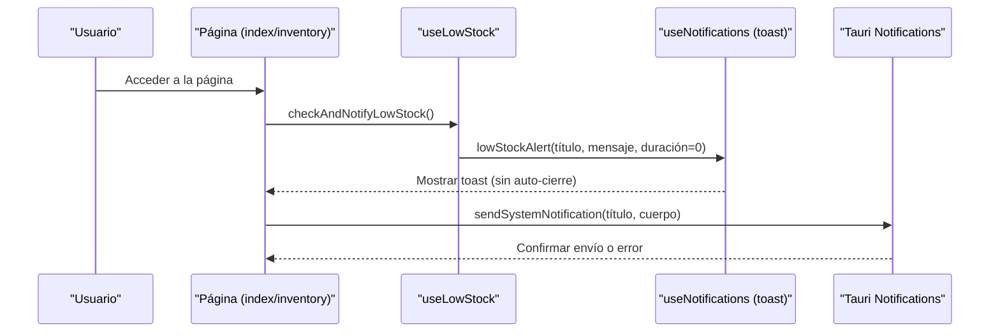
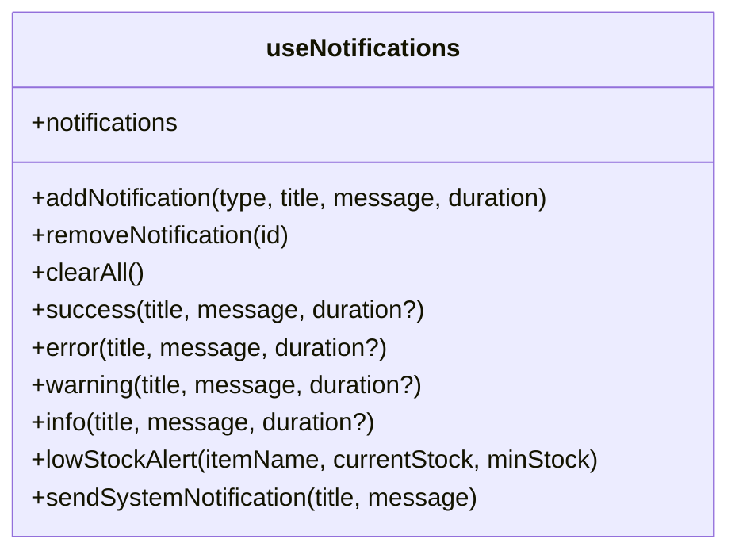
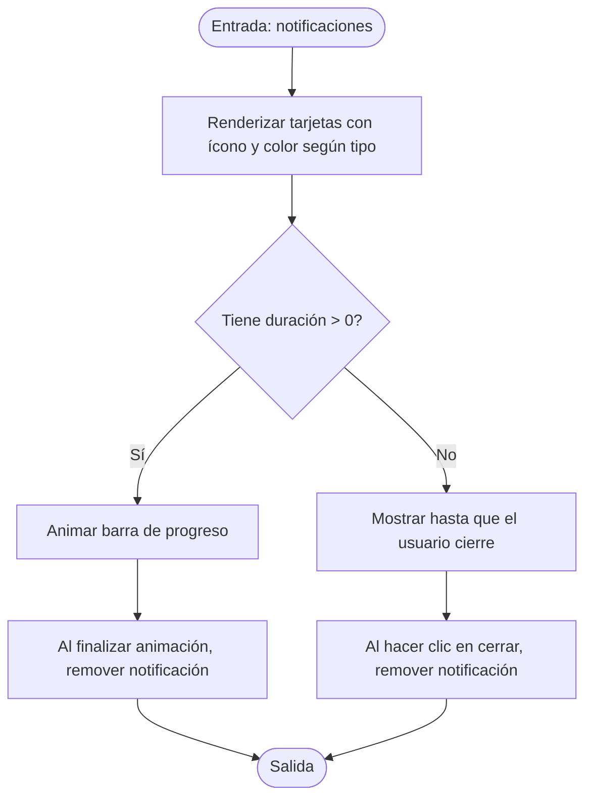
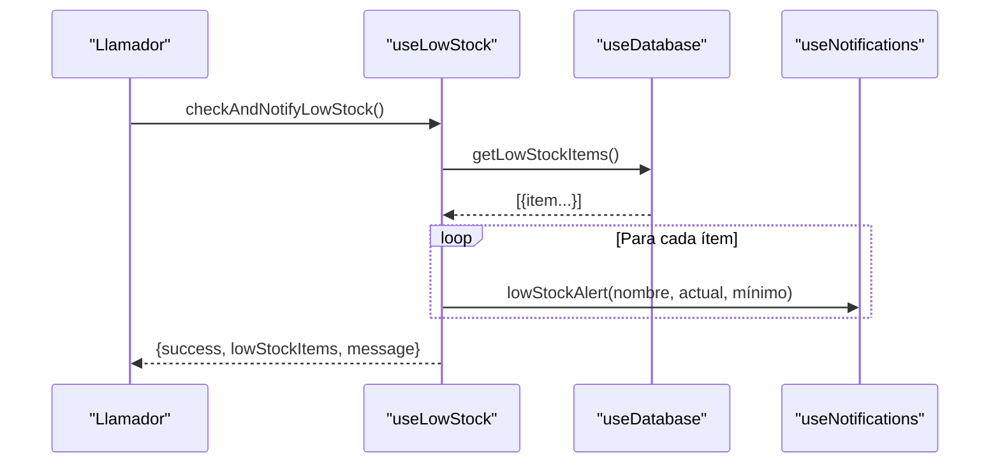
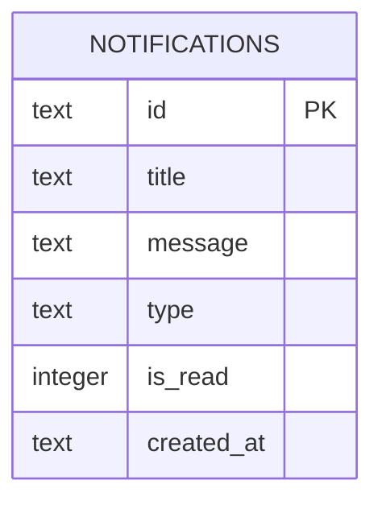

# Sistema de Notificaciones

<cite>
**Archivos referenciados en este documento**
- [useNotifications.ts](file://composables/useNotifications.ts)
- [Toast.vue](file://components/Toast.vue)
- [useLowStock.ts](file://composables/useLowStock.ts)
- [useNotificationsDatabase.ts](file://composables/useNotificationsDatabase.ts)
- [useDatabase.ts](file://composables/useDatabase.ts)
- [schema.json](file://data/db/schema.json)
- [desktop-schema.json](file://src-tauri/gen/schemas/desktop-schema.json)
- [macOS-schema.json](file://src-tauri/gen/schemas/macOS-schema.json)
- [index.vue](file://pages/index.vue)
- [inventory.vue](file://pages/inventory.vue)
- [default.vue](file://layouts/default.vue)
- [settings.ts](file://stores/settings.ts)
- [useSettingsDatabase.ts](file://composables/useSettingsDatabase.ts)
</cite>

## Índice
1. [Introducción](#introducción)
2. [Estructura del sistema de notificaciones](#estructura-del-sistema-de-notificaciones)
3. [Tipos de notificaciones y prioridades](#tipos-de-notificaciones-y-prioridades)
4. [Condiciones de activación y frecuencia](#condiciones-de-activación-y-frecuencia)
5. [Personalización de alertas y silenciamiento temporal](#personalización-de-alertas-y-silenciamiento-temporal)
6. [Configuración de notificaciones por correo y nativas del sistema](#configuración-de-notificaciones-por-correo-y-nativas-del-sistema)
7. [Notificaciones históricas y gestión de vistas](#notificaciones-históricas-y-gestión-de-vistas)
8. [Ejemplos de configuración y casos de uso](#ejemplos-de-configuración-y-casos-de-uso)
9. [Mejores prácticas](#mejores-prácticas)
10. [Arquitectura general del sistema de notificaciones](#arquitectura-general-del-sistema-de-notificaciones)
11. [Análisis detallado de componentes](#análisis-detallado-de-componentes)
12. [Consideraciones de rendimiento](#consideraciones-de-rendimiento)
13. [Guía de solución de problemas](#guía-de-solución-de-problemas)
14. [Conclusión](#conclusión)

## Introducción
Este documento describe el sistema completo de notificaciones de BOM Manager. Cubre cómo se generan, muestran y gestionan las alertas de stock bajo, notificaciones del sistema, notificaciones emergentes (toast), y cómo se integran con la base de datos de notificaciones y la configuración del sistema. También explica las condiciones de activación, personalización de alertas, silenciamiento temporal, y la gestión de notificaciones históricas. Se incluyen ejemplos de configuración, casos de uso y mejores prácticas.

## Estructura del sistema de notificaciones
El sistema se basa en dos capas principales:
- Notificaciones locales (toast): representación visual en la interfaz con temporización automática.
- Notificaciones del sistema operativo (SO): notificaciones nativas mediante Tauri, solicitando permiso al usuario.

Además, se mantiene un historial de notificaciones en la base de datos con estado de lectura/escritura.

**Diagrama fuente**
- [Toast.vue](file://components/Toast.vue#L1-L158)
- [useNotifications.ts](file://composables/useNotifications.ts#L1-L156)
- [useLowStock.ts](file://composables/useLowStock.ts#L1-L82)
- [useDatabase.ts](file://composables/useDatabase.ts#L1-L89)
- [useNotificationsDatabase.ts](file://composables/useNotificationsDatabase.ts#L1-L138)
- [schema.json](file://data/db/schema.json#L24-L36)
- [desktop-schema.json](file://src-tauri/gen/schemas/desktop-schema.json#L5971-L6065)
- [macOS-schema.json](file://src-tauri/gen/schemas/macOS-schema.json#L5971-L6065)

**Sección fuente**
- [useNotifications.ts](file://composables/useNotifications.ts#L1-L156)
- [Toast.vue](file://components/Toast.vue#L1-L158)
- [useLowStock.ts](file://composables/useLowStock.ts#L1-L82)
- [useNotificationsDatabase.ts](file://composables/useNotificationsDatabase.ts#L1-L138)
- [useDatabase.ts](file://composables/useDatabase.ts#L1-L89)
- [schema.json](file://data/db/schema.json#L24-L36)
- [desktop-schema.json](file://src-tauri/gen/schemas/desktop-schema.json#L5971-L6065)
- [macOS-schema.json](file://src-tauri/gen/schemas/macOS-schema.json#L5971-L6065)

## Tipos de notificaciones y prioridades
- Tipos disponibles: éxito, error, advertencia, información.
- Prioridad implícita:
  - Stock bajo: usa tipo advertencia.
  - Errores: tipo error (tiempo de visualización mayor por defecto).
  - Éxito: tipo éxito.
  - Información: tipo información.
- La interfaz muestra ícono y color según el tipo.

**Sección fuente**
- [useNotifications.ts](file://composables/useNotifications.ts#L4-L11)
- [useNotifications.ts](file://composables/useNotifications.ts#L72-L97)
- [Toast.vue](file://components/Toast.vue#L83-L129)

## Condiciones de activación y frecuencia
- Alertas de stock bajo:
  - Se disparan cuando un ítem tiene stock actual menor que su stock mínimo.
  - Se pueden ejecutar manualmente o al cargar datos.
  - No tienen cierre automático (duración 0) para permitir acción del usuario.
- Frecuencia:
  - Puede ejecutarse periódicamente (por ejemplo, al iniciar o al navegar a ciertas páginas).
  - En la página principal se puede usar un botón para activar la revisión.

**Sección fuente**
- [useLowStock.ts](file://composables/useLowStock.ts#L8-L36)
- [useLowStock.ts](file://composables/useLowStock.ts#L43-L50)
- [index.vue](file://pages/index.vue#L1-L36)

## Personalización de alertas y silenciamiento temporal
- Personalización:
  - Duración de visualización configurable al crear notificaciones.
  - Alertas de stock bajo no se autocierran automáticamente.
- Silenciamiento temporal:
  - No hay funcionalidad explícita de silenciamiento programado en el código actual.
  - Se puede evitar nuevas notificaciones locales limitando cuándo se invoca la función de notificación.

**Sección fuente**
- [useNotifications.ts](file://composables/useNotifications.ts#L20-L51)
- [useNotifications.ts](file://composables/useNotifications.ts#L102-L108)

## Configuración de notificaciones por correo y nativas del sistema
- Notificaciones nativas del SO:
  - Se envían desde Tauri con permisos solicitados.
  - Requiere permiso explícito del usuario.
  - Solo se ejecutan en entornos Tauri.
- Correo:
  - No se encuentra implementación de notificaciones por correo en el código actual.

**Sección fuente**
- [useNotifications.ts](file://composables/useNotifications.ts#L124-L141)
- [desktop-schema.json](file://src-tauri/gen/schemas/desktop-schema.json#L5971-L6065)
- [macOS-schema.json](file://src-tauri/gen/schemas/macOS-schema.json#L5971-L6065)

## Notificaciones históricas y gestión de vistas
- Historial persistente:
  - Tabla notifications con campos: id, título, mensaje, tipo, estado de lectura, fecha de creación.
  - Métodos CRUD y conteo de no leídas.
- Vistas:
  - Indicador visual en la barra de navegación mostrando alertas combinadas de stock bajo y notificaciones no leídas.
  - Página de inventario muestra cantidad de ítems con stock bajo.

**Sección fuente**
- [schema.json](file://data/db/schema.json#L24-L36)
- [useNotificationsDatabase.ts](file://composables/useNotificationsDatabase.ts#L1-L138)
- [index.vue](file://pages/index.vue#L1-L36)
- [inventory.vue](file://pages/inventory.vue#L68-L81)

## Ejemplos de configuración y casos de uso
- Activar notificaciones de stock bajo al cargar la página de inventario:
  - Llamar a la función de verificación de stock bajo.
- Mostrar notificación de éxito/error/info desde cualquier parte de la aplicación:
  - Usar las funciones correspondientes del composable de notificaciones.
- Enviar notificación nativa del sistema:
  - Verificar permiso y luego enviar notificación.
- Marcar notificaciones como leídas:
  - Al abrir el historial o al navegar, marcar como leídas.

**Sección fuente**
- [useLowStock.ts](file://composables/useLowStock.ts#L8-L36)
- [useNotifications.ts](file://composables/useNotifications.ts#L72-L108)
- [useNotifications.ts](file://composables/useNotifications.ts#L124-L141)
- [useNotificationsDatabase.ts](file://composables/useNotificationsDatabase.ts#L64-L95)

## Mejores prácticas
- Limitar la cantidad de notificaciones locales simultáneas (actualmente se restringe a un máximo).
- Usar tipos de notificación adecuados: advertencia para stock bajo, error para fallos graves.
- Evitar notificaciones innecesarias: desactivar o limitar frecuencia de alertas en flujos rutinarios.
- Solicitar permisos de notificaciones nativas solo cuando sea necesario.
- Utilizar el historial de notificaciones para auditoría y seguimiento de eventos importantes.

**Sección fuente**
- [useNotifications.ts](file://composables/useNotifications.ts#L13-L20)
- [useNotifications.ts](file://composables/useNotifications.ts#L110-L123)

## Arquitectura general del sistema de notificaciones

**Diagrama fuente**
- [index.vue](file://pages/index.vue#L1-L36)
- [inventory.vue](file://pages/inventory.vue#L68-L81)
- [useLowStock.ts](file://composables/useLowStock.ts#L8-L36)
- [useNotifications.ts](file://composables/useNotifications.ts#L102-L141)

## Análisis detallado de componentes

### Composable de notificaciones locales
- Responsabilidades:
  - Crear, mostrar y eliminar notificaciones locales.
  - Tipos de notificación con duración configurable.
  - Alerta específica de stock bajo sin cierre automático.
  - Envío de notificaciones nativas del sistema con permisos.
- Complejidad:
  - Operaciones básicas de array y temporización: O(1) para inserción/eliminación, O(n) para limpieza si se excede el límite.

**Diagrama fuente**
- [useNotifications.ts](file://composables/useNotifications.ts#L1-L156)

**Sección fuente**
- [useNotifications.ts](file://composables/useNotifications.ts#L1-L156)

### Componente Toast
- Responsabilidades:
  - Renderizar notificaciones locales con transiciones y barras de progreso.
  - Cerrar notificaciones manualmente.
- Complejidad:
  - Renderizado reactivo basado en estado reactivos.

**Diagrama fuente**
- [Toast.vue](file://components/Toast.vue#L1-L158)

**Sección fuente**
- [Toast.vue](file://components/Toast.vue#L1-L158)

### Composable de stock bajo
- Responsabilidades:
  - Consultar ítems con stock por debajo del mínimo.
  - Enviar alertas de stock bajo.
  - Actualizar mínimos y verificar si se activa alerta tras cambio.

**Diagrama fuente**
- [useLowStock.ts](file://composables/useLowStock.ts#L8-L36)
- [useDatabase.ts](file://composables/useDatabase.ts#L1-L89)
- [useNotifications.ts](file://composables/useNotifications.ts#L102-L108)

**Sección fuente**
- [useLowStock.ts](file://composables/useLowStock.ts#L1-L82)
- [useDatabase.ts](file://composables/useDatabase.ts#L1-L89)

### Base de datos de notificaciones
- Responsabilidades:
  - Persistir notificaciones con tipo y estado de lectura.
  - Consultar no leídas, todas, contar y marcar como leídas.
- Complejidad:
  - Operaciones SQL típicas: O(1) para inserción, O(n) para consultas dependiendo de resultados.

**Diagrama fuente**
- [schema.json](file://data/db/schema.json#L24-L36)

**Sección fuente**
- [useNotificationsDatabase.ts](file://composables/useNotificationsDatabase.ts#L1-L138)
- [schema.json](file://data/db/schema.json#L24-L36)

### Interfaz de alertas y vistas
- Página principal:
  - Botón de Alertas que muestra cantidad combinada de ítems con stock bajo y notificaciones no leídas.
- Página de inventario:
  - Indicadores de stock bajo y OK.
  - Filtros que afectan qué ítems se consideran “bajo”.

**Sección fuente**
- [index.vue](file://pages/index.vue#L1-L36)
- [inventory.vue](file://pages/inventory.vue#L68-L81)

### Configuración del sistema
- Store de configuración:
  - Carga y guardado de preferencias como idioma, moneda y elementos por página.
- Base de datos de configuración:
  - Métodos CRUD y asegurar valores por defecto.

**Sección fuente**
- [settings.ts](file://stores/settings.ts#L1-L99)
- [useSettingsDatabase.ts](file://composables/useSettingsDatabase.ts#L1-L111)

## Consideraciones de rendimiento
- Límite de notificaciones locales: se mantiene un máximo de notificaciones concurrentes para evitar sobrecarga visual.
- Temporización: el cierre automático se maneja con temporizadores; en entornos con muchas notificaciones, considerar ajustar duraciones o limitar la frecuencia de activación.
- Base de datos: las operaciones de notificaciones son sencillas; mantener índices en columnas de búsqueda si se amplía el volumen.

**Sección fuente**
- [useNotifications.ts](file://composables/useNotifications.ts#L13-L20)
- [useNotificationsDatabase.ts](file://composables/useNotificationsDatabase.ts#L1-L138)

## Guía de solución de problemas
- No se muestran notificaciones nativas:
  - Verificar permisos solicitados previamente.
  - Asegurar que la app se ejecuta en entorno Tauri.
- Las notificaciones locales no se eliminan:
  - Revisar que se llame a la función de cierre o que la duración sea mayor a cero.
- El historial de notificaciones no se marca como leído:
  - Usar métodos de marcado como leído o todas.

**Sección fuente**
- [useNotifications.ts](file://composables/useNotifications.ts#L110-L141)
- [useNotificationsDatabase.ts](file://composables/useNotificationsDatabase.ts#L64-L95)

## Conclusión
BOM Manager implementa un sistema de notificaciones completo: notificaciones visuales locales, alertas de stock bajo, notificaciones nativas del sistema con permisos y un historial persistente. Se recomienda usar tipos adecuados, limitar la frecuencia de alertas y aprovechar el historial para auditoría. La configuración del sistema permite personalizar preferencias generales, aunque no incluye notificaciones por correo ni silenciamiento programado explícito.